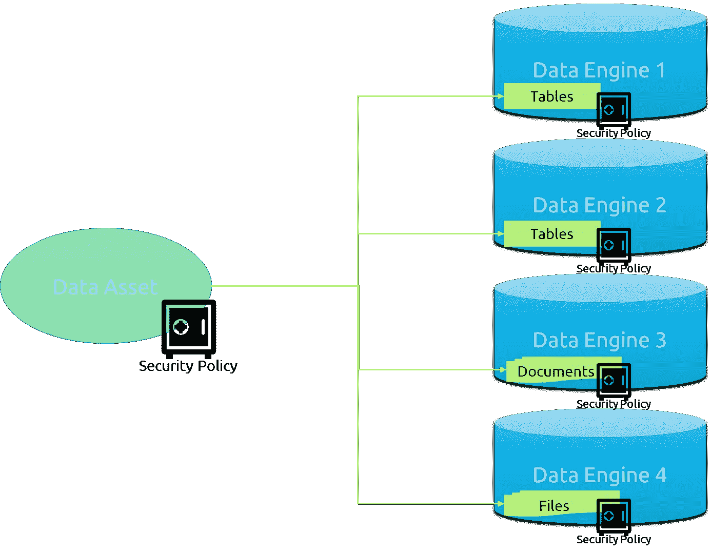
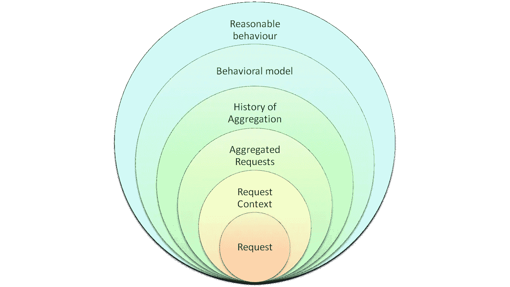
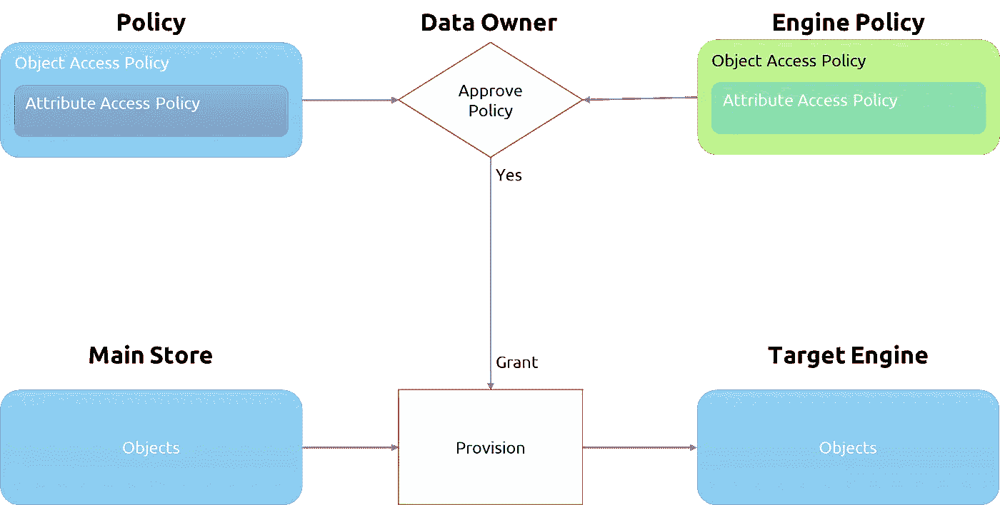
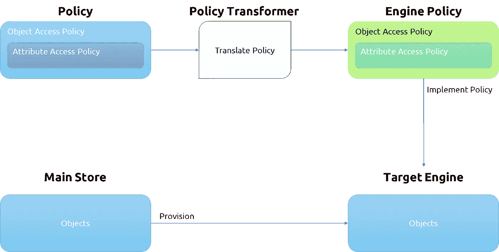

# 数据安全是一个数据资产问题，而不是数据模式问题

> 原文：<https://medium.com/nerd-for-tech/data-security-is-a-data-asset-problem-not-a-data-schema-one-a1287931dd02?source=collection_archive---------0----------------------->

如果数据是业务资产，那么它的安全性需要达到资产级别。如今，引擎内部的安全管理方式往往相互矛盾，人们可以通过理解访问数据的不同方式来绕过安全模型。在未来，安全性需要在资产级别进行管理，并且将更改推送到资产所在的每个引擎。

# 数据安全是集合论问题

从根本上说，将安全与引擎分离是一个好主意。安全性不应该仅仅由特定引擎可以支持的内容来规定。安全策略不仅仅是在引擎中保护资产的方法，第一个问题是引擎是否能够按照要求保护资产。

## 安全性不仅仅是 ACL，但让我们从这里开始…

回到大数据世界，人们认识到[安全性不仅仅是单个访问请求](http://service-architecture.blogspot.com/2015/01/securing-big-data-part-3-security.html)。

安全性不仅仅是关于请求

最终，完整的安全策略必须不仅仅包括 ACL，还需要包括行为元素，包括基于时间的访问策略，例如指示异常行为的模型。这意味着，当所有数据资产的安全性都得到真正定义时，它就不仅仅是访问，而是终身安全。

但是首先让我们处理访问控制。

## 针对用户保护数据

首先，让我们从最基本的开始:

> 安全是用户层面的事情，[服务账号不允许](http://service-architecture.blogspot.com/2020/09/service-accounts-suck-why-data-futures.html)

这可能听起来很基本，但从数据的角度来说，这是最基本的，我们说**每个存储或访问数据资产的数据引擎必须能够保护数据免受访问数据的个人用户的攻击。**

这不是今天有多少工具工作。通常，数据存储具有系统帐户，仅在报告工具中添加安全性，这在数据网格中是不可接受的，数据需要在引擎中针对用户进行保护。这意味着每个人工智能都需要绑定到一个用户，这是一个被称为授权的概念。

 [## 授权——人工智能安全的基础

### 在《受信任的人工智能人类在控制中》一书中，我谈到了一件我认为绝对需要的事情，那就是授权，也就是…

blog.metamirror.io](https://blog.metamirror.io/delegated-authority-the-foundation-of-ai-security-2575c42d0b1) 

## 用户有维度

关于用户的要点是，他们有可以保护数据的维度，这些维度包括(但不限于)他们的个人身份、组织角色、位置。应该根据这些方面来分配安全模型，并且始终可以追踪到特定的个人。

## 根据数据的维度和用户维度来保护数据

数据也有维度，即资产安全所依据的属性。需要为数据资产定义基本访问控制安全模型的是用户维度和数据维度的组合。

## 简单的例子

如果我们在一个销售机会上接受挑战，人们只能查看他们所在国家的机会，只有销售经理可以查看与交易风险相关的列。

无论该数据是在事务系统还是在报告系统中提供，安全规则都必须相同。因此，我们的数据产品有两个安全元素，首先是使用安全的对象，其次是“风险”，这是独立管理的安全令牌(如果我们做得对)。

因此，我们有两个获取访问权限的规则:

> opportunity.access 要求 user . country = = opportunity . county

和

> opportunity.risk.access 需要用户。roles 包含 sales.manager

因此，在数据产品的定义中，我们应该将属性标记为与风险相关，并针对该资产分配安全规则。最终结果应该是来自德国的销售人员看到类似这样的内容:

而来自英国的销售经理应该看到:

## 不总是简单的

因此，这种安全模型(关系数据库中的行/列，文档存储中的文档/属性)的逻辑是，如果有限制，那么只有在一切都适用的情况下，人们才能看到数据。

因此，在 Microsoft SQL Server 中，这工作得非常好，并遵循这种方法，但是在 Microsoft Analysis Services 中，它做了一些“有趣”的事情，它认为如果有人可以从**或**的角度查看数据，那就太好了。因此，如果某人是销售经理，那么他们就可以去每个国家的 T2。

现在技术上可以重新设计它，所以有两个模型，一个有风险元素，一个没有，然后在那个级别控制访问，但那是，使用一个技术术语，“有点扯淡”。

## 安全是“事物”，然后是“关于事物的事物”

对于我们的资产，我们需要考虑两个集合，首先是“事物”集合。这些是我们正在收集的信息，这就是为什么数据资产和数据产品应该从业务而不是模式的角度来治理。对于一个模式来说，分解片段可能更有效，但那是实现，对于治理，我们需要查看对象本身。

“信用卡申请”、“信用卡”、“贷款申请”、“贷款”、“汽车”、“人”等等，这些是我们希望管理数据的“事物”。第一条安全规则是我们对获取东西的限制。

第二个是我们能知道的事物的属性。如果我们不能通过第一部分访问，我们甚至不需要第二部分，但在属性上，我们不应该命名属性，我们应该标记它们所代表的内容，因此在我们的示例中，我们有 4 列“*销售风险*”。

# 应用资产策略

## 引擎是否支持该策略？

当我们有一个资产的安全策略时，第一个问题是给定的引擎是否能够成功地实现它。因此，对于我们上面的示例，我们可以说，开箱即用的 Microsoft Analysis Services 将无法通过这一阶段，因为它的基本配置策略无法支持我们的安全模型。

## 调配前手动验证

如今，没有一种数据资产安全策略语言可以与引擎安全模型相匹配。因此，我们真正需要的是从通用安全策略到系统安全策略的映射，以及一种可以批准该模型的机制(可能涉及到人员)。

对于要工作的数据网格或任何分布式供应方法以及要保持控制的数据所有者，第一阶段是验证目的地引擎是否可以实现所需的策略。

## 策略供应需要一种策略描述语言

在构建网格时，我们可以投资的一件事是构建从策略访问语言到特定引擎的翻译器。例如，如果我们创建一个描述对象的模式描述语言，然后创建一个定义其安全性的策略描述语言，我们就可以编写从该策略到引擎的转换。

## 基本资产政策会是什么样的？

要有一种基于集合论的安全策略语言，首先需要的是一种描述数据资产的语言。

 [## 虚拟化的时间到了—为什么模式描述语言是数据资产的起点…

### 我说过我不是数据虚拟化的粉丝，但是虚拟化中有一个架构模式，我…

medium.com](/collaborative-data-ecosystems/time-to-virtualize-virtualization-why-schema-description-languages-are-the-start-of-data-asset-d10d03c4a26a) 

之后，我们需要一种描述安全策略的语言。我认为我们应该将两种类型的规则分开，一种是限制对对象的访问，另一种是限制对其属性的访问。为此，我们可以使用语义语言，如 RDF 或 OWL。这和我在研究[定义服务合同](https://www.computer.org/csdl/magazine/so/2005/03/s3087/13rRUNvyaiM)时遇到的挑战是一样的，我认为非常相似的方法会奏效。我们需要一种数据资产安全策略语言(DASPL ),将管理从引擎中转移出来。

# 让数据成为安全的资产推动更快的成果

拥有更基于集合/布尔代数的安全方法并在资产或数据产品级别管理它，使我们能够独立于数据所在的引擎构建用户界面、转换工具和数据审计。使组织能够在单个模式之外建模和管理数据，有助于消除导致安全漏洞的“本地优化”。

从模式描述语言(SDL)和数据资产安全策略语言(DASPL)开始，我们提供了非常基本的基础，通过这些基础，数据从仅仅存储在引擎中的东西转变为我们可以真正在整个组织中查看的东西。这两个元素远不是我们需要的全部，但它们应该被视为数据资产管理的 MVP。