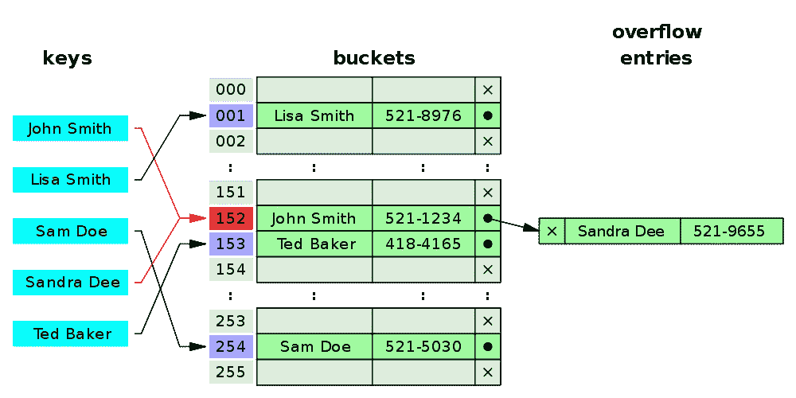
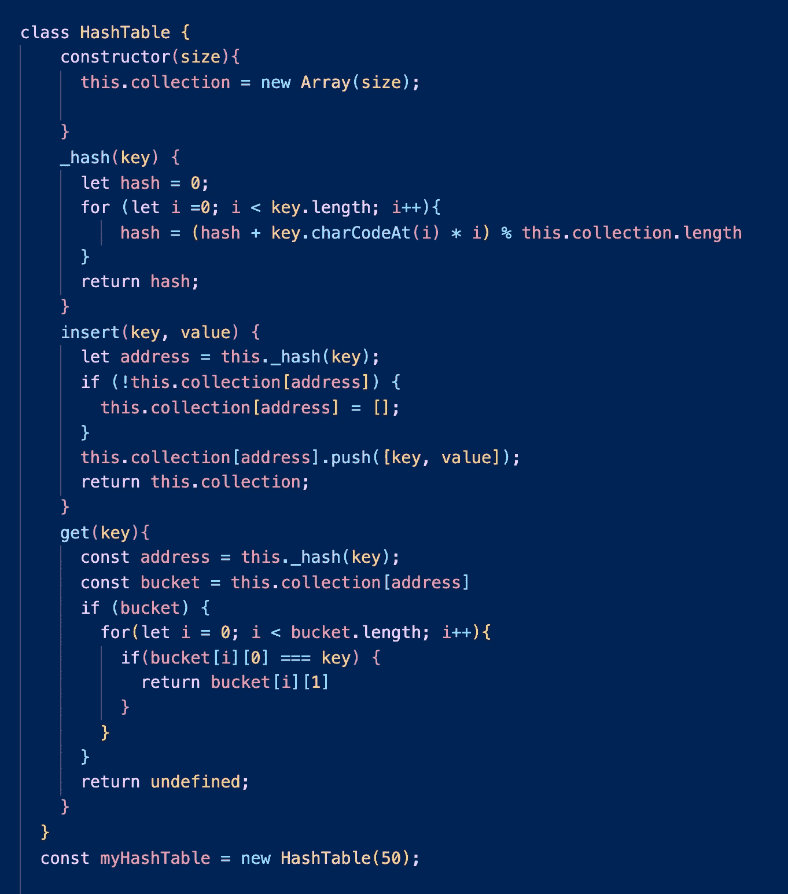
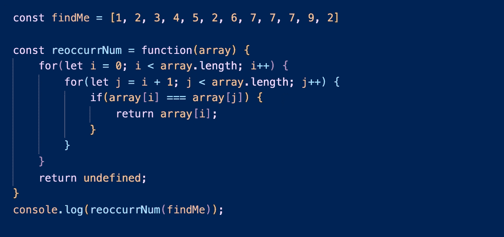
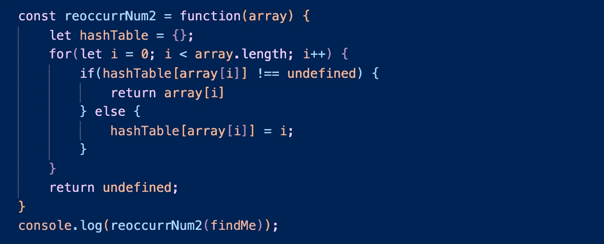

# 数据结构第 4 部分:哈希表

> 原文：<https://medium.com/nerd-for-tech/data-structures-part-4-hash-tables-a6bdc920708b?source=collection_archive---------18----------------------->

## 物品、字典、地图……天啊！

来自 [Pexels](https://www.pexels.com/photo/wood-blur-mailbox-business-6333743/?utm_content=attributionCopyText&utm_medium=referral&utm_source=pexels) 的 [cottonbro](https://www.pexels.com/@cottonbro?utm_content=attributionCopyText&utm_medium=referral&utm_source=pexels) 摄影

欢迎回来！我们已经完成了第四个数据结构。就像数组一样，哈希表是计算机科学中的另一种基本数据结构。哈希表经常出现在数据库中。如果您曾经使用过 API，并且想要查看所有可用的数据，那么您很可能已经在实际操作中看到了散列表。或者想象一下法律办公室中的文件系统。无论是在计算机上还是在数百个架子上，放在架子上的每个单独的案例都类似于散列表数据结构。你能想象为了找到一个案子而不得不翻遍 1000 份档案吗？如果你只知道被告的名字就能知道箱子在哪里呢？你可以直接进入他们的档案，现在你可以在几秒钟内看到整个案件。这就是哈希表的美妙之处。我们开始吧，好吗？

## **什么是哈希表？**

**哈希表**是简单的数据结构，将数据存储为键值对(我们将很快讨论所有其他细节)。我喜欢把哈希表看作一个总括术语，因为当你从一种编程语言转换到另一种编程语言时，它包含了几种不同的变体。在 JavaScript 中，散列表是一个“对象”，在 Python 中它们被称为“字典”，在 Java 中它们被称为“映射”，这样的例子不胜枚举。出于本文的考虑，我们将把重点放在哈希表的 JavaScript 实现上。

## **哈希函数**

哈希表由两个主要组件组成，一个数组(保存所有的键值对)和一个**哈希函数**。散列函数是一个独特的特性，它接受一个键，生成一个独特的幂等“地址”，并将其放在数组中的特定索引处。我鼓励你使用这个资源**来感受一下哈希函数是如何工作的！每种语言都有自己的内置哈希函数，它生成一个时间复杂度为 O(1)的哈希，无论创建多少个键，这个操作都是快速有效的。**

**虽然哈希函数通常将每个键映射到数组的不同索引，但有时可能会有多个键存储在同一索引位置。这叫做 ***哈希碰撞*** 。当相同的哈希被分配给一个或多个额外的键值对，并且现在该索引被共享时，就会发生哈希冲突。**

**如下所示，“John Smith”首先被赋予散列“152 ”,并被放置在数组的某个索引处；然后“桑德拉·狄”也被分配了相同的哈希值。**

****

**图片来自[维基网](https://www.wikiwand.com/en/Hash_table)**

**有几种方法可以解决这个问题:**

> **1.我们可以**扩展**哈希表的大小，这将使哈希表条目之间的距离更远**
> 
> **2.我们可以**链接**这些键，创建一个链表**
> 
> **3.我们可以使用**线性探测**将一个键重新分配给另一个索引。**

## ****从头开始散列****

**说得够多了，我们将从头开始创建一个散列表，这样我们就可以看到基本的功能。哈希表有两个主要功能:插入键值对和获取值。**

****

**哈希表的初始化**

**首先，我们创建了一个名为“HashTable”的类，它的构造函数将 size 作为参数。该构造函数将包含一个数组属性，该属性将有一个 size 参数(这是我们可以确定我们希望数组有多大的地方)。**

**我们的第一个函数是一个名为“_hash”的私有属性，它将为每个键创建一个惟一的 hash。私有属性前有一个“_”是常见的标准，这样将来的开发人员就知道不要使用它。**

**接下来我们有第一个方法“insert ”,它有一个键和值作为参数。首先，我们将创建一个地址变量，并将密钥传递给 _hash 函数，这样“address”将成为数组中的唯一索引。然后我们将检查该地址是否存在。如果没有，我们将把地址添加到我们的集合中，并把它设置为一个空数组。如果地址已经存在，那么我们将把我们的键和值推入数组并返回它，这样我们就不会在可能有散列冲突的情况下删除任何以前的数据(这种特殊的方法被认为是链接方法)。**

**现在，我们希望能够使用“get”方法检索我们的数据。这个函数将接受一个键作为参数。就像我们的“insert”方法一样，我们将使用 _hash 函数为键创建一个地址。我们将有另一个名为“bucket”的变量，它将是包含键值对的数组的任何索引。因为我们的键值对也在一个数组中，所以我们需要能够用一个循环遍历数组的长度，以便接收值。在我们的循环中，我们会得到 index[0](应该相当于我们的键值)，如果满足这个条件，我们要返回 index[1](应该是我们的值)，否则返回“undefined”。**

**现在你知道了！我们已经从头开始创建了自己的哈希表！**

## ****散列表和大 O 符号****

**这些数据结构非常流行有几个原因，其中之一是它们的大部分操作的时间复杂度为 O(1)。当插入和检索数据时，您不必像在数组或其他复杂的数据结构中那样遍历任何东西。能够通过使用键来定位数据是一个非常快速的操作，使得这种数据结构对于几种用例来说是最佳的。在出现哈希冲突的情况下，操作的时间复杂度可能会变成 O(n ),特别是当您需要迭代以找到特定的数据时。哈希表的另一个缺点是数据是无序的。如果您正在寻找一个按顺序构建的数据结构；不幸的是，哈希表不能提供这个特性。**

## ****演习:****

**现在我们有了一个好的基础，让我们用它来讨论一个流行的面试问题……(你看到我在那里做的了吗😉)!**

**给定一个数组，我们将返回第一个重复出现的字符。**

****

**强力实现:O(n)时间复杂度**

**让我们先尝试用蛮力解决这个问题，然后我们再重构优化。在我们的函数“reoccurrNum”中，我们将传入一个数字数组。然后，我们将创建一个嵌套的 for 循环，它将遍历数组的长度减去[i + 1]，第二个数组将从 i + 1 开始，因此我们总是比较两个不同的索引。如果数组[i]的索引在任何一点都等同于数组[j]的索引，我们就要返回数组[i]。如果没有重复出现的数字，我们将返回“未定义”。**

**虽然这个实现看起来没有很多代码，但它的时间复杂度仍然是 O(n ),随着数组长度的增长，这个复杂度会变得越来越慢。让我们试着让这个函数更省时。**

****

**使用对象实现:O(n)时间复杂度**

**对于我们的新函数“reoccurNum2”，我们将在遍历数组长度之前初始化一个空对象。我们首先要检查这个键是否是未定义的，如果不是，如果这个键已经存在，我们将返回数组的索引。我们还将为循环的每次迭代创建一个键-值对，只要它还没有被添加到对象中。如果没有重复的数字，那么函数将返回“未定义”。我们做到了！我们已经成功地重构了我们的问题来实现对象！不仅如此，我们还通过只使用一个循环，而不是两个循环，将函数的时间复杂度优化为 O(n)。**

**恭喜你通过了我们的第四个数据结构！哈希表是另一种简单但非常必要的数据结构，我们作为软件开发人员需要它。我希望在这篇文章之后，你会对实现它们感到更舒服，不仅如此，你还会认识到它们在存储数据时有多么有用。感谢您的阅读，下次再见…**

**💕👩🏾‍💻*编码快乐！*👩🏾‍💻💕**

**参考资料:**

**[掌握编码面试:数据结构和算法](https://www.udemy.com/home/my-courses/learning/)**