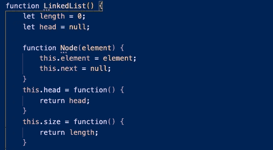
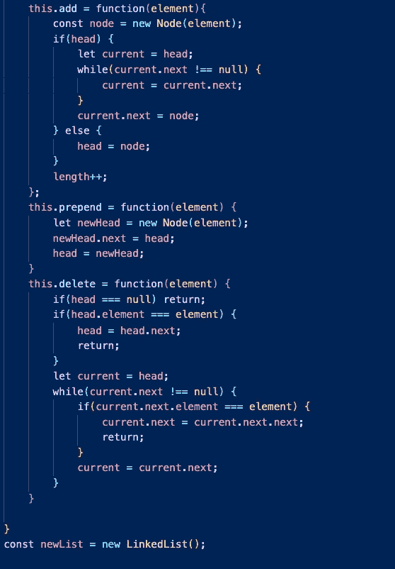
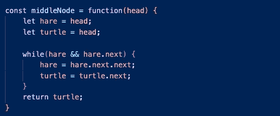

# 数据结构第 5 部分:链表

> 原文：<https://medium.com/nerd-for-tech/data-structures-part-5-linked-lists-247cb2483b33?source=collection_archive---------12----------------------->

照片由来自[佩克斯](https://www.pexels.com/photo/selective-focus-photo-of-black-metal-chain-119568/?utm_content=attributionCopyText&utm_medium=referral&utm_source=pexels)的[乔伊·凯伯](https://www.pexels.com/@joey-kyber-31917?utm_content=attributionCopyText&utm_medium=referral&utm_source=pexels)拍摄

你好。我们几乎已经学完了我们将一起学习的所有数据结构！今天的话题是…链表！这些数据结构可能很难理解，所以我们将尽可能地进行剖析，以确保您有一个良好的基础。我也鼓励你去看看 [***这个资源***](https://visualgo.net/en/list?slide=1) 来获得链接列表幕后真正发生的事情的惊人的可视化表示。在本文结束时，我希望您能更好地理解链表，如何从头开始创建它们，最重要的是如何解决实现这种新数据结构的问题。我们开始吧，好吗？

**什么是链表？**

**链表**是另一种由节点和指针组成的线性数据结构。每个节点都包含一个指向前一个节点的引用。链表的一个流行的可视化表示是康加线！每个人都伸出手臂去触摸他们前面的人的肩膀。不像我们以前的一些数据结构预先构建到 JavaScript 中，链表不是，这意味着我们将有机会从头构建一个！让我们首先从介绍链表的所有结构开始。

**链表的组成部分**

链表由四个主要部分组成:

> 1.**节点** — *链表中的一个元素，可以保存几种类型的数据，如数字、字符串、字符等。*
> 
> 2.**指针** — *指向* ***内存中的下一个节点*** *(节点可以放在内存中的任何地方，链表不像数组那样按索引顺序存储数据)*
> 
> 3.**头** — *链表中的第一个节点*
> 
> 4.**Tail**—**链表中的最后一个节点，然后指向一个* null *值**

***链表的类型***

*有两种主要类型的链表，每一种的构建都稍有不同，以适应不同的用例:*

1.  ****单链表****

**

*Cierra 创建的单链表*

*单向链表中的指针只引用链表中的下一个节点(注意箭头是单向的)。*

**2。* ***双链表****

**

*Cierra 创建的双向链表*

*双向链表的指针既指向前一个节点，也指向下一个节点(注意箭头是双向的)。*

***从零开始建造***

**

*单向链表的初始化*

*首先，我们将初始化一个名为“LinkedList”的类，它包含一个长度属性和一个头部属性。我们还将初始化一个节点类，它包含一个元素属性(表示当前元素)和一个下一个属性(表示下一个节点)。然后我们有两个简单的方法“头”和“大小”。“head”方法将返回头部的值，这是在任何给定时间链表前面的值。“size”方法只是返回链表的长度。到目前为止一切顺利！*

**

*单向链表的初始化*

*这个 LinkedList 类将有另外三个方法:add、prepend 和 delete。“add”方法将接受一个元素参数，我们将创建一个新的节点，将该参数作为实参传入。然后我们将检查列表中是否有头节点，如果已经有**而不是**头节点，那么我们将把我们的新节点指定为头节点。如果有一个现有的头节点，那么我们将分配一个“当前”值给头节点。当列表中的下一个节点没有 null 值时(意味着我们还没有到达尾节点)，继续在链表中向下移动。一旦我们到达链表的末尾，我们的 current.next 节点将被分配给我们创建的新节点。最后，我们增加链表的长度来考虑刚刚添加的元素。*

*既然我们已经在链表的末尾添加了一个新节点，我们还想在开头添加一个新节点。使用我们的“prepend”方法，我们还将启动一个新节点，该节点将元素参数作为参数。在这个方法中，我们只想将当前头重新分配给我们刚刚创建的新节点；所以我们要把 newHead.next 属性赋给 Head 位置的当前节点，然后把链表的 head 属性赋给我们的 newHead 节点。*

*最后，我们想从链表中删除一个节点。我们的“delete”方法将一个元素作为参数。如果我们的头节点等同于 null，我们将返回(这只是意味着我们的链表中没有要删除的内容)。如果我们的头节点确实存在，那么我们将检查我们想要删除的元素是否在列表的头位置。如果是，我们就把头的位置重新分配给下一个节点，然后返回。就像我们的“add”方法，当下一个节点没有 null 值时，继续在列表中移动。我们将继续移动，直到找到我们想要删除的元素之前的节点**。通过停在我们选择的节点之前的节点，我们将重定向指针以“跳过”它并连接到它之后的节点(current.next.next)。然后我们将当前值赋给 current.next***

*我们成功了！链表可能很难可视化，同样，[***【visual go】***](https://visualgo.net/en/list?slide=1)是一个惊人的额外资源，可以让你对我们刚刚讨论过的每个方法的流程有所了解。*

***链表和大 O 符号***

*现在你可能已经注意到链表和数组非常相似，你这样想是正确的。然而，他们确实有他们的不同之处。在数组中，您可以通过使用索引来获取特定的值，而不必通过迭代来查找它。因为数据不存储在索引中，所以必须遍历链表才能找到特定的值。因此，查找方法的时间复杂度为 O(n)。删除和插入方法也是如此。我们必须遍历整个链表，以便在最坏的情况下执行所有这些操作。在列表的开头添加一个节点的时间复杂度是 O(1)，这是非常快的！我们不必遍历或迭代链表的其余部分来更新索引(因为没有索引)。将一个节点附加到列表的末尾也有 O(1)的时间复杂度。*

***练习***

*现在我们已经从头开始创建了一个链表，让我们来解决一个取自 LeetCode 的问题。我们要找到一个链表的中间节点，如果链表是一个偶数，那么我们将返回第二个中间数:*

**

*我们的函数“middleNode”将把链表的头作为一个参数。我们将实现“龟兔赛跑”算法，也称为弗洛伊德算法来解决这个问题。我们将为 head 值分配两个指针。然后，只要 hare 的当前值和 hare.next 值不等于 null(意味着它已经到达了我们的链表的末尾)；兔子节点在列表中移动的速度是乌龟节点的两倍。一旦“野兔”节点命中一个空，我们将返回海龟。如果链表由奇数个节点组成，那么 hare 节点将到达链表的末尾而不会命中空值，而 turtle 节点将正好在链表的中间。如果链表由偶数个节点组成，hare 节点将在移动到 null 值之前停止，而 turtle 返回第二个中间数。*

*现在你知道了！我们在 O(n)时间内解决了一个链表问题，同时学习了一个流行的算法！*

*干得好！祝贺你完成了我们的第五个数据结构！链表很难学习；然而，我希望在这篇文章之后，我们能够将一些片段联系在一起(是的…这个双关语是非常有意的)。再次感谢您的阅读，下次再见…*

*💕👩🏾‍💻*编码快乐！*👩🏾‍💻💕*