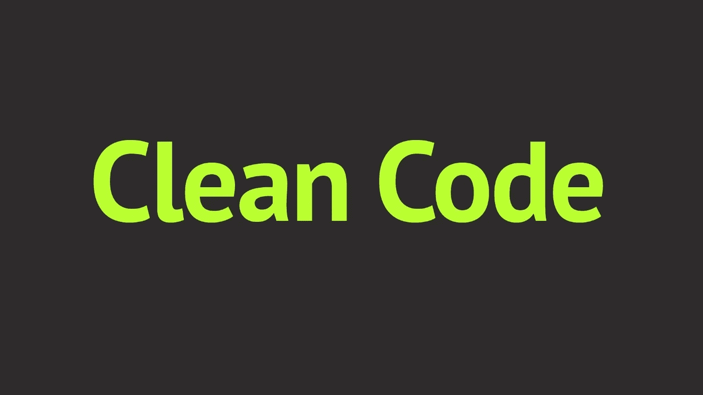

# 数据结构与对象— Swift

> 原文：<https://medium.com/nerd-for-tech/data-structures-vs-objects-swift-4d85ae324532?source=collection_archive---------1----------------------->



我正在读罗伯特·c·马丁的《干净的代码》的第 6 章，我对对象和数据结构之间的区别感到非常困惑。我不得不多次阅读，以理解是什么使对象成为对象，是什么使数据结构成为数据结构，以及它们之间的区别。我花了不止一、二、三次阅读来更好地理解它，但可以肯定地说，我理解了它的主旨。然后我决定把它应用到我最喜欢的语言(Swift)上，分享我的理解和几个例子。

**数据结构:**

数据结构应该公开它们的数据，不需要有任何有意义的行为。它们应该作为容器，一种访问数据的方式，以便外部各方可以使用它们来创建有意义的行为。

Swift 中的一个例子是 Enum。枚举非常适合定义数据

```
**enum** Word { **case** circle **case** square **case** rectangle}
```

在这个数据结构中，请注意只有数据是公开的，没有依赖于使用它的真正的行为或功能。这样做的好处是，使用这种数据结构，你可以有许多不同的功能。

**对象:**

对象通过使用抽象来隐藏它们的数据，但是会暴露行为和函数。这可以通过使它们的字段私有，同时公开将操作它们的私有数据的函数来实现。
此外，对象不同于数据结构，因为它的方法或行为不应该是访问数据的方式，而是执行操作这些数据的动作。如果一个对象有一个函数只返回它的一个私有数据的值，那么它就不是一个对象，而是一个数据结构。看一下这段代码:

```
**class** Square { **private** **var** sideLength: Int **init**(sideLength: Int) { **self**.sideLength = sideLength } **func** getSideLength() -> Int { **return** sideLength }}
```

这仍然被认为是一个数据结构，因为这个类通过“getsidelongth()”公开它的数据。为了使它成为一个对象，我们需要创建一个新的行为，这个行为不会暴露它的数据，而是操纵它，从而保存抽象的概念。

就像这样:

```
**class** Square {**private** **var** sideLength: Int**init**(sideLength: Int) { **self**.sideLength = sideLength}**func** findArea() -> Int { **return** sideLength * sideLength }}
```

注意 findArea()是如何操作数据并隐藏实现的。

**使用对象 VS 数据结构的优势和不便？**

这本书通过强调对数据结构使用过程代码和使用面向对象代码的优缺点来说明这些区别。

**使用数据结构的程序代码**

```
**enum** Word { **case** circle **case** square **case** rectangle}**class** Translation { **func** frenchTranslation(word: Word) -> String { **switch** word { **case** .circle: **return** "rond" **case** .square: **return** "carré" **case** .rectangle: **return** "rectangle" } }}
```

请注意,“枚举单词”是一个数据结构，frenchTranslation()函数对三个给定的单词进行操作。枚举单词没有行为，但是翻译类使用该枚举来创建行为。这种使用数据结构的过程化流程的优点是，我可以继续向翻译类添加更多的函数，而不会影响枚举字。然而，一旦我向枚举添加了一个新词，比如说 *case triangle* ，我添加到翻译类的所有函数都需要更新，以考虑这个新词。
因此，添加新的行为很容易，但是添加新的数据结构可能很繁琐，因为每个函数都需要适应新添加的数据结构。
现在让我们来看看面向对象的方式。

**面向对象方式**

```
**protocol** Shape { **func** findArea() -> Int}**class** Square: Shape { **private** **var** side: Int init(side: Int) { **self**.side = side} **func** findArea() -> Int { **return** side * side}}**class** Rectangle: Shape { **private** **var** height: Int **private** **var** width: Int **init**(height: Int, width: Int) { **self**.height = height **self**.width = width } **func** findArea() -> Int { **return** height * width }}
```

我们有一个名为 Shape 的协议，它为我们提供了一个要实现的方法，该方法是 findArea()
然后我们创建实现 Shape 的对象，并公开该方法的实现。
注意我们的对象是如何隐藏私有数据的，这些私有数据被用来操作数据，并给出给定对象的面积。在面向对象的解决方案中，添加新对象非常容易——我们所要做的就是让该对象实现协议形状，这一切都很简单！
然而，如果我们要向协议形状添加一个新的行为，例如:draw3DRepresentation

```
**protocol** Shape {**func** findArea() -> Int**func** draw3DRepresentation() -> UIImage}
```

然后，我们需要更新实现该协议的每个对象。因此我们可以说，使用面向对象的方法，添加新的对象很容易，但是添加新的行为却很繁琐。

> **(使用数据结构的代码)**
> 
> *使得在不改变现有数据结构的情况下添加新功能变得容易。*
> 
> *增加新的数据结构很困难，因为所有的函数都必须改变。*
> 
> ****OO 代码*** (代码使用面向对象)，*
> 
> *因为所有现有的类都必须改变，所以很难添加新的函数。*
> 
> *使得在不改变现有函数的情况下添加新类变得容易。*
> 
> *所以，对 **OO** 来说很难的事情对**程序**来说很容易，反之亦然。*

*就像书中提到的，它们都有各自的优点和不便之处。当我们更可能添加更多的对象或数据类型而没有新的行为时，面向对象更方便。*

*然而，当我们更有可能添加新的行为而不是新的数据结构时，过程代码更方便。*

# *有用的链接*

*[https://www . LinkedIn . com/pulse/clean-code-chapter 6-objects-data-structures-Mahmoud-Ibrahim](https://www.linkedin.com/pulse/clean-code-chapter6-objects-data-structures-mahmoud-ibrahim)*

*[https://www.youtube.com/watch?v=-YoX9KRW89E&t = 314s](https://www.youtube.com/watch?v=-YoX9KRW89E&t=314s)*