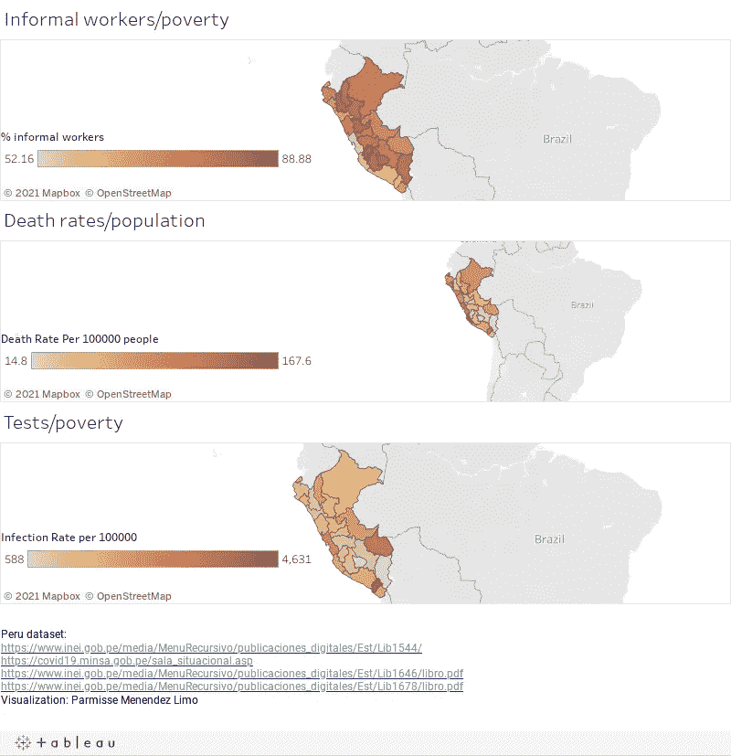
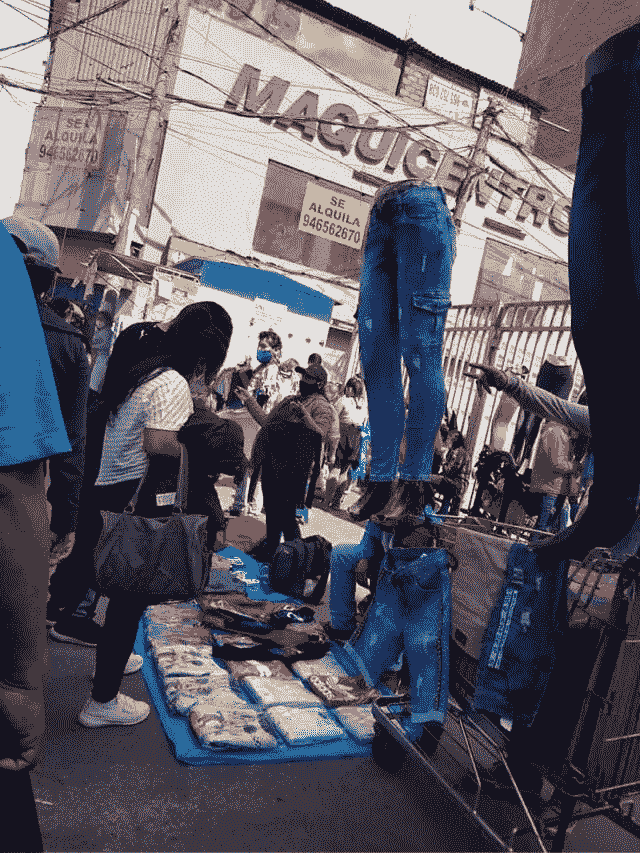

# 数据显示秘鲁最贫穷的工人不太可能感染新冠肺炎病毒

> 原文：<https://medium.com/nerd-for-tech/data-suggests-perus-poorest-workers-less-likely-to-contract-covid-19-ef9d5449d384?source=collection_archive---------18----------------------->

我们的“INNERJOIN”系列以协作、集成和思维伙伴为特色。我们提供不同行业思想领袖的观点，以展示数据的价值、灵活性和潜力。

在这篇博客文章中，我们主持了帕米斯·梅嫩德斯·利莫在设计驱动分析研究所的一个故事，她是亨伯学院新闻学研究生证书课程的新毕业生，在那里她挖掘了表明秘鲁最贫穷的工人不太可能感染新冠肺炎病毒的数据。

自疫情开始以来，新冠肺炎已导致秘鲁陷入严重的经济危机，2020 年 4 月至 7 月期间，超过 600 万秘鲁人失去了工作。

尤其危险的是该国的非正规工人，他们占秘鲁劳动力的 70%以上。这些工人既不纳税也不领工资条。许多人在街上或自家门口叫卖他们的货物。

然而，对秘鲁新冠肺炎数据的分析表明，该国最贫困的省份——这些省份的人均非正规劳动者比例也是最高的——却是新冠肺炎病毒阳性感染和相关人均死亡水平最低的一些省份。

为什么一个国家最脆弱的经济阶层似乎不那么容易受到新冠肺炎的影响？更仔细的观察表明，地理、生活方式和社会压力扮演着重要的角色。

## 海拔越高，新冠肺炎感染率越低

位于安第斯山脉的省份(海拔 2000 米以上的城市)贫困率和非正规工人率最高，但相对于较富裕的省份，新冠肺炎比率相对较低。他们中的许多人从事农业活动，如收割、采矿、造林和狩猎。

卡哈马卡是秘鲁最贫穷的省份，贫困率为 37.4%至 46.3%，根据该国 2018 年[人口普查，87%的经济活跃人口为非正规工人。截至 2020 年 8 月 25 日，它已记录了超过 13，650 例新冠肺炎病例和 375 例与 COVID 相关的死亡。经人口调整后，这相当于每 100，000 人中有 1018 人感染，每 100，000 人中有 28 人死亡。](https://www.inei.gob.pe/media/MenuRecursivo/publicaciones_digitales/Est/Lib1678/libro.pdf)

相比之下，伊卡是秘鲁贫困率最低的沿海城市，每 10 万居民中有 168 人死亡，几乎是卡哈马卡的六倍。

根据流行病学家 Milagros Anuel 的说法，与沿海或丛林人口相比，更健康的生活方式选择使安第斯山脉的人们对新冠肺炎的传播做出了更好的反应。

“有证据表明，安第斯山脉的人们食用更健康的食物，他们饲养的鸟或收获的蔬菜，”Anuel 说。"贫穷会影响你的文化，但不会影响你的营养状况，你可能贫穷，但会得到营养."

阿努埃尔说，拥挤的市场是新冠肺炎传播的工具，特别是在秘鲁首都利马，因为其沿海潮湿。因此，病毒在空气中停留的时间更长，导致更多的感染。

她说，避免病毒传播的唯一方法是正确使用口罩，勤洗手，不要触摸任何东西。这对于那些几个小时没有卫生间的街头小贩来说是一个挑战。

她说:“小贩是一个问题，他们是利马的一个大问题，很高比例的感染者是在街上工作的人。”“它们是一个风险因素，因为它们无处不在。”

Anuel 补充说，在利马和阿雷基帕等省，受影响最大的人口是妇女，因为她们是去购买食品、去银行和走亲访友的人。

利马人均阳性病例率第三高，感染率为每 10 万人 3019 例，每 10 万人死亡 131 例；分别是卡哈马卡的三倍和五倍。

来自 Defensoría del Pueblo 的政治学家 Elena Martinez 表示，仅仅将新冠肺炎的传播归咎于非正式工人是不公平的，因为他们的脆弱性增加了。

“疫情和国家采取的措施影响到每个人，但程度不同。这就是为什么有更多的弱势群体不仅受到疾病的影响，而且受到经济的影响，”马丁内斯说。

她说，虽然秘鲁是第一批实施严格检疫和罚款的国家之一，但应对新冠肺炎是一项共同的责任。

马丁内斯说:“政治当局、总统通过一项战略避免了 COVID 的传播，但公民们也应该以适当的方式做出回答。”

## “龙德罗斯”减缓了新冠肺炎的传播吗？

马丁内斯表示，秘鲁的“Rondas Campesinas”或“ronderos”是抑制新冠肺炎在该国最贫困省份传播的另一个因素。

龙德罗斯就像辅警一样，抓捕小偷、罪犯或他们认为犯了错误的人，并在没有当局干预的情况下惩罚他们。

在秘鲁，大约有 250，000 名 ronderos，仅在卡哈马卡就有 100，000 名。他们主要出现在安第斯山脉的省份，这些省份的感染率最低。

“Rondas campesinas 在国家之外实行地方司法有着悠久的历史。马丁内斯说:“他们在 70 年代首次出现在卡哈马卡，以控制社区内的犯罪和抢劫行为，并得到了 93 年宪法的认可。

Martinez 说，ronderos 在限制新冠肺炎的传播方面发挥了重要作用，因为他们使人们尊重国家实施的法律，尽管她说已经出现了过度使用武力的情况和警察的问题。

## 疫情可能增加非正式工人的数量

面对大规模失业，秘鲁公民正求助于网上销售商品或从事多种工作来支付账单。

Veronica Ciertogallo 说，她在利马的 Faber-卡斯特尔公司工作，这是一家销售办公和艺术用品的德国公司，在疫情开始工作后，她被送去“完美停职”。这是秘鲁政府为避免裁员和保护企业而采取的措施。在完全暂停的情况下，公司被允许向员工支付每月 760 索尔(304 加元)的折扣价。

“我采取一切措施按目录销售。我通过快递员发送产品，当我外出时，我戴上口罩，喝酒，远离人群，”Ciertogallo 说。

她不认为自己是非正式工人，尽管她不纳税，也没有工资单，因为她后来被费伯-卡斯特尔解雇了。Ciertogallo 现已成为利马大量非正式工人的一员。

秘鲁不同地区都有小贩。他们通常在红绿灯附近出售从巧克力到伪书的各种商品。然而，经过头 60 天的隔离，加上总计 760 索尔(304 加元)的补贴，小贩们又回到了街头。

对于许多非正式工人来说，一天不工作就是一天没有食物。秘鲁人仍然被隔离，尽管如此，一些限制已经解除。

在家门口经营无照经营也是一些秘鲁人生活中的新内容。America Rojas 现在在家工作，工作时间减少了，但因为资金紧张，她仍然需要非正式地出售甜点来增加收入。

“我做的工作是非正式的，因为我没有销售许可证。罗哈斯说:“我以前卖甜点(作为一种爱好)，但现在因为新冠肺炎，我在自己的街边小店卖甜点，有时也通过 WhatsApp 卖，因为人们已经认识我了。”。

“当我收到钱时，我会用酒精对硬币进行消毒，戴上我的面部保护装置以及口罩和手套。”

## 对于非正式员工来说，新冠肺炎是一个不幸但不可避免的风险

非正式工人需要工作来养家。尽管他们中的许多人采取了措施来避免新冠肺炎病毒的传播，但在像利马的 [Gamarra](https://gestion.pe/economia/el-peru-informal-no-espera-al-final-de-la-cuarentena-para-trabajar-noticia/) 这样的大市场销售，使他们处于传播病毒的高风险之中。

Mauricio Villanueva 拍摄的秘鲁利马街头市场 Gamarra 周围的照片:

年轻的学生 Geraldine Sabastizaga 在疫情之前在街上卖现成的食物，现在她又开始在公共场合卖了，尽管她认为如果小贩不按照要求保护自己，就会助长新冠肺炎的传播。

“我戴着口罩、手套，用酒精来保护自己和我的客户免受病毒感染，”Sabastizaga 说。“我害怕警察，因为他们随时都可能来拿走我们的东西。”

她还说，晚上 10 点强制宵禁减少了她工作的机会。

“我们现在必须找到其他方法来获得我们没有赚到的钱。我现在照顾我的侄女来赚更多的钱，因为我在街上卖东西赚的钱还不够，”Sabastizaga 说。

**关于设计驱动分析研究所** 亨伯的设计驱动分析研究所(IDDA)采用跨学科的方法培训学生，结合设计、数据分析和知识传播，为他们提供日益增长的数据驱动世界所需的技能。

**关于作者** 帕米斯·梅嫩德斯·利莫是亨伯学院的应届毕业生。她之前在自己的祖国秘鲁学习通信和新闻。在加拿大，她能够为亨伯新闻撰稿，并且是亨伯报纸的编辑等等。她还为亨伯电台和电视台制作新闻节目和报道。

**关于 ThinkData Works** 发现、管理和利用推动企业发展的数据。ThinkData Works 提供灵活的企业数据目录，旨在确保数据生命周期每个阶段的数据质量和法规合规性。如需了解更多信息，请访问[**ThinkData Works**](https://www.thinkdataworks.com/)并通过 [**Twitter**](https://twitter.com/thinkdataworks) 和 [**LinkedIn**](https://www.linkedin.com/company/thinkdata-works/) 与我们联系。

*这篇文章是由亨伯和 ThinkData Works 合作完成的。ThinkData 正在支持数据驱动的新闻业，并改善亨伯大学新闻研究生证书课程学生对外部数据的访问。*

*原载于*[*https://blog.thinkdataworks.com*](https://blog.thinkdataworks.com/why-data-suggests-perus-poorest-workers-are-less-likely-to-contract-covid-19)*。*