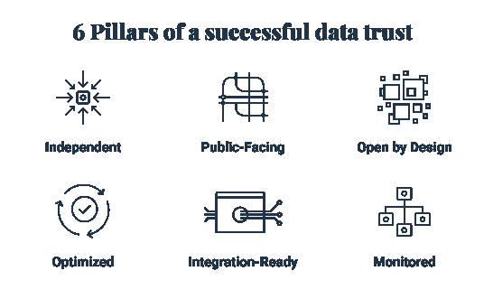
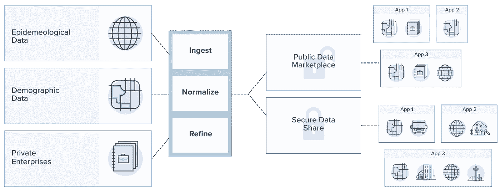

# 数据信任:通过集中式数据访问建立信任

> 原文：<https://medium.com/nerd-for-tech/data-trusts-building-trust-with-centralized-data-access-845efaeba617?source=collection_archive---------19----------------------->

在传统的商业模式中，核心商业资产包括财产、设备、存货和现金。我们认为有价值的有形事物。然而，当我们从工业革命过渡到技术革命时，有一种新的资产被引入，这种资产变得更加难以定性:数据。

根据**2020 年大数据和人工智能高管调查，**2020 年投资超过 5000 万美元的公司比例高达 64.8%(2018 年仅为 39.7%)，共有 98.8%的公司投资于大数据和人工智能计划。各种规模的企业都在竞相采用数据驱动的战略，以便不仅刺激其商业模式的创新，而且通过将数据驱动的决策置于本能之上来颠覆传统做法。

与此同时，我们看到了数据经济的兴起。 [**据 Gartner**](https://www.gartner.com/smarterwithgartner/gartner-top-10-trends-in-data-and-analytics-for-2020/?source=BLD-200123&utm_medium=social&utm_source=bambu&utm_campaign=SM_GB_YOY_GTR_SOC_BU1_SM-BA-SWG-CONF) 称，到 2022 年，35%的大型组织将通过正式的在线数据市场成为数据的卖家或买家，高于 2020 年的 25%。随着越来越多的数据变得可用，数据的潜力被发掘，数据正变得商品化。正如人们多次说过的那样，它是 21 世纪最宝贵的资源。

## 更多数据的问题

这种新资源的核心矛盾在于访问、使用和治理。可用数据的指数增长并没有自动导致使用率的增加。技术、制度和监管障碍目前正在限制外部数据的采用，而且令人惊讶的是，还限制了内部数据资产的使用。

这给投资了数据基础架构的组织带来了一个问题。为了访问他们认为有价值的数据(或潜在有价值的数据——试验 对于数据驱动型企业的好处是显而易见的),他们必须提供专门的内部资源来查找、连接和管理外部数据源，或者与数十家数据供应商签订单独的许可协议。第一种情况是滥用时间，第二种情况是滥用资源。

即使组织投入精力、时间、金钱和人才从公共领域和数据提供商那里收集数据，数据治理的问题也会浮出水面。"现在我可以访问数据，我可以用它做什么？"这一点尤其有争议，因为数据治理合规性是一个不断变化的目标。

近年来，GDPR 和 CCPA 提供了支持和限制数据使用的稳健框架；但是对于许多组织来说，这些规定很难解释，也更难实施。鉴于许多数据仓库看起来不像一个图书馆，而更像一个沼泽，突然需要了解其数据的形状、结构和组成是一项艰巨的任务。

鉴于这些困难，各个级别的组织(包括各种规模的政府、非政府组织和大型企业)都在探索使用更多数据的方法，与发布数据的组织进行集成，并构建随使用情况而扩展的产品和服务。

## 答案可能在于数据信任

对于什么是数据信任，没有一个普遍认可的定义。[****开放数据研究所(ODI)****](https://theodi.org/article/data-trusts-in-2020/) **将其定义为“提供独立的第三方数据管理”的结构，并得到数据主体的知情同意。数据信任还保证拥有数据、使用数据和受数据使用影响的人有一种机制来确保数据被公平地共享。成功的数据信任是一套促进公民、政府和第三方之间互动的原则，促进数据的公开和民主访问。**

****

**指导数据信任的规则可能并不具体，但在设计数据信任时，有几个关键的基础架构组件至关重要:**

*   **访问新数据的能力；**
*   **由数据管理员自定义、完全受控地调配数据资产；**
*   **开发基于角色的方法来管理数据使用；和**
*   **通过基于 API 的血管系统连接数据，以便与第三方工具进行交互。**

## **数据信任的好处是什么**

**数据信任为数据创新奠定了基础，同时实施了强大的治理原则，允许安全和可扩展的数据共享。它通过让数据提供者控制其数据的流动，为数据提供者提供了对其数据资产的增强的控制:谁得到它，他们得到什么，以及它驻留在哪里。**

**数据信任还允许数据用户和提供商之间基于同意的大规模快速数据共享。如果没有数据信任，数据提供商对其数据资产如何被管理、集成或保护的了解就非常有限。目前，大多数数据协议都是临时的，数据通过过时的(不安全的)方式共享，如 USB 驱动器、FTP 和电子邮件。如果组织不实现数据流的现代化，这一过程将带来严重的长期安全性和可伸缩性问题。**

## **集中访问的案例**

**为了正确看待这个问题，我们可以看看最近的疫情。3 月初，从约翰·霍普金斯大学和世卫组织到世界各地的地方卫生单位，各种来源发布了大量流行病学数据。危机爆发的速度之快，使得在所有这些数据提供商之间实时推动一个标准变得不可能。对于试图了解疫情如何演变的研究人员来说，这些数据的价值被埋没在同时手动连接和清理几十个地方的数据的实际考虑之下。实际上，这是过去十年来获取公共数据所固有的问题的缩影:信息是可以获得的，但不是很容易获得。**

**ThinkData 成为罗氏数据科学联盟 的创始成员，该联盟是一个与全球社区合作开发新冠肺炎疫情解决方案的公共和私人组织。该联盟致力于分享知识和公共数据，与数据提供商建立了关系，以打破能够获得有用信息的人和能够利用这些信息更好地了解危机的人之间的隔阂。**

**罗氏和 RDSC 利用来自政府、研究机构和私营企业的流行病学和人口统计学数据来了解新冠肺炎传播的潜在趋势。作为 RDSC 的创始成员，ThinkData 提供了我们的端到端数据访问解决方案 Namara，作为从全球收集的公开可用数据集的中心访问点。**

****

**ThinkData 与 RDSC 合作，建立了关于应该包含哪些数据的规则和治理原则。由于研究人员正在对这些信息进行分析和应用，因此能够始终如一地保证其 [**出处**](https://blog.thinkdataworks.com/provenance-in-covid-19-data) 和质量至关重要。数据移动速度也很快，单个数据集有时每小时更新几次。许多这些数据集是由医院和非政府组织手动创建的，抓住一些苦恼的研究人员错误地在每日病例总数中多加了一个零的情况是至关重要的。通过我们的 [**Dataspec 服务**](https://blog.thinkdataworks.com/namara-dataspec-monitor-the-health-of-any-data) 运行所有这些数据源，我们能够监控数据随时间的变化，并在数据被接收时捕捉任何异常值。**

**在 RDSC，ThinkData 是正在发布的公共数据的主要聚合者。作为一家建立在开放数据基础上的公司，我们非常乐意为研究人员和联盟提供平台，以帮助推动洞察力。**

**不过，最终，当新数据发布时，让我们的团队找到并提供对新数据的访问是有限制的。我们意识到，如果每家医院、研究人员和数据驱动的机构都可以自己绑定到平台上，就更好了，他们可以使用安全和结构化的 API 提供日常数据，随意编辑敏感信息，并与研究社区共享这些数据的自定义视图。这就是数据提供商和数据托管机构之间的区别——将访问控制权交给数据管理员，并为协作和创新带来新的机遇。我们很高兴地让我们的数据合作伙伴知道，所有这一切都可以通过 Namara 的新 [**企业版实现。**](https://blog.thinkdataworks.com/introducing-namara-enterprise)**

## **谁会从数据信任中受益？**

**随着企业不断寻找使用、货币化和聚合数据的方法，他们需要一种比电子邮件更安全、比快递发送 u 盘更具可扩展性的方式来有效地共享数据。他们还需要更有效地使用数据的方法。特别是，正在探索 ML 和 AI 解决方案的企业需要依靠数据信任来大规模提供这些解决方案，因为为这些解决方案提供燃料所需的数据准备的繁琐开销可能会完全破坏项目。**

**对于任何希望实现更大透明度和推动创新的政府或政府机构来说，数据信任也是合乎逻辑的下一步。毕竟，数据信任主要是安全收集和传播公共、私有和专有信息的工具。政府数据系统复杂；数据信任是一种有用的工具，可用于综合、标准化和审计内部生成或使用的数据。**

**数据信任为企业带来的价值的主要区别是增加组织内的数据使用，而对于政府来说，它主要用于审计数据资产和更好地了解内部数据环境。由企业和政府机构共同使用的信托更为强大，它能创造大规模的问责制，推动私人部门投资，并改善我们其他人的服务和创新。**

**第三种，也是更适合的，数据信任的用例是创新中心。这些实体位于政府和私营企业之间，旨在兑现一个更加互联互通的社会的承诺。创新中心将公民、学者、研究人员以及私营和公共部门聚集在一起，解决我们的城市、我们的星球和我们的未来所面临的关键问题。他们是数据生成者和数据用户之间的桥梁，在共同的任务下收集信息、工具、人才和流程，这是数据信任的完美应用。**

## **更多的访问，更好的数据**

**想要成为数据驱动型组织和那些想要成为数据驱动型组织的区别不在于数据，而在于处理数据的方式。数据信任的法律结构取决于用例，但是数据信任有一些共享的技术组件，需要这些组件来确保增加信任和减少相关人员的开销。通过采用一个共享生态系统，通过一个中央信息交换中心传输数据，您就可以构建一个成功的数据基础架构，并以此为基础构建您的数据策略。**

**有关数据信任的更多信息， [**下载白皮书**](https://blog.thinkdataworks.com/cs/c/?cta_guid=8e89d81e-4318-49c6-b2fd-fc6ebf2636a9&signature=AAH58kFp9uFui-quFvhn_VZHsXhabaKg0w&pageId=37055243714&placement_guid=463fa7ba-7b7e-4f28-a699-6f97bad16b11&click=c48c58c5-daea-4028-874b-78cb67b2eb00&hsutk=c44170329b0f6a24ca43003f609ef893&canon=https%3A%2F%2Fblog.thinkdataworks.com%2Fdata-trusts-building-trust-with-centralized-data-access&utm_referrer=https%3A%2F%2Fmedium.com%2F&portal_id=5507284&redirect_url=APefjpEsfwQK6BLSES-d88X2uib0YU2ScD424EiXF-ANctg33w-fEoa1kijYZo9hTaHVVKm0sLM21xbv9r7sXtfNtg_dwO2O7I7Wyh3V2Zpw5MvH8Hrj2ADE3xhyMnpvX3GlK8E9GTTivkLgSz5ltO6bXstpJGhWXM3NfvlKKtulbkqs_nBF1qHV4UHwCGEAzkkrBTo6iyQGjzggNHgiwecYlKncuJG8sK0hQTt9CaGVOW1yQ1P6oNKwqeAnL2B6gK_Ru3V37MZmyqVvOA5ZUgdYaAwMT0UqyA&__hstc=82057097.c44170329b0f6a24ca43003f609ef893.1609787358702.1617981512599.1617997490304.153&__hssc=82057097.1.1617997490304&__hsfp=3059880169&contentType=blog-post) 。**

**想了解有关协调业务和数据战略的更多信息吗？**

**[**请求咨询我们的数据专家**](https://meetings.hubspot.com/eugene) 或 [**浏览**](https://marketplace.namara.io/) 解决方案就绪数据的最大目录，以确定 [**ThinkData 的技术**](https://www.thinkdataworks.com/products/namara) 如何推进您的项目。**

***最初发表于*[*【https://blog.thinkdataworks.com】*](https://blog.thinkdataworks.com/data-trusts-building-trust-with-centralized-data-access)*。***