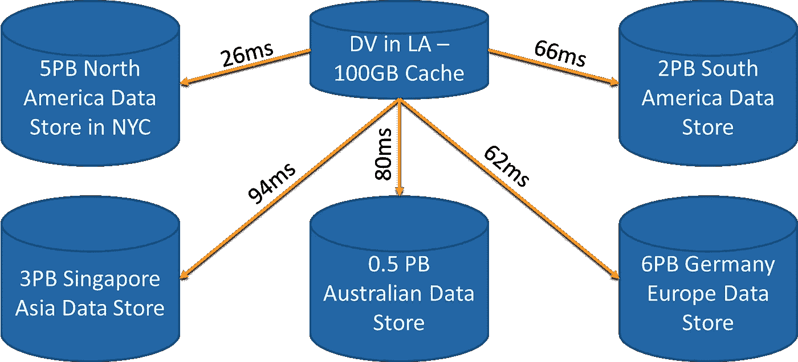

# 数据虚拟化并不神奇

> 原文：<https://medium.com/nerd-for-tech/data-virtualization-isnt-magic-e977ca08e553?source=collection_archive---------4----------------------->

我不喜欢数据虚拟化。为什么？

> 因为我使用了数据虚拟化

我并不完全讨厌它，我认为它在原型开发、发现方面有一些很好的用途，有时如果您将它用作针对已知查询和仪表板集的智能缓存，它真的可以在不同的数据源之间很好地工作。然而，我发现，即使我已经实施了它，并且在项目上线时取得了成功，大约 6 个月后，我会接到一个电话:

> “史蒂夫，数据虚拟化性能太差了，你能帮忙吗？”

然后，我毫无例外地发现，自由形式的查询已被允许，这些查询试图在无法利用缓存的数据集之间进行复杂的连接，我很快就发现了问题所在:

> “你的问题就在那里州长，光速”

担心的客户问我是否可以解决这个问题，回答总是一样的

> “您有两个选择，一是将这些不同的数据集集中到一个地方，以便在合理的时间内完成复杂的连接，而不会出现延迟问题”

他们不想这么做，毕竟这意味着承认他们错误地使用了虚拟化技术。所以他们要求第二次

> “这涉及到解决大规模量子纠缠的问题，或者某种违反我们所知的物理学标准模型的 11 维解决方案”

关键是，如果你在多个地方有大规模的数据集，并希望允许它们之间自由形式的连接，那么物理定律就不会是你的朋友。数据虚拟化并不是一颗神奇的子弹，你可以把它扔进数据资产中，然后让它神奇地为每一个场景工作。这是一项可以增加价值的技术，但你必须非常小心如何管理它，以及你这样做是为了什么。我有一个客户非常成功地使用了数据虚拟化解决方案，因为他们分散的数据集在压缩后总共只有大约 40GB。换句话说，虚拟化解决方案实际上只是一个内存缓存。另一个客户将其用作交叉引用持有人和 PII 信息持有人，这也是一个非常可缓存的数据集，是一种跨多个来源添加一致的安全模型的好方法，同时将交易数据留在这些来源中。

数据虚拟化解决方案通常作为“神奇”的单一窗口出售，通过它可以查看所有内容，而且它们演示得非常好，特别是在不同数据集之间进行基于关键字的查询时(数据虚拟化与良好的 MDM x-refs 配合使用效果很好)，但是当它成为自助服务平台时，我的经验始终是，人们开始在源之间的延迟成为问题的情况下进行查询。例如，一个虚拟化解决方案设计用于跨区域数据仓库进行收入汇总，由于下推非常简单，因此效果很好。你甚至可以对产品销售进行排名，因为这只是一个简单的后期汇总。

它运行得很好，然后有人决定推出“自助服务”。业务用户看到的是一个漂亮的平面视图，“他们认为很棒”，不需要考虑通过后期聚合将他们的查询分解为区域下推。因此，有人决定按一天中的本地时间查看购物篮关联性，并确定购物篮中的区域差异，换句话说，根据本地时间(而不是 UTC 时间戳)连接区域之间的交易数据，以确定一个区域中不存在于另一个区域中的关联性。在每个区域视图中，这些篮子线项目数以十亿计，缓存不会减少它。

> 咔嚓咔嚓！

DV 和商店之间的光速时间示例

DV 的工作原理是，它可以进行单个查询，并将其下推到存储区，然后获得单个响应，它试图通过缓存这些存储区中的键和核心数据来实现这一点，因此它可以在 DV 级别进行查询，并只向各个存储区发送单个请求。问题是，像 REST 一样，当查询变得“喋喋不休”并开始创建大量请求时，以外部连接开始的嵌套查询(例如，连接结果不能被缓存，所以您必须开始从一个存储中获取数据并将其发送到另一个存储中)。DV 工具可以自动做到这一点，问题是光速很快成为你的问题。我在这里甚至没有谈论延迟或带宽，我在谈论假设无限带宽时通过真空的理论最大传输速度。

有些查询从根本上说是不可伸缩的，而有些查询如果有人以可伸缩的方式设计它们，它们就可以伸缩。大多数情况下，这些问题属于后一类，但这并不意味着它们不是问题。我有一个客户，有人根据他们面前的**单个**模式做了一个非常合理的查询。他们不知道这是在联邦数据上，作为一个业务用户，他们肯定不具备在这种情况下高效地重构查询所需的 SQL 经验。对我来说，这是 DV 最大的挑战，在许多情况下，我发现理论上**的**在场景中是可行的，但是在**的现实中**用户社区没有以 DV 的“正确”方式构建查询所需的深厚的 SQL 经验，当然也没有获得这些技能的愿望。

如今，像[联合分析](/collaborative-data-ecosystems/federated-learning-for-architects-d6619631bbec)这样的技术正被用于极其复杂的场景，在这些场景中，数据通常出于法律原因而被分开保存。从事这项工作的团队通常拥有非常丰富的数据经验，并且正在解决更具挑战性的问题。出于隐私、法规和知识产权保护的原因，这些问题中的大部分都不允许 DV 解决方案，但却允许联合数据集进行协作。随着协作数据生态系统和数据共享越来越成为一种“东西”，我们必须小心我们使用的技术和技巧。

数据虚拟化可能是一个很有价值的工具，将它用于特定的情况，特定的问题，不要试图将其作为通用的解决方案，请记住，在这个时代， [100TB 不是复制，而是缓存](/nerd-for-tech/100-terabytes-isnt-duplication-its-caching-15658a1523a0)