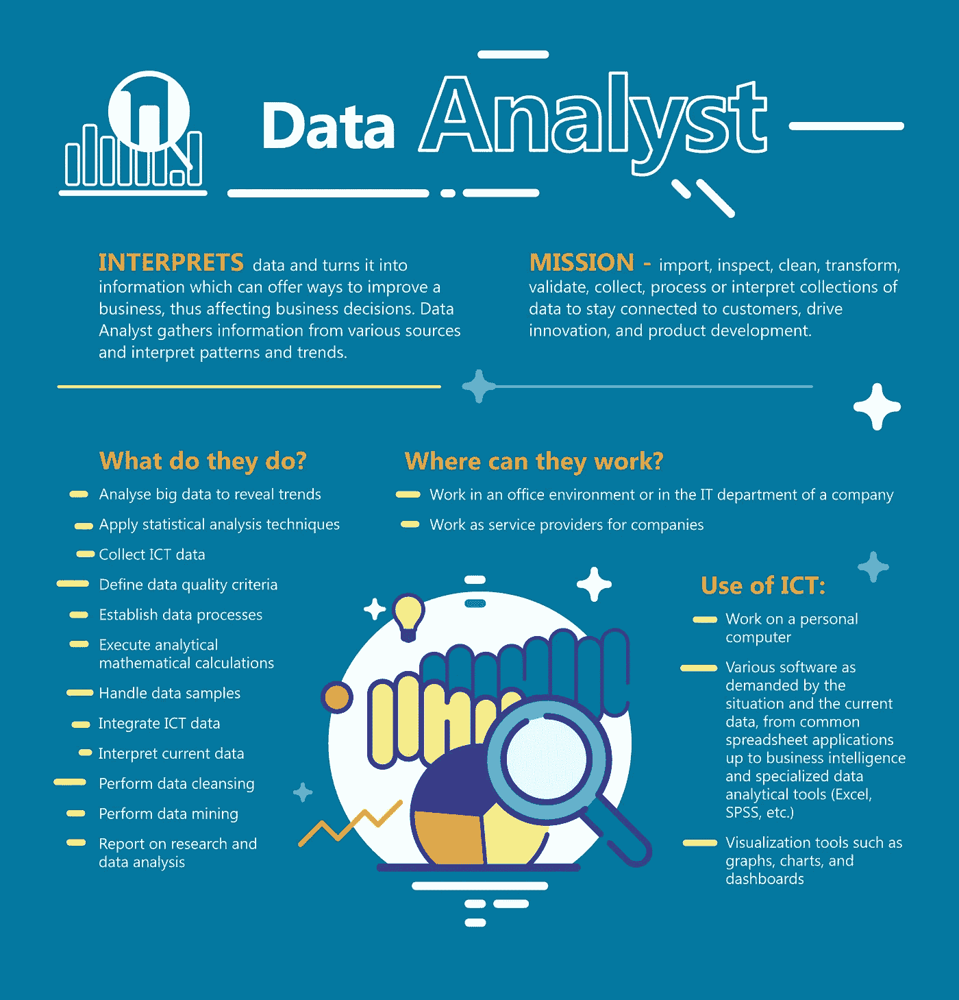
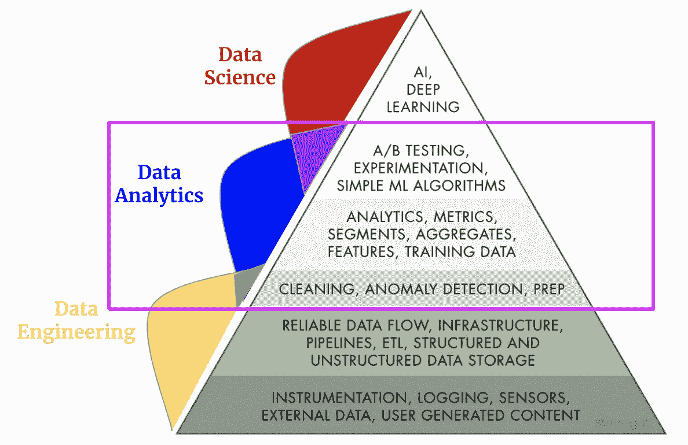

# 数据分析师的一天

> 原文：<https://medium.com/nerd-for-tech/day-in-the-life-of-a-data-analyst-ef84d2fc4901?source=collection_archive---------1----------------------->

你可能听说过“数据分析师”这个职位，这听起来是一个很有趣的职业。与数据和技术打交道的想法激起了你的好奇心，但数据分析师整天都在做什么呢？

数据分析师在工作日挖掘大数据，并使其为他们工作的公司所用。这包括分析数据系统、自动化信息检索和准备报告等任务，向经理们展示如何将这些数据应用到他们的业务模型中。

# 数据分析师的一天

一般来说，数据分析师将检索和收集数据，组织数据，并使用数据得出有意义的结论。“数据分析师的工作因行业和数据类型(销售、社交媒体、库存等)而异。)以及具体的客户项目。

无论他们在哪个行业工作，数据分析师都会花时间开发收集数据的系统，并将他们的发现汇编成报告，以帮助改善他们的公司。

关系数据库的发展给数据分析师带来了新的活力，它允许分析师使用 SQL 从数据库中检索数据。数据分析师收集、处理和执行大型数据集的统计分析。

分析师可以参与分析过程的任何部分。在数据分析师的角色中，你可能参与从建立分析系统到根据你收集的数据提供见解的所有事情——你甚至可能被要求在你的数据收集系统中培训其他人。

数据分析师通常与 IT 团队、管理层和/或数据科学家合作，以确定组织目标。他们从一手和二手资料中挖掘和清理数据，然后使用标准的统计工具和技术分析和解释结果。

数据分析师可能负责设计仪表板、监控 KPI 和维护关系数据库。他们还使用商业智能软件、可视化软件和计算机编程来评估整个组织中不同部门的系统。

数据分析中的大多数工作涉及收集和清理复杂的数据集，以揭示趋势/相关性/模式和业务洞察力，并确定流程改进的新机会。数据分析师还必须根据他们的发现创建报告，并向关键利益相关方传达后续步骤。

一些数据分析师不使用编程语言，更喜欢统计软件和 Excel。根据他们试图解决的问题，一些分析师执行回归分析或创建数据可视化。

数据分析师的角色越来越复杂。经验丰富的分析师使用建模和预测分析技术来生成有用的见解和行动。然后，他们必须向非技术利益相关者解释他们的发现，以及为什么这些信息是有用的。换句话说，他们是业务分析师和数据科学家之间的桥梁。

# 数据分析师的工资:

入门级数据分析师的平均薪资:83750 美元

数据分析师的平均薪资:100，250 美元

高级数据分析师的平均薪资:118，750 美元至 142，500 美元

未经适当检查而收集的数据是没有价值的。数据分析师的真正工作是为他们的客户/公司增加价值。

既然你已经知道了数据分析师工作描述背后的真正含义，你可能会认为挖掘数据听起来是你的完美职业。

查看下一篇帖子，其中包含分析师入门资源。