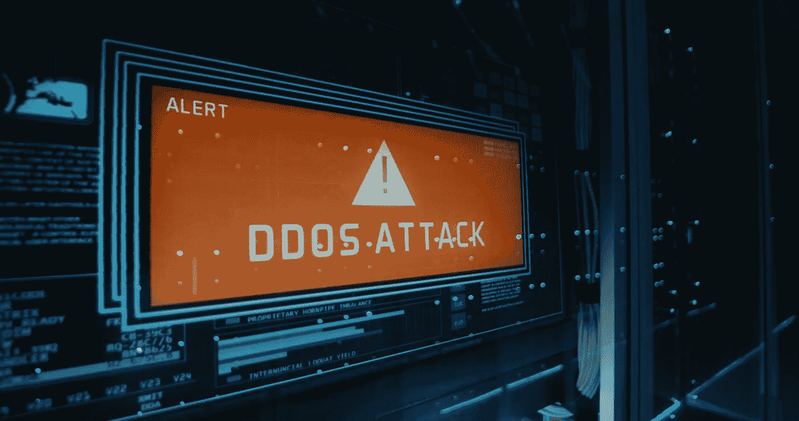

# DDoS 攻击:更大、更坏、传播更快

> 原文：<https://medium.com/nerd-for-tech/ddos-attacks-bigger-badder-and-spreading-fast-7a45e45137f1?source=collection_archive---------0----------------------->

这是破纪录的几周，而且不是好的方面。网络犯罪记录是不祥的警告，而不是庆祝的理由。

安全供应商 [Akamai](https://www.akamai.com/blog/security/record-breaking-ddos-attack-in-europe) 报告称，他们已经缓解了针对欧洲客户的最大规模的分布式拒绝服务(DDoS)攻击。那次攻击发生在[之前创纪录的](https://www.akamai.com/blog/security/largest-european-ddos-attack-ever)对同一客户的突破性 DoS 攻击的几个月后。Akamai 表示，最新的攻击对该公司的主数据中心以及欧洲和北美的其他六个数据中心进行了 201 次攻击。

另一家安全厂商 imper va[上周](https://www.imperva.com/blog/record-25-3-billion-request-multiplexing-attack-mitigated-by-imperva/)报告称，6 月 27 日，它缓解了一次超过 253 亿次请求的攻击，创下了其 DDoS 缓解产品的新纪录。

如果你不熟悉 DDoS 攻击，你并不孤单。他们通常不会像重大数据泄露或勒索软件攻击那样受到重视。

但也许他们应该。它们也可能是恶性的。根据 Comcast Business 的一份报告，他们的大多数目标(73%)都是一个国家最重要的行业部门——医疗保健、政府、金融和教育。

他们引起的麻烦很容易解释。我们都熟悉垃圾邮件或垃圾短信和电话。大多数时候，他们更多的是烦恼，而不是主要的威胁。如果我们愿意，我们有时间在手机上做“屏蔽来电”的事情，即使我们知道这有点像在夏天杀死一只蚊子。它几乎什么也没完成，因为还有十亿多，但它仍然让我们感觉良好。

但是，如果你的垃圾邮件或短信从每天几十封甚至几百封增加到每秒几百万封呢？这远不止是烦恼。你想联系的人都打不通。

**被垃圾淹没**

这就是 DDoS 攻击的目标。用太多的垃圾流量淹没一个网站，以至于它崩溃了，没有一个合法的流量可以通过。本质上，它关闭了一个企业的功能。

动机多种多样。可能是钱——在某些情况下，袭击者要求赎金来阻止海啸。这可能是竞争——你可以很快在无法运作的竞争对手面前占上风。可能是愤怒——一个游戏玩家不喜欢游戏制作者的所作所为。这可能是政治性的——像这样的“抗议”肯定会引起某个组织的注意。或者在某些情况下，它旨在转移受害者的注意力和资源，以便攻击者能够更容易地成功实施不同的攻击-注入恶意软件、窃取数据或发起勒索攻击。

Akamai 没有具体说明其刚刚报告的攻击动机，但表示其客户受到了 704.8 Mpps(每秒百万包)的垃圾流量——这是衡量 DDoS 攻击的方法之一。

Imperva 以每秒请求数(RPS)来衡量对其客户中国电信的攻击。该公司表示，攻击者向目标发出了 253 亿次请求，平均速率为 180 万次。

Akamai 也没有直接说攻击者是谁，尽管它暗示俄罗斯参与了此事。在一家公司关于此次攻击的博客文章的末尾，有链接将读者引向联邦网络安全和基础设施安全局的两个警告——一个是关于如何减轻[俄罗斯国家支持的对关键基础设施的威胁](https://www.cisa.gov/sites/default/files/publications/cisa_insight_mitigating_foreign_influence_508.pdf)，另一个是关于[俄罗斯恶意在线活动的概述](https://www.cisa.gov/uscert/russia)。

DDoS 攻击并不新鲜，它们已经存在了二十多年。到目前为止，每年都有数百万人这样做——Comcast Business 报告称，2021 年约有 984 万人这样做。

安全供应商 Gcore [上周](https://www.bleepingcomputer.com/news/security/ddos-and-bot-attacks-in-2022-business-sectors-at-risk-and-how-to-defend/)报告称，预计今年客户遭受 DDoS 攻击的数量将是 2021 年的两倍，平均规模将从每秒 150-300 千兆位(Gbps)——这是衡量攻击规模的另一种方法——增长到 500-700 Gbps。

**钝器**

它们也在多个层面上变得越来越大，越来越坏。其中一个级别是它们可能造成的损害。Synopsys 网络安全研究中心(CyRC)全球研究负责人乔纳森·努森(Jonathan Knudsen)指出，DDoS 攻击通常是一种“钝器——你可以用它在有限的时间内拒绝访问资源。”他们通常不会关注窃取数据或金钱之类的事情。

但是，如果 DDoS 攻击摧毁了一个提供关键服务的组织，显然会对更多的人产生物理影响，而不仅仅是目标组织内部的人。

最臭名昭著和不祥的例子之一是 2016 年针对域名提供商 Dyn 的攻击[。那次攻击使用了由数千台物联网设备组成的僵尸网络，扰乱了数十家主要网站，包括 Twitter、Spotify、PayPal、GitHub、CNN.com 和纽约时报。](https://www.csoonline.com/article/3137544/ddos-attack-on-dyn-could-have-been-prevented.html)

Synopsys CyRC 最近[发布了一个关于一个漏洞的建议](https://www.synopsys.com/blogs/software-security/cyrc-advisory-open5gs/?cmp=pr-sig&utm_medium=referral)，该漏洞可能允许对 5G(当前移动电话使用的网络技术)的开源实现进行 DDoS 攻击。

不难想象，如果一家主要运营商，或者多家运营商的数百万用户失去所有移动通信，将会导致怎样的混乱局面。

DDoS 攻击越来越严重的另一个原因是，攻击者更容易“招募”其他设备(这是攻击的“分布式”部分)来创建僵尸网络，然后他们使用僵尸网络试图用流量淹没受害者。

十多年来，被黑的计算机是用来创建僵尸网络的主要工具。最近，攻击者转向了构成物联网(IoT)的数十亿台嵌入式计算机设备，其中大多数设备都是众所周知的不安全设备。

虽然电话和计算机供应商有安全团队致力于修复其软件中的漏洞，但物联网设备的情况远非如此，其重点是可用性和功能，而不是安全性。

**不可抗拒的攻击面**

在众多的漏洞中，大多数都有公开和可发现的管理控制、默认密码，并且没有修补或更新的能力。

专家们经常警告说，如此广泛和脆弱的攻击面对犯罪黑客来说是不可抗拒的。这些袭击就是证明。

Imperva 表示，攻击其客户的攻击者使用路由器、安全摄像头和黑客服务器创建了一个僵尸网络，这些服务器连接到 180 多个国家的近 17 万个不同的 IP 地址，其中大多数位于美国、印度尼西亚和巴西。

当使用所有这些应征设备发起攻击时，这是一场“攻击者和受害者之间的数据管道大小的战斗”，[自称为公共利益技术专家和 Inrupt 安全架构负责人的 Bruce Schneier](https://www.schneier.com/blog/archives/2016/11/lessons_from_th_5.html) 说，他曾多次撰写关于 DDoS 攻击的文章。“如果防守者有更大的接收和处理数据的能力，他或她就会赢。如果攻击者能够抛出比受害者能够处理的更多的数据，他(她)就赢了。”

显然 Akamai 和 Imperva 为客户提供了更大的管道。

但这是有代价的。六年前，安全博客博主 Brian Krebs 是当时最大的 DDoS 攻击之一[的目标。Akamai 一直在为他的网站提供无偿保护，并缓解了那次攻击，但后来表示，它再也负担不起免费保护了。](https://krebsonsecurity.com/2016/09/krebsonsecurity-hit-with-record-ddos/)

克雷布斯很理解。“我真的不能责怪 Akamai，”[他当时写道](http://www.zdnet.com/article/krebs-on-security-booted-off-akamai-network-after-ddos-attack-proves-pricey/)。"我今天可能会让他们损失一大笔钱."

**保护物联网**

所有这些都意味着是时候开始关注 DDoS 攻击了。

怎么办？age light Trust & Risk Advisory Group 总裁 Craig Spiezle 在 Dyn 遭受攻击后表示，虽然没有完美的安全性，但物联网设备可以而且应该具有更好的安全性，如果它们做到了，像 Dyn 遭受的 DDoS 攻击将很难发生。

但这不是一个容易解决的问题。单个组织对用于创建僵尸网络的不安全物联网设备的安全性几乎没有控制。有数十亿是由开发人员创建的，他们的主要压力是上市速度和酷功能，而不是安全性。

目前，组织的唯一选择可能是雇佣 Akamai 和 Imperva 这样的供应商来缓解这些问题。

Spiezle 和其他人表示，唯一的长期解决方案是联邦政府对物联网市场施加压力。如果有什么好消息的话，那就是这种压力正在酝酿之中。

拜登总统 2021 年 5 月的行政命令(EO) [“改善国家网络安全”](https://www.govinfo.gov/content/pkg/FR-2021-05-17/pdf/2021-10460.pdf)包含多项指令来实施更好的安全实践——其中包括软件材料清单(SBOM)和标签，以说明应用程序和设备中使用的所有软件，它们来自哪里，如何构建和测试，以及如何维护。

当然，总统 EO 很多，并不总是被严格遵守，但一个可能改变游戏规则的要求是，最终，联邦机构将被禁止购买不符合拜登 EO 要求的安全实践的软件产品。

**涓滴式安全**

如果这一规定成立，并且供应商不遵守这些要求就不能向联邦政府出售，那么鉴于联邦政府的巨大购买力，安全性将“渗透”到私营部门。

“我希望 SBOM 倡议会获得支持，”施皮兹尔说，“但迄今为止，接受者和披露者都很有限。”

他补充说，一些积极的迹象是，“NIST[国家标准与技术研究所]刚刚发布了[物联网核心基线指南](https://csrc.nist.gov/publications/detail/nistir/8425/final)，并在 2 月份发布了[标签指南](https://nvlpubs.nist.gov/nistpubs/CSWP/NIST.CSWP.02042022-2.pdf)。与许多多方利益攸关方的努力一样，这些努力是最低限度的和自愿的。我仍然希望亚马逊等市场领导者和百思买(Best Buy)和好市多(Costco)等零售商能要求供应商遵守规定。”

人们希望，假以时日，他们会这样做。“联邦政府可以根据客户的要求实现这一点，这将‘滚动’到商业和消费领域，”斯皮兹尔说。

Knudsen 也有这样的希望，但并不认为这会很快发生。“我认为下游客户和消费者最终会要求他们的供应商和销售商提供更好的安全性，但我认为这不会发生，”他说。“也许这就像期望人们从他们的快餐店要求更好的营养价值和更健康的食物一样。”

他说:“我们正在走向一个良好的安全实践成为商业区分因素的世界，但我们还有很长的路要走。”。