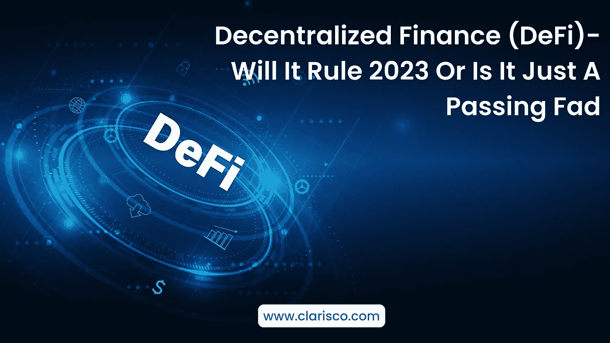

# 分散金融(DeFi)-它将统治 2023 年还是只是一个短暂的时尚？

> 原文：<https://medium.com/nerd-for-tech/decentralized-finance-defi-will-it-rule-2023-or-is-it-just-a-passing-fad-a9791efe13a9?source=collection_archive---------8----------------------->

分散金融(DeFi)-它将统治 2023 年还是只是一个短暂的时尚

你是一个花了大部分时间跟踪市场波动的加密迷吗？如果是这样的话，你并不孤单！随着每个新闻频道对熊市的痴迷，这是唯一合乎逻辑的。最近，关于金融未来的讨论一直被数字货币所主导。但是，还有一些事情正在金融系统中引起涟漪。这是 DeFi 的崛起。公司投资于 DeFi 发展服务并不奇怪。

即使经历了漫长的加密寒冬，总部位于区块链的 Cosmos 平台 Onomy 还是在几天前获得了数百万美元的资金，用于开发其新的 DeFi 协议。据开发者称，他们从 Bitfinex、艾娃实验室和 CMS Holdings 等行业巨头那里获得了 1000 万美元的首轮投资。您知道吗，到 2030 年，全球 DeFi 市场预计将达到 2311.9 亿美元。是的，你没听错！事实上，分散融资(DeFi)是一个十亿美元的机会，你可以通过与可靠的 [**DeFi 发展公司**](https://www.clarisco.com/defi-development-company) 合作来做大它。

在加密货币世界中，事情在不断变化。抓住每一个可以利用的机会是有利的，尤其是像分散融资这样有前途的机会。不熟悉 DeFi？别担心，我们会支持你的！让我们更深入地了解 DeFi。

# **DeFi 到底是什么？**

分散金融，又名 DeFi，使消费者能够在没有第三方(如银行)干预的情况下进行购买和转移支付。它还为消费者提供了绝对的财务控制权，而无需填写任何文书或表格。虽然没有必要提供个人信息，但能上网的智能手机或平板电脑至关重要。DeFi 与区块链(Blockchain)有着密切的联系，区块链是一种分布式、不可变的公共账本，加密货币建立在它的基础上，它允许网络上的所有设备(或节点)维护交易历史记录。这个想法是，没有一个人能控制或有权修改交易分类账。最简单的形式，DeFi 就是使用算法进行交易。让我们来看看 DeFi 提供的众多额外津贴，以及影响个人将资金投入**分散式金融发展服务的因素。**

# **DeFi 提供了哪些福利？**

1.DeFi 是开源的，不需要许可。任何拥有加密货币钱包并连接到互联网的人，无论在什么地理位置，都可以使用 DeFi 服务。用户还可以交易和转移资金，而不必等待银行转账或支付定期银行费用。

2.当交易成功完成时，基础区块链会更新，利率每分钟都会调整多次。交易是完全透明的。以太坊区块链上的每一笔交易(占所有 DeFi 通信量的 90%以上)都被广播给其他网络用户并得到他们的确认。有了这种程度的交易数据公开，任何用户都可以查看网络活动。

3.非托管加密钱包或基于智能合同的托管允许用户保持对其资金的控制。智能合同具有广泛的可编程性，能够根据各种标准自动执行。由于采用了区块链架构，DeFi 数据具有防篡改性、受保护性和可审计性。

4.一些 DeFi 协议是开源的，包括 Ethereum 和其他使用开源代码的项目，任何人都可以检查、审计和改进这些代码。开发人员可以简单地集成许多基于开源技术的 DeFi 应用程序，而无需授权来构建新的金融产品或服务。此外，举例来说，将资金从你的经纪人转移到你的银行，在集中融资中可能需要几天时间。DeFi 没有这种滞后。

这些只是分散融资带来的一些好处。难怪人们会将资金投入到基于 DeFi 的平台开发中。让我们来看看这些平台/应用。

**2023 年您可以投资的突出 DeFi 用例**

DeFi 是一个不断发展的生态系统，有潜力发展成为远远超过传统金融业的东西。以下是一些最常见的 DeFi 应用:

**1。分散市场**

分散市场是个人可以交易和投资数字资产的平台，无需使用中介。这些网站在国际上都可以使用，不需要使用中介来促进交易。NFT(不可替代的代币)是在这种分散的市场上购买的。NFT 市场是数字收藏家的平台，用于存储、展示、购买、销售和创建反映独特、有形和无形资产所有权的代币。你需要一个预充值的加密货币钱包和一个用户账户才能使用 NFT 市场。其中最著名的是 OpenSea，它也是交易量最大的市场。

**2。分散交易所(DEX)**

分散交易所(DEX)是一个 P2P 市场，加密货币交易者可以在这里直接交易，而无需将其资产委托给托管人或中介。相反，智能合约被用来促进交易。这些交易所的建立是为了消除任何监督和允许交易的中央集权。它们支持对等加密购买和交易。它们通常是非托管的，这意味着用户可以完全控制他们钱包的私钥。NXT 是 2014 年第一家分散式交易所，但自那以后，出现了一系列竞争对手 dex。Uniswap 是一个众所周知的 DEX，许多其他项目已经利用它的软件建立了类似的分散式交易所。

**3。借贷**

通过允许借贷，DeFi 改变了金融。分散贷款，通常被称为“开放金融”，为加密投资者提供了通过贷款赚取年回报的机会。分散借款允许个人以设定的利率借款。贷款和借款旨在满足加密社区的需求，同时也满足金融行业的用例。复合金融(Compound Finance)由 Rober Leshner 创立，于 2018 年首次亮相，是目前领先的 DeFi 借贷平台。该项目是一个基于以太坊的借贷协议，使用户能够通过借出资产或抵押借款来获得利息。复合协议通过由算法控制的利率为加密货币产生流动性，从而使这成为可能。

**4。聚合器&钱包**

分散金融现在分散在各个区块链，包括以太坊和 BSC。每个区块链都有自己独特的独立金融协议生态系统。这就是分散聚合器的用武之地，它将来自众多交易所的交易整合到一个地方，为客户节省时间，提高交易效率。从本质上说，它们是分散的资产管理服务，可以自动在几个产量农业平台之间转移客户的加密资产，以实现利润最大化。1inch 可能是最知名的聚合器。

钱包是数字资产的存储和交易中心。钱包可以容纳多种资产，也可以只容纳一种资产，它们以多种形式存在，包括软件、硬件和交换钱包。自托管钱包是您在其中处理您的私钥的钱包，并且是 DeFi 的重要组成部分，根据钱包促进各种 DeFi 平台的使用。相比之下，基于交换的钱包为你管理你的私人钥匙，给你较少的控制权，但也较低的安全责任。

**5。稳定的噪音**

稳定的硬币是 DeFi 行业的重要数字资产。为了防止波动和保持价格一致，这些加密货币的价值与另一种资产挂钩。它们经常与美元等法定货币或黄金等其他资产挂钩。这些硬币在贷款人、借款人、交易商和流动性提供者中享有盛名，因为它们能够提供稳定的价格和更快的资金转移前景。

# **结论**

由于像区块链这样的技术突破，金融服务业正在经历巨大的转变。DeFi 会留下来统治 2023 年。Web3 即将到来，金融服务将不再是原来的样子。不仅如此。DeFi 将通过允许虚拟和现实世界的交易，在元宇宙的扩张中发挥至关重要的作用。随着技术的发展和项目的广泛测试和分析，DeFi 产品和服务将变得合规和安全，并通过适当的审计和监控来保护用户的安全和隐私。DeFi 不应被视为一个迷人的概念，而是一个正在发生的积极转变。DeFi 的确是金融业的未来。今天与 [**DeFi 发展公司**](https://www.clarisco.com/defi-development-company) 合作，深入了解未来。