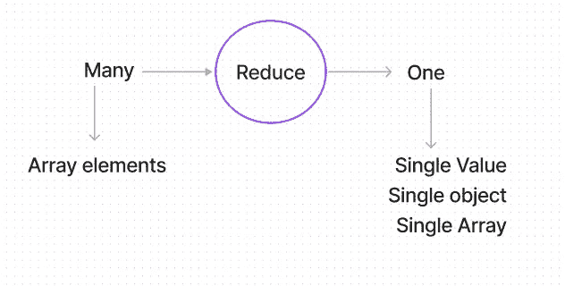

# Declutter Array.reduce()

> 原文：<https://medium.com/nerd-for-tech/declutter-array-reduce-bf6087dccfb6?source=collection_archive---------1----------------------->

许多人说在代码中使用 **Reduce** 方法会使代码变得混乱。因此，许多专家建议尽可能避免它。但是把这些建议放在一边。我们现在明白了。记住，它仍然是 Javascript 中数组的内置方法。

**减少** =多对一。它用于数组。所以在这里， ***多*** 指数组中的元素， ***一*** 指输出(结果)。该输出由 **Reduce 方法给出。**



Reduce 是一个接受一个**回调**函数和**初始值**的方法。

```
Array.reduce(**() => {}** , **initialValue**) --> Callback and initial value
```

该初始值决定输出或结果或单个(一个)最终值。

如果，

> 初始值=数字，那么输出是一个单一的数字。
> 
> 初始值= Object {}，那么输出的是单个对象。
> 
> 初始值= Array []，那么输出是一个单数组。

我们在处理数组，我们在数组元素上做运算。每次操作都会给你一个结果。我们需要这样的结果吗？停下来深思！

当然可以！但是为什么呢？因为我们是把很多元素转化成一个元素。所以每个操作都基于前一个元素的操作结果。听起来很困惑，对吧？

记住:在第一次迭代时，我们没有先前的迭代结果，因此，我们给出初始值。

## 手术在哪里进行？

在回调函数内部(函数包含要执行的操作和变量)。该函数必须使用以前的结果值，所以我们需要一个变量来存储结果。根据这个结果，完成后续操作。这个变量是回调函数的第一个参数，通常称为**‘累加器’。**

因为我们处理数组，所以第二个和第三个参数将分别是数组和索引中的当前元素——这种描述已经够无聊的了。我们来看一个经典的例子。

```
const arr = [1,2,3] // Syntax 
// Array.reduce(**() => {}** , **initialValue**) --> Callback and initial value //Callback parameters --> accumulator(previous result),current element in a array, index.  
// We will add all the elements in an array with an initial value of **0** const reduced = arr.reduce((acc,elem,index) => {     console.log('acc',acc)     
console.log('elem',elem)     
console.log('index',index)     
**return acc + elem** 
},0) console.log('The final output is',reduced) // Output is 
acc 0 --->First iteration value will be initial value 
elem 1 
index 0 acc 1 --> 0+1(Form previous result) --> **acc + elem** 
elem 2 
index 1 acc 3 -->  1+2(From previous result) --> **acc + elem** 
elem 3 
index 2 **The final output is 6 --> Result of the output is equal to the final accumulator value(3+3) because no element to process further in the array.**
```

让我们改变初始值，

```
const arr = [1,2,3]; const reduced = arr.reduce((acc,elem) => {     
**return acc + elem** 
},**100**) console.log('The final output is',reduced) **// Prints value *106* ** **because when it enters the callback function for the first iteration, it will have *acc* value of *100* = *initial value***
```

**注**:

*   在第一次迭代时， **acc** = **初始值。所以两者都是必修的。**
*   然后回调函数中的第二个参数是它将要处理的数组中的当前**元素**。

让我们复杂一点，比如一个属性名为**‘Price’的对象数组。我们需要总价。**

```
const arr = [ { price:100, }, { price:200, }, { price:300, }, ]; const reduced = arr.reduce((acc,elem) => { 
return acc + elem.price 
},0) console.log('The total value is',reduced) 
// Outputs --> **The total value is 600**
```

对于嵌套对象，

```
const arr = 
[ 
{ product:**{ name:'Shirt', price:2000 }** }, 
{ product:{ name:'Pant', price:1000 } }, 
{ product:{ name:'Shoe', price:1500 } }
]; const **reduced** = arr.reduce((acc,elem) => {  
**let {product} = elem; --> Destructuring first level 
return acc + product.price**  
},0) console.log('The total value is',reduced) 
// Outputs --> **The total value is 4500**
```

让我们在一个数组中求最小值和最大值，

我们将把初始最大值改为数组中的第一个元素，然后检查数组中的每个元素。

const arr = [100，30，9，0，200，90，10，25]

```
const arr = [100,30,9,0,200,90,10,25]; const reduced = arr.reduce((acc,elem,index) => { // only enters if the current maximum(acc) is less than current element  
if(acc<elem) {  
acc = elem  return acc  
} // enters current maximum is greater  
else {   
return acc;  
} },arr[0]) 
// First value of array console.log(reduced)   ** //Prints 200**
```

至少，

```
const arr = [100,30,9,0,200,90,10,25]; const reduced = arr.reduce((acc,elem,index) => { // only enters if the current minimum(acc) is greater than current element  
if(acc>elem) {  
acc = elem  return acc  
} // enters current maximum is greater  
else {   
return acc;  
}  
},arr[0]) // First value of array console.log(reduced)   ** // Prints 0**
```

我们将减少一组对象，

典型的电子商务问题，每个项目的数量被添加到购物车。

```
const arr = [ 
{ product:**{ name:'Shirt', price:2000 }** }, 
{ product:{ name:'Pant', price:1000 } }, 
{ product:{ name:'Shoe', price:1500 } }, 
{ product:{ name:'Shoe', price:1500 } }, 
{ product:{ name:'Pant', price:1000 } }, 
{ product:{ name:'Pant', price:1000 } }, 
{ product:{ name:'Shirt', price:2000, } 
}, ];
```

让我们仔细看看结构。

是数组吗？是的。所以我们可以减少它！

结构是什么？对象的数组。

我们在第一层有预期的属性吗？不，它是嵌套的。

完整的结构是什么？

```
[ { 
   product:{     
         name:...,     
         price:...     
      } 
  }
]
```

我们需要找到什么？每个产品在此数组中出现的次数。

*最后的输出应该是在* ***对象*** *与* ***键*** *为* ***产品名称*******值*******中它出现的次数*** *。***

**我们使用动态密钥计算和扩展操作符，因为每次迭代都会检查密钥并保留已经计算的属性和值。这将存储在*累加器*中，用于下一次迭代，最后一次迭代结果将被输出。**

**检查键=动态键。**

**在 object = Spread 运算符中保留先前输出的结果。**

```
**const reduced = arr.reduce((acc,elem) => { let {product} = elem; if(!acc[product.name]) { 
// using dynamic keys [product.name] and spread operator (...acc) return {...acc,[product.name]:1} 
} else { 
return {...acc,[product.name]: acc[product.name] + 1} 
} },**{}**)  
// Final output is reduced to single object and hence initial value is empty object**
```

**让我解释一下这里的逻辑，**

**如果密钥在输出对象中不可用→ **if(！acc[poduct.name])。****

****注意:第一次迭代→将是空对象{}****

**请复制已经计算的值(键和值)并用值**‘1’初始化一个新的键。****

**= **{****

****…acc，****

****【产品名称】:1****

****}****

**否则，**

**复制已经计算的值(键和值)并**添加**一个带有**‘1’=**的特定键**

****{****

****…acc，****

****【产品名称】:acc【产品名称】+ 1****

****}****

**所以输出是，**

```
**{Shirt:1, Pant:3, Shoe:2}**
```

**让我们将产品名称添加到一个数组中。**

```
**const reduced = arr.reduce((acc,elem) => {    
let {product} = elem;     

// Since we initialize it as an **array**, we can use the **push** method       acc.push(product.name)        
return acc 
},**[]**)console.log(reduced) 
//[ 'Shirt', 'Pant', 'Shoe', 'Shoe', 'Pant', 'Pant', 'Shirt' ]**
```

**因为我们可以像上面一样从原始数组创建另一个数组，所以我们可以使用 **reduce** 对一个数组进行 **map** 操作。让我们对数组中的每个元素求平方。**

```
**const arr = [5,10,15,20,25]; const reduced = arr.reduce((acc,elem) => {     
let squared = elem * elem     
acc.push(squared)     
return acc 
},**[]**) console.log(reduced)**
```

**输出是**

```
**[ 25, 100, 225, 400, 625 ]**
```

**类似地，我们可以使用 reduce 过滤数组，**

```
**const arr = [5,10,15,20,25]; const reduced = arr.reduce((acc,elem) => { if(elem > 15) { 
acc.push(elem) 
return acc 
} else { 
return acc 
} 
},**[]**)**
```

**输出是，**

```
**[ 20, 25 ] // Values greater than 15**
```

***原载于 2022 年 9 月 26 日 https://www.pansofarjun.com*[](https://www.pansofarjun.com/post/declutter-array-reduce)**。****