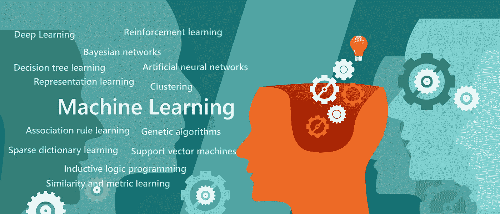
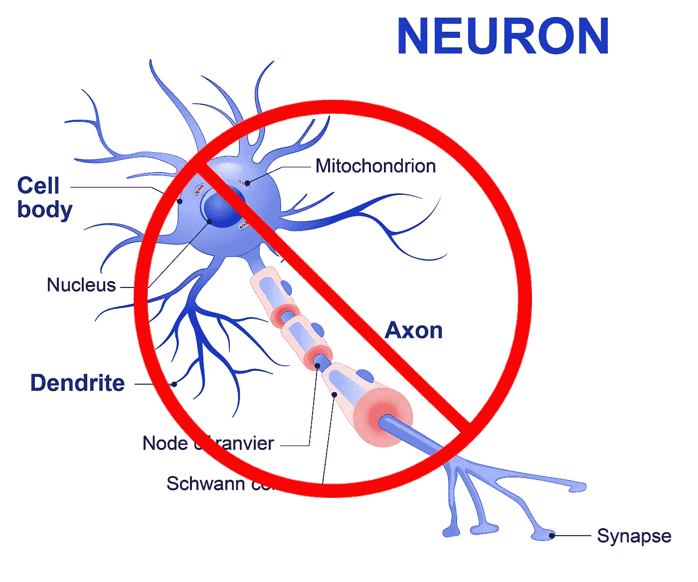
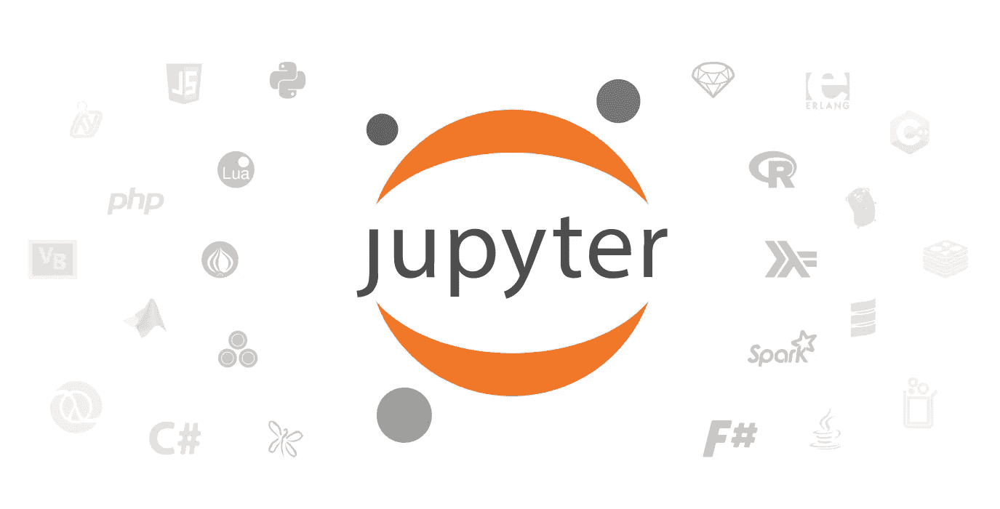

# 深度学习之旅——需要避免的事情

> 原文：<https://medium.com/nerd-for-tech/deep-learning-journey-things-to-avoid-58bb07fdce6?source=collection_archive---------19----------------------->

早些时候，我写了一篇文章,建议当你开始深度学习之旅时应该做些什么。这篇文章将讨论**不该做的事情**。

**1。不要过分迷恋术语**

相信我——你可以在不知道机器学习、数据科学、人工智能、深度学习、大数据、数据挖掘等等术语的完美正式定义以及它们的差异或相互关系的情况下，学习更深层次的深度学习。虽然一些高层次的理解会有所帮助，但如果你最初无法弄清楚什么类型的人工智能不是机器学习，以及深度学习与神经网络有什么不同，这也没关系。你对一件事情了解得越多，就会逐渐帮助你理解它与其他事情的不同之处。你会成功的！相信我的话。

**2。不要看这张图片或任何看起来很像的东西——甚至这张也不要看。闭上眼睛。快速向上滚动，移到下一段。**

对我来说——这个宇宙中最没用(甚至有害)的东西(仅次于我所在国家的政客)就是上面这张图。

可能没有任何深度学习书籍或教程不开始描述生物神经网络，突出像这样的图片。虽然意图是好的——帮助你联系神经网络如何工作，说明人类大脑如何工作，但它并没有真正的帮助。

一个原因是，你可能不知道人脑是如何工作的。如果你和我一样，在没有完全理解之前章节的情况下，不愿意继续阅读后面的章节，这些图片肯定会把你吓跑。就我而言，我花了很多时间研究轴突、树突和突触，以为这些概念会在后面的章节中用到。不幸的是，我花了几年时间做出勇敢的决定，跳过这张图片，继续前进。从那以后已经过了相当长的时间，我现在对基本原理有了一个相当好的想法——你猜怎么着——那些轴突、突触再也没有出现过——一次也没有(据我所知没有)。

**3。不要犹豫，带着不完整的知识前进**

信用:[http://clipart-library.com](http://clipart-library.com/)

这是最后一点的一种延伸。不像你的三角学书，你需要理解每一章才能开始下一章——同样的方法在深度学习中可能不太实用。记住，深度学习是建立在一大堆学科之上的——微积分、统计学、概率、线性代数等等。你一定会遇到你希望离开高中后没有忘记的话题。在那些情况下，不要完全停顿下来重新获得该主题中的所有知识——这将使旅程更加艰难，你会发现很难继续下去(除非你像罗伯特·布鲁斯一样下定决心)。

作为我所指的一个具体例子——在你深度学习旅程的第一天，你可能会遇到“sigmoid function”这个概念。这个等式可能看起来很可怕，尤其是如果你很久以前就已经放弃了研究。但是要继续下去，就试着说服你自己，你现在唯一需要理解的是，对于任何输入，函数都会给出 0 到 1 之间的输出。此外，它确保了一些非线性，以捕捉比线性关系更复杂的关系。最好不要完全脱离深度学习的学习，花一周时间在欧拉数(e)上，更深入的了解 sigmoid 函数。

> 另外，欧拉数很热！花上几个月甚至几年的时间来获得背后的直觉可能是值得的。但是生命太短暂——你必须明智地利用你的时间，并专注于实现你的目标。

**4。开始使用代码不要迟到**

多年来，我一直认为我知道神经网络的基本架构。直到我从零开始建立我的第一个基本神经网络，我才意识到我错了。

在花了几个小时的视频教程后，你可能会得到类似的错觉——但在你建造自己的机器之前很难验证。

在你对层次、神经元、权重、偏差有所了解之后，选择一种语言。打开一个 IDE。在 YouTube 上找一个视频——跟着做，继续编码。

你的研究可以与代码并行进行。熟悉编码的一个很大的好处是，你可以快速地将你的知识与代码联系起来，自己尝试不同的东西。更大的原因是——事实上“数千行理论有时用几行代码写成”会让你更有动力继续下去。

**5。不要低估玩具示例**

比方说，你遇到了一个非常简单的教程——从摄氏温度预测华氏温度。首先你会发现缺乏热情，因为你不在乎飞轮海。你想要构建自己的 Sofia 或者终结者——而教程离它太远了。其次，如果你无论如何都要开始学习教程，并且在某一点上遇到了困难，你会开始感到沮丧，想着如果连这些简单的例子都不能理解，我怎么能建造我的索菲亚呢？

现在—玩具例子不应该更容易，所以当你卡住时不要难过。它们很好，因为它们只关注核心概念。使玩具成为真正机器的其他概念相对来说比较容易理解，或者不太容易理解。考虑“从摄氏温度预测华氏温度”的例子。它看起来没有“识别手写数字”那么花哨(与其他更接近现实生活的问题相比，甚至这个问题也可以是一个“玩具”)。但是“识别手写数字”需要一些预处理来读取和解释图像。此外，对于初学者来说，可能很难想象单个像素在网络中是如何被处理的。

对于像 Fahrenheit 这样的简单问题，您可以从这些预处理工作中解脱出来，并可以将所有的注意力放在理解向前和向后传递是如何工作的以及参数是如何更新的。然后你可以通过学习激活函数和预测非线性关系来逐步加强你的理解。现在你唯一需要学习的是将这些知识应用到图像中(无论是手写的数字还是你最喜欢的名人),将图像表示为矩阵，这并不难学。

**6。不要挑剔工具**

你已经对工具有什么偏好了吗？和他们一起去。如果你完全不知道——不要浪费时间研究它们，听我说。刚入门 Python 和 JupyerLab。

**7。不要沮丧地重述**

当你在投入大量时间和努力后理解了一些东西，后来发现你的理解并不像你想象的那样完整——不沮丧是很难的。

在我的例子中，在构建了 CNN、RNN、Transformer，甚至更复杂的网络之后，我不得不回到我的基本网络实现，发现我之前遗漏了一些核心概念。你可能有同样的经历——并且需要适应它！