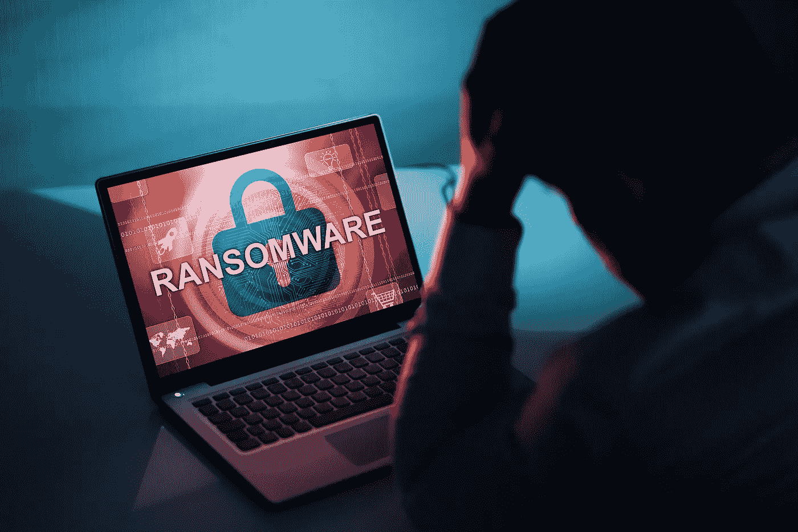

# 击败勒索软件并不需要花心思，而是需要基础知识

> 原文：<https://medium.com/nerd-for-tech/defeating-ransomware-doesnt-take-fancy-it-takes-fundamentals-55782ca525a3?source=collection_archive---------6----------------------->

宣布任何勒索软件攻击都是“警钟”的时候到了。

如果他们中的任何一个真的被感染了，勒索软件现在应该只是一个小麻烦，而不是一个流行病级别的持续灾难。事实上，根据勒索软件造成的损害数量和规模的不断增加，这些攻击的集体目标似乎没有醒来加入到力量中去，粉碎一个巨大的在线祸害，而是象征性地按下了打盹按钮。

因此，毫不奇怪，对于应对通胀、产品供应链和 COVID 的每个人来说，2021 年可能都很糟糕，但对于勒索软件攻击者来说，这是非常好的一年，延续了每年都变得更好的趋势。 [SonicWall 报告称](https://blog.sonicwall.com/en-us/2021/03/sonicwall-exposes-soaring-threats-historic-power-shifts-in-new-report/)从 2019 年到 2020 年，全球范围内的攻击数量激增 62%,美国激增 158%。这一趋势今年似乎还会继续。

美国司法部估计平均每天[有 4000 起勒索攻击](https://www.justice.gov/criminal-ccips/file/872771/download)，或者每年大约 146 万起

请记住，这些只是被报告的内容。如果漏报不是问题，国会就不会[考虑多项法案](https://www.lawfareblog.com/pros-and-cons-mandating-reporting-ransomware-victims)来解决这个问题。

此外，正如数百个故事中提到的那样，犯罪勒索团伙已经变得越来越复杂，越来越有说服力。

有说服力的是，如果您的组织对其所有数据进行离线备份，它就不再受到保护，因为攻击者不再只是加密数据。他们威胁要将其公之于众，这可能会危及知识产权以及个人和财务数据。所以现在是两级勒索。

**无尽的名单**

就在过去的几周内，全国步枪协会、视频游戏玩家的 Windows 设备和辛克莱广播集团都遭到了高调的勒索攻击。

此外，11 月 1 日，联邦调查局发布了一份[“私人行业通知”](https://www.ic3.gov/Media/News/2021/211101.pdf)警告称，勒索软件团伙正在瞄准参与并购等“重大金融事件”的公司，进行更有针对性的勒索。

“在攻击之前，勒索病毒行为者会研究公开可用的信息，如受害者的股票估值，以及重要的非公开信息。如果受害者不迅速支付赎金，勒索软件行为者将威胁公开披露这些信息，引起潜在投资者的反弹。”

这个清单可以一直列下去，但是你会明白的。勒索软件非常猖獗，而且非常成功。

新思软件完整性集团的管理顾问 Rehan Bashir 说:“是时候醒醒了，把网络安全当作一件严肃的事情来对待。”“数据泄露会带来严重的社会和经济后果。”

**他们容易，我们难**

当然，这并不是说防守队员真的睡着了。从多方面来看，勒索软件攻击变得越来越容易实施，而预防、检测和响应它们变得越来越困难。

正如多位专家指出的那样，发动攻击不再需要那么复杂。GitHub 上免费提供支持网络钓鱼、初始访问、凭据滥用和开源勒索软件有效负载的工具集。

多个国家——俄罗斯是最突出的，但也有其他国家，包括朝鲜——是勒索软件团伙的避风港，只要这些团伙不攻击东道国的利益。而那些肇事者是大多数西方国家鞭长莫及的。

要求用加密货币支付使得追踪他们变得困难甚至不可能。总收入是净收入，因为他们超出了国税局的范围。

此外，[Prevailion 的首席技术官内特·沃菲尔德最近在 Threatpost 上指出，](https://threatpost.com/cybersecurity-failing-ransomware/175637/)小偷之间显然存在某种程度的荣誉。他们比好人合作得更好。

“通过将工作分散到多个犯罪集团，这使得战术、技术和程序更难归咎于任何一个单一的行为者，”他写道。“它可以模糊恶意行为者的意图，并允许勒索软件即服务卡特尔优先考虑高价值目标。”

尽管如此，辩护者可以也应该做得更好。在某些情况下，他们甚至不做多因素身份认证等安全基础工作，或者他们依赖于防病毒解决方案等工具，这些工具因为更容易被绕过而变得过时。

再加上人为因素——善意的员工容易受到越来越复杂和可信的网络钓鱼攻击——看起来竞争环境压倒性地倾向于犯罪分子。

**使用工具**

但专家多年来一直表示，勒索软件的目标——几乎所有不是罪犯的人——都有工具和技术，可以让这个领域回到接近的水平。这仍然是事实。是的，这需要工作、时间和金钱，但几乎总是比从攻击中恢复要少得多。

除了上面提到的基础知识之外，组织需要解决已经成为他们的主要弱点，因此对攻击者有吸引力的东西:软件供应链。

Synopsys 软件完整性小组的高级安全工程师 Boris Cipot 表示，组织使自己成为更难攻击的目标的一种方法是保持他们的系统和软件最新。但是，他补充说，这需要跟踪你的软件中有什么。

实际上，在所有情况下，软件组件都“依赖于”来自其他来源或供应商的其他组件。这些依赖关系本身就有依赖关系，这些依赖关系可以达到多个层次，甚至几十到几百个层次。如果一个组织不跟踪所有这些，它就不知道何时有更新或补丁可用。

“组织没有密切关注软件供应商，”Cipot 说。"在许多情况下，整个软件供应链的建立是有问题的."

他说，其中很大一部分原因是组织更关注“特性、功能和价格”。这些不应该是你购买产品的唯一标准。供应链安全意味着确保您实施的一切都符合您的规则和政策，并且能够根据需要进行维护。”

在更广泛的层面上应对勒索软件祸害还需要公共和私营部门的合作——由于缺乏信任，这很难做到。许多组织不想将任何私人信息交给政府，因为担心这些信息会被用来制裁或起诉他们，或者被公之于众。

但是有一些措施可以解决这个问题。虽然乔·拜登总统 5 月 12 日在 T2 发布的关于改善国家网络安全的行政命令甚至没有提到勒索软件，但它确实将重点放在了改善软件供应链安全上。它要求联邦机构只能购买符合严格安全标准的产品。鉴于联邦政府的购买力，大多数专家认为这将全面提高安全性，而不仅仅是针对政府承包商。

**采购杠杆**

Cipot 和其他人赞赏这种采购杠杆，指出产品的物理安全和保障长期以来一直受到政府的监管。他说:“例如，一辆不满足特定安全措施的汽车不能卖给美国的消费者。”

安全与技术研究所勒索软件特别工作组(RTF)发布了一份 81 页的报告，该报告在拜登行政命令发布前几周发布，呼吁公共/私人联盟“扰乱勒索软件商业模式”，该报告称这已经成为“全球紧迫的国家安全风险”。该任务组得到了数十个技术组织的支持，包括微软、思科、亚马逊网络服务和 FireEye 等巨头。

在 RTF 中有代表的政府机构包括美国司法部、国土安全部的网络安全和基础设施安全局、特勤局、联邦调查局、欧洲刑警组织和英国国家犯罪局。

偶尔有迹象表明好人正在取得进展。在过去的一周，[哔哔电脑报道了](https://www.bleepingcomputer.com/news/security/the-week-in-ransomware-october-29th-2021-making-arrests/)欧洲刑警组织的声明，该组织已经逮捕了 12 名与 71 个国家的 1800 多起勒索攻击有关的人。此外，一些解密器已经帮助勒索受害者恢复文件免受勒索软件的攻击，包括 BlackMatter，Babuk，Atom Silo 和 LockFile。

或许是为了回应这一点，据报道，[黑物质团伙由于“来自当地政府的压力”而关闭了](https://thehackernews.com/2021/11/blackmatter-ransomware-reportedly.html)

但是对于个人和组织来说，它仍然归结为安全基础。它必须比建筑物的物理安全更严肃地对待，在大多数情况下，物理安全只是意味着锁好门窗，或许使用视频监控。网上有更多的入口，攻击者不必亲自出现。他们可能在世界上的任何地方。

“组织仍然缺乏强大的网络安全文化，”巴希尔说。“在许多组织中，网络安全仍然被视为一项开支，是事后才想到的。这种情况现在需要改变。”

Cipot 同意。“你必须安全地生活，”他说。“你必须测试实现，运行‘消防演习’,并检查你的安全性是否仍然与最新的威胁相当。你需要教育你的员工。你需要让每个人都参与进来，帮助他们理解这一点，并能够发现问题所在。”

“因为根据攻击者是谁，他们会尝试所有的锁和门把手，以找到开着的那个。”