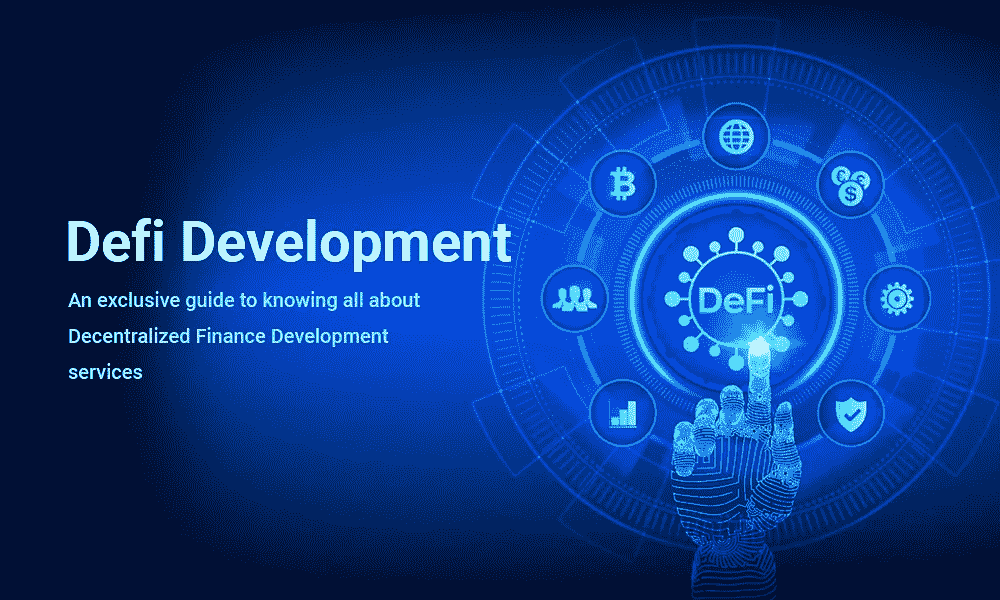
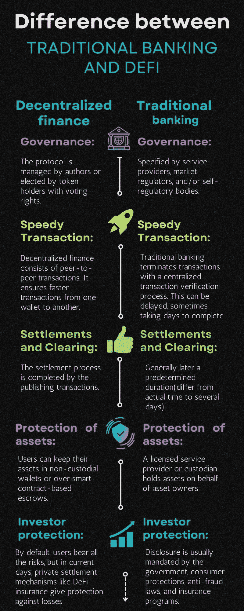

# defi Development——了解分散式金融发展服务的独家指南

> 原文：<https://medium.com/nerd-for-tech/defi-development-an-exclusive-guide-to-knowing-all-about-decentralized-finance-development-35bbc0cbc169?source=collection_archive---------6----------------------->

Defi 开发

# 什么是分散金融发展？

DeFi 发展也被称为 [**分散金融发展**](https://www.alwin.io/decentralized-finance-defi-development) ，是当今金融生态系统中最重大的范式变革者。它改善了每个人获得重要金融功能、交易、借贷、投资、风险管理等的机会。

我很高兴欢迎大家愉快地阅读我的文章。带着同样的贪婪，让我们深入挖掘去中心化的金融发展。

# 快速查看 Defi

分散金融与日益增长的金融技术支持的安全分布式分类账相关联，就像加密货币所使用的那些分类账一样。这种类型的系统消除了银行部门，建立了磨损货币和金融服务/产品。

# 为什么要分散财务？

与传统银行部门(如定期存款、储蓄账户和股票市场投资)相比，分散式金融提供了更高的投资回报率。这种投资计划是不稳定的，以增长为导向，并保证有效的资产修改。

不需要人工干预或第三方，因为智能合同有助于 100%自动化。这也避免了不必要的冲突和挑战的发生。

交易成本非常低，资金可以轻松转移，因为平台中没有任何中间人。这改善了用户体验。

它确保全球获得金融服务，尽管一个人的经济。这创造了一个额外的公平世界，在这里可以很容易地获得有益的投资机会。

分散式金融服务具有高度的可操作性，可以完全整合。这排除了任何类型的复杂性，因为所有用户都可以通过一个一致的模块使用每个服务。

由于所有数据都保存在永久的区块链网络上，参与者可以随时随地查看，因此确保了更高水平的开放性。这在 Defi 开发服务中产生了更多的信任和保证。

# 传统银行与 Defi 的区别

传统银行与 Defi 的区别

# 让我们深入了解一下各种 Defi 服务

## [Defi 钱包开发](https://www.alwin.io/defi-wallet-development):

用户习惯于将他们的硬币或代币安全地存放在他们的 Defi 钱包中。他们可以使用自己的私钥访问它，不会有任何私人访问。Defi 钱包可以在网络和移动平台上轻松使用。

# Defi 令牌开发:

DeFi 代币有一定的价值。它们建立在分散的区块链网络上。它可以与流行的 DApps 结合，增加其交易量。代币有多种使用选项，可以是安全、实用、支付或权益代币。

# Defi 保险开发:

保险对于防范突发风险和紧急情况至关重要。用户可以选择金融保险来保护自己免受智能合约中任何技术错误和流动性问题的影响。

# DApp 发展基金会:

DApps 将更多的权力放在用户手中，并防止了大多数集中式系统中存在的单点故障风险。他们非常安全。DeFi DApps 的一些示例有 PancakeSwap、SushiSwap、UniSwap、MakerDAO 和 Curve。

# Defi 产量农业发展:

它意味着用户承诺他们当前的密码持有量，并在一定时期后获得更多的回报。

# Defi 贷款平台开发:

它保证及时向合格的借款人发放信贷。它不需要中间人，使借款人和贷款人能够直接讨论贷款协议的条款。借款人可以选择抵押来保护自己不拖欠贷款。贷款人以利息的形式从借款人那里获得定期付款。

# Defi 打桩平台开发:

用户的加密资产将被押在交易平台或合适的钱包上。对于投资者来说，它提供了一个可靠的被动收入来源。给予用户的回报由多种因素决定，包括网络发行率、当前通货膨胀率、在平台上押下的资产总量、押下的时长等。

# Defi 分散交换开发:

分散式交易所利用流动性池取代集中式交易所的标准订单簿，允许用户交易数字资产。示例包括 KyberSwap、Atomex、Balancer、Curve 和 Uniswap。

# Defi 智能合同开发:

智能合同通过有效地自动化每一个流程，成为 DeFi 应用程序的基础。它们将用计算机语言 Solidity 编写。它们是高度加密的，只有在满足一些简单要求的情况下才能有效工作。为了保持健康，智能合同要求定期进行专家审计。

额外的 DeFi 开发服务包括为消费者提供做市咨询和确保分散的资金管理。

# Defi 的发展历程？

我们将看到 Defi 一步一步的发展过程

步骤 1:从客户那里收集业务和软件模型的需求，然后创建蓝图。

第二步:得到客户端的确认后，按照蓝图开始开发过程。在这一步中，开发人员编写代码，设计人员也用一个有吸引力的用户界面来开发代码。一旦构建就绪，它将进入测试过程。

第三步:Defi 的构建进入测试过程，它将被一个接一个的测试。如果所有的测试过程都完成了，它将进入下一个过程。

步骤 4:现在，这个软件被移动到客户的审查和满意，并且客户给出确认，然后部署过程开始。这些是 Defi 开发流程的步骤

# 结论

据密切关注该行业的 Pulse.com DeFi 公司称，DeFi 解决方案正在快速创建，各种项目锁定了惊人的 143.6 亿美元。DeFi 开发主要是在不同区块链网络的帮助下安全运行的，如以太坊、币安智能链、Polygon(Matic)、Tron、Solana 等等。根据颁布的法律和用户接受新金融应用的速度，去中心化金融的发展将继续加速。

通过消除中介，它为客户提供了一种更智能的处理资金的方法。变得更加开放和稳健是对世界金融体系的可喜贡献。WeAlwin Technologies 是一家顶尖的分散式金融(DeFi)开发公司，致力于加速分散式应用程序的发展和使用，同时也紧跟发展趋势。这将有助于未来引起更大经济体的关注。