# 使用 Azure Kubernetes 服务(AKS)将 Wso2 Api 管理器与 ELK stack 和 prometheus operator 一起部署

> 原文：<https://medium.com/nerd-for-tech/deploy-wso2-api-manager-with-elk-stack-and-prometheus-operator-using-azure-kuberenetes-service-aks-9a7c6f68bf4f?source=collection_archive---------0----------------------->

[API 管理](https://wso2.com/api-management/)包括管理从创建、测试、文档、发布、发现和货币化的 API 生命周期。除此之外，API 管理平台还可以加强安全性，并提供对 API 使用情况的深入分析。这确保了 API 的安全性和易用性。

这是一个 api 管理及其组件之间交互的示例概述。

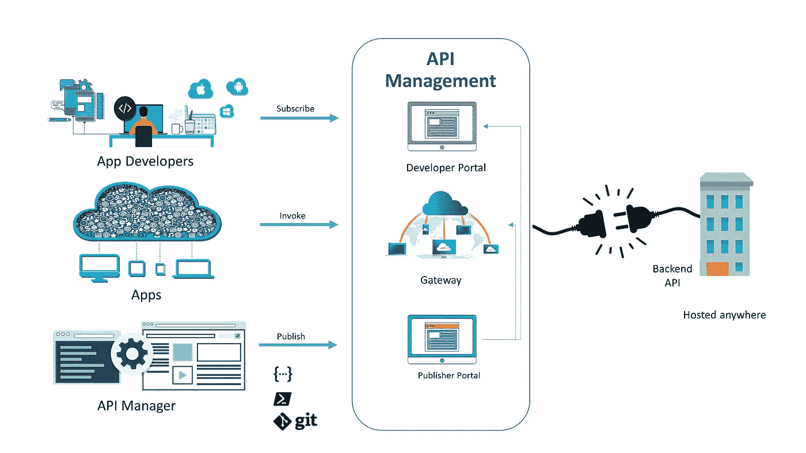

*   api 管理器将从发布者门户创建 API，在网关中部署它，并在开发者门户中发布它
*   Api 开发人员将从开发人员门户订阅这些 Api，并从应用程序调用它们
*   api 网关将处理即将到来的请求，并从实现 api 的后端获得响应

**我们要用什么？**

*   管理 Api 生命周期的 Wso2 Api 管理器
*   用于日志系统的 Elasticstack(elasticsearch、logstash 和 kibana)
*   普罗米修斯、加拉法纳和警报管理器进行监控
*   Wso2 choreo for analytics
*   松弛作为通知渠道(您可以使用任何其他渠道，如团队或电子邮件..)

## 先决条件

*   Aks 集群或任何其他类似 minikube 的集群
*   克隆包含所有必需的 yaml 文件和后续步骤的 git repo "[https://github.com/FirasMessaoudi/wso2-deployment](https://github.com/FirasMessaoudi/wso2-deployment)

这是我们将要实现的系统架构。

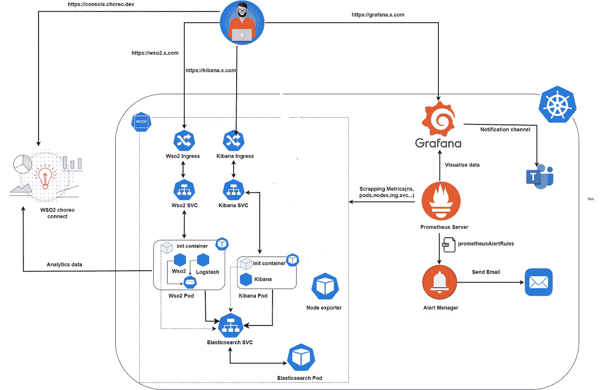

体系结构

*   Wso2 和 Kibana ingress 将公开相关的服务并管理外部访问。
*   Wso2、kibana 和 elasticsearch services (SVC)将公开在 pod 内部运行的应用程序。
*   Wso2 和 logstash 是运行同一个 pod 的两个容器，它们可以访问包含 wso2 生成的日志的共享卷。Logstash 处理这些日志并将其发送到 elasticsearch
*   我们在运行 logstash 和
    Kibana 的 pod 中有两个 init 容器，以确保在创建容器之前 elasticsearch 服务正确运行。
*   对于分析，我们已经配置了 wso2 api 管理器来发送
    api 的统计数据给 choreo
*   对于监控部分，prometheus server 检索由 pod 公开的标准指标
    和由导出节点公开的其他指标(cpu、内存……)。grafana 将询问 prometheus 以获取这些指标并创建仪表板。
*   如果节点或单元中发生意外行为(例如使用
    过多的内存或 cpu)，我们将创建警报来通知用户这些行为。

# 步伐

在 aks 中创建和连接了集群之后，第一步将是创建名称空间，我们将在其中隔离我们的资源。我们将有两个命名空间 wso2 和 monitoring。

*   Wso2 命名空间将重组 wso2 api 管理器和 elk 堆栈资源
*   监控命名空间将重新组合 prometheus、grafana 和 alert manager 资源

为了创建名称空间，我们转到 bash 文件夹下，执行文件 create-namespace.sh

```
./create-namespace.sh
```

然后，我们需要安装入口控制器服务，以便获得后续步骤中所需的外部 ip 地址。

为了创建安装 nginx 入口，我们将使用 helm(预安装在集群中)

```
NAMESPACE=ingress-basic
helm repo add ingress-nginx [https://kubernetes.github.io/ingress-nginx](https://kubernetes.github.io/ingress-nginx)
helm repo update
helm install ingress-nginx ingress-nginx/ingress-nginx \
--create-namespace \
--namespace $NAMESPACE \
--set controller.service.externalTrafficPolicy=Local \
--set controller.service.annotations."service\.beta\.kubernetes\.io/azure-load-balancer-health-probe-request-path"=/healthz
```

不，我们可以获得外部 Ip


外部 Ip

然后转到 choreo 控制台，生成一个密钥，用它从 wso2 发送分析数据

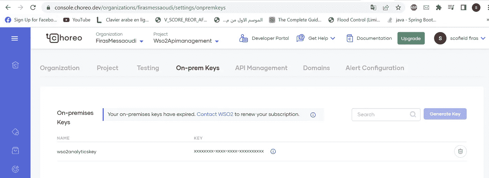

在预置键上

不需要。我们转到 configs/apim 下的部署文件，并更新以下属性:

```
hostname = "wso2apim-portal.20.124.60.109.nip.io"
service_url = "https://wso2apim-gateway.20.124.60.109.nip.io/services/"
http_endpoint = "http://wso2apim-gateway.20.124.60.109.nip.io"
https_endpoint = "https://wso2apim-gateway.20.124.60.109.nip.io"
[apim.analytics]
enable = true
config_endpoint = "https://analytics-event-auth.choreo.dev/auth/v1"
auth_token = "YOUR GENERATED ON-PREM-KEY"
```

请注意，主机名将与 wso2 api 管理器的入口主机相同，端点将与我们稍后创建的 wso2 apim 网关的入口主机相同

更新部署后，我们可以通过执行。bash 文件夹下的/create-config.sh

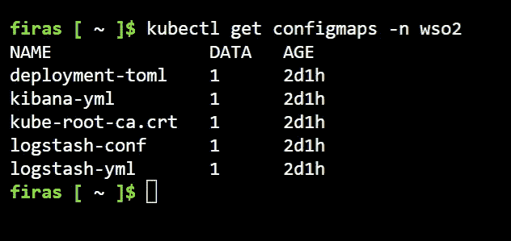

配置映射

现在，我们的配置已经就绪，我们可以开始部署资源了

我们需要从 elasticsearch 开始，这对于其他资源是强制性的。您可以通过按以下顺序执行 bash 文件夹下的 bash 脚本来创建所有资源:

*   。/create-deploy.sh = >这将为 elasticsearch、wso2 api-manager 和 logstash、kibana 创建部署
*   。/create-service.sh = >将为 elasticsearch、wso2 api manager 和 kibana 创建服务。

我们还是错过了监控部分，对吧？

为了安装 prometheus、grafana 和 alert manager，我们将使用 prometheus 操作员存储库，该存储库带有监控所需的所有资源。

```
helm repo add prometheus-community [https://prometheus-community.github.io/helm-charts](https://prometheus-community.github.io/helm-charts)
helm repo update
helm install prometheus prometheus-community/kube-prometheus-stack --namespace monitoring
```

现在，我们可以在继续之前检查我们所有的 pod 和服务是否运行正常

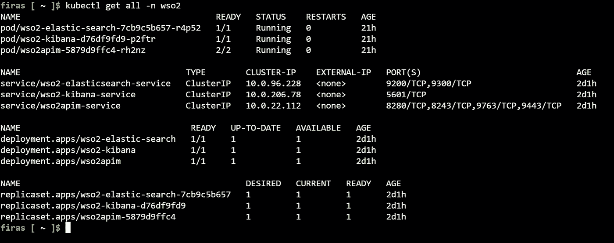

测试部署

看起来一切都很好，最后一步，正如我们所说的，我们将使用 nginx ingress 来公开这些服务，因此我们需要为每个需要公开的服务创建一个 ingress，如下所示:

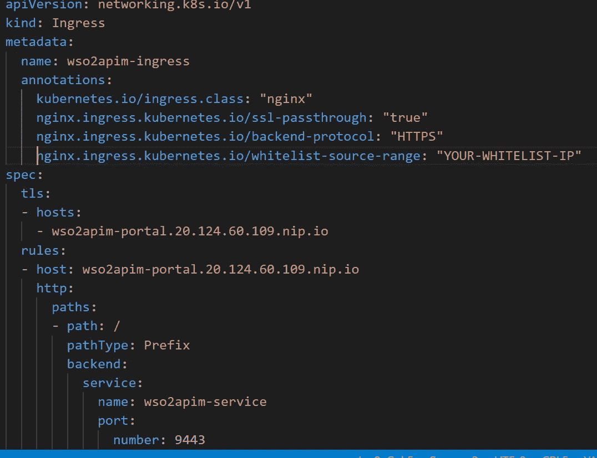

进入

我们可以注意到 whitelist-range-source 注释的存在，我们使用它来防止任何人可以访问入口，在这种情况下，入口将只接受来自白名单范围中列出的 ip 的流量。

现在我们执行/bash 文件夹下的 create-ingress.sh 来创建所有需要的入口。

这是使用其主机创建的入口列表:


入口列表

# 监视

**仪表盘**

现在我们所有的资源都已部署并运行，prometheus 将从 pod 和节点导出程序中删除指标，grafana 将向 prometheus 请求这些指标以创建仪表板和警报。我们只需要导航到 grafana host(garafana . 20 . 124 . 60 . 109 . nip . io)来探索这些 dashbords。

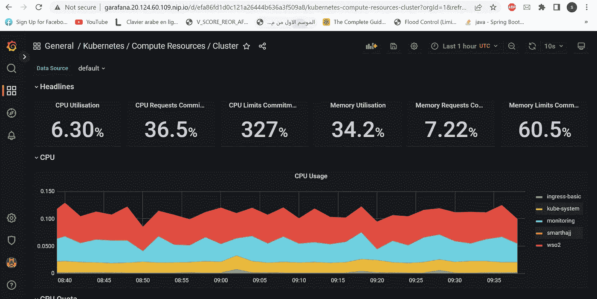

格拉夫纳·达什博德

**警报**

从这些仪表板中，我们可以创建警报规则来通知用户集群资源中的任何异常行为，在本例中，我们将创建一个关于内存使用的警报规则，如果超过 2GB，我们将在 slack 应用程序中发送通知(我们可以使用团队、电子邮件等)

1.  创建松弛通道并获得 webhook 链接([https://www.youtube.com/watch?v=6NJuntZSJVA&ab _ channel = BoyumITSolutions](https://www.youtube.com/watch?v=6NJuntZSJVA&ab_channel=BoyumITSolutions)
2.  从 grafana 警报菜单创建联系人

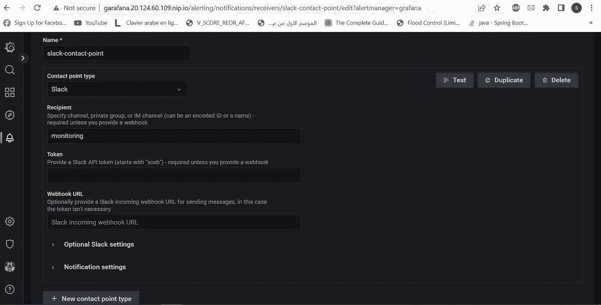

点击测试后，我们将收到一个通知测试，以确保接触点工作正常

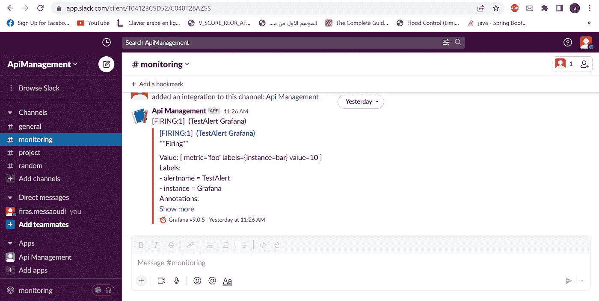

测试松弛度

3.从控制面板中选择任何面板(我们将选择内存使用面板),然后单击创建警报规则

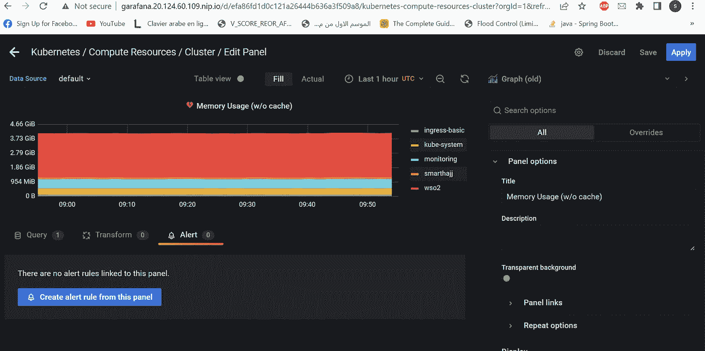

4.配置警报规则

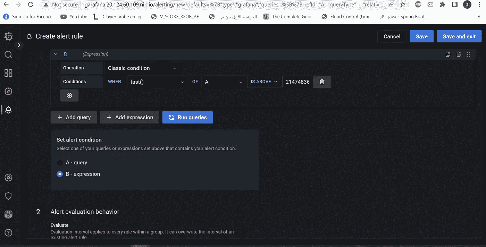

配置警报

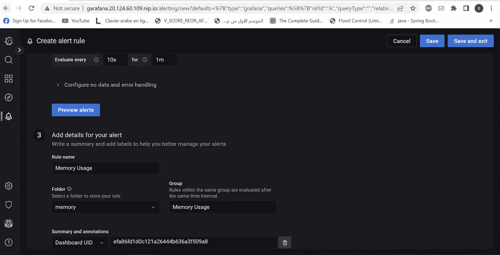

配置警报 2

当达到警报的条件时，警报的状态将被触发，并且一个带有详细信息的通知将被发送到松弛通道

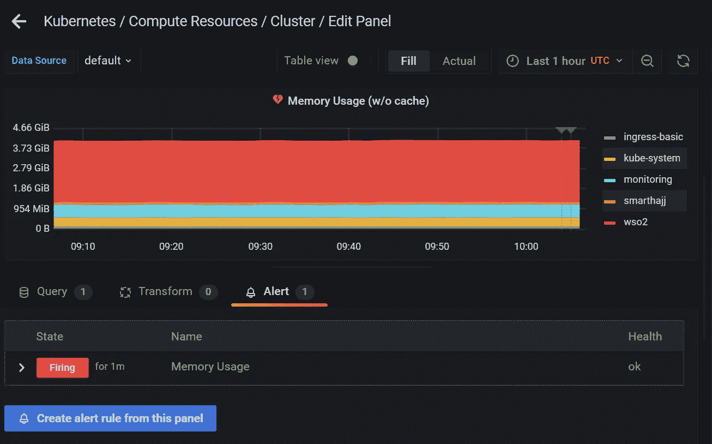

发信号

# 管理 Api

现在，我们将了解如何使用 wso2 api manager publisher portal 部署示例 api，并通过以下步骤从开发人员门户使用该 api。

*   **部署示例 Api**

从 wso2 api 管理器的发布者门户(【wso2apim-portal.20.124.60.109.nip.io/publisher】T4)选择部署示例 api

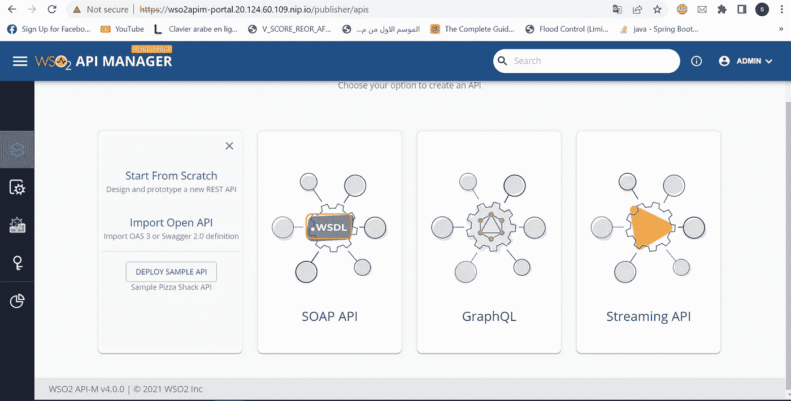

这将创建、部署和发布一个样例 api，其中一些资源将直接在开发人员门户中使用

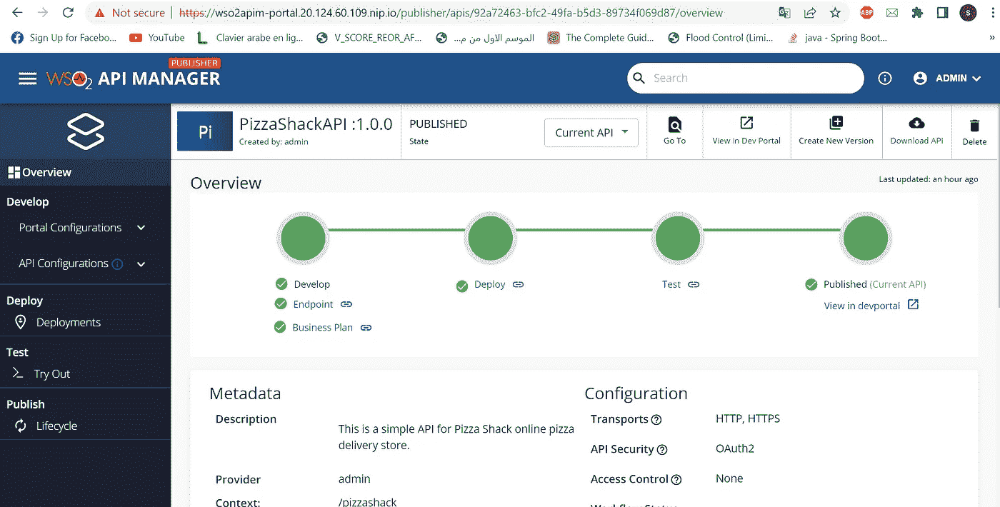

*   **在开发者门户中创建应用**

现在我们切换到开发者门户(**wso2apim-portal.20.124.60.109.nip.io/devportal**)，从应用菜单创建一个新的应用，以便订阅它

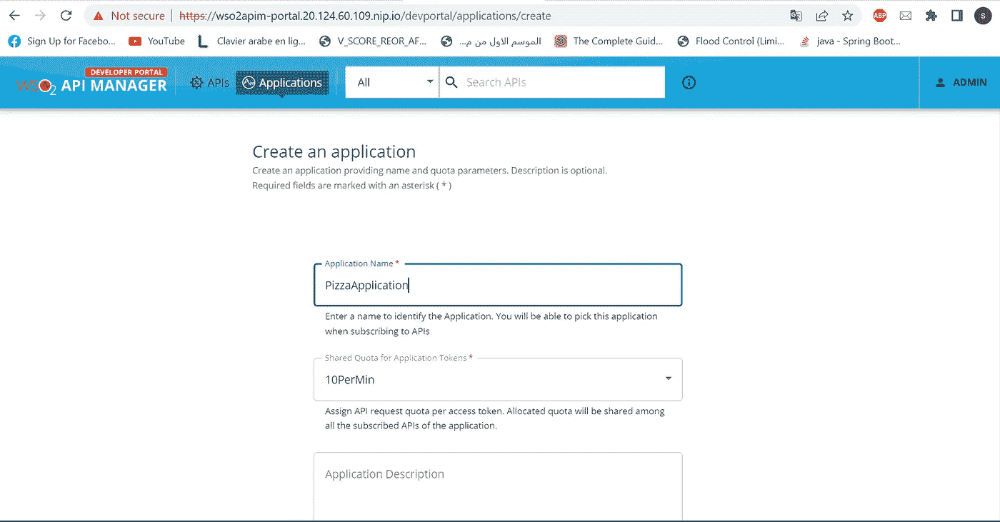

*   **订阅应用**

现在，从 api 的菜单中选择所需的 Api，并选择订阅侧菜单，以便订阅最近创建的应用程序

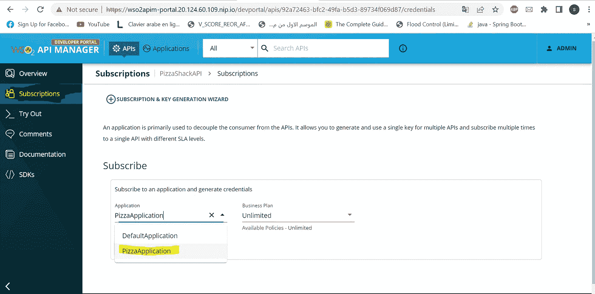

订阅

*   **生成密钥**

为了使用这个 api，我们需要一个访问令牌，它可以通过选择应用程序和令牌产品或沙箱的类型来生成

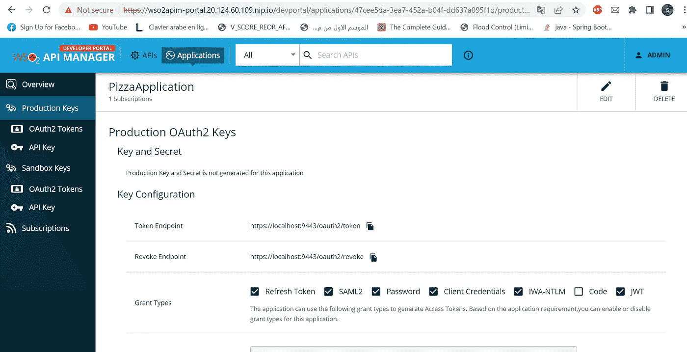

生产键

现在，我们只需单击生成密钥并复制访问令牌

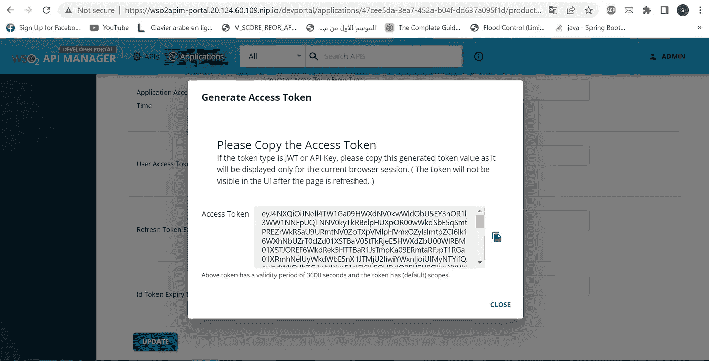

生成访问令牌

*   **消费 Api**

最后一步当然是使用 api，我们可以从开发者门户的试用菜单中直接使用它

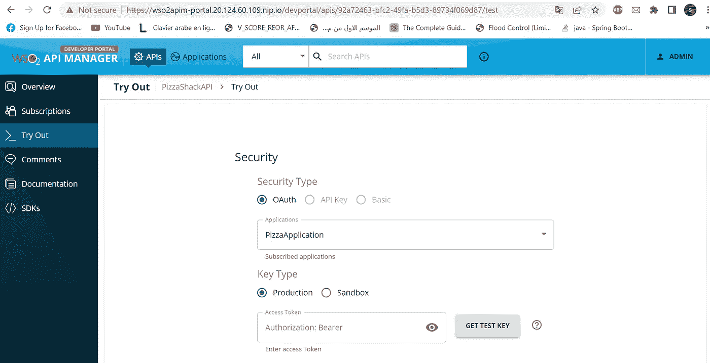

我们可以在这里看到我们在订阅中使用的应用程序和生成的密钥的类型，我们只需要放置令牌并选择任何要执行的资源

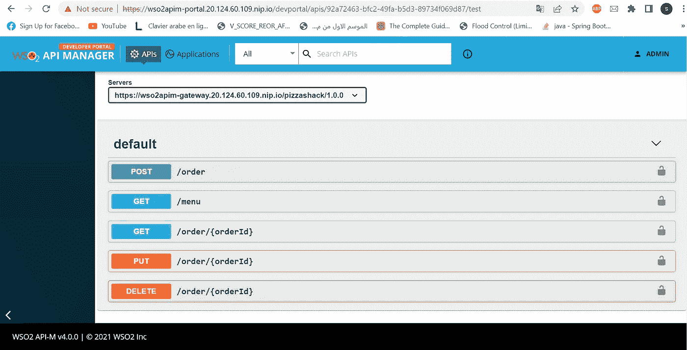

Wso2 api 管理器有另外两个门户:

*   **管理门户(**wso2apim-portal.20.124.60.109.nip.io/admin)，我们可以在其中添加关键经理和管理策略和网关
*   **Wso2 carbon(**wso2apim-portal.20.124.60.109.nip.io/carbon)me manager 用户和角色。

# 记录

在执行一些 api 和操作 API 管理器之后，生成了许多日志，logstash 收集了这些日志，并在 elasticsearch 中对它们进行索引，以便从 kibana 中可视化。

*   **在基巴纳**创建索引模式

为了在 kibana 中查看这些日志，我们需要导航到 kibana 主机(wso2-ki Bana-dah board . 20 . 124 . 60 . 109 . nip . io)并从堆栈管理/索引模式创建一个索引模式

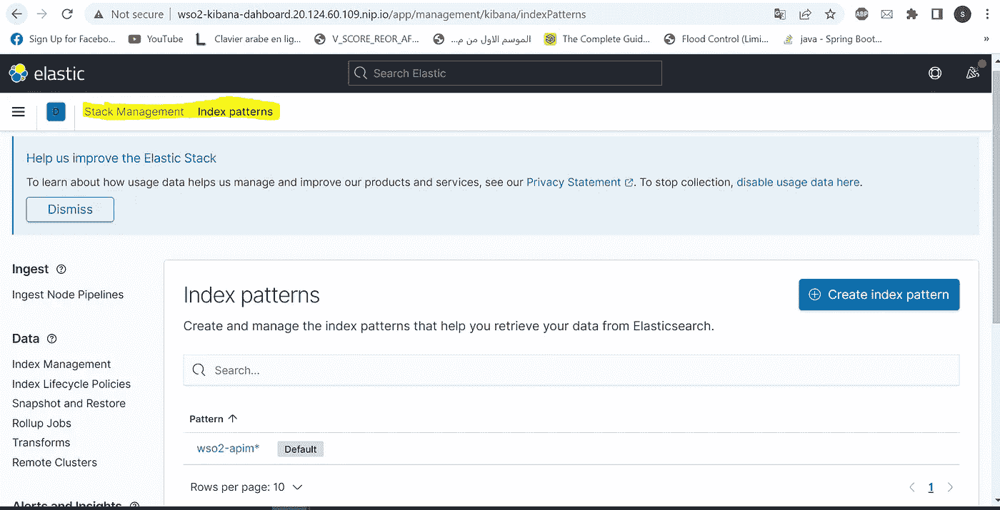

索引模式

*   **查看日志**

现在，我们返回“发现”菜单，以浏览日志

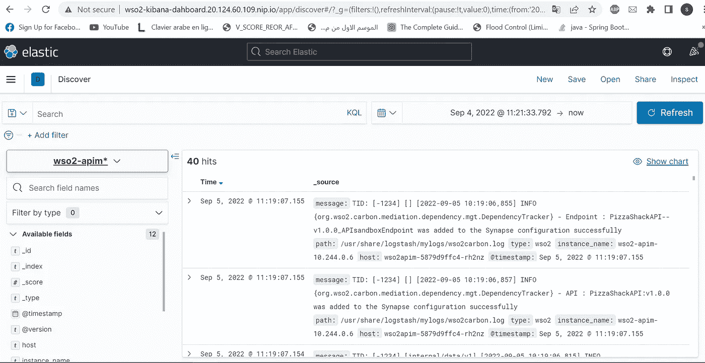

基班原木

# 统计和报告

在本教程的最后一部分，我们将关注 choreo 控制台中的 api 统计和报告

我们只需导航到 choreo 控制台，从 insight 菜单中选择我们生成的本地密钥，以获取统计信息

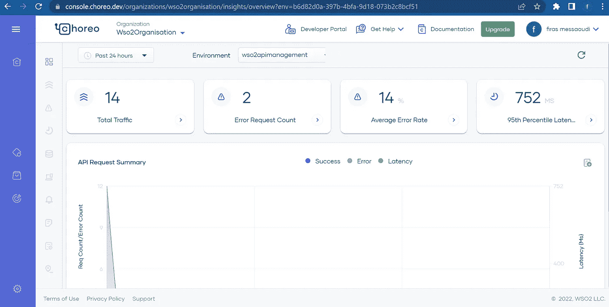

统计数据

有很多关于 choreo 提供的 API 使用情况的统计数据，这是一个概览仪表板

要生成报告，我们必须转到使用情况报告，并下载带有所选过滤器的报告。

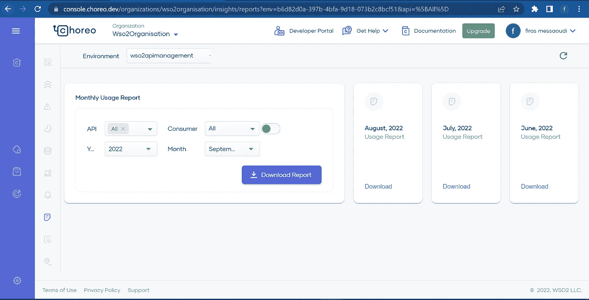

报告

# 结论

在本教程中，我们看到了在 azure kubernetes 服务中部署 wso2 api 管理器、elk stack 和 prometheus operator 的步骤，以及使用 nginx ingress 控制器公开集群服务的步骤。我们创建了警报来发送有关集群中可能发生的任何异常行为的通知。

最后，我们设法配置 wso2 api 管理器，将分析数据发送给 choreo，以便生成有关 api 使用情况的仪表板和报告

您可以在这个 git repo (branch master)中找到部署所有资源所需的所有 yaml 文件以及步骤

https://github.com/FirasMessaoudi/wso2-deployment