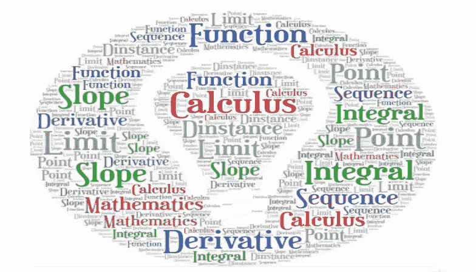
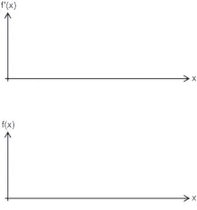
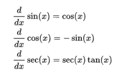
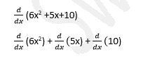
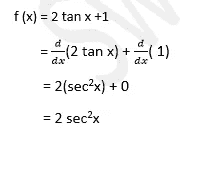
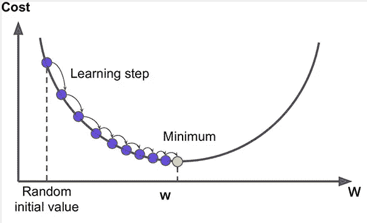
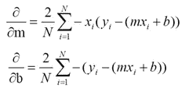

# 数据科学中的衍生品

> 原文：<https://medium.com/nerd-for-tech/derivatives-in-data-science-c5d7bd916f17?source=collection_archive---------0----------------------->

# 微积分中的导数:

**导数:——**在数学中，导数是函数相对于变量的变化率。导数是解决微积分和微分方程问题的基础。一般来说，科学家观察动力系统以获得一些感兴趣的变量的变化率，将这些信息结合到一些微分方程中，并使用积分技术来获得可用于预测原始系统在不同条件下的行为的函数。

导数是一种显示瞬时变化率的方法，瞬时变化率是函数在某一给定点的变化量。对于作用于实数的函数，它是图上一点的切线的斜率。。导数通常写为，

也就是 y 的差除以 x 的差，这里，d 不是变量，所以不能被抵消。

y 相对于 x 的导数定义为 y 的变化除以 x 的变化。

用数学术语来说，

也就是说，随着两个 x 点之间的距离变得越来越接近零，它们之间的直线的斜率越来越接近各自的切线。

**函数的导数:-**

不同类型函数的导数可以推导如下:

**1)** **线性函数:——**没有高阶项的 mx + c 等线性函数的导数是常数。当因变量 y 直接取 x '值(y =x)时，直线的斜率在所有地方都是 1。所以，不管位置在哪里。

**2)幂函数:——**幂函数根据其指数和斜率表现。幂函数遵循以下规则:

**3)** **指数函数:—** 指数是 abf(x)的形式，其中 a 和 b 是常数，f(x)是 x 的函数，指数和多项式的区别在于，在多项式中，x 的幂是乘方，而在指数中，x 是乘方。

**4)对数函数:——**对数的导数是倒数。

**5)** **三角函数:——**余弦函数是正弦函数的导数，余弦的导数是负正弦。

**衍生产品的性质:-**

衍生品可以被分解成更小的部分以便管理。

举个例子，

# 衍生类型:-

导数可以根据它们的顺序分为不同的类型，例如一阶和二阶导数。

# 一阶导数:-

一阶导数描述了函数的方向，无论函数是增加还是减少。它可以被预测为瞬时变化率。也可以从切线的斜率来确定。

# 二阶导数:-

二阶导数用于了解给定函数的图形形状。这些函数可以根据凹度来分类。

# 衍生示例:-

**例-1:** 求函数的导数:

**解决方案:-**

现在，计算 f(x)的导数，

现在，将函数项分解为:

使用这些公式，

**例- 2** :求 2 tan x + 1 的导数

**解决方案:-**

# 数据科学中衍生工具的重要性:

机器学习使用导数来解决优化问题。诸如梯度下降的优化算法使用导数来决定是否增加或减少权重，以便增加或减少任何目标函数。

数据科学家几乎对每个模型都使用微积分，机器学习中微积分的一个基本但非常优秀的例子是梯度下降。

**梯度下降:-**

梯度衡量的是，如果你稍微改变输入，函数的输出会改变多少。在机器学习模型中，我们的目标是降低输入数据的成本。成本函数用于监控 ML 模型预测中的误差。通过最小化这一点，基本上意味着获得尽可能最低的误差值或增加模型的准确性。因此，我们通过在调整模型参数的同时迭代训练数据集来提高精确度。

例如，我们有一个用户数据集，上面有他们在某些科目上的分数以及他们为毕业而选择的进一步学习。我们的目标是在考虑个人分数的情况下预测个人的毕业流。

在这个数据集中，我们有 Swapnil 和 Priyanker 的数据，使用这些数据我们需要预测 Sarang 的毕业流。

现在考虑主体中的标记作为梯度，流作为底部目标。我们必须优化模型，使它在底部预测的结果应该是准确的。

通过使用 Swapnil 和 Priyanker 的数据，我们将创建梯度下降并调整我们的模型，这样，如果我们给出 Sarang 的分数，那么它应该预测梯度底部的科学结果，对于 Priyanker 也是如此。这是我们训练过的模型。现在，如果我们给我们的模型一个主题的标记，那么我们就可以很容易地预测这个流。

我们可以在这个模型中使用的基本公式是

y = m*x + b

其中，y =预测值，m =斜率，x =输入，b = y-截距

这种类型的问题可以通过定义一个成本函数来解决，该函数确定一条给定的线有多好。可以使用下面的等式来计算成本函数:

更符合我们数据的线将导致更低的误差值。如果我们最小化这个函数，我们将得到数据的最佳线。

我们用微分来计算斜率。

为了对这个误差函数进行梯度下降，我们需要计算它的梯度。为了计算梯度，我们需要对误差函数求导。由于我们的函数由两个参数(m 和 b)定义，我们需要计算每个参数的偏导数。

这些导数可以计算如下:

我们可以初始化我们的搜索，从任何一对 m 和 b 值(即任何线)开始，并让梯度下降算法在我们的误差函数上朝着最佳线向下行进。每次迭代将 m 和 b 更新到一条线，该线产生的误差比前一次迭代稍低。使用上面的两个偏导数计算每次迭代的移动方向。

学习率变量控制着我们在每次迭代中走下坡路的幅度。如果我们迈得太大，我们可能会跳过最小值。然而，如果我们采取小步骤，将需要多次迭代才能达到最小值。

**参考:** [**数学趣味**](https://www.mathsisfun.com/calculus/derivatives-introduction.html) ， [**向数据科学**](https://towardsdatascience.com/a-quick-introduction-to-derivatives-for-machine-learning-people-3cd913c5cf33) **。**