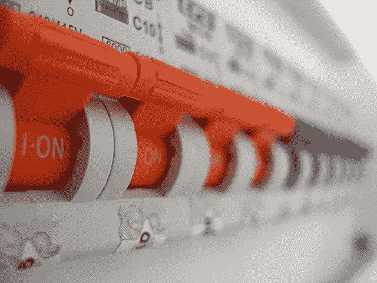
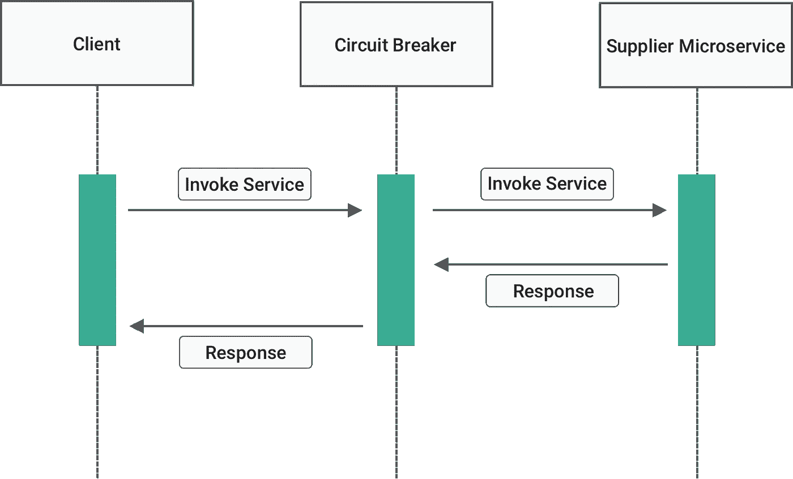
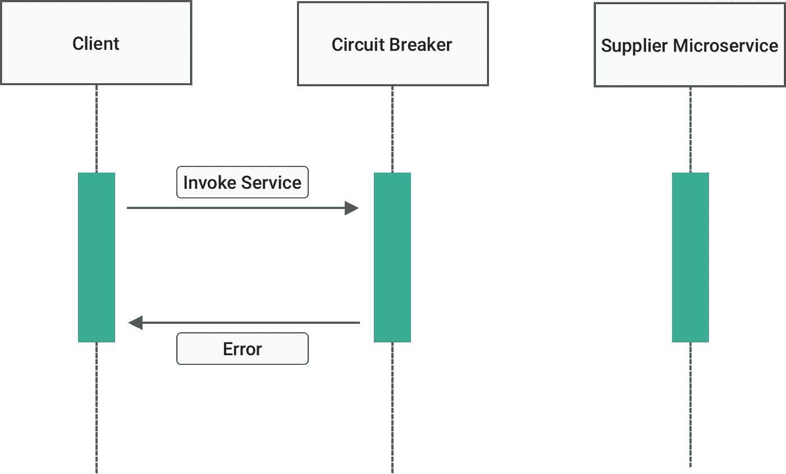
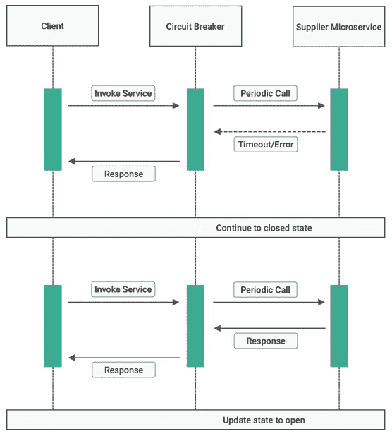

# 微服务设计模式—断路器模式

> 原文：<https://medium.com/nerd-for-tech/design-patterns-for-microservices-circuit-breaker-pattern-ba402a45aac2?source=collection_archive---------0----------------------->



circuitbreakercity.com 摄

在我之前的文章中: [***微服务的设计模式——聚合器模式&代理模式***](/nerd-for-tech/design-patterns-for-microservices-aggregator-pattern-99c122ac6b73) ，我讨论了聚合器模式&代理模式，如何使用它们，以及为什么设计模式在微服务中很重要。还有，如果你是微服务新手，我强烈推荐你去看看我之前的两篇文章: [***微服务简介***](/geekculture/introduction-to-microservices-9dcaafa5d882)&[***微服务架构最佳实践***](/geekculture/best-practices-for-microservices-architecture-9cd896fb41b5) 。

你有没有想过，为什么你的房子里有断路器？如果你的房子是用电供电的，必须有断路器，因为它们控制和保护你家里的电线电路。当电力通过主电网时，它总是流经这些断路器。因此，如果主电网以异常方式运行，或者如果额外的电力试图流动，那么特定的断路器将关闭。因此，你房子的内部线路将得到保护。因此，断路器的这种行为非常类似于断路器设计模式的工作方式。

# 断路器模式

断路器模式是微服务架构中使用的一种流行的设计模式，属于可持续设计模式类别。在微服务架构中，一个服务通常调用其他服务来检索数据，下游服务有可能会关闭。这可能是由于网络连接速度慢、超时或暂时不可用造成。因此，重试呼叫可以解决问题。但是，如果某个特定微服务出现严重问题，那么它将在更长时间内不可用。在这种情况下，请求将被持续发送到该服务，因为客户端不知道某个特定服务正在关闭。导致网络资源耗尽，性能低下，用户体验不佳。此外，一个服务的失败可能会导致整个应用程序的级联失败。

因此，您可以使用断路器设计模式来克服这个问题。在这种模式的帮助下，客户端将通过代理调用远程服务。这个代理基本上相当于一个电路断路器。因此，当故障数量超过阈值数量时，断路器会在特定时间段内跳闸。然后，所有调用远程服务的尝试都将在此超时期限内失败。超时后，断路器允许有限数量的测试请求通过。如果这些请求成功，断路器恢复正常运行。否则，如果出现故障，超时周期将重新开始。

断路器设计模式有三种状态:

1.  关闭的
2.  打开
3.  半开的

## **关闭状态**

在这种状态下，断路器将请求路由到微服务，并计算每个时间段内的失败次数。这意味着它的工作没有任何故障。但是，如果在某一段时间内故障的数量超过阈值，电路将跳闸，并将进入“开路”状态。



表示关闭状态(blogs.halodoc.io)

## **开启状态**

当断路器移动到“打开”状态时，来自微服务的请求将立即失败，并将返回一个异常。但是，超时后，断路器将进入“半开”状态。



表示开放状态(blogs.halodoc.io)

## 半开状态

在这种状态下，断路器仅允许来自微服务的有限数量的请求通过并调用操作。如果这些请求成功，断路器将回到“闭合”状态。但是，如果任何请求再次失败，它将返回到“打开”状态。



表示半开状态(blogs.halodoc.io)

# 为什么可用性在微服务架构中很重要

通常，当我们使用任何架构(微服务/单片)开发系统或应用程序时，我们向客户保证应用程序的可用性将达到 99.999%。这意味着只有 0.001%的服务停机机会。一开始你可能觉得我们连这 0.001%都不用在意。这样的话，让我们做些数学计算。

```
**24 hrs * 365 days = 8760 hours per year****8760 hrs * 60 mins = 525600 minutes per year****525600 mins X 0.001% = 5.256 minutes of downtime**
```

如您所见，每年 0.001%的不可用性成本总共会导致 5.256 分钟的停机时间。如果你仍然认为这没关系，因为它只是 5 分钟，你还是错了。因为说到微服务，我们有多种服务。例如，假设您的应用程序中有 100 个微服务。

```
**(5.256 * 100)/ 60 = 8.78 hours of downtime**
```

所以，现在你可以看到它有多重要了。如果您有 100 个微服务，一年的总停机时间为 8.78 小时。显然，这是完全不能接受的。因此，我们需要更加注意保护我们的服务。

# 断路器模式的用例

我们举个例子来了解一下，在微服务架构中哪里可以应用断路器模式。

## 场景:

假设在微服务应用中有 5 种不同的服务。每当收到请求时，服务器都会分配一个线程来调用特定的服务。但是，由于某些故障，服务有一点延迟，线程正在等待。然而，如果只有一个线程在等待该服务，也没关系。但是，如果服务是一个要求很高的服务，会收到很多请求，那么就不要等待了。因为在一段时间内会有更多的线程被分配给这个服务，而这些线程将不得不等待。

因此，到达您的服务的剩余请求将被阻塞或排队。即使服务被恢复，web 服务器仍然试图处理队列中的请求。因为 web 服务器永远不会恢复，因为它不断地接收请求。最终，这可能会导致整个应用程序出现级联故障。因此，这种情况将导致您的服务甚至应用程序崩溃。

## 解决方案:

上面的场景是应用断路器模式的完美例子。假设您已经为特定服务定义了阈值，因为它应该在 200 毫秒内响应。正如我上面提到的，这个服务是一个高需求的服务，不断地接收请求。如果 75%的请求达到上限(150 毫秒-200 毫秒),则意味着服务即将失败。但是，如果几个请求超过了最大阈值(200 毫秒)，则意味着服务不再响应。因此，它将故障回复到消费者，并通知该特定服务不可用。所以，如果你还记得这个模式的上述状态，现在我们正从“关闭”状态转移到“打开”状态。

因此，所有那些到达特定服务的请求都不会再等待了。但是，超时后，断路器会在后台向该服务发送 ping 请求。这意味着现在我们处于断路器模式的“半开”状态。如果这些请求成功，断路器将允许再次发送该服务的请求。

因此，您可以使用断路器模式来提高微服务架构的容错性和弹性，并防止故障向其他微服务的级联。

所以，这是我的文章的结尾，我希望你喜欢它。快乐编码👨‍💻。

# 参考

[](https://martinfowler.com/bliki/CircuitBreaker.html) [## 断路器

### 软件系统对运行在不同进程中的软件进行远程调用是很常见的，可能是在不同的…

martinfowler.com](https://martinfowler.com/bliki/CircuitBreaker.html) [](https://dzone.com/articles/design-patterns-for-microservices-1) [## 微服务的设计模式

### 微服务可以对你的企业产生积极的影响。因此，了解如何处理微服务是值得的…

dzone.com](https://dzone.com/articles/design-patterns-for-microservices-1) [](https://blogs.halodoc.io/circuit-breaker-with-resilience4j/) [## 带弹性 4j 的断路器介绍

### 在 Halodoc，我们采用了基于微服务的服务架构，以及由…提供的所有医疗保健服务

blogs.halodoc.io](https://blogs.halodoc.io/circuit-breaker-with-resilience4j/)