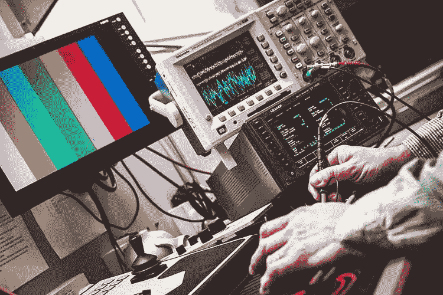
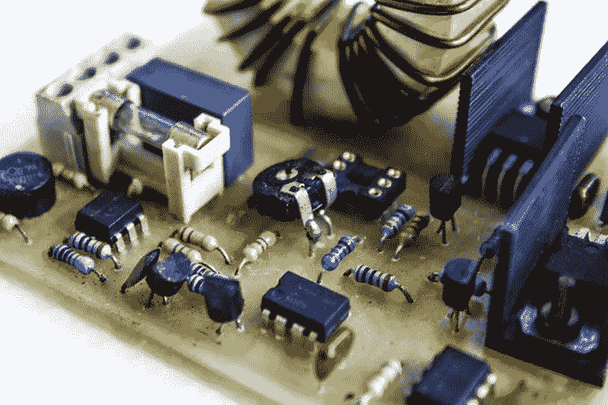
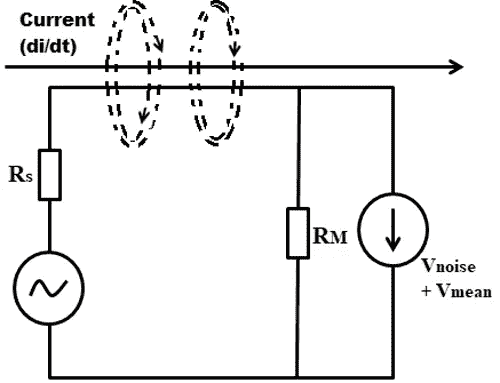
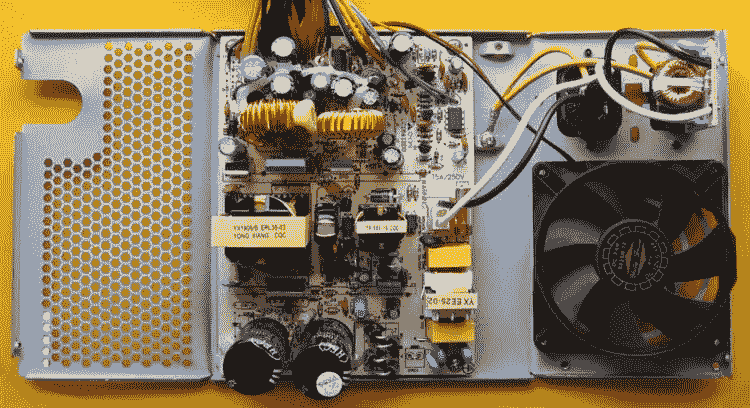
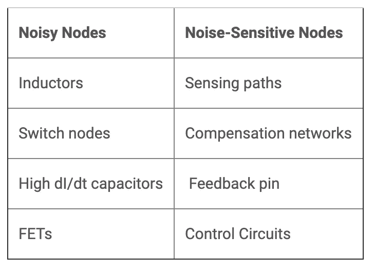

# 降低开关电源电磁干扰的设计技术

> 原文：<https://medium.com/nerd-for-tech/design-techniques-for-reducing-emi-in-switch-mode-power-supplies-25c97f1b144c?source=collection_archive---------0----------------------->



在之前关于 EMI 的一篇[文章中，我解释了 EMI 源的有意/无意特性如何影响周围其他电气/电子设备(受害者)的性能。那篇文章之后是另一篇关于](https://circuitdigest.com/article/electromagnetic-interference-types-standards-and-shielding-techniques)[电磁兼容性(EMC)](https://circuitdigest.com/tutorial/emc-testing-process-and-requirements-for-emc-compliance) 的文章，该文章提供了对 EMI 危险的深入见解，并提供了一些关于 EMI 考虑不周如何对产品的市场表现产生负面影响的背景，无论是由于监管取缔还是功能故障。

两篇文章都包含了在设计中最大限度降低 EMI(输出或输入)的广泛技巧，但在接下来的几篇文章中，我们将深入探讨如何在电子产品的特定功能单元中最大限度地降低 EMI。我们将从**电源单元**开始，特别关注[开关模式电源](https://circuitdigest.com/tags/smps)。

开关模式电源是交流 DC 或 DC DC 电源的通称，使用快速开关动作的电路进行电压变换/转换。它们的特点是高效率和低功耗，这使它们成为新电子设备/产品的首选电源，尽管与线性电源相比，它们的设计要复杂得多。然而，除了设计的复杂性之外，SMPS 为实现高效率而采用的快速开关频率也带来了严重的电磁干扰威胁，如果处理不当，这可能会影响产品的运行甚至认证。



随着越来越多的器件(潜在的 EMI 受害者/来源)每天被开发出来，克服 EMI 成为工程师面临的主要挑战，实现电磁兼容性(EMC)变得与使产品正常工作同样重要。因此，在今天的文章中，我们将探讨开关模式电源中 EMI 的本质和来源，并研究一些可用于减轻 EMI 的设计技术/方法。

# SMPS 的电磁干扰来源

解决任何 EMI 问题通常需要了解干扰源、到其它电路的耦合路径(受害者)以及性能受到负面影响的受害者的性质。在产品开发过程中，通常不可能确定电磁干扰对潜在受害者的影响，因此，**电磁干扰控制**的努力通常集中在最小化辐射源(或降低敏感度)和消除/减少耦合路径上。

SMPS 电源中 EMI 的主要**来源可以追溯到它们固有的设计性质和**开关特性**。无论是在从交流-DC 还是 DC-DC 的转换过程中，SMPS 的 MOSFET 开关元件在高频下打开或关闭，都会产生一个假正弦波(方波)，可以用**傅立叶级数**描述为许多具有谐波相关频率的正弦波的总和。
开关动作产生的谐波的完整傅立叶频谱成为 EMI，从电源传输到设备中的其他电路，并传输到附近易受其影响的电子设备。**

除了开关噪声，SMPS 的另一个 EMI 源是**快速电流(dI/dt)和电压(dV/dt)转换**。根据[麦克斯韦方程](https://circuitdigest.com/tutorial/maxwells-equations-explained)，这种交变电流和电压将产生交变电磁场，虽然电磁场的幅度随着距离的增加而减小，但它会与 PCB 上的铜迹线等导电部件相互作用，这些导电部件就像天线一样，会在线路上产生额外的噪声(EMI)。

现在，在耦合到相邻电路或设备(受害者)之前，EMI 在源头并不危险(大多数情况下)，因此，通过**消除/最小化潜在耦合路径**，通常可以减少 EMI。

正如“[EMI 简介](https://circuitdigest.com/article/electromagnetic-interference-types-standards-and-shielding-techniques)”一文中所讨论的，EMI 耦合通常通过以下方式发生:传导(通过不需要的/改变用途的路径或所谓的“寄生电路”)、感应(通过变压器等电感或电容元件耦合)和辐射(空中)。因此，通过了解这些耦合路径以及它们如何影响开关模式电源中的 EMI，设计人员可以设计出耦合路径影响最小的系统，并降低干扰传播。

# 不同类型的 EMI 耦合机制

我们将回顾每一个与 SMPS 相关的耦合机制，并建立 SMPS 设计的元素，这些元素导致了它们的存在。

## **SMPS 的辐射电磁干扰**

**辐射耦合**发生在源和接收器(受害者)充当无线电天线时。源辐射电磁波，该电磁波穿过源和受害者之间的开放空间传播。在 SMPS **，辐射 EMI 传播**通常与具有高 di/dt 的开关电流有关，由于不良的设计布局和导致漏电感的布线实践，具有快速电流上升时间的环路的存在会加剧这种传播。
考虑下面的电路；



除了正常电压输出(Vmeas)之外，电路中的快速电流变化还会产生噪声电压(Vnoise)。耦合机制类似于变压器的[操作，因此 Vnoise 由以下等式给出:](https://circuitdigest.com/tutorial/transformer-basics)

```
Vnoise = RM / (RS + RM) * M * di/dt
```

其中 M/K 是耦合系数，取决于磁环的距离、面积和方向，以及相关磁环之间的磁吸收，就像变压器一样。因此，在环路方向考虑不周、电流环路面积较大的设计/PCB 布局中，辐射 EMI 水平往往较高。

## **在 SMPS 传导 EMI**

**传导耦合**当 EMI 辐射沿着将 EMI 源和接收器连接在一起的导体(电线、电缆、外壳和 PCB 上的铜走线)传递时，就会发生传导耦合。以这种方式耦合的 EMI 在电源线路上很常见，在 H 场分量上通常很严重。

SMPS 的传导耦合要么是共模传导(干扰在+ve 和 GND 线上同相出现)，要么是差模传导(干扰在两个导体上异相出现)。

**共模传导发射**通常由寄生电容引起，如散热器和变压器的寄生电容、电路板布局以及开关两端的开关电压波形。

**另一方面，差模传导发射**是开关动作的结果，会在输入端产生电流脉冲，并产生开关尖峰，导致差分噪声的存在。

## **SMPS 的感应电磁干扰**

**电感耦合**当源和受害者之间存在电(由于电容耦合)或磁(由于电感耦合)EMI 感应时，就会发生。**电耦合或电容耦合**发生在两个相邻导体之间存在变化的电场时，感应它们之间间隙的电压变化，而**磁耦合或电感耦合**发生在两个平行导体之间存在变化的磁场时，感应沿着接收导体的电压变化。

总之，虽然 SMPS 的主要 EMI 源是高频开关动作以及由此产生的快速 di/dt 或 dv/dt 瞬变，但促使所产生的 EMI 向同一电路板(或外部系统)上的潜在受害者传播/扩散的因素是元件选择不当、设计布局不当以及电流路径中存在杂散电感/电容。

# 降低 SMPS 电磁干扰的设计技术

在阅读本部分之前，不妨先看一下 EMI/EMC 相关标准和法规，提醒自己设计目标应该是什么。虽然标准因国家/地区而异，但大多数地区认证认可的两个最广泛接受的(由于标准协调)标准包括:FCC EMI 控制条例和 CISPR 22(国际无线电干扰特别委员会(CISPR)第三版，出版。22).早些时候发表的 [EMI 标准文章](https://circuitdigest.com/article/electromagnetic-interference-types-standards-and-shielding-techniques)总结了这两种标准的复杂细节。

通过 **EMC 认证流程**或者仅仅是确保您的设备在其他设备周围正常工作，需要您将排放水平保持在标准中描述的值以下。有相当多的设计方法可以帮助实现这一点，我将尝试逐一介绍它们。

## 1.直线前进

老实说，如果您的应用能够承受(体积庞大且效率低下)，您可以通过使用**线性电源**来节省大量与电源相关的 EMI 压力。它们不会产生明显的电磁干扰，也不会花费太多的时间和金钱来开发。就其效率而言，即使不能与 SMPS 相提并论，你仍然可以通过使用 LDO 线性调节器获得合理的效率水平。

## 2.使用电源模块

实施最佳实践来获得良好的 EMI 性能有时可能还不够。在你似乎找不到时间或其他资源来调谐并获得最佳 EMI 结果的情况下，一种通常有效的方法是使用电源模块。

电源模块并不完美，但有一点它们做得很好，那就是它们能确保你不会落入常见的电磁干扰陷阱，比如糟糕的设计布局和寄生电感/电容。市场上一些最好的电源模块已经考虑到了克服 EMI 的需要，其设计使得开发具有良好 EMI 性能的快速简单的电源成为可能。村田、[瑞科姆](https://circuitdigest.com/tags/recom)、[晨星](https://circuitdigest.com/tags/mornsun)等厂商。拥有广泛的 SMPS 模块，已经为我们解决了 EMI 和 EMC 问题。


电源模块

例如，它们通常将大部分元件(如电感)连接在封装内部，因此，模块内部存在非常小的环路区域，辐射的 EMI 降低。有些模块甚至会屏蔽电感和开关节点，以防止线圈辐射 EMI。

## 3.防护的

降低 EMI 的强力机制是用金属屏蔽 SMPS**。这是通过在接地导电(金属)外壳内的电源中放置噪声产生源来实现的，与外部电路的唯一接口是通过在线滤波器。**



然而，屏蔽会增加项目的材料成本和 PCB 尺寸，因此，对于以低成本为目标的项目来说，这可能不是一个好主意。

## 4.布局优化

设计布局被认为是促进 EMI 在电路中传播的主要问题之一。这就是为什么在 SMPS 减少 EMI 的一种广泛的通用技术是布局优化。这有时是一个相当模糊的术语，因为它可能意味着不同的事情，从消除寄生元件到将噪声节点与噪声敏感节点分离，以及减小电流环路面积等。

SMPS 设计的一些布局优化技巧包括:

## **I .保护噪声敏感节点免受噪声节点的影响**

这可以通过将它们放置在彼此尽可能远的地方来实现，以防止它们之间的电磁耦合。下表提供了一些噪声敏感节点和噪声节点的示例；



## **二。保持噪声敏感节点的走线较短**

PCB 上的铜走线充当辐射 EMI 的天线，因此防止直接连接到噪声敏感节点的走线获得辐射 EMI 的最佳方法之一是使它们尽可能短。例如，从电阻分压器网络馈入电源反馈(FB)引脚的一条长走线可以充当天线，拾取周围的辐射 EMI。馈入反馈引脚的噪声会在系统输出端引入额外噪声，使器件性能不稳定。

## **三世。减少关键(天线)回路面积**

承载开关波形的走线/导线应尽可能相互靠近。
辐射电磁干扰与电流大小(I)和电流流经的回路面积(A)成正比，因此，通过减小电流/电压面积，我们可以降低辐射电磁干扰水平。对于电力线来说，一个好的方法是将电力线和回路放在 PCB 的相邻层上。

## **四。最小化杂散电感**

通过**增加**PCB 上走线(电源线)的尺寸并使其平行于其返回路径**以降低走线的电感**，可以降低线环的阻抗(由于其与面积成比例，因此会产生辐射 EMI)。

## **五.接地**

位于 PCB 外表面的完整接地层为 EMI 提供了最短的返回路径，尤其是当它直接位于 EMI 源下方时，可以显著抑制辐射 EMI。然而，如果允许其它走线穿过接地层，可能会有问题。切口可能会增加有效环路面积，并导致显著的 EMI 水平，因为返回电流必须找到一条长路径绕过切口并返回到电流源。

## **5。过滤器**

EMI 滤波器是电源的必备之物，尤其是为了减轻传导 EMI。它们通常位于电源的输入和/或输出端。在输入端，它们有助于过滤来自电源的噪声，在输出端，它防止来自电源的噪声影响电路的其余部分。

在设计 EMI 滤波器以减轻传导 EMI 时，通常重要的是将共模传导发射与差模发射分开处理，因为滤波器处理它们的参数是不同的。

对于**差模传导 EMI 滤波**，输入滤波器通常由电解电容和陶瓷电容组合而成，以有效衰减较低基本开关频率和较高谐波频率下的差模电流。在需要进一步抑制的情况下，可以在输入端串联一个电感，形成一个单级 L-C 低通滤波器。

对于**共模传导 EMI 滤波**，可通过在电源线(输入和输出)和地之间连接旁路电容来有效实现滤波。在需要进一步衰减的情况下，可以增加与电力线串联的耦合扼流圈电感。

一般而言，选择器件时，滤波器设计应考虑最差情况。例如，共模 EMI 在高输入电压时最大，而差模 EMI 在低电压和高负载电流时最大。

# 结论

在设计开关电源时，考虑上述所有要点通常是一项挑战，这也是 EMI 缓解被称为“黑暗艺术”的原因之一，但随着您对此越来越习惯，它们就会成为您的第二天性。

由于物联网和技术的不同进步，电磁兼容性和每个设备在正常操作条件下正常工作的一般能力，而不会对其附近的其他设备的操作产生负面影响，变得比以前更加重要。设备不得易受附近有意或无意来源的电磁干扰，同时不得辐射(有意或无意)干扰，以免导致其他设备出现故障。

出于成本相关的原因，在 SMPS 设计的早期阶段考虑 EMC 非常重要。考虑将电源连接到主器件会如何影响两者的 EMI 动态特性也很重要。在大多数情况下，尤其是对于嵌入式 SMPS，电源与主要设备一起作为一个单元进行认证，任何一个方面的失误都可能导致故障。

这篇文章的副本发表在电路文摘[这里](https://circuitdigest.com/article/design-techniques-for-reducing-emi-in-smps-circuits)。