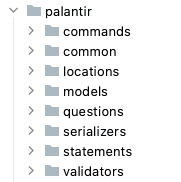
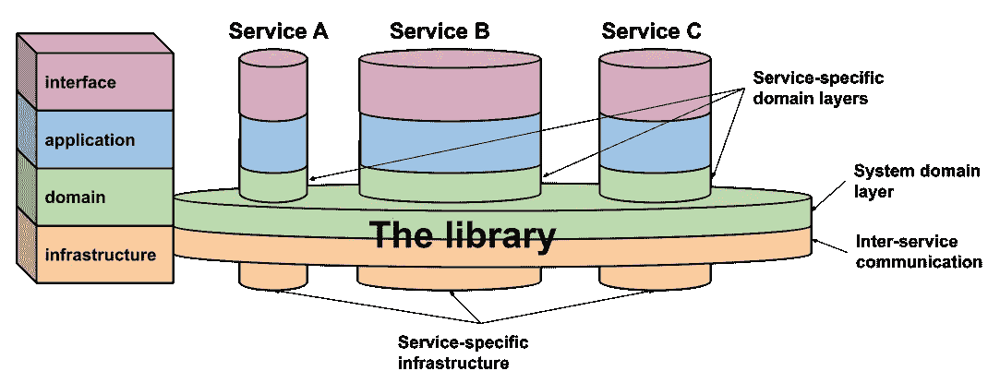

# 为 SOA 中的服务间通信设计一个库

> 原文：<https://medium.com/nerd-for-tech/designing-a-library-for-inter-service-communication-in-soa-6c4b297be422?source=collection_archive---------9----------------------->

我之前的文章是关于将一个整体系统分割成几个部分时出现的额外复杂性。基本思想是，不管底层的通信基础设施如何，SOA 系统都有一个额外的“通信复杂性”，这基本上是关于服务接口的额外知识。例如，如果服务 A 与服务 B 和 C 进行通信，那么负责 A 的工程师必须对 B 和 C 有所了解:她知道它们的接口，她被告知有变化，甚至可能对一些实现细节有所了解。每对通信服务都会增加系统的整体复杂性。在具有密集通信网络的大型软件系统中，这会导致两个大问题:

*   通信层存在大量复杂性，并且在添加新服务时会迅速增加。
*   工程师“只见树木，不见森林”——他们只使用服务级别的模型，看不到系统整体的全貌。

显然，服务隔离有很多优点，如果没有，SOA 就没有任何意义。主要的好处是将系统的一部分封装到一个单独的单元中，与系统的其余部分有一个瘦接口。因此，一组工程师可以专注于组件的内部，对系统其余部分的干扰最小。他们有一个可以理解的工作范围，可以更快地交付，独立地部署，等等。由于与系统隔离，工程师在设计决策上具有灵活性，不仅在组织代码方面，而且在他们在服务的“有限上下文”中创建的“无处不在的语言”方面。这种与服务相关的词汇表的主要问题是，它可能过于独立于系统中的其他词汇表而发展。经过几年这样的发展，人们可能会注意到类似的抽象在不同的服务中有不同的名称和行为，服务之间有数据重复，这些无处不在的语言之间的“翻译”变得更加复杂。此外，以某种方式存在于最初的整体中的公共“系统语言”逐渐从代码中消失，并转移到文档中，或者只是转移到几个有经验的工程师和产品所有者的头脑中。

因此，这个“通信复杂性”问题的解决方案有两个方面。第一个是关于设计一个通信层，以减少和简化不同部分的“通用语言”之间的“翻译”。第二个是关于通用无所不在的语言或系统无所不在的语言，或者简单地说，只是系统词汇。

正如在上一篇文章中所讨论的，拥有一个通用的、设计良好的系统内部通信方法可能对这两个方面都有帮助。这篇文章是关于一个服务于两个目的的库(包、gem 等等):

*   定义系统级模型:描述系统整体功能的所有抽象(数据结构和命令)。
*   封装通信层，为系统提供通用接口。

# 一点背景知识

用真实世界的例子来解释这个想法要容易得多。我是一个伟大团队的成员，这个团队设计并开发了一个自动化保险代理机构的系统。文章的其余部分是关于我们的 SOA 系统所面临的挑战，它从一开始就发展得太快了。它最初是一个由保险代理管理客户的整体 Rails 应用程序:为他们请求保险报价并发布保险单。然后出现了一个独立的分销项目，用于管理客户数据以及与大企业集成特定的分销渠道。然后，第一个应用程序被分成两部分:代理管理平台(AMP)和与保险公司的集成(报价)。随着时间的推移，随着新的发行源的出现或新的第三方服务的集成，该系统已经发展到大约 10 种不同服务的规模。

但是因为事情发生得很快，在 1-2 年的时间里，并不是所有的事情都进展顺利。

第一，数据重复。系统的不同部分以某种方式复制了大量信息。例如，像“人”、“财产”、“线索”、“报价”、“保险”这样的基本抽象概念几乎存在于每一个服务中。并且每个服务在其自己的“有界上下文”中呈现、存储和管理相应的数据。这样的重复对于系统功能来说不是大问题，但是当人们试图理解细节时，它肯定会带来混乱。当我们开始向系统添加商业智能层时，问题变得更加明显。很难恰当地汇总来自不同服务的数据。为了简化链接分散数据的过程，我们甚至为一些实体引入了“gid”(全局 id)的概念。

第二，服务之间的非标准化 API。大多数 API 接口是为每一对通信服务专门设计的。没有客户端库，每个服务必须自己处理 JSON 数据。只有文档、定期讨论和详细测试有助于避免错误。

最后，逐渐降低工程意识。随着系统的发展和工程师数量的增加，这是一个自然的专业化过程。一个工程师知道他或她积极工作的 2-3 个服务，并且对系统的其他部分有相当模糊的想法。

但是，也有好消息。系统中的所有服务都是用一种编程语言——Ruby 编写的。服务大部分通过 REST API 调用同步通信，只有很少一部分是异步事件。并且，当时整个工程团队比较小(大概 10 个工程师)，所以至少人与人的交流还算顺利。

## **大规模重构的计划**

整部重构史诗由三大部分组成。首先，我们必须重组数据，然后库本身应该已经被设计和实现，最后，集成到所有的服务中。每个阶段都需要大量的努力。数据重组和库到每个服务的实际集成都需要在域和应用程序层进行重大的改变。第一个(重新组织数据)任务影响了系统中几乎每个服务的数据层。最后一个(库的集成)需要对一些服务进行重大的修改，甚至是重新实现，因为每个服务的领域和应用程序层的很大一部分都需要修改。

从技术角度来看，库本身相对简单，但是由于它实现了系统每个部分的接口，所以可以想象它引起了多少与所有涉众的会议。

好消息是你不需要立刻重构整个系统。可以(也建议)从系统中的一个小服务开始:定义该服务负责的数据，稍微重构其接口，在库中实现相关的“模型”和“动作”，并在所有其他需要与该服务通信的服务中使用该库。对于系统的现有部分来说，这应该是一个进化的过程，但是，如果你要构建一个新的服务，最好从一开始就使用新的方法。

但是让我们详细回顾一下每一步

## 把你的数据整理好

与每个特定业务实体相关的数据必须在相应的服务中存储和管理。该服务对实体的数据负有完全的责任，因此，它成为关于实体实际状态的唯一来源(“实体的主服务”)。其他服务(“实体的消费者”)仅通过使用负责的主服务来初始化它并进行更改。在某些情况下，消费者可能拥有某个实体数据的本地副本(如缓存),或者甚至使用仅在其有界上下文中相关的附加属性来扩展该实体。但是所有这些修改应该只封装在消费者服务内部，而不应该暴露给系统。对其他消费者可见的任何更改都必须通过主服务来完成。

这种数据分离可能是一个非常复杂的问题，涉及到所有的利益相关者，包括工程师和产品所有者。为了解决这个问题，人们应该记住在一个软件系统中总是有两种数据。首先是“外部数据”——代表系统周围“世界”的数据。我们系统中的好例子是“人”和“财产”。人(及其属性)的存在与系统无关，因此系统处理这些数据的最佳方式是确保它们符合外部世界的现实。而“内部数据”实际上是系统本身生成的所有其他数据。这并不意味着这些实体与“真实”世界毫无共同之处。它们确实有，例如，像“lead”或“insurace request”这样的抽象概念肯定存在于系统的业务领域中。但这些数据是系统的产物，是与系统一起运作的业务。

让我们详细看看我们系统中的“人”——“候选人”——“领导”三人组。业务逻辑如下。客户(个人)可能对购买新的保险单感兴趣，他在公司页面上提交了一个表单。系统中出现两个实体:“人”和“候选人”。然后，系统检查是否有可能为客户找到更好(更便宜)的保单，如果是，则“候选人”转换为“领导”，并转到系统中的另一个服务。因此，作为人的客户在系统中被表示为“人”，这些是“外部数据”。同时，“候选人”和“领导”是系统创建的实体。

实际上，在我们的系统中处理“内部数据”并不是一个大问题。我们在服务之间有非常明确的责任分离，因此这些数据最初是在相应的服务中存储和管理的。真正的问题与“外部数据”有关:人、财产等。这些实体(以不同的方式)出现在系统中的几乎每个服务中。解决方案非常简单——我们只是将所有这些“外部”抽象转移到一个单一的服务中——“起源”。“源”服务不仅仅是客户、属性和其他实体的简单存储。事实上，它是整个系统的外部世界的一个大模型。所有实体、它们之间的关系以及访问和修改它们的接口都在一个地方。

数据迁移完成后，就为定义系统中的基本数据结构打下了良好的基础。然后，它们将被放入库中，以便可以在系统的任何服务中看到和访问。这些数据结构、它们的名称以及它们属性的名称将成为系统的“名词”,并覆盖整个概念、实体、状态等集合。

在数据重组之后，服务的接口很可能也需要修改。而且，最有可能的是，它们会变得更简单。每个实体都有自己的位置，可以使用 id 或 uuid 来引用它。因此，如果以前您必须在服务之间传递实体的许多属性，现在您可以只传递它们的 id。然后，服务可以自己获取所有必要的数据。当然，在性能和简单性之间有一个折衷，但是在本文中我们站在简单性的一边。

请记住，我们将把整个通信封装在 Ruby 库中，最后，我们将使用普通的 Ruby 对象及其方法进行通信。当然，在引擎盖下，它将(主要)是具有不同语义(URI、HTTP 动词、状态代码)的 REST API。应该考虑这些细微差别，但是，首先，在为库中的对象和方法选择名称时，必须关注 Ruby 和人类语言。REST 语义的优先级较低，它只是基础设施层的一部分，将隐藏在库中。也就是说，基本上，它。有了正确组织的数据和相应的接口，我们就可以创建一个库，用简单漂亮的 Ruby 对象包装所有这些。

# 遇见帕兰提尔

让我们回顾一下库背后的基本思想。有两个主要目的:定义系统级模型和封装服务间通信。

该库的结构如下所示:



图书馆的高层结构

“模型”、“验证器”服务于第一个目的，而其余的抽象与通信层相关。

## 模型

模型是带有简单验证的数据结构。所有的模型类都继承自 Palantir::BaseModel。

```
***module Palantir
 class BaseModel
   include ActiveModel::Validations
   include ActiveModel::Serializers::JSON

   attr_accessor :id*** ***...*** ***end
end***
```

因此，唯一的额外功能是验证和序列化。每个模型实际上是一组带有相应验证的属性。

```
**module *Palantir* class *Person*** < ***Palantir***::***BaseModel
    ATTRIBUTES*** = **%i[email first_name last_name ...]**.freeze
    *attr_accessor*(****ATTRIBUTES***)

    *validates* **:email**, **format**: ***Validations::Patterns***::***EMAIL*** *validates* **:first_name**, **presence**: **true**, **on**: **:create** *validates* **:last_name**, **presence**: **true**, **on**: **:create
   end
end**
```

模型的接口由“build”类方法(从 Palantir::BaseModel 继承而来)和几个用于验证和序列化的实例方法组成，前者从属性构建模型。

在 Palantir 中保留一个小的验证层的想法是双重的。首先，验证语句提供了关于属性值的附加信息，换句话说，更严格地定义了类型。其次，这些验证在每个请求之前应用，如果有错误，请求将不会被发送，但会返回一个错误。

active model::serializer::JSON 模块只是简化了 JSON 序列化例程。

## 行动

“动作”是系统中每个交流行为的通用词。它的意思和“请求”有点不同。请求更多的是关于两个特定服务之间的通信。但既然 Palantir 隐藏了沟通各方，不如用“行动”这个词，把沟通想成系统中的一个行动(business-action)。

系统中既有同步动作也有异步动作，我们在这两种类型的通信之间引入了严格的分离。同步请求是基本的通信方式，业务逻辑建立在它们之上，对业务实体的任何“重大”更改都是同步完成的。异步消息只是通知系统“微小的”变化。这些消息也需要在一个或多个服务中进行一些处理，但是它们不会对系统行为产生很大影响。当然，重要和不重要的操作之间的区别应该在业务层面上进行，但是一个好的经验法则是系统应该只在同步消息的情况下保持功能，而异步消息控制一些非关键的方面。或者，从技术上讲，人们可能会问两个问题:我们是否需要确保成功的消息处理，以及如果消息丢失了会发生什么。如果您不关心通信的结果，并且如果消息在途中的某个地方消失了，系统一致性也不会被破坏，那么异步请求是一个正确的选择。

系统中有两种类型的同步动作:“问题”和“命令”。分离背后的思想是保持 GET(问题)和 POST/PUT/DELETE(命令)HTTP 请求的语义。一个问题表达了对一些数据的需求——服务向系统“询问”数据。而命令告诉系统做某事或/和改变系统中的数据。就系统中的数据流而言，问题是关于从系统到服务的数据流，而命令向系统发送新数据。

而“语句”呈现异步通信。

“动作”的接口模仿 RPC(远程过程调用)的通用方法，每个动作具有相应的“请求”和“响应”对象，它们是包含执行通信所需的实体的复合对象。每个动作都是一个只有一个“调用”方法的类，该方法接受一个“请求”对象并返回一个“响应”对象。以下是 Palantir::CreateProperty 命令的示例。

```
*request* = ***Palantir***::***CreateProperty***::***Request* do** |*request*|
  *request*.property = new_property
  *request*.property_address = new_property_address
**end***response* = ***Palantir***::***CreateProperty***.(*request*)
*response*.class *# Palantir::CreateProperty::Response*
```

注意命令的命名约定，它是一个带宾语(名词)的动词——理解命令目的所需的最少语义信息。

请求对象包含数据验证和序列化的逻辑:

```
**module *Palantir* class *CreateProperty*** < ***BaseOrganizer* class *Request*** < ***BaseCommandRequest
      SERIALIZER*** = ***PropertySerializer
      RELATIONS*** = {
        **property**: { **required**: **true** },
        **address**: { **required**: **true** }
      }.freeze
      ...
    **end
  end
end**
```

虽然命令本身定义了执行操作所需的所有必要步骤，并且还具有关于向何处发送数据的信息:

```
**module *Palantir* class *CreateProperty* < *BaseOrganizer* organize *Common*::*SetDefaults*,
             *Common*::*Validate*,
             *Common*::*Serialize*,
             *DoRequest*,
             *Common*::*Deserialize*,
             *Common*::*CheckStatus*,
             *Common*::*BuildProperty*,
             *Common*::*BuildAddress*** **def self.*endpoint* 'properties'
    end

    def self.*location
      Locator*.origin_location
    end** **def self.*call*(*request*)
      ...
      super(request: *request*, organizer: self).response
    end
    ...
  end
end**
```

我们使用一个很棒的[交互器](https://github.com/collectiveidea/interactor)库来定义中间步骤。人们可以看到引擎盖下到底发生了什么。首先，可能会为动作的对象填充一些默认值。然后进行验证(客户端)，如果数据有问题，将立即返回错误响应。如果一切正常，那么就执行实际的 HTTP 请求(Common::Serialize->do request->Common::Deserialize)。Common::CheckStatus 验证响应的状态，并可能通过错误响应停止管道。最后，最后两个步骤构建属性和地址对象。

response 类定义了命令输出中必须包含的数据。在给定的示例中，这非常简单:

```
**module *Palantir* class *CreateProperty* class *Response*** < ***Palantir***::***BaseResponse*** *attr_accessor* **:property**, **:address
    end
  end
end**
```

因此可以肯定，响应对象将具有在命令成功后构建的“属性”和“地址”对象:

```
*response*.property *# Palantir::Property
response*.address  *# Palantir::Address*
```

基本上，这就是库中的主要抽象:“模型”、“动作”、“请求/响应”。有几个实用组件(RestApiClient、MqClient、Locator)实现了底层通信和服务发现逻辑，但是这些不值得在本文中考虑。

## 服务中的图书馆

当您将库集成到一个特定的服务中时，会出现一个问题:是否可以在服务域/应用层中直接使用库模型，或者它们是否应该由其他对象包装？对于简单的用例，直接使用库类是可以的。在更复杂的情况下，可以使用继承或组合。但是，一般来说，这个库是系统代码库的一部分，而不是第三方代码库，所以它应该被视为服务代码的“本地”部分。

其他困难与通信层有关:每个操作都需要一些时间来完成，请求可能会失败(网络问题或其他服务器崩溃)。当然，应该在服务端以某种方式处理缓慢的请求，并且可以考虑并行处理这些动作(例如后台处理)。更好的解决方案是改变逻辑，改为做几个快速请求。例如，与其使用 DoSlowRequest 命令，不如启动进程，然后在它准备好的时候获取结果:StartProcess 命令，ResultReady 语句，GetResult question。

# 结束语

## 系统领域层和通用普适语言

就分层架构而言，Palantir 部分占据了基础设施层和领域层。在基础设施层，库负责在服务之间传递消息。而在领域层，它代表“系统领域层”——领域的公共部分，代表业务的基本概念。领域层是最重要的部分，因为它定义了每个人都将遵循的“无处不在的语言”，并且在未来很难改变它。因此，将系统域层作为一个独立的软件，可以在系统的每个部分重用，这简化了很多事情。工程师可能只关注应用层——应该在系统域层之上执行的一组任务或工作。



每个服务都通过自己的抽象来扩展系统域层，以满足特定的业务需求。如果新概念只是局部概念(只有在其有限的上下文中才有意义)，它们将只是系统域层的补充，并将与库的抽象一起存在于代码中。但是，如果一个新引入的概念对整个系统有意义，并将用于系统的其他部分，那么它必须包含在库本身中。无论如何,“本地语言”和“系统语言”的扩展都是建立在定义明确的“通用无处不在的语言”之上的，每个人都可以使用和理解这种语言。

## 单片化

有人可能会说，使用 Palantir 库的方法，我们实际上回到了一个整体。那是部分真实的。目前，每项服务都严重依赖于贯穿所有代码的公共抽象。库中的任何变化都会导致相应代码库的大量变化，减缓系统开发，并削弱 SOA 方法的优势。

但是让我们再次回顾一下这种耦合发生在什么层次上。它在公共数据结构和动作的层次上——一个经过充分讨论和良好设计的系统核心。它是协作架构决策的产物，在任何情况下都很难改变。这种“系统级”的耦合在 SOA 中是无法避免的:将一个系统分割成几个部分会使特定于服务的功能解耦，但是总有一些共同的东西会影响两个或更多“解耦”的部分。

从哲学的角度来说，如果没有连接各个部分的公共抽象，就不可能将系统理解(感知)为一个整体(而不仅仅是一组部分)。

考虑一个简单的例子，我们需要在一个公共数据结构中引入一个新的属性，并且许多服务中的逻辑应该被改变以支持该属性。或者想象一个复杂的情况，对现有的命令界面进行重大修改。在这两种情况下，新功能都应该首先在库中实现，然后所有依赖的服务都将被更新。

但是，如果没有图书馆，人们也会这样做。新的数据结构将出现在系统中的某个地方，负责服务的接口将被更改，然后所有其他部分的代码也将被更改。实际上，即使在一个单一的应用程序中，人们也会经历相同的动作。

因此，是的，系统是由库耦合的，但它是“自然地”耦合的，基于常见的事物，无论如何它都是耦合的。与此同时，如果没有 Palantir，我们系统内部的相互依赖性会在文档、API 规范和厨房对话中的某个地方表达出来。但是现在它们在代码中被明确定义了。

## 异构系统

所描述的方法在用一种编程语言编写的系统中是可能的，但是如果在一个系统中使用几种语言呢？有几种可能的情况。

第一个非常流行的是在系统的最关键部分使用“核心”语言的系统，还有几个用其他语言编写的实用服务。在这种情况下，为系统核心准备一个类似 Palantir 的库是完全没问题的。如果需要，甚至可以用其他语言实现它的基本变体。

第二种情况是一个“技术动物园”或“巴别塔”系统，可能只用一种语言描述——英语(大部分)，并且只在文档中描述。很可能，用单一的元语言描述核心行为并为每个服务自动生成客户端库是可能的(类似于 gRPC 框架方法)，但我怀疑这是否会简化事情。对于这种情况，最合适的解决方案是创建一个单点通信(如 API gateway)并通过其接口“单片化”系统。网关的接口与库的用途相同——所有常见的抽象(名词和动词)都将在一个地方定义。

另一个广为人知的方法是事件源模式，它基本上做同样的事情——它在通信层之上构建一种公共语言。但它以一种巧妙的方式做到了这一点——通过用系统中发生的“域事件”来表示系统逻辑，每个服务对这些事件做出“反应”。这种方法更复杂，因为它给由服务组成的系统带来了一个反应式的范例，而服务内部有一个(主要是)“主动的”方法。事件语言与服务中使用的类似 RPC 的语言有很大不同。它更多的是关于系统内部隐含地影响系统状态的变化，而不是直接改变状态的声明性动作。这种思维方式与我们在传统编程中的思维方式有很大不同，因此人们在选择它时应该仔细考虑。