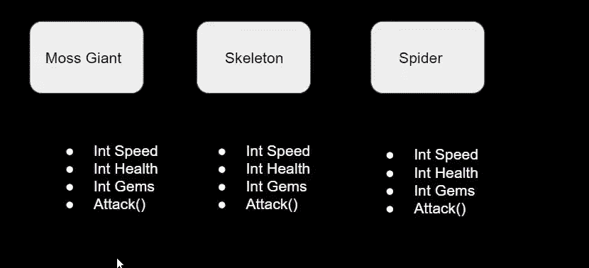
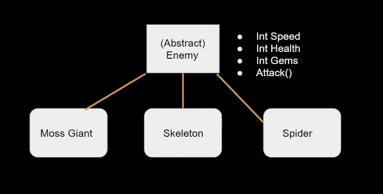
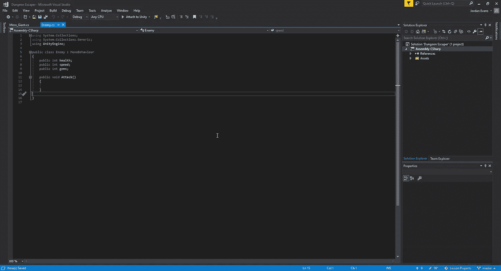
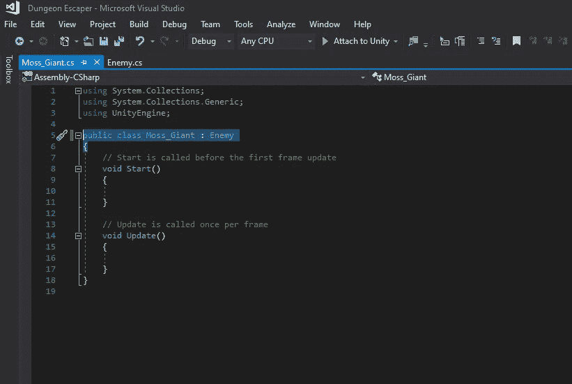
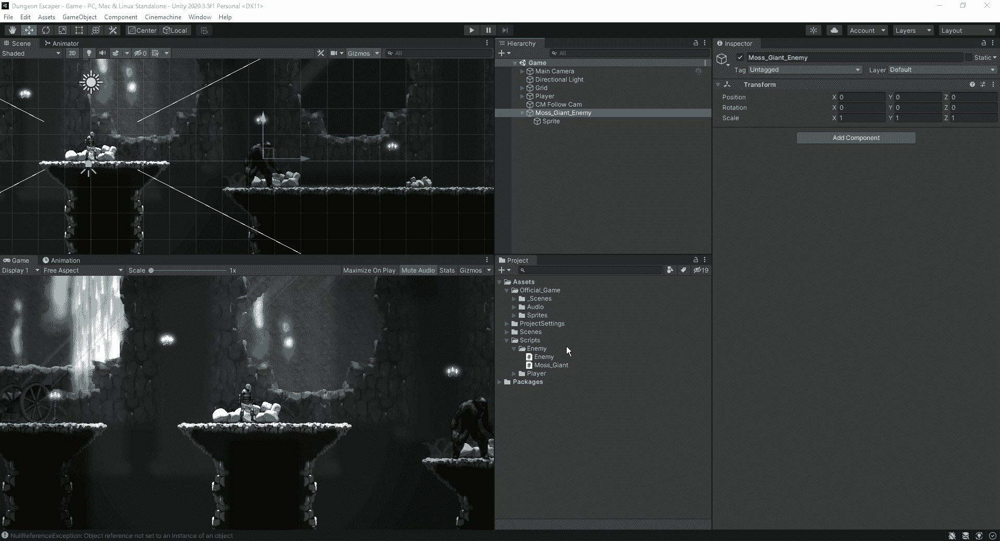
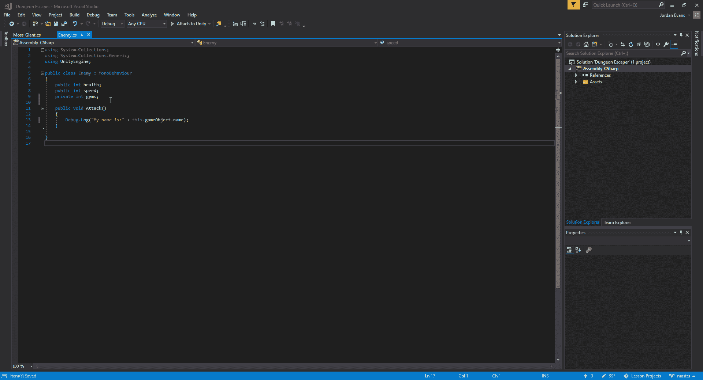
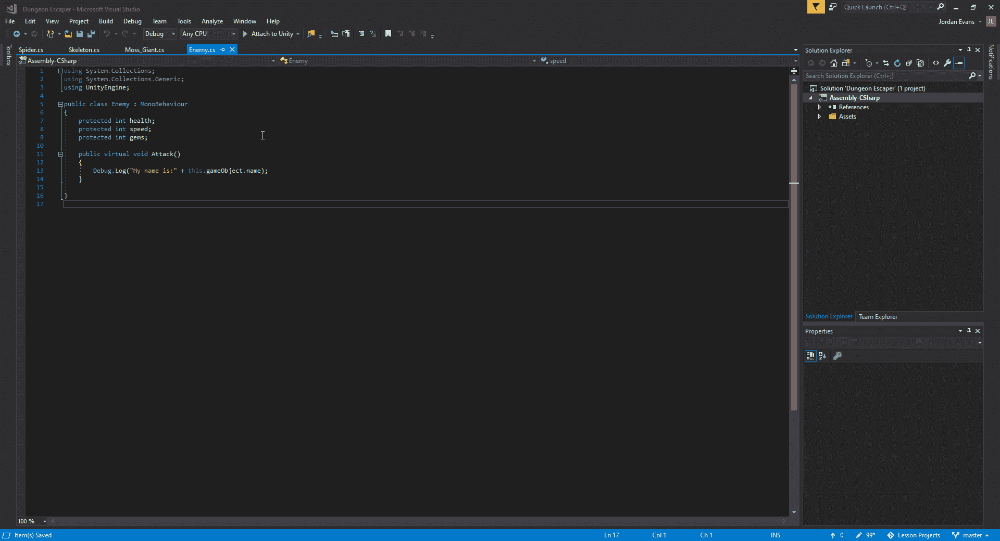
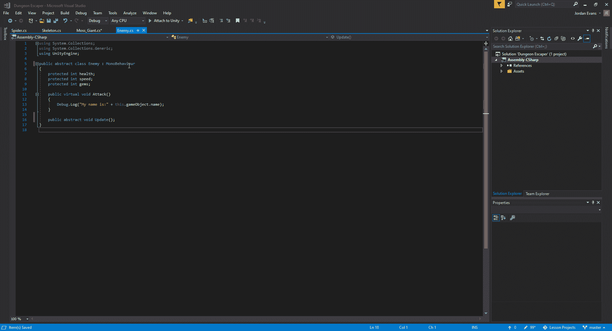

# 使用抽象类设计敌人

> 原文：<https://medium.com/nerd-for-tech/designing-enemies-using-abstract-classes-fc9d7fdc0c95?source=collection_archive---------6----------------------->

现在我们已经创建了玩家联盟，让我们看看如何在游戏中制造敌人。我们可以将它们都创建为自己的脚本，并输入它们各自的属性:

然而，当你看到不同的敌人类型是如何建立的，他们都有相同的信息。现在，有了几个不同的单位，这还不算太糟糕，但是如果我们要实现几十个不同的敌人类型，需要的脚本工作量会增加得相当快。为了减轻我们必须投入的工作量，我们可以创建一个抽象类来编码我们敌人的所有共享属性，然后给这些特定的敌人赋值:

首先，让我们为敌人和我们的苔藓巨人创建一个脚本:

在我们的 Moss_Giant 脚本中，我们要做的就是在创建了敌方脚本属性并将其附加到 unity 中的巨型对象后，将其从 MonoBehaviour 更改为敌方脚本:

正如我们所看到的，即使我们的巨型脚本是空的，从敌方脚本中提取出来的 1 改变允许我们使用我们设置的公共 int 值。现在，当我们使用这种类型的脚本行为时，使用 public 通常不是最佳实践，因为我们希望对不需要访问这些信息的其他类隐藏这些值。为此，我们可以使用不同的方法来设置限制，而不是公共或私有:

有了 protected 限制，它允许我们用任何调用该特定变量的类来调用该变量。接下来，让我们来看看如何将我们的虚空调整为虚拟的。这让我们可以对某种行为有自己的方法，比如攻击，但我们也可以根据我们正在调整的敌人对它进行修改:

正如我们所看到的，我们仍然在调用 My Name Is，但是对于 spider 类，我们调用了一个额外的方法。
接下来，我们将把我们的敌人类变成一个抽象类，并创建一个抽象的 void 更新。这将使得我们用敌人的行为创造的任何东西都将被强制实现对那个特定虚空的覆盖:

有了这个方法，我们可以用它来确保每次我们创造一个新的敌人，我们一定会添加所有需要的行为，使我们的新敌人正常工作。既然我们已经研究了如何构造一个抽象类，我们将研究为我们计划在游戏中实现的各种敌人类型创建单独的行为。