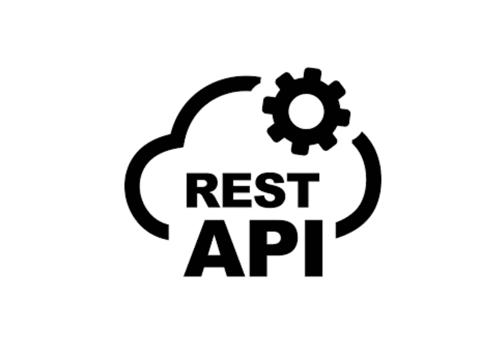
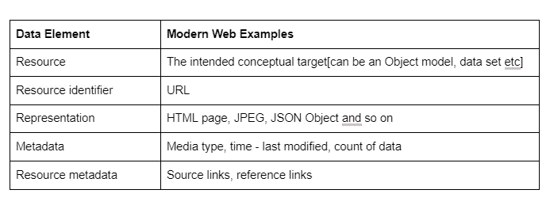
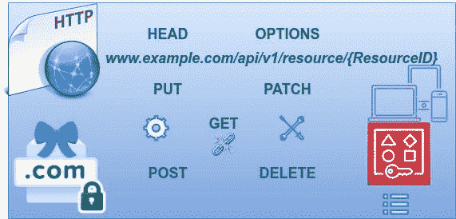
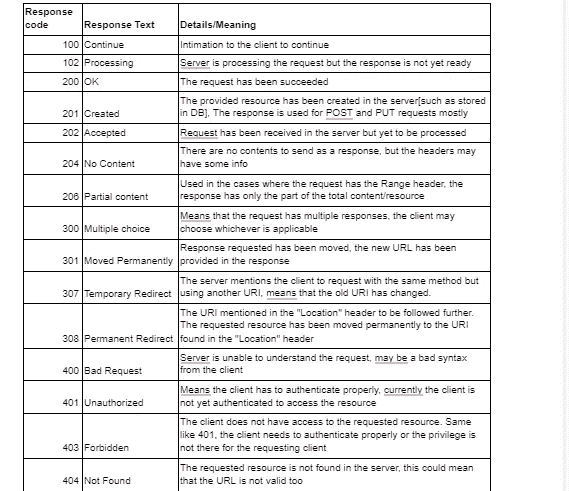
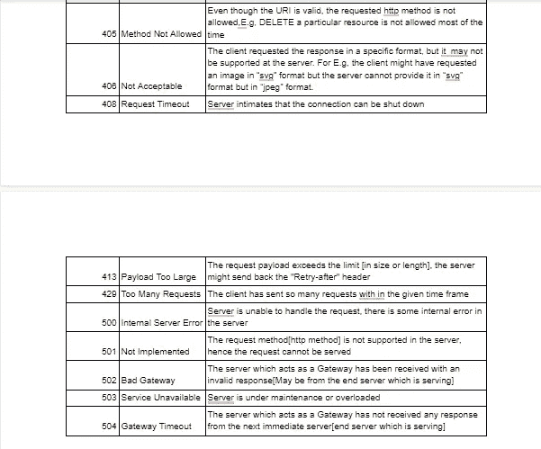

# 设计 REST API 的正确方法

> 原文：<https://medium.com/nerd-for-tech/designing-rest-apis-the-right-way-1af5ab0653f0?source=collection_archive---------3----------------------->

现代 web 客户端-服务器通信大多借助于 API(应用程序编程接口)进行。业务逻辑的业务模型/结果通过 API 向客户公开。API 的设计应该首先支持平台独立性和服务评估。

有几种方法可以设计 API，REST[表述性状态转移]是一种架构风格，通过它可以很好地设计 API。无论您是一个务实的还是理想主义的程序员，对于任何 API 服务器，都需要有一个基本的架构设计，并仔细考虑所有的边缘情况。

REST APIs 是任何一种众所周知的格式(比如 JSON 格式)的资源表示，并在分布式部署环境中跨不同的系统传输。它不是像 HTTP 一样的协议，而是一种架构方法，但是 REST 可以在 HTTP 上使用。

为什么 REST API 设计很重要:

如今，软件系统以快节奏的方式开发，这有时会导致重复的代码、为同一资源公开多个 API、客户端/用户界面进行数据操作等等。为了避免这种担忧，以适当的方式设计 REST API 变得非常重要，REST API 的设计在任何分布式系统中都是一个非常重要的因素。

架构师/设计师只从业务需求和使用系统的客户开始。首先，在开始设计之前，要很好地理解用户界面和数据存储系统的职责，并且需要在仔细考虑必要资源的情况下确定与业务相关的数据模型。

资源可能直接映射到数据模型，也可能不直接映射到数据模型，并且系统中的所有资源也不一定向客户端公开。每个资源都应该用一个唯一的标识符来标识，即 URL 或端点。REST 关注的是组件、连接器和数据，而不是实现或协议语法。

REST API 的架构元素:

数据元素:REST 根据客户机/用户界面的功能，以任何现有的数据格式传输资源的表示。REST 架构中不同数据元素如下:

正如我们看到的架构元素，资源[实际数据]扮演主要角色。使用诸如 GET、POST、PUT、PATCH、DELETE 等 HTTP 请求方法来修改/操纵/提供资源。

让我们讨论一下设计 REST API 时的一些关键考虑事项:

**资源标识符:**

资源标识符就是 URL/路径/端点，通过它可以访问特定的资源。创建 URL 时，总是需要遵循正确的层次结构和名词。例如，假设我们正在设计一个购物门户，购物门户的主要资源是产品和消费者资料。产品的 API 设计可以采取如下形式:

1.  列出产品

**获取**/产品

2.列出特定产品的详细信息[比如产品 Id 为 12]，

**获得**/产品/12

3 列出了产品 Id 为 12 的产品的消费者评论

**获取**/产品/12/评论

4.要查看产品 Id 为 12 的产品的特定注释

**获取**/产品/12/评论/3

在上面的例子中，我们可以看到名词被使用，而且总是用复数。无论是列出许多产品还是提供单个产品的细节[GET /products/12],字面意思应该是复数。如果你注意到了，层次分明，产品有来自消费者的评论，也可以有多个评论。在上面的例子中，你可以看到第 4 点，为一个特定的产品标识了一个特定的评论。

不要对 API 路径使用任何动作动词，如“GET/GET product”，这是一种不好的做法，并且在创建这样的名称时没有限制，用户[客户端]可能会对特定 API 的结果感到困惑。

**//好的**

*[*http://www.example.api.com/v1/*](http://www.example.api.com/v1/products)*创造-产品//不良**

*每个 HTTP 请求方法本身都有一个特定的动作，该名称意味着[它做什么动作/操作]如下，*

***POST** →创建一个由客户端提供的详细信息表示的资源，请求的主体可以包含必须创建的特定资源属性*

***获取** - >列表或获取资源/资源属性。*

***PUT** - >创建或替换已有的 resoby 服务器到客户端的详细信息，请求消息体中可以有要创建或替换的资源详细信息。*

***补丁** - >部分更新或更改特定于资源的详细信息，请求消息的正文可以包含要为现有产品更改的详细信息。*

***删除** - >删除所提供 id 的特定资源。*

***表示:***

*表示意味着请求资源或提供响应的形式/格式。主体参数、查询参数或路径参数是请求表示。同样，响应体表示结果资源。*

*下面是一个 JSON 格式的带有 **body params** 的 POST API，这是客户端如何表示资源的。*

****POST-https://example . API . com/v1/products****HTTP/1.1**

**内容类型:应用/JSON；charset=utf-8**

**内容长度:57**

****{"Id":1、"名称":" CoolPhone "、"类别":"手机"、"价格":3000 }//*/***车身参数**

*类似地，带有**查询参数**的 GET API，*

****得到****[*https://example.api.com/v1/products****？***](https://example.api.com/v1/products?price=3000) 价格=3000**

****路径参数**的一个例子是带有产品 Id 的特定产品，**

*****得到***[*https://example.api.com/v1/produc*](https://example.api.com/v1/products?price=3000)*ts/****{:id }*****

****元数据和实际数据:****

**到目前为止，我们已经看到了来自客户端的输入/请求格式，现在是来自服务器的对从客户端接收的相应请求的响应，响应格式可以是具有关于结果资源[元数据]和实际资源细节[数据]的高级信息的形式。**

**示例响应/结果，**

***{***

***元数据:{***

***//关于结果数据的信息，例如数据的计数、数据的长度、数据的格式信息***

***}，***

***数据:{***

***//实际数据收集***

***}***

***}***

****认证和授权:****

**在快速发展的开放网络世界中，这一点非常重要，API 服务器有责任确保数据是安全的，通过网络安全传输，并且不加任何修改地到达正确的客户端。通过网络提供/共享的数据总是存在威胁。为了识别正确的客户端，需要对所有 API 进行身份验证和授权。**

**身份验证是通过匹配服务器数据库信息(例如，用户标识/用户名和密码、API 令牌等)的特定客户端身份来识别客户端。可以有一个 API，例如“/login ”,它可以公开获得，可以对客户端进行认证，并且可以提供回一些特定的授权令牌/会话令牌等。**

**API 的一种授权或访问方式可以基于客户端提供的令牌(在登录 API 中作为响应提供)或客户端添加的任何附加授权头信息。客户端在访问 API 时必须提供相同的信息/令牌。**

****API 访问限制:****

**如果有人滥用 API 或者想要意外地/恶意地关闭服务器，就不应该有这样的空间。API 应该有连续访问的限制，或者超过来自同一客户端的 API 请求的数量。应该用 503 响应通知用户。**

****耗时的 API:****

**可能有一些 API 需要一些时间来处理从 DB 获取的数据，或者处理和提供结果。在这种情况下，API 应该立即响应“202 Accepted ”,还应该提供 URI 来获取结果。响应中的 Location 头可以让 URI 稍后获取结果。如下例所示，对 API 的响应是“202 Accepted”，但是没有立即提供结果，而是提供了位置信息，以便客户端稍后获取结果位。**

**HTTP/1.1 202 已接受**

**位置:/api/v1/status/56789**

****分页和过滤:****

**对于任何处理不断增长的客户端数量和数据量的系统来说，性能都是一个至关重要的因素。通过考虑系统的可扩展性，可能通过添加额外的/复制资源等，可以处理越来越多的客户端。让我们从第二个方面来考虑数据量，当我们处理报告或统计数据时，记录的数量总是很大。在这种情况下，API 不要花费太多时间或者不应该在给定的时间获取更多的数据是非常重要的。因此，有必要在查询中使用分页技术和过滤器选项。例如，如果需要一个更大的所有产品的列表，那么客户端可以在调用 API 时发送一个偏移量和限制，如下所示，**

***得到*[*https://example.api.com/v1/products****？***](https://example.api.com/v1/products?price=3000) 极限=30 &偏移=0**

***得到*[****？****](https://example.api.com/v1/products?price=3000) *极限=30 &偏移=31***

****二进制部分内容:****

**在处理二进制类型的数据时，我们需要考虑的另一个因素是用部分内容进行响应。让我们假设一个 API 提供一个更大的图像或文件作为响应，在这种情况下，还应该考虑客户端的接收能力，在提供响应的同时制作二进制数据块将会有所帮助。客户端应该在其 GET 请求中提供一个 Accept-Ranges 头，这个选项将告诉服务器客户端可以支持接收部分内容。HTTP 方法中还有另一个选项“HEAD”，它也类似于 GET 等，它帮助客户端知道图像或文件的大小。基于 HEAD API 响应，客户端可以决定一次可以获取多少内容以及获取多少次。**

**头[https://example.com/api/v1/products/12?fields=productImage](https://example.com/api/v1/products/12?fields=productImage)HTTP/1.1**

**响应可以如下所示，**

**HTTP/1.1 200 没问题**

**接受范围:字节**

**内容类型:图像/jpeg**

**内容长度:4338**

**有了上面的响应，客户端可以决定第一次可以获取多少数据，如下所示，**

**获取[https://example.com/api/v1/products/12?fields=productImage](https://example.com/api/v1/products/12?fields=productImage)HTTP/1.1**

**范围:字节= 0–1999**

**这里，GET 请求获取前 2000 个字节，这可能是客户机的接收和处理能力。获取响应元数据可以如下所示，**

**HTTP/1.1 206 部分内容**

**接受范围:字节**

**内容类型:图像/jpeg**

**内容长度:2000**

**内容范围:字节 0–2000/4338**

**收到第一个 2000 字节后，客户端可以发出另一个 GET 请求，范围为 2000–4338，以获取完整的图像内容。**

****响应代码:****

**服务器 API 应该发送正确的 HTTP 响应代码，同时向客户端返回响应。HTTP 响应代码，总的来说，主要有以下 5 类:**

1.  **1XX = >用于传达信息性消息的响应代码，如处理继续等。这意味着服务器仍在处理请求。**
2.  **2XX = >成功的响应，如 OK、created、Accepted、Partial content 等，表示请求已被成功处理并做出响应。**
3.  **3XX = >重定向消息与 3XX 响应一起传送。例如永久移动、临时重定向等，这意味着联系另一个端点来获取信息**
4.  **4XX = >响应代码，用于传达客户端请求中的错误，即客户端错误**
5.  **5XX = >代码，表示服务器有问题，如内部服务器错误**

**最好用正确的响应代码来传达响应，以便客户端能够正确理解，并且全球都能理解。**

**在某些情况下，服务器可能会收到来自客户端的请求，并且处理请求可能会比平时花费一些时间，在这些情况下，为了避免客户端超时，最好发送“102”代码作为响应。**

**下面列出了一些重要且常用的响应代码，**

********

****版本化:****

**支持向后兼容性是最不重要的，但也是最重要的。假设设计发展到支持系统中不同的附加功能，我们可能最终会在相同的 API 中添加更多的功能。在这种情况下，旧的客户端(以前的版本)可以继续工作而不会出现任何问题，直到升级到最新版本(如果有合适的版本)。为了支持向后兼容性，请考虑 API 的版本控制。有几种方法，**

1.  **路径参数中的版本控制**

**例如，得到 http://example.com/api/[v1/产品](http://example.com/api/v1/products)**

**2.查询参数中的版本控制、**

**例如，得到[http://example.com/api/products?version=1】](http://example.com/api/products?version=1])**

**3.标题版本控制**

**例如，得到[http://example.com/api/products](http://example.com/api/products)**

**自定义标题:api 版本=1**

**4.媒体类型版本控制。**

**例如，得到[http://example.com/api/products](http://example.com/api/products)**

**接受:application/image.v1+json**

****文档:****

**大多数情况下，这是用户界面开发人员和系统开发人员之间关于如何定义界面、请求和响应将如何的合同。在开发 API 时，最好的做法是包含 API 的文档，这也有助于理解版本差异。制作 API 文档的工具有很多，其中一个就是 swagger.io，从 swagger 版本 2 开始，遵循的就是开放 API 标准。开放 API 倡议的创建是为了跨不同供应商标准化 REST API。**

**希望本指南有助于以行业标准的方式设计成熟的 REST APIs。**

**参考资料:**

**[https://www . ics . UCI . edu/~ fielding/pubs/dissertation/rest _ arch _ style . htm](https://www.ics.uci.edu/~fielding/pubs/dissertation/rest_arch_style.htm)**

**[https://docs . Microsoft . com/en-us/azure/architecture/best-practices/API-design](https://docs.microsoft.com/en-us/azure/architecture/best-practices/api-design)**

**https://mathieu.fenniak.net/the-api-checklist/**

**[https://medium . com/hashmapinc/rest-good-practices-for-API-design-881439796 dc9](/hashmapinc/rest-good-practices-for-api-design-881439796dc9)**

**[https://www . vinaysahni . com/best-practices-for-a-practical-restful-API](https://www.vinaysahni.com/best-practices-for-a-pragmatic-restful-api)**

**[https://flori mond . dev/blog/articles/2018/08/restful-API-design-13-best-practices-to-make-your-users-happy/](https://florimond.dev/blog/articles/2018/08/restful-api-design-13-best-practices-to-make-your-users-happy/)**