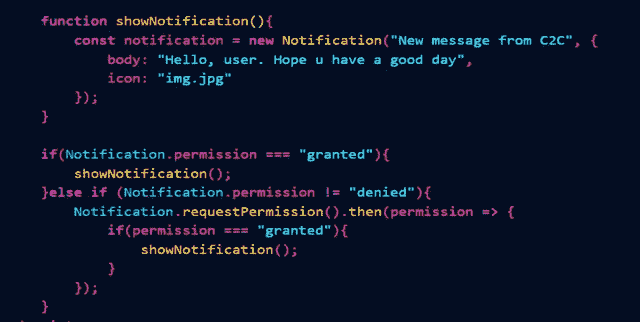
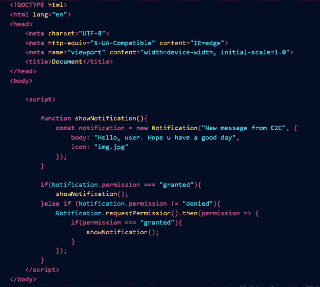

# 使用 JS 的桌面通知

> 原文：<https://medium.com/nerd-for-tech/desktop-notifications-using-js-7a82989a7cff?source=collection_archive---------11----------------------->

推送通知是允许网站在桌面上向用户显示即时消息的功能。当涉及到与用户通信时，推送通知非常方便，因为这些通知易于实现和理解，并且开发者可以允许用户对这些通知执行多个动作。

在桌面上推送通知

在桌面上显示通知的代码是普通的 JS，不需要任何外部库或依赖。它唯一需要的是一个活的服务器以及一个以 HTTPS 开头的 IP 地址。(即它应由 HTTPS 担保。例句:-[https://www.google.com/](https://www.google.com/)。为了稍微降低要求，代码可以简单地部署在任何部署站点上，比如 Github、Heroku、Firebase、GCP 等等。所有这些部署引擎总是在部署时提供安全的 HTTPS 链接。

现在，我们创建一个简单的 JS 文件(这里是一个 HTML 文件，下面的代码在

用于创建通知的 JS 代码

代码的第一行引入了一个包含 Notification 类型常量的函数。

这种通知类型包含两个主要内容，标题(“新消息..”)和通知的正文。该正文包含您希望作为通知给出的描述，以及显示在描述旁边的图像。

下面的 if 结构用于获得用户的许可，就像在中一样，允许我们的应用程序在用户的桌面上推送通知。

现在，如果许可被授予，showNotification 函数被调用，带有标题、正文和图像的通知显示在用户的右下角。

如果用户拒绝许可，代码将再次请求许可，并检查用户是否同意。

现在我们只需要在一个服务上部署代码，或者在服务器上运行代码，给我们 HTTPS 链接，我们将得到一个请求许可的提示，随后，我们将得到我们上面制作的主体的通知。用户必须强制允许网站显示通知。此外，可以在代码中的任何地方调用 showNotification 函数，因此我们可以通过单击任何按钮或任何其他交互等方式来利用这个推送通知。为了便于理解，包含通知的文件的完整代码如下

HTML 文件代码

虽然，有许多外部 API 和许多其他的交互方式来向用户显示推送通知，但这是基本的方式，并且是普通的 JS，因此它可能以这样或那样的方式有所帮助。

谢谢你。