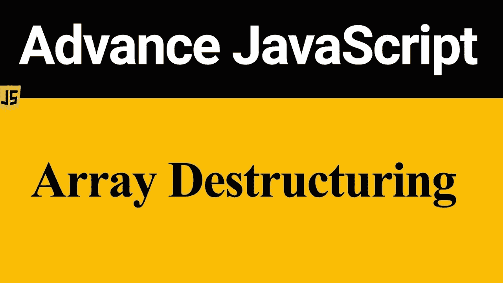

# 在 JavaScript 中析构数组

> 原文：<https://medium.com/nerd-for-tech/destructuring-arrays-in-javascript-9ee759210f6?source=collection_archive---------10----------------------->



析构是 ES6 的一个特性，它是一种将数组中的值或对象中的属性解包到单独的 e 变量中的方法。

*换句话说，去结构化就是将复杂的数据结构分解成更小的数据结构，比如变量。因此，对于数组，我们使用去结构化来从数组中检索元素，并以一种非常简单的方式将它们存储到变量中。*

*为什么去结构化是有用的或必要的👉*

*为 ex。我们取一个非常简单的数组👉*

```
*const firstArray = [1, 2, 3]*
```

现在，如果我们想在不析构的情况下将每一个都检索到变量中，我们将这样做👉

```
const a = firstArray[0];const b = firstArray[1];const c = firstArray[2];
```

这就是我们如何在不析构的情况下从一个数组中获取所有三个元素👆这是一个非常漫长的过程。

*但是现在有了去结构化，我们可以以非常简单的方式使用，在方括号中同时声明所有三个变量。👉*

```
const [a, b, c] = firstArray;
```

*所以这是 ES6 的一个好特性。它节省了我们代码中的大量混乱。左侧方括号中声明的变量看起来像数组，但它们不是。他们在破坏任务。并且在进行析构的时候不会影响到原来的数组。*

*如果我们想析构像前 2 个或任何数量的元素，不要全部来自数组。我们应该声明想要析构的变量的数量，javaScript 会自动析构这些元素。而不是全部。对于 ex:*

```
const dishes = [‘pizza’, ‘pasta’, ‘noodles’ ];const [first, second ] = dishes;console.log(first, second);output will be: pizza pasta;
```

所以它只析构了数组的前两个元素。

假设我们想析构一个数组的第一个元素和第三个元素。所以解构有办法做到这一点。👉

```
const [first, , third] = dishes;console.log(first, third);output will be: pizza noodles;
```

所以我们所做的，只是在析构操作符中留下一个洞，跳过我们不想析构的变量。我们不必为所有不想析构的东西赋值变量。这真的很强大。

我们可以使用析构来切换变量或重新赋值。这是一个非常简单的方法👉

对于 ex:

```
const numbers = [1, 2, 3, 4];let [a , b ] = numbers;output: a = 1;b= 2;
```

*如果我们想在不析构的情况下重新分配它们，我们要做的是:*

```
const c = a;a = b;b = c;output will be: 2 1;
```

有了析构，我们可以用一种简单的方式来做

```
[a, b ] = [b , a];output will be: 2 1;
```

所以它比我们以前做的更简单、更整洁。析构化节省了许多代码行，并且不需要额外的变量来重新赋值。

嵌套析构:如果我们在一个数组或一个嵌套数组中有一个数组，并且我们想析构那个数组，该怎么办👉

```
const nested = [1, 2, [5, 6]];
```

这样做的方法是:

```
const [i, , [j, k]] = nested;console.log(i, j ,k);output will be: 1 5 6;
```

*在上面的代码中，我们通过在赋值中留下空格或整数跳过了一个元素，并析构了嵌套数组的所有其他元素。我们在解构中解构。*

*设置默认值:我们可以在析构的时候给变量设置默认值，这在我们不知道数组长度或者从 API 取数据的时候使用。*

对于 ex:

```
const [p , q , r] = [8 , 9 ]console.log(p, q , r);output will be = 8 9 undefined;
```

***r*** *未定义，因为数组中不存在值或元素。所以在这里我们可以为变量设置默认值。*

```
const [p =1 , q= 1, r = 1] = [8 , 9];console.log(p, q , r);output will be = 8 9 1;
```

因此在这类数组中非常有用。