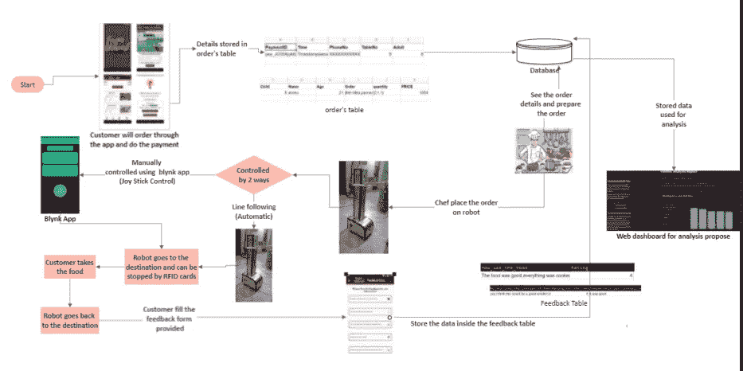

# 实现社会距离的低成本机器人服务员框架的开发(一)

> 原文：<https://medium.com/nerd-for-tech/development-of-a-low-cost-robotic-waiter-framework-for-achieving-social-distancing-part-1-27c489d75cd5?source=collection_archive---------2----------------------->

近年来，各行各业对自动化的痴迷与日俱增。然而，由于新冠肺炎的巨大影响，这种愿望逐渐变成了人们对服务业的需求。

在医疗保健行业，需要服务机器人来帮助减少由于直接接触而导致的从患者到医院工作人员的感染传播。医院员工可以专注于高优先级的任务。

在酒店行业，继新冠肺炎之后，有多种理由选择自动化。由于疫情，许多餐馆老板在反弹后也吃了不少苦头。根据[1],由于社交距离等措施，全球餐厅的入座率下降了 30%。第二，劳动力成本逐渐上升，疫情大规模裁员造成劳动力短缺，迫使人们寻找其他工作。第三，由于近年来人们换工作越来越频繁，餐馆老板总是很难找到和培训新员工。

这个项目是关于一个低成本的服务机器人框架(foronic 炼金术士 1.0)，它可以解决服务行业成本高以及劳动力短缺的问题。这种低成本的服务机器人也可以部署在医院中，为病人提供药物和食物，以避免与病人直接接触。通过使用这个框架，餐厅将只需要几个员工来协助机器人。

服务员机器人的使用在亚洲的餐馆达到顶峰。在中国上海的一家酒店，他们使用了由 Keenon Robotics 开发的服务员机器人。工作人员过去常常将包装好的饭菜放入机器人服务员中，然后机器人与 covid 患者一起进入房间，它会走到房间并发出通知来取饭，他们也在医院使用这种机器人，这消除了人与人之间的接触[9]。2021 年 6 月，在日本东京的一家咖啡馆里，他们用真正的人形机器人端菜[10]。在韩国首尔的必胜客店里，他们正在测试一款名为 Dilly Plate 的机器人服务员，这款机器人是由 Woowa Brothers 公司开发的，未来将会推出，以使服务更加方便。在新加坡，一家海鲜餐厅部署了机器人，每年花费 17000 美元。在印度，泰米尔纳德邦、喀拉拉邦和卡纳塔克邦、安得拉邦等邦也在餐馆里放置了机器人来提供食物，在 COVID 提供非接触式服务。Vo Nhu Thanh [2]设计并提出了一种依赖于跟随其运动的线的解决方案。在微控制器 PIC18F4550 上实现了直线跟踪算法。机器人感知并跟踪线路，以到达所需的桌子。超声波传感器用于障碍物检测的解决方案中，该传感器的输出负责在碰撞前停止运动，并能够说出简单的句子。Shruti BP 等人[3]设计了一个由有机发光二极管屏幕、4*4 键盘和 WIFI 模块组成的解决方案。解决方案中部署了节点 MCU，用于 WIFI 控制。顾客可以使用安装在机身上的键盘/遥控器下订单。Dheeraj Salgotra 等人[4]提出了一种基于物联网的半自主解决方案。他们使用 Arduino 作为微控制器，字段映射是为了避免表格混淆。Neeti Malik 等人[5]展示了一种解决方案，即部署一个线跟随驱动器和红外传感器。一个液晶显示屏安装在机器人的身体上，用于下单。还使用了射频技术。Salmiya Afsheen 等人[6]提出了一种由 LCD 屏幕、键盘(4*3)和蓝牙模块组成的下单解决方案。本解决方案使用 Arduino atmega328p。红外传感器用于障碍物检测。Anjali M. Yelasange 等人[7]开发了一种使用 raspberry pi 作为微控制器的解决方案。超声波传感器用于障碍物检测。液晶显示屏是用来下订单的。Tajima MD. Niamat Ullah Akhund 等人[8]提出了一种能够循线和避障的解决方案。它使用射频识别技术来确定送货地点。所有数据都存储在云数据库中。

## 拟议框架

提议的系统在设计时考虑了社会距离和成本等变量，因此即使是小餐馆经营者也可能使用它。参考图 3，客户最初进入餐厅并坐下，桌子上有一个可以扫描的 QR 码，它重定向到 Play Store。因此，当客户最初进入餐厅并坐下时，桌子上有一个二维码，可以扫描该二维码，它会重定向到 Play Store。接下来，你必须下载并注册该应用程序，提供您的电话号码和餐桌号码等信息，然后使用 UPI 或卡支付。该数据库包含有关客户订单的所有信息。厨师还可以检查订单细节，准备订单，并将饭菜放在机器人提供的盘子上。然后可以用两种方式控制机器人。第一种是通过 Blynk 应用程序，它需要餐厅工作人员的帮助，使用操纵杆控制移动。第二，它可以利用线跟踪自动操作，这可以在自助餐系统中使用，客户可以使用 RFID 卡停止机器人。到达地点后，机器人会欢迎客户，客户会收到订单，机器人会返回厨房。接下来，向客户发送反馈表，并记录客户的反馈。对反馈进行数据分析，利用 FP growth 将其转化为相关信息，辅助餐厅改进系统。

框架流程图

在第二部分，我们将讨论机器人及其功能。