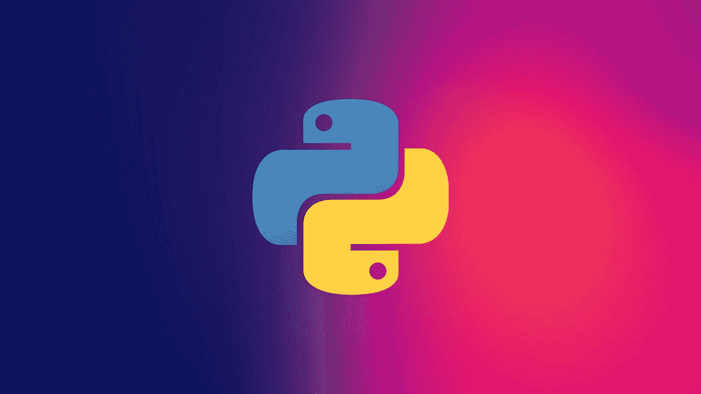

# Python 中的字典

> 原文：<https://medium.com/nerd-for-tech/dictionaries-in-python-c8e7a9743358?source=collection_archive---------9----------------------->



# 注意:

在开始这门课之前，推荐看[初学 Python(Part-](https://www.decodebuzzing.com/learn-python-for-beginners-part-2/)[2](https://www.decodebuzzing.com/learn-python-for-beginners-part-2/)[)](https://www.decodebuzzing.com/learn-python-for-beginners-part-2/)课程

# 所以现在让我们开始吧

## Python 字典及其函数

那么 python 中的字典是什么呢？让我们把字典想象成我们在日常生活中使用的字典，其中有一个单词(键)及其含义(值)。所以 python 字典有点类似，我们可以存储键值对，而不是像其他数据结构那样存储单个元素。
字典是一个可变的(可以改变的)有序数据结构，它是一对两个值:
键和值。

## 钥匙

键是 python 中的唯一标识符，用于从 python 的字典中获取一个条目。字典中不能有两个相同的键。如果添加代表不同值的键，将会覆盖以前的值。但是你可以用不同的大小写创建两个相同的键。

## 价值

在字典值中，我们可以存储字符串、整数、列表，甚至字典(嵌套字典)。与键不同，字典值可以相同。

现在让我们来了解如何制作一本字典:

# 创建字典

可以通过使用大括号( *'{}'* )来创建字典，其中有键-值对。

## 句法

```
mydict = {key:value}
```

现在让我们*创建一个字典:*

现在让我们添加一个字典作为字典中的值(嵌套字典):

*在这里，我们创建了一个变量“NestedDict ”,它是一个字典，有一个键“A ”,这个键有一个值“B ”,它也是一个字典，包含更多的键值对*

现在让我们学习如何访问它的项目:

## 访问字典项目

现在您可能已经猜到，为了获得字典的条目，我们使用方括号( *[]* )中的关键字名称(就像我们使用 List 中的索引一样)。现在让我们访问上面的字典条目。

## 访问嵌套字典项目

访问嵌套字典的元素几乎与访问简单字典中的条目一样。就像我们使用方括号(其中有键)从简单的字典中获取条目一样，这里我们改为再添加一对括号(其中有嵌套字典的键)来获取嵌套字典的元素。

如您所知，字典是可变的(可以更改),所以现在让我们看看如何向字典添加元素:

# 向词典中添加条目

我们可以很容易地将一些条目添加到字典中，方法是在定义好的字典周围放上方括号，在方括号中添加一个键名，当然后跟一个值。需要注意的重要一点是，如果您添加了一个元素，但是如果它的键已经存在于字典中，那么它将被替换(覆盖)

# 句法

```
MyDict["key"] = "Value"
```

让我们用代码给这个字典添加一些元素:

现在，您将如何向嵌套字典中添加条目:

## 将字典添加到嵌套字典中

这里需要注意的重要一点是，当向嵌套字典添加条目时，与我们向字典添加条目时不同，嵌套字典应该在字典中。*向嵌套字典添加元素的语法如下:*

```
mydict["AlreadyAddedKey"]["key"]=["value"]
```

我们可以将一个字典添加到一个嵌套的字典中，方法是在方括号中添加已经添加的键(我们希望在其中放置这个字典),后面是我们的自定义键和值。我知道你不能理解它，所以让我们看看它的代码

现在，在这之后，让我们了解如何从列表中删除项目

# 从字典中移除项目

从字典中删除条目非常简单，可以通过两到三种方式完成:

*   *弹出*
    删除指定键值的项目

```
*myDict = {
  "FirstName":"John",
  "Grade":"1st",
  "LastName":"abc"
}**myDict.pop("Grade")**print(myDict) # {'FirstName': 'John', 'LastName': 'abc'} (No Grade key)*
```

*   *Del 关键字*
    *Del 关键字也用于带有特定值的 pop 项*

```
*myDict = {
  "FirstName":"John",
  "Grade":"1st",
  "LastName":"abc"
}*del myDict["Grade"]print(myDict)
```

# 从嵌套字典中移除项目

使用 del 关键字也可以从嵌套字典中删除元素。唯一的区别是，我们必须添加另一对方括号来定义嵌套值的键。下面是它的语法

## 句法

```
del MyDict[key][nestedKey]
```

## 密码

现在，让我们来看看👀python 中的一些字典方法:

# 字典方法

Python 有一套非常有用的内置方法:

*   **Copy**这个方法返回字典的一个副本。那么， ***当我们使用=赋值运算符*时有什么区别呢？**

当我们使用复制方法时，我们创建了一个与原始字典相同的新字典。它不会修改原始字典。

赋值运算符(=)不会创建新对象，而是引用原始对象。所以当我们用' = '改变变量时，它会影响原来的对象。所以，如果我们创建一个指向我们的字典的变量，当我们修改它的时候，它会修改原来的字典

现在让我们在代码中使用*这个复制函数:*

```
MyDict = {
    "FirstName":"Default1",
    "LastName":"Default2"
}newDict = MyDict.copy()print(MyDict) # {'FirstName': 'Default1', 'LastName': 'Default1'}
```

*   ***清除***
    从字典中删除所有条目

```
MyDict = {
    "FirstName":"Default1",
    "LastName":"Default2"
}MyDict.clear()print(MyDict) # {}
```

*   ***键***
    *返回包含所有字典键*的列表

```
MyDict = {
    "FirstName":"Default1",
    "LastName":"Default2"
}MyDict.keys() # dict_keys(['FirstName', 'LastName'])
```

*   ***值***
    *返回包含所有字典*值的列表

```
MyDict = {
    "FirstName":"Default1",
    "LastName":"Default2"
}MyDict.values() # dict_values(['Default1', 'Default1'])
```

*   ***items***
    返回一个列表，包含字典中所有值为元组的键。

元组是 python 和类似列表中的内置数据类型，它们用于在单个变量中存储多个项目。列表和元组之间的主要区别是元组是不可变的(不能改变)，而列表是可变的(可以改变)，元组使用括号“()”，而列表使用方括号。列表比元组有更多可用的方法，但是列表比元组消耗更多的内存。

```
MyDict = {
    "FirstName":"Default1",
    "LastName":"Default2"
}MyDict.items() # dict_items([('FirstName', 'Default1'), ('LastName', 'Default1')])
```

现在让我们看看如何在 python 中循环遍历字典

# 字典循环

正如我们在[循环和范围课程](https://www.decodebuzzing.com/loops-and-range/)中的“for loops”循环遍历字符串和[初学者学习 Python(第二部分)](https://www.decodebuzzing.com/learn-python-for-beginners-part-2/)课程循环遍历列表一样，现在，让我们循环遍历字典。

我们可以遍历字典，或者遍历所有的

*   键
*   价值
*   键和值

# 循环所有键

```
MyDict = {
    "FirstName":"Default1",
    "LastName":"Default2"
}
for x in MyDict.keys():
    print(x)
```

*或*

```
MyDict = {
    "FirstName":"Default1",
    "LastName":"Default2"
}
for x in MyDict:
  print(x)
```

# 遍历所有值

```
MyDict = {
    "FirstName":"Default1",
    "LastName":"Default2"
}
for x in MyDict.values():
    print(x)
```

*或*

```
MyDict = {
    "FirstName":"Default1",
    "LastName":"Default2"
}
for x in MyDict:
  print(MyDict[x])
```

# 循环访问键和值

```
MyDict = {
    "FirstName":"Default1",
    "LastName":"Default2"
}
for key,value in MyDict.items():
    print(key + ':' + value)
```

这里☝️☝️为`key`，`value`中的....意味着:对于字典中的每个`key`和字典中的每个`value`做一些事情(即打印)

*谢谢！！！*

*本帖最初发表于*[*https://www.decodebuzzing.com*](https://www.decodebuzzing.com/learn-python-for-beginnerspart-3/)