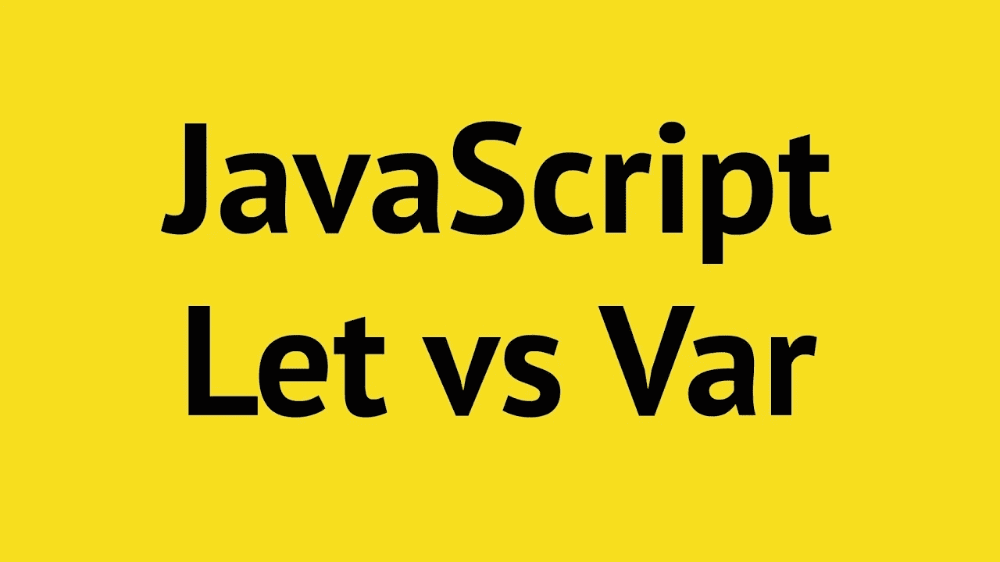

# var 和 let 之间的差异

> 原文：<https://medium.com/nerd-for-tech/difference-between-var-and-let-eff8b375a067?source=collection_archive---------22----------------------->



在 Javascript / Typescript 中经常会遇到变量声明，这里我们用 **let** ， **var** ， **const** 。这篇文章是关于 **var** 和 **let** 的用法

# Var 和 Let

Javascript，一种增加网站交互性的动态编程语言。变量用于存储不同类型的值，如字符串、数字、数组、对象、布尔值。

最常用的变量声明是 let、const 和 var。这个故事给你详细讲了一下 ***让*** 和 ***var*** 。

# 让诗句 Var:

Let & Var 两者都用于声明具有已定义或未定义值的变量。

**示例:**

```
var firstName; // undefinedvar firstName = ‘Akarsh’; // defined valuelet secondName;let secondName = ‘saraff’;
```

有什么区别？

Let 是作用域的，Var 是全局变量声明。

让我们更深入地理解上面的陈述:

```
function displayFirstName () {var firstName = “akarsh”;console.log(firstName);}displayFirstName();firstName = “saraff”console.log(firstName);
```

在上面的例子中:

第一个控制台将名字打印为 ***【阿卡什】***

第二个控制台将名字打印为***【saraff】***

所以名字可以被赋予新的值，即使它已经在***display first name***函数中声明。

让我们以 Let 为例:

```
function displayFirstName () {let firstName = “akarsh”;console.log(firstName); // logs "akarsh"}displayFirstName();firstName = “saraff”console.log(firstName); // throws error
```

在上面的例子中，**是在函数中用 ***let 声明的。*****

**当函数被外部调用时，它记录***“akarsh”。*****

**但是当第二个日志运行时，它抛出了 ***“变量未声明”*** 错误。这是因为 let 变量的范围仅限于 ***displayFirstName 函数。*** 所以我们不能在函数外访问名字。由 ***let*** 声明的变量是限定作用域的。**

**希望这有帮助！！:)**