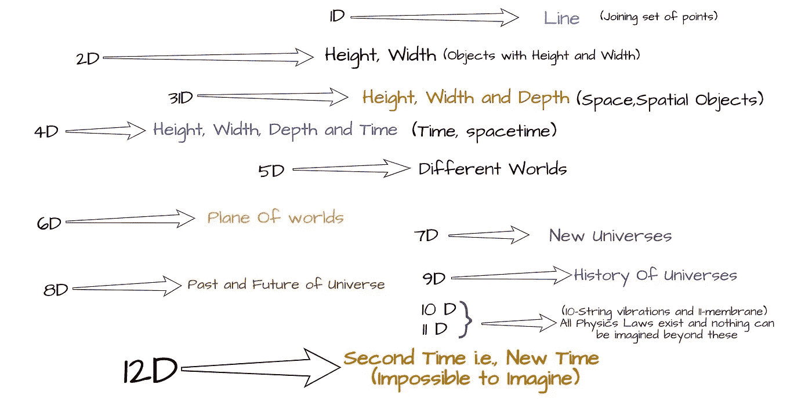
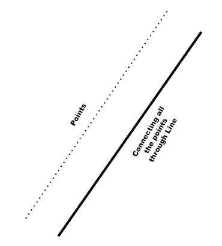
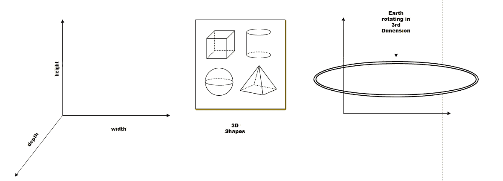
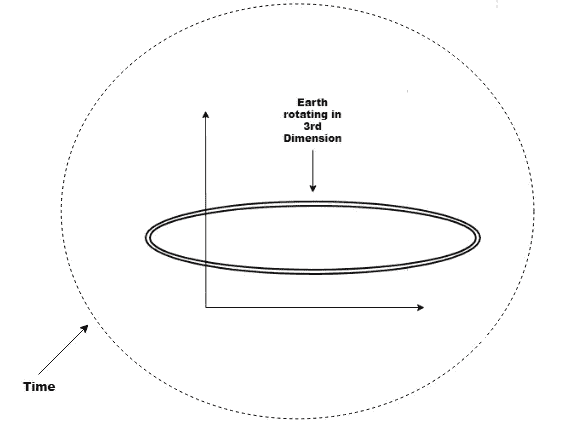
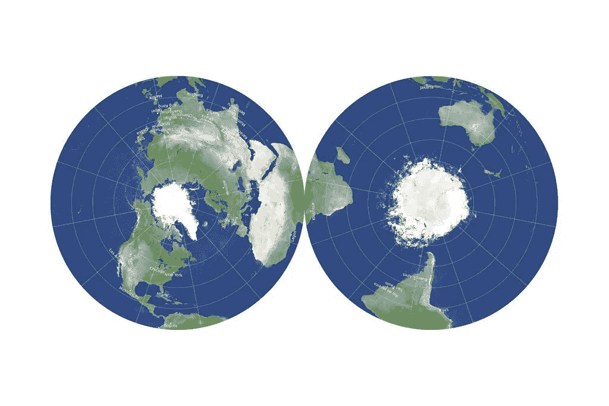
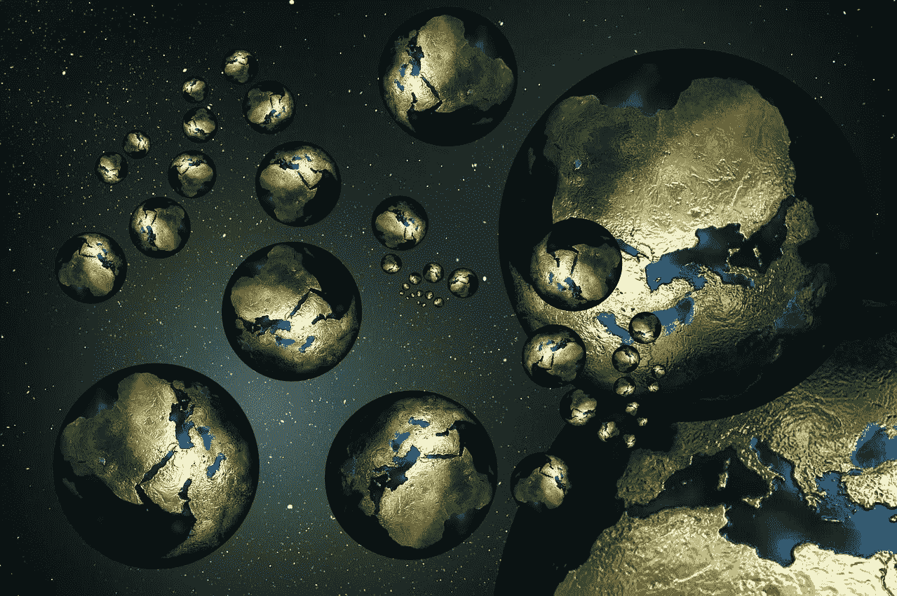
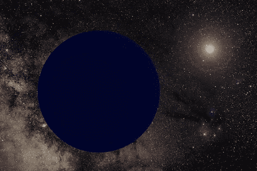

# 自然界的维度

> 原文：<https://medium.com/nerd-for-tech/dimensions-in-nature-329107ec1872?source=collection_archive---------14----------------------->

**维度如何影响世界或宇宙**

**探索多维世界**

我们需要了解宇宙中存在的维度。理解宇宙中的维度需要对天体物理学感兴趣，主要涉及空间、时间、多元宇宙或多个世界、量子力学性质、新理论的发明、物理定律等。,

我试着用一般的和较少的物理术语来涵盖尺寸，这样一个普通人应该很容易理解。

我的志向是写关于自然中的维度，因为要理解我们在哪里，我们能看见、假设、享受和体验哪些维度。量子力学性质解锁平行宇宙或多元宇宙的概念通常从第五维度开始，并引导我们以另一种方式思考我们的宇宙和现实同时存在于多个地方(使用概率概念)。

根据弦理论，在我们的创造中存在 11 个维度，在大爆炸之前这些维度是对称的，而在大爆炸之后只有 4 个维度我们可以感知，其余的都是不可感知的。

**1 维**它只是一条线，它连接所有的点，但没有宽度和高度。

**二维**:能做出平面图形的东西，包含宽度和高度。最好的例子是我们生活在二维空间。

**三维**我们存在的空间维度。最好的例子就是我们的空间。尺寸是高度、宽度和深度。我们的星球地球在三维空间中绕着自己和太阳旋转。以下是数字。

**4 维**:这是指时间，是我们存在的现实的时间维度和嵌入空间维度(3D)。时间允许改变空间的三维。在广义相对论中，时空被视为第四维。在我们的地球上，我们可以感知 3 维，体验 4 维，但不可见。

**第五维度**:从第五维度开始，假设需要理解物理上根本不可见的东西。从这里开始，多重宇宙或多重世界或平行世界基于量子物理学的性质而出现。多世界实际上是我们所能想象的最简单也是最不复杂的量子力学版本。这是世界的概率。我们世界和其他世界有显著的不同。从这个维度体验多元宇宙中的量子力学性质。

**第六维度**:这个维度是可能的新世界的平面，在这里我们可以比较和定位所有可能的世界，它们都以与大爆炸相同的初始条件开始。

请注意，第五维度和第六维度都涉及平行世界。

第七维度:在这一点上，宇宙的创造可能不同于大爆炸，也就是说，宇宙不是从大爆炸中创造出来的。这些宇宙有不同的物理定律，光速和新的力量。

**第 8 维**:这是可能的新宇宙历史平面，这样我们可以展示每个宇宙的过去和未来，这个维度无限延伸。每个宇宙都有不同的初始条件，无限分支。

**第九维**:比较所有可能的宇宙历史，无论这些宇宙是否由大爆炸产生，其中每个宇宙都有不同的物理定律和初始条件。比较不同宇宙的过去和未来。

**第 10、第 11 维度**:这些维度涵盖了一切可能和可以想象的，在这些维度之后，没有什么是可以想象的，这是我们在维度方面所能想象的自然限制。

## 我们在几个维度上？

我们生活在四维空间，我们在 2D，卫星在三维空间围绕地球旋转，在四维空间体验时间。从第五维度开始通向平行世界。

根据弦理论，我们的宇宙在 11 个维度中运作。大约 11 维我们的宇宙不会稳定。基于弦论和 M 理论等发展的理论，11 维是稳定宇宙的最低要求。

## 穿越时空？

从现在开始，我们可以通过交通工具和航班在 2D 旅行。在 3D 中，物体必须围绕某个物体旋转，就像地球围绕太阳旋转一样。在高维空间中旅行可以通过数学来证明，但是现实必须接受它，必须发展来支持这种机器。追逐自然并不简单，我们在理论上、实践上和现实中所取得的成就可能会不同，并改变生产中提出的方程式。

## 额外维度的存在？外星人

截至目前，我们人类的眼睛可以看到三维生物(生物和非生物)和更大的三维生物，我们不能看到，对我们来说不可见。正如一个普通人可以很容易理解的那样，从高维度到低维度可以很容易地看到和捕捉，低维到高维度的生物无法看到和捕捉，除非他们在同一个维度。

感谢您阅读我的文章，感谢您的反馈、评论、错误和分享。