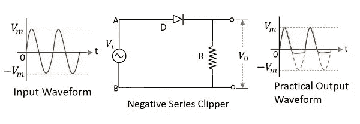
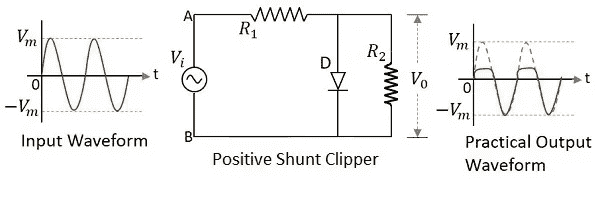
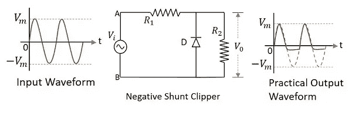

# 二极管削波电路

> 原文：<https://medium.com/nerd-for-tech/diode-clipper-circuits-843360522a19?source=collection_archive---------4----------------------->

二极管削波器(或二极管限幅器)是一种波形整形电路。它接收交流信号，并对上半部分、下半部分或两部分进行箝位。在本文中，我们将研究削波电路的类型及其工作原理。

# 1.串联削波电路

当二极管串联到交流输入电压源时，我们称之为串联斩波电路。

如果二极管以允许电流从电压源的正端流向负端的方向连接到电路，因为它不允许相反的电流流动，所以它将削波信号的负半周。正因为如此，我们称这样的电路为负削波电路。

负串联削波电路

当您以其他方式连接二极管时，它仍然与输入电压源串联，但允许电流从负端到正端流动，它将允许负半周，但限制正半周。我们称这样的电路为*正削波器*电路。

正串联削波电路

假设二极管不是理想二极管，而是阈值为 0.7V 的硅二极管，如果我们在正半周取峰值输入电压 10V，在负半周取-10V，则负串联削波器的峰值输出电压为 10–0.7 = 9.3V，正串联削波器的峰值输出电压为-10+0.7=-9.3V。

**注意:**如果你仔细阅读图形，你会发现尽管二极管限幅正或负周期，但限幅的周期不会下降到 0V。这是因为在整个周期中，二极管将收集到其阈值，*继续收集*，然后下降到负周期。如果电路中使用的二极管是理想的，那么限幅周期可以下降到 0V。

# 2.并联削波(分流)电路

当你把一个二极管和一个串联电阻并联到电压源时，你得到一个并联斩波电路。

并联斩波器的工作原理与串联斩波器非常相似，它们根据二极管的位置来削减输入信号的一半周期。在与二极管方向相反的周期中，二极管将充当开路，您必须根据现在得到的分压器电路来计算 Vout。在二极管允许的方向上的周期中，二极管将让电流流动，所以你将会以短路结束。

您可能会认为，由于存在短路，没有电流流过输出电阻，因此输出电压应该为零，对吗？不对。如果二极管不理想，在输出电阻上将有一个高达二极管阈值的电压。这是因为虽然二极管允许电流流动，但电流需要一个地方来流过，直到它超过二极管的阈值电压，即使这样，由于二极管的阈值将不断反击，等量的电压将不断在输出电阻上稳定收集。因此，您将得到以下图表:

正分流限幅器

负并联限幅器

**注意:**不管是并联削波器还是串联削波器，电路都根据其削波的周期命名为正或负。但是，如果你碰巧使用一个 DC 源，将输出源的限制设置在一个周期，它被称为正/负*偏置*并联削波器。

## 带齐纳二极管的并联斩波器

我们也可以用齐纳二极管代替普通二极管。齐纳二极管被构建为反向偏置工作，因此如果馈电电压高于齐纳二极管的阈值，它将不会像普通二极管那样在一个方向上工作，而是在两个方向上工作。

当我们在并联斩波器中使用齐纳二极管时，与二极管相同的方向会导致短路，但允许阈值电压超过输出电阻，就像以前一样。(请记住，当与电流同向工作时，齐纳二极管将像硅二极管一样工作，阈值为 0.7V)。但当工作方向与齐纳二极管相反时，我们必须检查输入电压是否大于二极管的阈值。如果是这样，那么二极管将允许电流几乎作为短路流过它，但阈值电压仍将在输出电阻上收集。因此，Vout 将仅与二极管的阈值一样高。否则，二极管将充当开路，为了计算 Vout，我们必须求解最终的分压器电路。在使用齐纳二极管的情况下，两个周期都将被限幅。