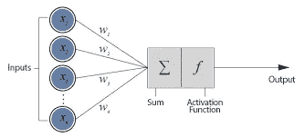
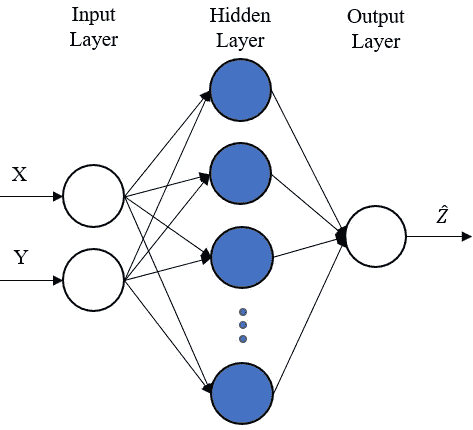
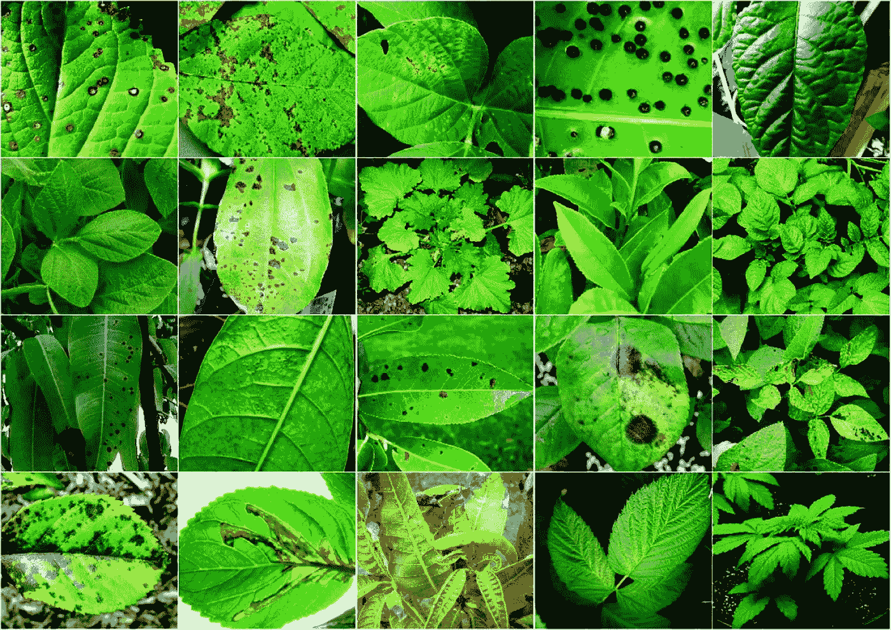

# 讨论神经网络

> 原文：<https://medium.com/nerd-for-tech/discussing-neural-networks-4627956dfeb?source=collection_archive---------15----------------------->

# 欢迎读者！

对于大多数营销人员来说，2020 年是一个…好吧，让我们说这是一个给每个人惊喜的一年。现在是 2021 年，人工智能和机器学习是这一年的流行语。它不仅仅是技术世界的互联网轰动，而且在艺术和娱乐领域开辟了新的可能性，实现了丰富而深入的互动体验。我认为编剧和导演是如何将人工智能这样复杂的东西像随意的对话一样简单地融入到戏剧中的，这令人难以置信。虽然这个词可能听起来让千禧一代和 z 世代感到害怕，但它已经使用了几十年，其应用比我们想象的更普遍。在大多数普通编码人员的脑海中，当他们听到人工智能和/或机器学习时，首先弹出的是神经网络。

带着对不同观点持开放态度的想法，联系所有的编码者和自由主义者，我欢迎你们来到我的第一个博客！

# 谈论神经网络

神经网络被设计成像人脑一样工作。它有能力通过提取模式和检测趋势来从数据中获取意义，这些模式和趋势太复杂，以至于人类或其他计算机技术都无法注意到。
神经网络有助于识别，例如，你看到一张脸，并通过分析可见的特征和模式来检测它是“女性”还是“男性”。出于对性别话题的敏感，让我非常坦率地说，假设某人的性别是跨性别的，我们永远不应该根据他们的“长相”来假设任何人的性别，因此人工智能正在研发中，以创建身体和性别识别系统之间的同步，正如 magorzata Izabela reko**博士在 [*中提到的人工智能研究领域中身体感知和性别认同的主观性*](https://www.researchgate.net/publication/343658844_The_Subjectivity_of_Body_Perception_and_Gender_Identity_in_the_field_of_Artificial_Intelligence_Research)**

**所以，基本上来说，如果你是一个伟大的模式检测者，你就有一个聪明的大脑！提供进一步的参考资料，你必须检查是关于数学家约翰·纳西，他的生活和工作在电影和书籍中有详细描述， [**【美丽的心灵**](https://en.wikipedia.org/wiki/A_Beautiful_Mind_(film))**2001 年，在电影《约翰·纳西》中有一个场景，被带到五角大楼的一个房间，展示了一面充满看似随机数字的墙。"电脑检测不出模式，但我肯定这是密码，"纳什盯着那些数字看了很久，然后转向将军。“我需要一张地图，”他说。他在图案中发现了地理信息。****

********

****约翰·纳西在五边形大屏幕后面随机抽取数字****

****《时间向前看，到 2016》从关于神经网络的电影到完全由人工智能机器人使用神经网络编写的电影[***sun spring***](https://www.thereforefilms.com/films-by-benjamin-the-ai.html)是一部宏伟的实验科幻小说，它采用了
这部电影的剧本由一个名为长期短期记忆(LSTM)的递归神经网络创作，由一个名叫本杰明的人工智能机器人编写，是世界上第一个自动编剧，它是一个在古德温和夏普构思的人类剧本上训练的自我完善的 LSTM·RNN 机器智能。它被训练写电影剧本，方法是向它提供网上找到的几十个科幻电影剧本的语料库。****

********

****本杰明的电影概要，罗斯·古德温和奥斯卡·夏普的机器人****

# ******神经网络是如何工作的？******

****神经网络由许多高度互联的元素或节点组成，称为“神经元”，它们被组织在处理信息的层中。****

********

****待识别的模式由*输入* *层*引入神经网络，其中每个神经元计算其输入的加权和——输入的权重越大，影响神经元输出的输入就越多。这个加权和然后被馈送到一个称为*激活函数*的非线性函数中——这是一个使神经网络能够模拟复杂非线性现象的步骤，并被传送到网络中存在的一个或多个*隐藏层*。所有的处理实际上都发生在隐藏层中，并且可以有多个隐藏层！****

********

****神经网络是分层组织的，一层的输入与下一层的输出相连。****

****我们用一个例子来理解这个。假设您有一组带有标签的患病和未患病作物的图像，您需要创建一个神经网络，将这两者分类到各自的类别中。****

********

****基于图像分类的植物病害检测****

****>首先将作物图像分解成像素，然后将这些像素表示为矩阵，使它们有资格进入神经网络的输入层。****

****>人工神经网络的[感知器](https://towardsdatascience.com/what-the-hell-is-perceptron-626217814f53)通过将输入从输入层传递到隐藏层并最终传递到输出层来接受和处理输入。****

****如果网络正确地对图像进行分类，则有助于正确答案的权重会增加，而其他权重会减少。如果网络对图像分类错误，则向相反方向调整权重。这个程序允许早期的神经网络以一种表面上类似于人类神经系统行为的方式“学习”。****