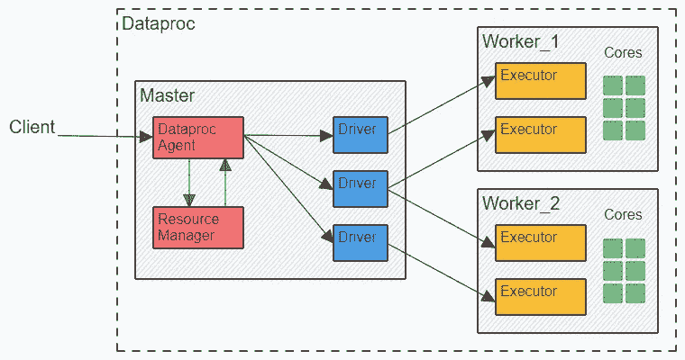

# 基于 Dataproc 的 Spark 分布式计算

> 原文：<https://medium.com/nerd-for-tech/distributed-computing-on-spark-with-dataproc-1322d8be4bc?source=collection_archive---------3----------------------->

## 了解 GCP Dataproc 和 Spark 上的分布式计算

Spark 和 Hadoop 被广泛认为是大数据处理的领先技术。在本文中，我们将探讨如何在开发周期中快速开始使用 Spark，而不必担心基础设施支持。具体来说，我们将介绍如何创建 Spark 集群、运行作业以及调度这些作业自动运行。假设您已经理解了 Spark 的必要性，并且正在寻找如何在您的工作流程中使用它的实用指南。

谷歌云平台(GCP)提供 Dataproc，这项服务包括 Spark 和 Hadoop 以及一系列其他开源工具，如 Hive、Jupyter Notebook 和 Presto。我在数据湖和数据仓库开发中使用过 Dataproc，并且发现由于它与 GCP 的集成，它是一个方便的选择。一个主要优势是我们不必处理 Spark 和 Hadoop 的操作支持，因为所有的配置和工作都是用代码编写的，并存储在 Git 中。另外值得一提的是，集群创建时间相对较快，大约为 1.5 分钟。

> 为了提供实践经验，本文末尾链接的知识库中提供了代码示例。这些例子将在整篇文章中引用，并在结尾提供解释。我使用的是使用虚拟机的 Dataproc。

# 1.Dataproc 集群创建

在设置 Dataproc 集群之前，仔细考虑集群大小是很重要的，因为它会影响性能和成本。群集的成本是根据 CPU 的数量、使用持续时间以及每 CPU 小时 0.01 美元的固定费率来计算的。

优化成本的一种方法是使用自动扩展功能，该功能根据工作负载自动调整集群大小。自动缩放功能使用纱线指标(如待定内存量)来确定何时缩放集群。在配置 Dataproc 集群时，您需要考虑以下因素:

优化成本的一种方法是使用自动扩展功能，该功能根据工作负载自动调整集群大小。自动缩放功能使用纱线指标(如待定内存量)来确定何时缩放集群。在配置 Dataproc 集群时，您需要考虑以下因素:

*   [自动缩放](https://cloud.google.com/dataproc/docs/concepts/configuring-clusters/autoscaling) —如上所述，它允许您根据当前负载进行缩放，还可以定义缩放操作的力度。
*   [节点类型](https://cloud.google.com/dataproc/docs/concepts/compute/supported-machine-types) —支持所有标准机器，但实践表明您需要使用一个[定制机器类型](https://cloud.google.com/compute/docs/instances/creating-instance-with-custom-machine-type)。例如，我们对一个有 8 个 CPU 的主节点使用 50 GiB 来平稳地启动我们所有的作业。
*   [Spark](https://cloud.google.com/dataproc-serverless/docs/concepts/properties) 和 [Dataproc](https://cloud.google.com/dataproc/docs/concepts/configuring-clusters/cluster-properties) 属性——您将需要它来微调集群。我们使用 Spark 属性来定义核心和执行器的数量。
*   [初始化动作](https://cloud.google.com/dataproc/docs/concepts/configuring-clusters/init-actions) —当您需要确保缩放操作后的所有新节点都具有特定状态时，您可以使用此配置选项。它允许您在创建新节点时在新节点上执行脚本。例如，我们正在添加一个 BigQuery 连接器，它不是 Dataproc 默认设置配置的一部分。
*   [Python 包](https://cloud.google.com/dataproc/docs/tutorials/python-configuration)
*   [自动删除](https://cloud.google.com/dataproc/docs/concepts/configuring-clusters/scheduled-deletion)

shell 命令示例:

```
gcloud dataproc clusters create "${CLUSTER_NAME}" \
--project="${GCP_PROJECT}" \
--bucket="${CLUSTER_BUCKET}" \
--region="${GCP_REGION}" \
--autoscaling-policy="${CLUSTER_AUTOSCALE_NAME}" \
--master-machine-type="${CLUSTER_MACHINE_TYPE_MASTER}" \
--master-boot-disk-size=500 \
--num-workers=2 \
--num-secondary-workers=0 \
--worker-machine-type="${CLUSTER_MACHINE_TYPE_WORKER}" \
--worker-boot-disk-size=500 \
--image-version="2.0-debian10" \
--enable-component-gateway \
--optional-components="JUPYTER" \
--scopes="https://www.googleapis.com/auth/cloud-platform" \
--labels="${CLUSTER_LABELS}" \
--properties="dataproc:dataproc.logging.stackdriver.job.driver.enable=true,dataproc:dataproc.logging.stackdriver.job.yarn.container.enable=true,spark:spark.executor.cores=5,spark:spark.executor.instances=2" \
--initialization-actions="gs://goog-dataproc-initialization-actions-${GCP_REGION}/connectors/connectors.sh,gs://goog-dataproc-initialization-actions-${GCP_REGION}/python/pip-install.sh" \
--metadata="bigquery-connector-version=1.2.0,spark-bigquery-connector-version=0.21.0" \
--metadata="PIP_PACKAGES=psycopg2" \
--service-account="${CLUSTER_SERVICE_ACCOUNT}" \
--max-idle=3600s \
--quiet
```

完整片段:[https://github . com/xtrm step/data proc-distrib-comp/blob/main/src/1 _ create _ cluster/run . sh](https://github.com/xtrmstep/dataproc-distrib-comp/blob/main/src/1_create_cluster/run.sh)

这将创建一个集群，其中有一个主节点和两个工作节点`--num-workers=2`，启用了自动伸缩、BigQuery 连接器和其他日志。

# 2.提交工作

有几种方法可以向 Dataproc 提交作业，包括使用云函数、g Cloud 命令行界面(CLI)和工作流。虽然可以使用云功能来实现这一目的，但通常不建议这样做，因为这会增加系统的复杂性，并引入额外的潜在故障点。相反，在 Dataproc 中创建调度作业的推荐方法是使用工作流。我将在本文后面关于工作流和调度器的部分讨论工作流。

对于尚不需要自动化的情况，gcloud CLI 可能是提交作业的一个方便选项。gcloud CLI 允许用户通过指定所需的参数(如要使用的集群和要提交的作业文件)直接从命令行提交作业。

shell 命令示例:

```
gcloud dataproc jobs submit pyspark "${MAIN_PYTHON_FILE}" \
--project="${GCP_PROJECT}" \
--region="${GCP_REGION}" \
--cluster-labels="sdce-type=testing" \
--bucket="${CLUSTER_BUCKET}" \
--properties-file="${SPARK_PROPERTIES_FILE}" \
--async
```

完整片段:[https://github . com/xtrm step/data proc-distrib-comp/blob/main/src/2 _ run _ simple _ job/run . sh](https://github.com/xtrmstep/dataproc-distrib-comp/blob/main/src/2_run_simple_job/run.sh)

# 分布式计算

当一个作业被提交到 Dataproc 集群时，它最初由 Dataproc 代理接收。然后，代理检查可用的资源，并确定是否有集群可以承担该作业。如果找到一个合适的集群，这个任务将被传递给 Spark 进行处理。可以通过标签或名称找到聚类。



作者图片

在 Spark 中，在主节点上创建一个驱动程序流程，并将实际的处理任务分配给执行者和工作者。并行度取决于可用的内核和执行器的数量。核心对应于 CPU 资源，并受到机器上 CPU 数量的限制。作为最佳实践，建议保留一个 CPU 以满足系统需求，并将 Spark 配置为使用剩余的内核。执行器是运行在 worker 节点上的进程，负责执行 Spark 任务。它们由固定数量的内核和固定数量的内存组成。除了数据洗牌等其他因素外，调整核心和执行器的数量有助于优化 Spark 作业的性能。

为了确保任务以分布式方式执行，Spark 作业中的 Python 代码必须使用 Spark SDK 和 RDDs(弹性分布式数据集)来执行。最常用的命令是`Map().collect()`和`Foreach()`。如果在没有 rdd 的情况下使用多线程，任务将只在主节点上运行。然而，在 rdd 中使用多线程是可能的。

# 3.在执行程序上运行

为了说明如何在集群上执行作业并使用不同的工作节点，我创建了一个简单的例程，它接受一个数组，创建一个 RDD 并模拟项目的处理。在处理过程中，它会获得执行它的主机名。下面的代码做了一点修改，以显示重要的时刻。

下面是函数`process_func`如何提交给集群以处理`gcs_files`中的数据(该函数是指向另一个函数`def empty_task(filename: str)`的指针):

```
gcs_files = [f"gs://{bucket_name}/{b.name}" for b in blobs]

spark_conf = spark.getConf()
sys_cores = int(spark_conf.get("spark.executor.cores"))
sys_executors = int(spark_conf.get("spark.executor.instances"))
effective_partitions = sys_cores * sys_executors

# create a distributed dataset (RDD) to submit to Spark cluster
files_rdd = spark.parallelize(gcs_files, numSlices=effective_partitions)

# executing the method on the cluster in parallel manner
result = files_rdd.map(process_func)\
    .collect()  # this collect triggers the actual work of the Spark
```

```
def empty_task(filename: str):

    sleep(random.Random().randrange(1, 5))  # wait from 1 to 5 seconds

    result = dict(
        filename=filename,
        host=socket.gethostname(),
        started_at=started_at,
        elapsed_sec=elapsed
    )
    return result
```

作业可以这样提交:

```
gcloud dataproc jobs submit pyspark "${MAIN_PYTHON_FILE}" \
--project="${GCP_PROJECT}" \
--region="${GCP_REGION}" \
--cluster-labels="sdce-type=testing" \
--bucket="${CLUSTER_BUCKET}" \
--properties-file="${SPARK_PROPERTIES_FILE}" \
-- "${DATA_BUCKET_SOURCE}" "${DATA_BUCKET_OUTPUT}" dry 100
```

在最后一个`--`之后，你可以看到参数，其中的值`dry`对于这个例子很重要，因为它告诉作业只是为了模拟工作。您可以学习代码，并看到非模拟运行将解压文件。作业的输出显示了在哪个主机上处理了多少个项目:


完整片段:[https://github . com/xtrm step/data proc-distrib-comp/blob/main/src/3 _ run _ tasks _ on _ executors/run . sh](https://github.com/xtrmstep/dataproc-distrib-comp/blob/main/src/3_run_tasks_on_executors/run.sh)

您可以看到，所有这些资源平均分布在集群上的两台主机之间。这是因为集群上任务分配的默认逻辑是“循环”。决定这一点的火花属性是默认值为`FAIR`的`spark.scheduler.mode`。

向 Spark 集群提交作业时，了解以下参数的配置很重要:

*   `--num-executors` —集群上的执行者数量
*   `--executor-memory` —每个执行者的内存
*   `--executor-cores` —每个执行器的 CPU 数

最佳配置应该允许执行者对内核和内存的需求不会重叠。

# 4.工作流和调度程序

在现实生活中，我们希望将 Spark 作业配置为根据计划自动运行。Dataproc 没有能力配置作业并按计划运行它们。因此，为了实现期望的行为，我们需要对几个组件进行配置。

[工作流](https://cloud.google.com/dataproc/docs/concepts/workflows/overview)允许从多个作业构建 DAG，定义它们之间的依赖关系。可以指定如何为工作流选择集群以及一些其他参数。工作流程可以用 YAML 来描述。下面是 YAML 的非常简化的版本。

```
jobs:
- pysparkJob:
    args:
      - ARG1
      - ARG2
      - ARG3
      - ARG4
    mainPythonFileUri: MAIN_PY
  stepId: test_workflow-1
placement:
  clusterSelector:
    clusterLabels:
      sdce-type: testing
```

在我为这个例子准备的截图中，你可能会发现最终的 YAML 看起来会是什么样子(经过一些替换):[https://github . com/xtr mstep/data proc-distrib-comp/blob/main/src/4 _ workflows/run . sh](https://github.com/xtrmstep/dataproc-distrib-comp/blob/main/src/4_workflows/run.sh)

以下命令将创建一个工作流:

```
gcloud dataproc workflow-templates import "${WORKFLOW_NAME}" \
--project="${GCP_PROJECT}" \
--region="${GCP_REGION}" \
--source="./${WORKFLOW_NAME}.yaml"
```

当实例化时，它将使用标签`sdce-type: testing`向 Dataproc 集群提交一个作业。

[](https://cloud.google.com/dataproc/docs/concepts/workflows/overview) [## Dataproc 工作流模板概述| Dataproc 文档| Google 云

### Dataproc WorkflowTemplates API 为管理和执行工作流提供了一个灵活易用的机制…

cloud.google.com](https://cloud.google.com/dataproc/docs/concepts/workflows/overview) [](https://cloud.google.com/dataproc/docs/concepts/workflows/use-yamls) [## 将 YAML 文件用于工作流| Dataproc 文档| Google 云

### 您可以在 YAML 文件中定义工作流模板，然后实例化该模板以运行工作流。你也可以…

cloud.google.com](https://cloud.google.com/dataproc/docs/concepts/workflows/use-yamls) 

工作流不可能指定一个调度器，所以一些触发器应该实例化工作流。使用 GCP API 是可能的。触发器可以使用调度程序调用 API，GCP 提供了服务云调度程序来完成这一任务。

[](https://cloud.google.com/dataproc/docs/tutorials/workflow-scheduler) [## 使用云调度程序的工作流| Dataproc 文档| Google 云

### 目标:创建一个运行 Spark PI 作业的 Dataproc 工作流模板，创建一个云调度程序作业来启动…

cloud.google.com](https://cloud.google.com/dataproc/docs/tutorials/workflow-scheduler) 

以下命令将创建一个调度程序:

```
gcloud scheduler jobs create http "${WORKFLOW_NAME}" \
--project="${GCP_PROJECT}" \
--location="${GCP_REGION}" \
--schedule="0 0 1 * *" \
--uri="https://dataproc.googleapis.com/v1/projects/${GCP_PROJECT}/regions/${GCP_REGION}/workflowTemplates/${WORKFLOW_NAME}:instantiate?alt=json" \
--http-method=POST \
--max-retry-attempts=1 \
--time-zone=Europe/Sofia \
--oauth-service-account-email="${CLUSTER_SERVICE_ACCOUNT}" \
--oauth-token-scope=https://www.googleapis.com/auth/cloud-platform
```

您可能会注意到 API 是如何被用来实例化 Dataproc 工作流的。参数`--uri`包含端点，而`--oauth-service-account-email`和`--oauth-token-scope`用于指定将用于调用 API 的服务帐户。参数 schedule 定义了一个标准的 cron 调度来执行和调用 API，该 API 将实例化工作流和相关联的作业。

这种方法只有一个问题:不可能指定允许多少个相同工作流的并行执行。如果您希望一次只运行一个工作流实例，那么这种方法应该由您来开发。例如，我们在第一个作业执行的开始额外注册工作流，并在最后(在最后一个作业中)取消注册它。这允许我们检查某个工作流是否正在运行。

完整片段:[https://github . com/xtr mstep/data proc-distrib-comp/blob/main/src/4 _ workflows/run . sh](https://github.com/xtrmstep/dataproc-distrib-comp/blob/main/src/4_workflows/run.sh)

# 5.SparkSQL

我的存储库还包含一个 SparkSQL 的例子，对于那些 Python 不像其他团队那样常见的团队来说，这可能很方便。基本上，如果您想保持 DBA 的技能集不变，但允许他们使用 Spark，SparkSQL 将允许您实现这一点。可以在 PySpark 中提交纯 SQL 或使用 SQL 语法，这在进行复杂转换时会很有用。例如，下面的代码执行相同的任务，但是使用 fluent API 和 SQL 编写。

流畅的 API:

```
def execute_py(number_of_records, session):
    raw_df = session.read.csv(Settings.BUCKET_INPUT, header=True)\
        .filter(F.col("uri_path").endswith('.sgml')) \
        .withColumn("parth_parts", F.split('uri_path', '/')) \
        .withColumn("path_idx_1", F.col('parth_parts').getItem(4)) \
        .withColumn("path_idx_2", F.col('parth_parts').getItem(5)) \
        .withColumn("rn", F.row_number().over(pss.Window.partitionBy('path_idx_1').orderBy('path_idx_2'))) \
        .filter("rn == 1") \
        .select("_time", "uri_path") \
        .limit(number_of_records)
    return raw_df
```

SQL:

```
def execute_sql(number_of_records, session):
    session.read.csv(Settings.BUCKET_INPUT, header=True).createOrReplaceTempView("raw_df")
    session.sql(f"""
        CREATE OR REPLACE TEMPORARY VIEW transformed_df
        AS
        WITH
            raw_data AS (
                SELECT
                    *,
                    SPLIT(uri_path, '/')[4] AS path_idx_1,
                    SPLIT(uri_path, '/')[5] AS path_idx_2
                FROM raw_df
                WHERE uri_path LIKE '%.sgml'
            )
            ,ordered AS (
                SELECT
                    *,
                    ROW_NUMBER() OVER(PARTITION BY path_idx_1 ORDER BY path_idx_2 DESC) AS rn
                FROM raw_data
            )
        SELECT _time, uri_path FROM ordered WHERE rn = 1 LIMIT {number_of_records}
    """)
    df = session.table("transformed_df")
    return df
```

您可能会注意到 SQL variant 更干净，可读性更好。

完整片段:[https://github . com/xtrm step/data proc-distrib-comp/blob/main/src/5 _ spark SQL/run . sh](https://github.com/xtrmstep/dataproc-distrib-comp/blob/main/src/5_sparksql/run.sh)

# 包含代码片段的存储库

我的存储库包含所有脚本和附加信息，呈现在`readme.md`文件中。您可能会在 Bash 脚本`run.sh`的存储库中找到几个“步骤”，但是它们是按照所有脚本都位于同一个文件中的想法创建的。因此，如果您通过将每个`run.sh`文件的内容复制到同一个终端并一个接一个地执行它们，它们将会工作得很好。这将确保环境变量被定义并具有正确的值。

最后，第 6 步有清洗命令。他们正在删除在之前步骤中创建的所有对象。最后，一些费用可能会被计入你的 GCP 账户，大约 10 美元或更少。

[](https://github.com/xtrmstep/dataproc-distrib-comp) [## GitHub-xtrm step/data proc-distrib-comp:讲座“了解 GCP…

### 数据:2022 年和 2021 年的 EDGAR 日志文件数据集。桶中文件的总解压缩大小:62.04 GiB GCP…

github.com](https://github.com/xtrmstep/dataproc-distrib-comp)