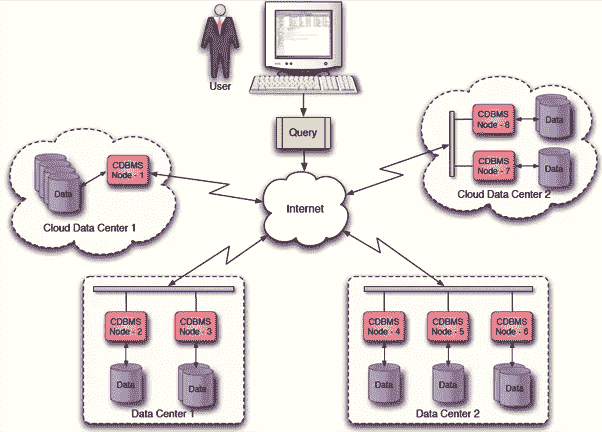
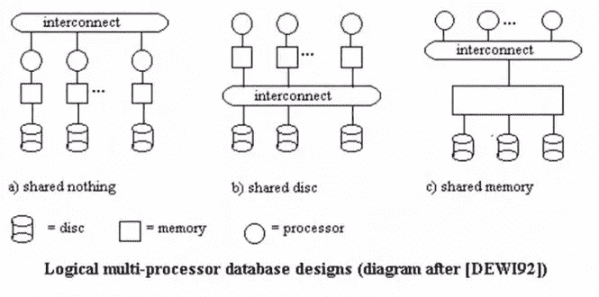
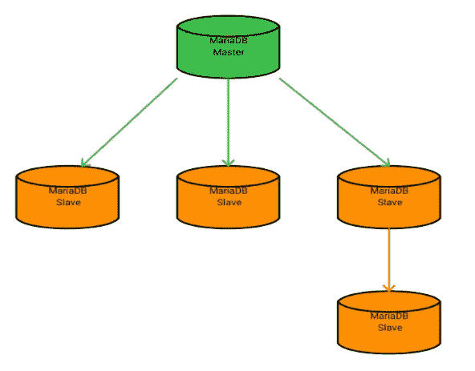
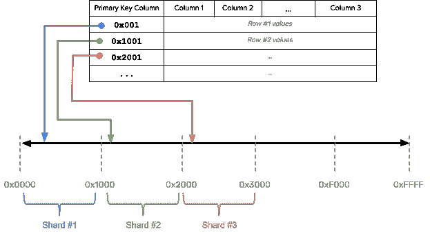

# 分布式数据库什么，为什么，为什么不？

> 原文：<https://medium.com/nerd-for-tech/distributed-databases-what-why-why-not-683024bbcd1d?source=collection_archive---------0----------------------->

# 什么是分布式数据库？

> 分布式数据库系统是将属于一个逻辑数据库的数据分布到两个或更多的物理数据库中，以保证可靠性和可用性

您可以使用许多不同的系统架构将数据分布在多个节点上

## 碎片存储器

CPU 可以通过快速互连访问公共内存地址空间。

*   每个处理器都有所有内存中数据结构的全局视图。
*   处理器上的每个 DBMS 实例都必须“知道”其他实例。

## 碎片光盘

所有 CPU 都可以通过互连直接访问单个逻辑磁盘，但每个 CPU 都有自己的私有内存。

*   可以独立于存储层扩展执行层。
*   必须在 CPU 之间发送消息以了解它们的当前状态。

## 没有碎片

每个 DBMS 实例都有自己的 CPU、内存和磁盘。节点只能通过网络相互通信。→难以增加容量。→难以确保一致性。→更好的性能和效率。

# 分布式数据库的类型

## 分身术

数据库复制可用于提供具有数据库后端的容错。数据库复制的实现成本相对较低。你不需要专门的硬件或软件。您只需要确保您的数据库平台支持它。您还需要确保应用程序以有利于复制的方式存储数据。在数据库复制中，数据自动从一个数据库复制到另一个数据库。在数据库复制中，通常有一个发布者和一个订阅者。发布者是保存数据主要副本的数据库。订阅服务器通过从发布服务器复制数据来获取信息。

## 分片

分片是将大表分割成更小的块的过程，这些块被称为分片，分布在多个服务器上。碎片本质上是一个水平的数据分区，它包含整个数据集的一个子集，因此负责服务整个工作负载的一部分。这个想法是将单个节点无法容纳的数据分布到一个由数据库节点组成的集群上。分片也称为水平分区。水平和垂直之间的区别来自于数据库的传统表格视图。数据库可以垂直拆分，即在单独的数据库中存储不同的表列，也可以水平拆分，即在多个数据库节点中存储同一表的行

# 为什么使用分布式数据库

**提高可靠性和可用性**
可靠性基本上定义为系统在某个时间运行的概率，而可用性定义为系统在某个时间间隔内持续可用的概率。当数据和 DBMS 软件分布在几个站点时，一个站点可能会出现故障，而其他站点会继续运行，我们不能只访问出现故障的站点上的数据，这基本上会提高可靠性和可用性

## 更好的反应

如果数据以高效的方式分布，那么用户的请求可以从本地数据本身得到满足，从而提供更快的响应。另一方面，在集中式系统中，所有查询都必须通过中央计算机进行处理，这增加了响应时间。

## 模块化开发

如果该系统需要扩展到新的地点或新的单位，在中央数据库系统中，这一行动需要大量的努力和对现有功能的破坏。然而，在分布式数据库中，这项工作只需要将新的计算机和本地数据添加到新的站点，并最终将它们连接到分布式系统，而不会中断当前的功能。

## **减少网络上的数据移动**

关系的副本越多，在事务执行的地方找到所需数据的机会就越大。因此，数据复制减少了站点之间的数据移动。增加。处理速度。

## ***较小的数据库更容易管理***

对于常规备份、数据库优化和其他常见任务，必须对生产数据库进行全面管理。对于单个大型数据库，如果仅从完成所需的时间窗口来看，这些例行任务可能很难完成。例行的表和索引优化可以从几个小时延长到几天，在某些情况下使得定期维护变得不可行。通过使用分片方法，可以独立地维护每个单独的“碎片”,提供一个更易于管理的场景，并行地执行这样的维护任务。

## ***数据库越小越快***

分片的可伸缩性是显而易见的，并且是通过在网络中的多个分片和服务器上分配处理来实现的。不太明显的事实是，每个单独的碎片数据库将优于单个大型数据库，因为它的大小更小。通过将每个分片数据库托管在自己的服务器上，磁盘上的内存和数据之间的比例得到了适当的平衡，从而减少了磁盘 I/O 并最大限度地利用了系统资源。这减少了争用，提高了连接性能，加快了索引搜索，减少了数据库锁。因此，分片系统不仅可以扩展到新的容量级别，单个事务的性能也会受益。

## ***数据库分片可以降低成本***

大多数数据库分片实现都利用了低成本的开源数据库和商用数据库。该技术还可以充分利用许多商业数据库的价格合理的“工作组”版本。分片适用于商用多核服务器硬件，与高端多 CPU 服务器和昂贵的存储区域网络(San)相比，这些系统的价格要低得多。与传统解决方案相比，由于节省了许可费、软件维护和硬件投资，总体成本降低了 70%。

# 为什么不使用分布式数据库

分布式数据库不是银弹，没有一种技术可以解决所有问题。数据库领域也不例外。如果您的数据可以放在一个 MySQL 实例上而不会给服务器带来太大压力，或者如果您对复杂查询的性能要求不高，那么分布式数据库可能不是一个好的选择，因为:

## 需要复杂而昂贵的软件

DDBMS 需要复杂且通常昂贵的软件来提供跨多个站点的数据透明性和协调。

## 处理开销

即使是简单的操作也可能需要大量的通信和额外的计算，以提供跨站点的数据一致性。

## 数据完整性

在多个站点更新数据的需要带来了数据完整性的问题。

## 不适当的数据分发的开销

查询的响应性在很大程度上取决于正确的数据分布。不适当的数据分发通常会导致对用户请求的响应非常缓慢。

## ***处理故障是一项艰巨的任务***

在某些情况下，我们可能无法区分站点故障、网络分区和链路故障。

## ***可能会造成更多的网络流量***

在分布式数据库的复制形式的写操作的情况下

# 分布式数据库的例子

虽然有许多分布式数据库可供选择，但分布式数据库的一些示例包括 Apache Cassandra、Apache HBase、Couchbase Server、Amazon SimpleDB 和 FoundationDB。

## 阿帕奇卡桑德拉

提供对跨多个位置的集群的支持，它有自己的查询语言，Cassandra 查询语言(CQL)。此外，Cassandra 的复制策略是可配置的。

## Apache HBase

运行在 Hadoop 分布式文件系统之上，并提供一种容错方式来存储大量稀疏数据。它还具有压缩、内存操作和逐列 Bloom filters 功能。尽管 Apache Phoenix 为 HBase 提供了一个 [SQL](https://searchsqlserver.techtarget.com/definition/SQL) 层，但 HBase 并不是 SQL 数据库的替代品。

## Couchbase 服务器

是一个 NoSQL 软件包，非常适合通过创建、存储、检索、聚合、操作和呈现数据来为多个并发用户提供服务的交互式应用程序。为了支持这些应用程序需求，Couchbase Server 提供了可伸缩的键值和 JSON 文档访问。

## 亚马逊 SimpleDB

被用作亚马逊弹性计算云和亚马逊 S3 的 web 服务。Amazon SimpleDB 使开发人员能够以最少的数据库管理和管理责任来请求和存储数据。

## 基础数据库

是一个围绕核心数据库设计的多模型数据库，它为每个事务公开一个有序的键值存储。这些事务支持 ACID 属性，并且能够读写存储在集群中任何机器上的密钥。附加特征出现在围绕该核心的层中。

# 结论

在这篇文章的最后，这些是一些阅读和获得更多知识的资源，我将在未来发布更多与这个主题相关的帖子

分布式数据库系统

[分布式数据库介绍](https://15445.courses.cs.cmu.edu/fall2019/slides/22-distributed.pdf) (CMU 数据库集团)

[了解数据库分片](https://www.digitalocean.com/community/tutorials/understanding-database-sharding)

[数据库复制](https://www.nakivo.com/blog/how-to-configure-ms-sql-server-replication-walkthrough/)