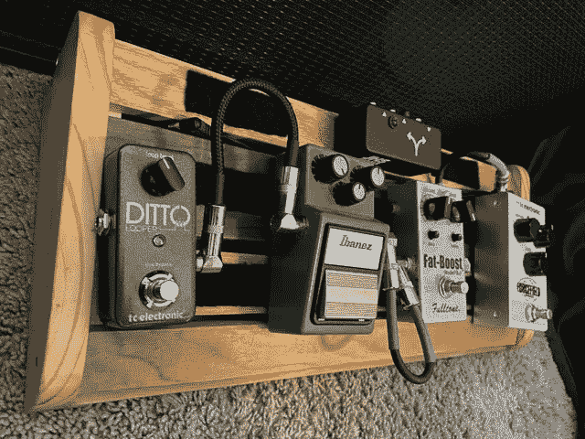

# 因为你喜欢，所以去做

> 原文：<https://medium.com/nerd-for-tech/do-it-because-you-love-it-38b44501b7f1?source=collection_archive---------3----------------------->

一年前，我在一个幸运饼干里得到了一笔财富，上面写着“因为你喜欢而去做。”我首先想到的是，这是有史以来最糟糕的运气。当时我没多想，但我还是保留了这张小纸条。

首先，我想说这不是一篇关于如何开始一个成功的开源软件项目的文章。这不是一个技术讨论，也不是对我的项目中的技术的解释。我想分享我的故事，希望它能帮助其他开始从事软件行业的人迈出他们自己的一大步，并从我的经历中学习。

# 我的故事

我一直对技术感兴趣。当我还是个孩子的时候，我玩化学玩具(危险的那种)并且痴迷于乐高。我的父亲是光学物理学博士，拥有大量的出版物和专利，这是我对工程感兴趣的重要原因。我选择在大学学习航空航天工程，因为它听起来最酷(确实如此)。快进到我职业生涯的第十年，我可以说我很幸运能和那些在飞机和火箭方面非常聪明的人一起工作在一些惊人的项目上。

一架波音 757 的发动机，当时他正在为 Timco 航空系统公司(现称 HAECO 美洲公司)进行飞机改装项目。

那么为什么是软件呢？我发现如今软件在工程中是不可避免的。但是，如果使用得当，它可以让任何人的职业生涯受益。这是一个解决问题的工具，可以增强你最重要的工具的能力:你的大脑。

慢慢地，不情愿地，我开始学习更多的软件技能，从 Matlab(与其说是编程语言，不如说是工程工具)开始，然后开始尝试 Python 和 c++。我对它非常感兴趣，最终我在公司找到了一份正式的软件开发工作。我接触了当前的软件过程和工具，比如敏捷、git、docker 容器和 web 框架。有人让我看到了 Github.com，这在 2020 年对我来说是全新的，如果这能告诉你什么的话(Github 始于 2008 年)。

在继续我在 Github 上的冒险之前，你需要了解我的另一部分，那就是我热爱创作音乐。我小时候上过钢琴课，但直到 13 岁拿起电吉他，我才找到了毕生的爱好和激情。高中时，我曾有过在大学学习音乐的想法，但在父母和其他人温和的建议下，我决定转而学习工程学。

我的 DIY 吉他踏板和踏板

回顾过去，我可以追溯从我生命中的人到我今天的位置，但当你生活在其中时，这些线很难看到。我写这个主要是讲一个故事，但在这里我会给出我个人的职业建议。我把自己放在那里，遇见人们，了解和理解人们是我时间最有价值的用途。谁知道当我决定不伸出手或不花时间开始交谈时，我错过了什么机会！听比说更有价值。

# 飞跃

我的项目开始的背景是这样的:2020 年疫情的夏天，大部分时间在家工作，已婚，有两个孩子，第三个随时会出生。这是开始一项耗时的、非盈利的、我一无所知的事业的最佳时机！我们刚刚让 5 岁和 3 岁的孩子睡了一会儿，我坐在沙发上，手里拿着手机，漫不经心地在网上冲浪。我可能是在寻找继《虎王》之后网飞的下一个狂欢节目。

这是我的下一个想法:伙计，如果能像以前一样拿出我的吉他和扩音器，那就太好了。也许学一首新的齐柏林飞船的歌或者一些布鲁斯音乐。我怎样才能不吵醒孩子们呢？我对软件略知一二…我想知道写一个吉他插件会有多难。然后我可以戴上耳机，打开它。谷歌谷歌谷歌……哦，所以有一个叫做 JUCE 的框架来做所有繁重的工作。酷毙了。让我们看看 Github 上有什么…哦，一个使用神经网络的吉他插件项目？我必须更多地了解这项我一无所知的技术！

我掉进了兔子洞。

我将简单解释一下吉他插件是做什么的。这是一个你可以“插入”数字音频工作站(DAW)的软件，就像录音棚里使用的那种。它的作用类似于放大器或效果器，因此当您将电吉他插入电脑的音频接口时，您可以听到扬声器或耳机发出的声音。也许你想添加一些失真，或混响，或任何数量的效果，使它听起来很好。我在过去录制过一些业余歌曲，所以我对这部分很熟悉。

我发现的开源项目是“WaveNetVA”，这是芬兰阿尔托大学声学实验室的一项非常酷的研究成果。在他们的出版物中，他们描述了使用各种人工智能模型来复制吉他放大器和踏板的失真声音的过程。他们还使用实时运行的 JUCE 框架创建了一个可玩的插件。

 [## damskagep/wave netva

### 用于黑盒虚拟模拟建模的前馈波网这个代码与我们提交给 SMC 2019 的论文有关…

github.com](https://github.com/damskaggep/WaveNetVA) 

在 Github(顺便说一下，Github 是一个托管软件项目的网站)上进一步搜索后，我找到了第二个项目，名为“pedalnet”，它使用 PyTorch(一种人工智能框架)从研究论文中独立地重新创建了训练代码。您可以将声音模型应用到音频文件中，但是您不能从电吉他上实时播放它。

在对这两个代码库进行了一些学习和尝试之后，我想知道让这两个代码兼容有多难。这样，我可以使用我自己的吉他踏板/放大器，并创建它们的数字声音模型。为什么我要花时间学习一个新的复杂的过程来创建我已经拥有的放大器和踏板的模型？因为我本质上是个书呆子，这就是书呆子做的事情。

问题是训练代码库使用了一个框架(Pytorch)，而实时代码使用了另一个框架(Tensorflow)，这两个框架不容易兼容。此外，模型必须按照插件设计的方式进行训练，但事实并非如此。当在插件中玩的时候，非常小的差异会打乱整个模型。如果可能的话，需要一些非常系统的代码研究来找出如何将它们匹配起来。

我不能夸大 Github 上许多开发者的慷慨。我不知道会遇到什么，而且我通常回避在线论坛和类似的事情。但是当我联系这些代码库的创建者时，他们慷慨而耐心地帮助我做我想做的事情。

我花了几个月的时间研究代码，测试想法，听着耳机里可怕的静电噪音，但最终我破解了代码。我不会进入技术细节，但在整个过程中，我已经决定放弃两次，并写了大约二十页的笔记，只是试图追溯代码，并找出声音是如何流经每一行的。我提到过我以前从未做过音频或人工智能软件吗？当我终于弹了吉他，我的 TS9 电子管的高音踏板发出了美妙的清脆的中音时，我默默地把手举在空中，跳起了欢快的舞蹈，小心翼翼地不吵醒我的(现在已经 3 岁了)孩子们。

从那里，我决定清理代码，并把它放在 Github 上。人们肯定会和我一样对此感到兴奋。你可以录制一个吉他放大器或效果(花费数百或数千美元)并使用计算机将声音提取到一个小的文本文件中的想法对我来说就像魔术一样。我还学习了更多关于 JUCE 插件框架的知识，并制作了一个看起来像真正的吉他放大器的用户界面。两个现有项目的许可证允许其他人使用他们的代码，但我确实与所有者进行了核实，并确保在我的项目中引用他们的工作。从技术上讲，我的贡献只不过是在他们的代码上添加了一个转换脚本和一个漂亮的界面，这是最重要的。

以下是我的 SmartGuitarAmp 项目，这是目前我在 Github 上发布的最受欢迎的代码库:

 [## GuitarML/SmartGuitarAmp

### 用 JUCE 制作的吉他插件，使用神经网络模型来模拟真实世界的硬件。在 YouTube 上观看视频演示…

github.com](https://github.com/GuitarML/SmartGuitarAmp) 

# 几乎(互联网)出名

事实证明，在互联网上发布无人知晓的酷代码不会让你一夜成名。谁知道呢？但我确信，如果人们了解它能做什么，他们会感兴趣的。

大多数工程师都不知道如何营销某样东西，我也不例外。我决定制作一些插件的视频(用我的手机)放到 YouTube 上。我在 Reddit 上发布了一些(对我来说也是全新的)，并获得了一些关注。有些人似乎对我的项目比我更感兴趣，他们帮助改进代码并自己运行测试。

这是我的第一个 SmartGuitarAmp 插件演示视频:

我的代码最受关注的事情是在一个名为 Hacker News 的网站上发布，但我认为这更多的是一种侥幸，是运气(也许还有一些遗憾)让它成功了。我刚接触这个网站，心想，嘿，这就像免费广告。所以我做了一个非常引人注目的标题“通过使用深度学习，GitHub 上的免费吉他插件听起来像 600 美元的电子管放大器”。这在技术上是正确的，因为它是以我的 Fender Blues Jr. amp 为模型，带有花呢外壳，其建议零售价为 600 美元。黑客新闻的用户比我预期的更有眼光，我很快为我的项目辩护，并了解到我违反了在他们网站上发帖的一些核心规则。因为所有人都在发帖说我违反了规则，这篇文章的分数上升了，所以它成为了所有访问该网站的人的首选。由于所有这些流量，我的 Github 项目从 5 星上升到超过 500 星(星很大程度上决定了人们在 Github 上偶然发现你的项目的难易程度)。到那天结束的时候，我的项目 SmartGuitarAmp 已经有超过 10，000 次点击，我的 YouTube 链接演示有 5，000 次观看。我从来都不是一个在乎“观点”或“喜欢”的人，但我觉得那天我学到了一些关于营销的东西。我学到的是:我对市场营销一无所知。

这是黑客新闻上的帖子:

 [## 展示 HN:用深度学习制作的智能吉他插件|黑客新闻

### 现在最流行的吉他放大器都是固态的，但是内部计算机将吉他信号数字化，然后…

news.ycombinator.com](https://news.ycombinator.com/item?id=24740266) 

# 吉他 ML

当然，一旦人们真的在使用我的软件，他们就开始发现错误，或者能在我的电脑上工作但不能为他们工作的东西。或者只是他们想让我添加的东西。或者比我能想到的更聪明的主意。我很快感到不知所措，不知道自己需要解决什么问题。我也开始研究另一种训练模型的方法，这种方法要快得多，我可以说完全是我自己的。

我的个人邮箱和 YouTube 账户收到了来自对我的项目感兴趣的人们的大量反馈。我甚至得到了工作机会和对商业机会感兴趣的人(有些甚至是合法的！).我不得不拒绝他们，因为我有限的空闲时间和对航空航天/软件工作的承诺(我仍然非常喜欢这份工作，而且没有离开的打算)。

我想创建一个我可以保持独立的名称，同时也让人们可以很容易地将这些项目组合在一起。我不太记得是怎么做到的，但我想到了“GuitarML”这个名字，其中 ML 代表“机器学习”。我做了一个标志，一些社交媒体也为它做了说明。一个非常慷慨的人很早就对这个项目表现出兴趣，他担心我没有获得网站的域名，他们甚至购买了域名并转让给我。所以我为 GuitarML 做了一个简单的网站。谢谢大家！(你知道你是谁)。

 [## 吉他 ML

### 吉他音乐吉他音乐机器学习看看宣布 SmartAmpPro 唱片的 SmartAmp

guitarml.com](https://guitarml.com/) 

我还开始开发我的第二个插件，旨在解决第一个插件的问题:提高 CPU 使用率，将模型训练集成到插件中，并加快训练速度。使用 SmartGuitarAmp，培训是一个单独的代码库，需要 8 个多小时才能完成。与其他插件相比，CPU 使用率也非常高，在低端计算机或非英特尔 CPU 的情况下，无法实时使用。我也决定把 Ai 框架从 PyTorch 换成 Tensorflow。它似乎有更多的支持，并且有了 Keras 后端，编写高级代码变得非常容易。

通过使用不同的深度学习模型，训练速度和 CPU 使用任务成为可能。我发现了一个被称为 LSTM(长短期记忆)的模型类型的例子，在研究论文中提到它更快，与最初插件使用的 WaveNet 相反。通过大量的测试、重新测试和在线社区的帮助，我能够结合卷积层和 LSTM 层创建一个可用的插件。在我有限的业余时间里，整个过程又花了几个月的时间来开发。在那段时间里，我买了一台二手的 Macbook，这样我就可以为苹果电脑开发和制造产品。这只是我第二次投资这个项目(380 美元)，第一次是一个吉他踏板，它可以分离信号，以捕捉创建模型所需的声音(80 美元)。

最终结果没有我希望的那么低的 CPU 使用率，但是比第一个插件要好。训练时间减少到只有几分钟，但声音质量不如 WaveNet 的 8 个多小时。最重要的是，在我的代码中有一个错误，我最初解释为底层模型不起作用。我几乎放弃了整个项目，但幸运的是我决定坚持下去，最终的声音仍然非常好。我决定以“SmartAmpPro”的名字发布它，因为我很难想出名字。

 [## GuitarML/SmartAmpPro

### 用 JUCE 制作的吉他插件，使用神经网络模型来模拟真实世界的硬件。这个插件使用了 LSTM…

github.com](https://github.com/GuitarML/SmartAmpPro) 

我立即得到回应，综合培训并不是对大多数人都有效。问题的一部分是弄清楚如何下载和安装 Tensorflow 依赖项。对于不熟悉命令行界面的人来说，这并不简单。第二个问题是，当插件试图运行外部应用程序时，不同的 Daw(录音软件)表现不同。我还在努力解决这个问题。目前这个插件处于“预发布”阶段。GuitarML 网站上没有，但是任何人都可以从 Github 发布页面下载。

关于这个项目最好的部分是，我真的很喜欢使用我创造的东西。我喜欢拉起它，在我的吉他上尝试不同的声音。其他人已经创建了他们自己的放大器和踏板的模型，并发送给我，这是这个项目非常有益的一个方面。我知道玩一个 Revv G3 失真踏板听起来是什么感觉，尽管我没有，因为别人拿起我的代码，认为值得一试。(Revv G3 是 SmartAmpPro 代码中的“RevvvItUp.json”型号)

 [## 转速放大 G3 超速和失真踏板

### 转速放大 G3 超速和失真踏板

Revv 放大 G3 过驱动和失真 Pedalwww.amazon.com](https://www.amazon.com/Revv-Amplification-G3-Overdrive-Distortion/dp/B07M8GLVPN) 

我收到的最酷的东西是有人把他们自己的放大器改装成新的东西，并用我的代码训练了一个模型。现在，我可以通过我的插件播放他的放大器，尽管它实际上是世界上唯一一个这样的放大器(这是 SmartGuitarAmp Tonepack 中包含的“Dynabright”型号)。模型的声音质量可能有所不同，但对于干净和低失真的声音，它是原始硬件的近乎完美的匹配。

这是到目前为止的故事。我花了 10 个月，460 美元，花了数百个小时，但在我的任务清单上仍然有许多错误和改进。但是我不会改变任何事情，因为我喜欢这样做。几周前我发现那笔财富埋在我的梳妆台上。“因为热爱而去做。”那不是一笔财富。但事实证明这是个很好的建议。

如果你想支持我的工作，可以考虑加入我的[***pat reon***](https://www.patreon.com/GuitarML)*为我的插件做幕后软件开发和神经网络放大器/踏板模型。*