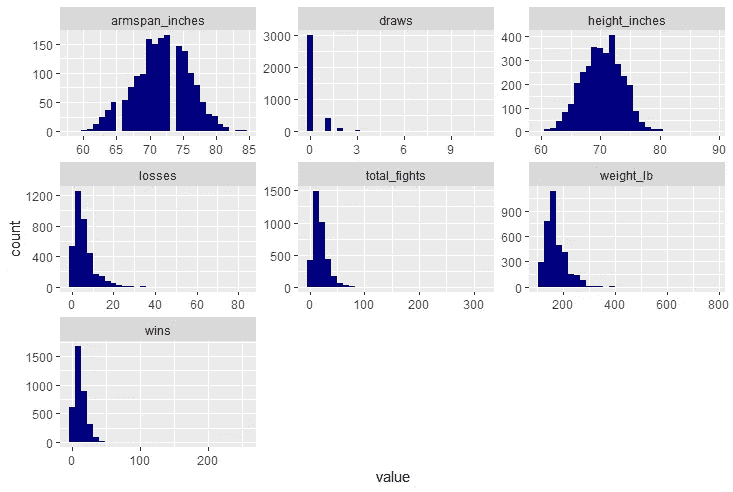
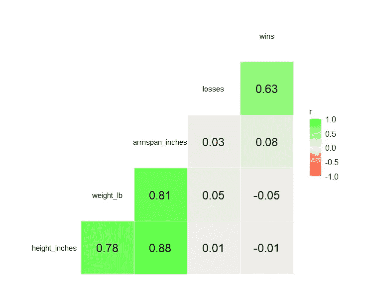
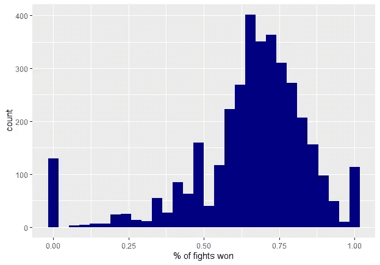
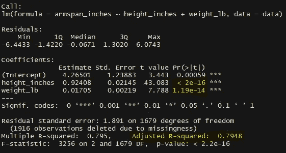

# 手臂越长的 MMA 拳手是否会赢得更多的打斗？(第三部分)

> 原文：<https://medium.com/nerd-for-tech/do-mma-fighters-with-longer-arms-win-more-fights-part-3-4cbbf8003fd1?source=collection_archive---------8----------------------->

# 分析干净的数据

在三部曲的第一部分[，我向你展示了如何从 UFCstats.com 收集 MMA 战斗机的数据。](https://thomas-richie-richardson.medium.com/do-mma-fighters-with-longer-arms-win-more-fights-part-1-963dfca02a3a)[在第 2 部分中，我向您展示了我将如何清理它](https://thomas-richie-richardson.medium.com/do-mma-fighters-with-longer-arms-win-more-fights-part-2-d08dbf13e5ca)，使它适合于分析。最后，在第 3 部分中，我们将开始分析。

在我们开始之前:如果你从一开始就遵循了，你将已经收集了你自己的 MMA 数据。因为你会在不同的一天刮到我，你会有稍微不同的数据:一些战士会赢得战斗，其他人会失败。一些新的战士将被添加到表中，一些可能已经被删除。你的数字会和我的略有不同。如果它们完全不同，很可能是你做错了什么。如果你*确定*你已经做得很好，并且仍然得到完全不同的结果，我想知道！MMA 随着时间而变化，所以它最终很可能会发生。

# 我们开始吧

首先，加载包

```
library(‘ggplot2’)
library(‘magrittr’)
library(‘tidyr’)
library(‘dplyr’)
library(‘broom’)
library(‘modelr’)
library(‘purrr’)
library(‘GGally’)
```

这可是好多包啊！ggplot2 可生成报告图表，magrittr 为我们提供了管道(%>%)，tidyr 和 dplyr 用于方便的数据操作，broom 允许我们将多个回归输出转换为易于阅读的表格，modelr 允许我们从回归模型输出中轻松提取残差，purrr 用于绘制多个直方图的代码，而 GGally 用于制作相关图。

使用以下代码读入您的数据:

```
data = read.csv(‘UFC_data_cleaned.csv’)
data %<>% select(-X)
data %>% str()
data %>% head(20)
```

**str()** 告诉我我们有 12 个变量，3598 个战士， **head(20)** 让我们快速看一下数据是什么样子的。

## 探索性分析:直方图

接下来我们使用几年前我在网上找到的一些代码，并且一直使用至今。它为数据集中的所有数值变量制作直方图。它非常灵活，可以复制并粘贴到任何项目中，并且可能会工作。我在所有的数据探索中使用了它。

```
data %>% 
 keep(is.numeric) %>% 
 gather() %>%
 ggplot(aes(value))+
 facet_wrap(~key,scales=’free’)+
 geom_histogram(fill=’navy’)
```

我们获取数据，保留数字变量，将所有这些变量收集到一个列中，然后调用 ggplot，告诉它为每个方面制作一个单独的直方图。在这种情况下，我们所说的面是指变量。如果有人有更简单的方法，我很想看看！



因此，看起来非常大的值给我们看起来奇怪的直方图！似乎有少数拳手有很高的胜率、败率，结果是总的战斗次数。让我们看看这些:

```
data %>% filter(total_fights >= 100)
```

我们过滤所有拥有 100 场或以上战斗的战士。


有些拳手的战斗次数非常多！

## 探索性分析:相关性分析

让我们探索我们的变量如何与相关图相关联

```
data %>% 
  select(height_inches, weight_lb, armspan_inches, losses, wins) %>% 
  ggcorr(label = T, label_size = 6, label_round = 2,
    low = 'red', high = 'green',
    method = c('pairwise','spearman'),
    name = 'r', legend.size = 12)
```

我们**只选择()**我们想要的变量，然后用 **ggcorr()** 做一个相关图。 **Label = T** 表示增加相关系数，设置 **label_size** 为 6 给了我一个好看的图(不同的数字可能对你更好),而 **label_round** = 2 表示我们希望相关系数精确到小数点后两位，这是通常的标准。**低**和**高**指定我们希望负相关和正相关采用的颜色；我把负相关设为红色，正相关设为绿色，因为这对我来说很直观。**方法**参数有两个部分，其中第二部分非常重要:我们告诉它绘制 Spearman 相关性，而不是默认的 Pearson 相关性。这是因为皮尔逊相关性受极端值的影响更大(就像我们在第 2 部分看到的 770 磅战斗机！).斯皮尔曼的相关性可以处理极值。 **Name** 设置图例的标题， **legend.size** 不言自明。这里有很多可以玩的东西，所以我鼓励你改变一些东西，看看它们如何影响剧情！



两件事引起了我的注意:

首先，身高、体重和臂展都是高度相关的。这是有道理的:更高、更重的人有更长的手臂。这些都是某种“大”的量度。这意味着，如果我们想知道臂展是否会影响获胜的数量，这种相关性并不是一个好的衡量标准，因为臂展与身高和体重之间存在 T21。我们需要建立模型来观察臂展的影响，同时消除身高和体重的影响，我们在下面用多元回归来做。

第二，赢的次数和输的次数在 r = 0.63 时高度相关。这是因为大部分打架次数多的拳手，随着时间的推移，输赢都会累积。这可能会给我们的分析带来一个问题:战士们可能会因为打了很多场比赛而获得很多胜利。我们想看看胜利的数量，同时考虑战斗的数量。

## 特征工程:创建 win_percentage 作为战斗能力的度量

一种方法是计算获胜的百分比。我们定义了一个叫做 *win_percentage* 的新变量，它是赢的次数+平局次数的一半，除以总的比赛次数。这样平局也算半个赢。

```
data$win_percentage <- 
(data$wins +(0.5*data$draws)) / data$total_fightsdata%>% ggplot(aes(x = win_percentage))+ geom_histogram(fill = 'navy')
```



看起来获胜的百分比大部分是正态分布的，但有 0(即输掉所有战斗的战士)和 1(赢得所有战斗的战士)的起伏。

## 臂展、身高和体重

从上面的相关性中我们可以看出，臂展、身高和体重都是相互关联的。我们可能想知道的一件事是身高和体重是否与臂展唯一相关。可能身高和臂展有联系，身高和体重有联系，但是臂展和体重没有联系。我不清楚为什么更重也意味着更长的手臂。也许体重和臂展之间的相关性是*虚假的*，仅仅是因为它们与身高的共同关系。为了区分这些，我们进行了多重回归测试，看身高和体重是否能预测臂展。

对于 r 中的线性和多元回归，我们使用 **lm()** 函数，并用 **summary()** 显示结果。

```
lm(armspan_inches~ height_inches + weight_lb, data = data) %>% summary()
```

我们得到这个(我用黄色突出了重要的部分):



p 值表明身高和体重都与臂展有唯一的关系。这意味着，如果我们让所有的人都一样高，较重的人可能会有更长的手臂，如果我们让一群体重相同的人，较高的人会有更长的手臂。正如系数所示:身高增加 1 英寸，臂展增加 0.92 英寸。体重每增加 1 磅，臂展就会增加 0.017 英寸。调整后的 R 平方告诉我们，身高和体重一起解释了臂展变化的 79%，这是一个很大的数字！如果我们知道某人的身高和体重，我们就能相当准确地说出他们的臂展。

这个分析也告诉我们，要确定臂展真的与战斗能力有关，我们需要控制身高和体重。否则，我们可能会得出结论，臂展与战斗能力有关，而实际上是身高和/或体重造成了这种影响。

# 手臂较长的拳手会赢得更多比赛吗？

我们准备解决我们的主要问题。我们拟合多元回归，其中响应变量(或因变量，它们的意思基本相同)是 *win_percentage* ，我们的预测因子(或自变量)是*臂展、身高*和*体重。*

我们必须控制体重的另一个原因是因为拳手在重量级比赛。如果康纳·麦格雷戈有 81%的胜率，那只能告诉我们，与同等重量的拳手相比，他是个好拳手。不知道他是否有能力对抗重量级选手。因此，将战斗机与和他们体重相近的其他战斗机进行比较才有意义。控制体重使得臂展的效果代表了更长手臂的效果*假设所有拳手体重相等*(嗯，有点复杂)。

```
main_model = 
lm(win_percentage ~ armspan_inches + height_inches + weight_lb, 
data = data)tidy(main_model, conf.int = T) %>% 
   select(-statistic) %>%  
   rename(Predictor = term, 
         Coefficient = estimate, 
         `Standard error` = std.error
          )
```

这一次，不仅仅是用 **summary()，**打印我们的模型，让我们用… **tidy()** 来整理它！这将我们的回归表变成了一个数据框架，因此我们可以很容易地操作它。conf.int = T 意味着我们希望我们的系数有 95%的置信区间。我们使用 **rename()** 来重命名列，使表格更容易阅读。


你应该得到这样的东西。我们查看 p 值部分，发现只有臂展的影响是< 0.05\. The others are not. This suggests that only armspan has a statistically significant effect on win percentage: height and weight do not have independent effects on the percentage of fights a fighter wins. You can also see this in that the confidence intervals for the effect of armspan do not contain 0, whereas the confidence intervals for the other effects do contain 0.

However, looking at the coefficient, it seems that the effect of armspan is small. Increasing armspan by 1 inch increases the percentage of fights won by 0.005 or 0.5%. Still, that might be big if fighter vary by 10 or 20 inches in their armspan. To get a feel for the real world size of the effect, let’s take all the fighters with a weight of 155lb and find the longest and shortest armspan.

```
data %>% 
filter(weight_lb == 155) %>% 
summarise( max(armspan_inches, na.rm = T),    
           min(armspan_inches, na.rm = T)
          )
```

summarise allows us to apply multiple functions to a dataset, in this case, **max()** 和 **min()** 。因为有些拳手的臂展是 na，所以我们必须告诉 max 和 min 在他们行动时移除这些 NA，我们用 **na.rm = T.** 来做

我们发现 155 磅的人最长的臂展是 80 英寸，最短的是 64 英寸，差别相当大。我们预计长臂战斗机的胜率为 16 x 0.005 = 0.08 或高 8%！因此，虽然对于大多数拳手来说，臂展的影响很小，但在一些极端情况下，它可能会产生很大的影响。

# 结论

所以看起来手臂更长的拳手确实赢得了更多的比赛！这不仅仅是因为它们更大。事实上，看起来高个子战士赢得更多战斗的唯一原因是因为他们的手臂更长:当臂展也在模型中时，身高对胜率没有独特的影响。

谢谢你跟了我这么久！我希望你已经从这三部曲中学到了一些东西，无论是网络抓取、数据清理、数据分析还是制作图表。如果你对这些数据做了其他分析，请告诉我！我很想看看你在做什么。谢谢！