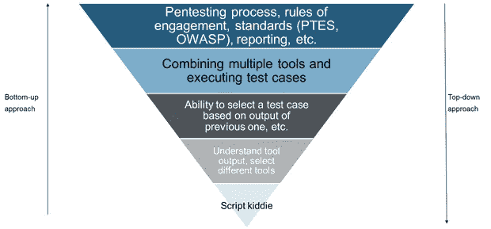

# 不要为了很少或没有附加值而扼杀你的 pentester

> 原文：<https://medium.com/nerd-for-tech/do-not-kill-your-pentester-for-little-or-no-value-add-431b84ef597?source=collection_archive---------4----------------------->

声明:这将是一个很长的帖子(许多旧帖子的高潮),有很多不同的观点和想法。如果编织不正确，请提供反馈，说明如何纠正。

我有幸阅读了几位先生写的[语丝](https://www.linkedin.com/posts/activity-6607883158127943680-3vjZ/)中的[对](https://www.linkedin.com/feed/update/urn%3Ali%3Aactivity%3A6616997749445455872/)的文章，我尊重他们的基础建议。他们的帖子引发了我的一些想法，这些想法是我在几篇旧帖子中记下的。所以我试着把它们编成一个帖子。

这些想法是我自己的，因此，可能读起来有点跑题。这不是科学帖，是我的观察。你已经被警告了。

我把我的想法分成三个部分。他们是

1.  技术
2.  人
3.  过程

## 技术

渗透测试(或 pentesting)随着技术的发展而发展。nmap-metasploit-jackpot 的早期时代已经过去了(尽管我有一种挥之不去的感觉，即并非每个组织都是如此)。防御变得越来越聪明(EDR，更好的防火墙)。尽管更多的术语已经进入市场(红队、入侵和攻击模拟、基于智能的渗透测试等)。)，实现还没到大众。

## 人

假设有一些与测试相关的知识，有两种方法可以实现它——自顶向下或自底向上。BoK 没有变，只有获得它的方法变了。方法取决于你的大脑学习事物的方式。

高级别测试 BoK

自上而下的人总是从高层看问题，然后一步一步往下走。例如，一个负责学习测试的自上而下的家伙几乎总是从 BoK 的外围开始(测试的过程，不同的方法，测试的类型，高级执行方法，等等。这种类型的思维适合从中层到高层管理人员，因为这种思维过程支持基于抽象的思维。这些人通常会以某种方式收集他们的想法，以便出版一本书。

现在，如果你要求一个自上而下的人去:-

*   执行技术渗透测试(我说的不是你的 nmap-metasploit 类型)；
*   解释为什么必须使用特定的 nmap 交换机；
*   通过阅读没有任何动手元素的书来学习东西；
*   论证不同防火墙规避策略的区别等。

一个自底向上的家伙总是从弄脏自己的手开始(运行工具而不是浏览手册页)。然后，慢慢地，这个人会开始挑选不同的工具，运行它们，然后将它们组合在一个脚本中。了解每个工具的输出后，将会执行全面的项目。这些人在一段时间内积累了大量的知识和智慧，但是把它们组织成一本书——对不起！这些人没有耐心把一本书从头到尾看完，更别说设计出版了。

现在，核心渗透测试仪通常是自下而上的类型。这意味着如果你要求他们这样做，你就是在自找灾难

*   准备一份执行摘要，供执行人员/决策者使用
*   将他们的调查结果/漏洞与任何特定的风险管理标准(如公平、ISO 27001 等)结合起来。)
*   进行风险评估。
*   解释 CVSS v2 和 v3 的区别

另一个需要思考的问题是——在哪里使用臭虫赏金猎人和圣灵降临者？

TLDR——到达“未知的未知”后，使用虫子赏金猎人。有关更多详细信息，请参见下面的“时机必须正确”小节。

## 过程

这就是我们需要解决问题的地方。在这种程度上，我同意这里提出的大多数观点。以下是我对格雷格观察的评论

> *向右看，但总是向左看*

圣灵降临节既是一场进攻，也是一场个人战斗。制定交往规则是最难做对的事情之一。两个 pentester(我是不是事半功倍？)和客户(我是不是得到的越来越少？)与之搏斗。虽然客户不想被黑客攻击，但他们也不想让自己系统经受苛刻的测试，因为他们担心系统会崩溃。他们只是希望 pentester 通知他们任何漏洞，而不是利用它，以便他们可以关闭它。然而，pentester 经常不能正确地传达它，如果不尝试破坏，他们就不知道是否存在漏洞！这是订婚后长期存在的一种两难处境。

这个问题导致了合同中含糊不清的语言，这成为了很多令人心碎和半途而废的结果的原因。然而，主要是因为订婚没有考虑周全。

如果您希望识别更多的漏洞，请向您的渗透测试人员提供信息，并允许他们破解这些信息以进行测试。

> 检查里面，不只是外面

我同意格雷格的观点。仅仅在外围进行测试并不能[帮助](https://www.peerlyst.com/tags/help)了解一家公司的安全状况。内部测试也需要进行。这将有助于理解当内部凭证/系统遭到破坏时会发生什么影响。一旦有效的广告凭证被泄露，对手就可以获得更多的信息。

> 时机必须正确

我认为，从安全态势的角度来看，每个公司都会经历这些阶段(基于对乔哈里窗口(【https://en.wikipedia.org/wiki/Johari_window】T2)的松散解读)

**已知的已知者(他们知道自己有问题，其他人也知道)**

这一领域的公司知道他们必须大大改善他们的安全状况，并了解要关注的主要领域(充分了解漏洞必须大量存在)。此外，他们的外部环境也存在问题(泄露信息、密钥、访问等)。).彭斯特的梦遗。这些公司应从定期扫描其基础架构开始(由外向内，即先外围后内部)，重点是内部化补丁程序管理(基础架构、应用程序，尤其是第三方应用程序，如 Java、Adobe 等。).不要梦想得到红队/紫队的参与。你不会得到你应该得到的那么多好处，因为你不会让那些红队队员得到更多。

**已知未知(他们知道自己有问题，但其他人还不知道)**

大多数公司都属于这一类。他们了解应该保护的关键资产，并在这些资产中或周围实施了控制措施。然而，他们不确定这是否就是全部。另外，这些问题大多存在于内部环境中。这些公司应该有一个涵盖外围(范围内没有网络钓鱼)的红队项目，再加上全年的内部测试。

**未知的未知(他们不知道自己有问题，其他人也不知道)**

它可能是最危险的(如果公司没有一个决策者认为安全至少应该是决策会议的一个议程点)或公司生命中最成熟的状态，这取决于各种因素。

*   如果是前者，ISO 27001(由优秀的顾问领导)应该是一个不错的选择，因为它将自上而下地启动安全流程的制度化。好的顾问是必不可少的，因为这将是一个优秀的 ISMS 提供价值和一个拙劣的决定因素。ISMS 实现是我最喜欢的一个话题，稍后会详细介绍。
*   如果是后者，他们应该雇用红队队员和漏洞赏金猎人，每个季度专注于一个领域(例如，网络钓鱼、外部防火墙旁路、物理安全、链接多个漏洞以访问公司关键数据等)。).

> **需要与高级控制保持一致，以提供一种安全感**

我在以前的文章中也一直这么说。自上而下的方法(治理、保证、审计)和自下而上的方法(与安全相关的常规内务处理活动)都有价值。一个不能离开另一个而存在。自上而下和自下而上的人在决定安全评估部分之前需要折中。想象一下这个(某种理想的场景):-

*   CISO 咨询公司让内部审计师设定 RFP 的范围，让供应商进行年度渗透测试；
*   内部审计员设计了一套技术控制措施，与公司的安全政策/程序相对应。
*   内部审计师计划/安排他们的内部流程审计以及这些渗透测试练习；
*   技术控制提供给测试人员进行测试，以及正常的测试工作流程；
*   pentest 练习的输出(也称为调查结果)然后映射到公司的安全程序和内部审计结果，以提供公司安全状态的整体视图。

—帖子结束—