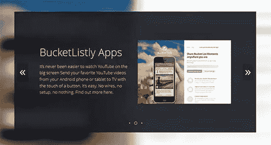

# 您想使用 JavaScript 创建自己的图像滑块吗？

> 原文：<https://medium.com/nerd-for-tech/do-you-want-to-create-your-own-image-slider-with-javascript-c6bbb76bede8?source=collection_archive---------0----------------------->

> 通常，我们会在网站上添加图片，使其更具吸引力。但是，如果我们将多个图像排成行，效率会高吗？如果没有，有没有其他方法可以出色地排列网站中的多个图片？让我们对此进行深入讨论…

# 什么是图像滑块？

目前，web 开发者倾向于使用**图像滑块**或**图像转盘**作为对此的补救。这些图像滑块，

*   增加网站的可读性。
*   为我们的网站增添色彩。
*   非常适合展示特色内容。

这是一个示例图像滑块的样子

# 为什么我们应该去定制图像滑块？

大多数情况下，如果你需要添加一个图片滑块，你可能会想到使用现有的 jQuery 插件或者类似的东西。但是在应用程序中使用的现有库和可用的插件库之间存在**代码冲突的可能性，这将**消耗更多的时间**用于修复过程。但是我们仍然能够通过使用 HTML、CSS 和 JavaScript 来实现我们自己的图像滑块。**

因此，让我们看看实现图像滑块所需的代码集。在此之前，让我们快速回顾一下什么是 HTML、CSS 和 JavaScript。

*   ***HTML*** *是一种标记语言，主要用于定义网页的内容和结构。它被认为是网页的骨架。*
*   ***CSS*** *用于指定网页的布局。*
*   ***JavaScript****用于网页的交互性和功能性。*

为了滑块的正确功能，选择相同宽度和高度的图像，并且将所有图像放在您希望保存代码工作的同一个文件夹中。

# 步骤 01

创建一个包含图像和导航按钮的 Html 文件。这里我使用了"<> "来移动图像。你可以随心所欲地使用它。

HTML 代码的基本结构

# 步骤 02

创建一个外部 JS 文件，并在一个数组中定义样本图像。

这里我使用了五张图片，你可以使用任意数量的图片。

# 步骤 03

处理导航按钮并调用相应的函数来改变图像。为标签定义一个 id 选择器。

用 HTML 代码调用函数

# 步骤 04

在 JS 中定义两个函数“上一个”和“下一个”,以便分别移动到上一个图像和下一个图像。

# 步骤 05

最后，是时候使用 CSS 以适当的方式来设计和定位我们的图像了。这里的

是滑块的主容器，而和是用来设置链接样式的。

HTML 代码

CSS 代码(这个不具体，可以随意改)

# 步骤 06

将创建的外部 CSS 和 JS 文件链接到 html，如下所示。

# 步骤 07

请务必保存您的工作，并在您的浏览器中运行 HTML 代码，以检查它是否正常工作。

这是最终输出的样子

这是创建图像滑块最简单的方式，不需要使用任何现有的库、插件，甚至 jQuery。您可以进一步改进这些代码，根据您的喜好和要求获得具有额外效果的响应图像滑块。

我希望现在已经很清楚如何用更少的努力创建你自己的图片滑块了。让我们在一篇有趣的文章中再次见面，讨论如何进一步设计和开发这个图像滑块。