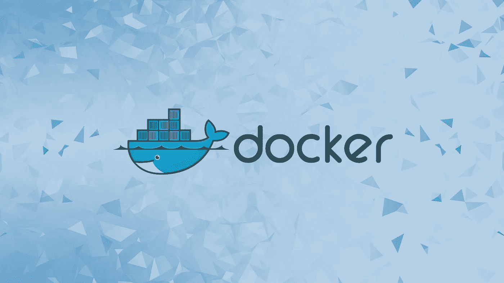

# Docker 命令(CheatSheet)

> 原文：<https://medium.com/nerd-for-tech/docker-command-cheatsheet-33edcbacdf66?source=collection_archive---------34----------------------->

By-SANDEEP KUMAR PATEL



# Docker 是什么？

Docker 是一个开源项目，可以轻松创建容器和基于容器的应用程序。Docker 最初是为 Linux 开发的，现在也可以在 Windows 和 MacOS 上运行。为了理解 Docker 是如何工作的，让我们来看看一些可以用来创建 Docker 容器化应用程序的组件。

# Docker 命令

1.  生命周期命令
2.  启动和停止容器
3.  Docker 图像命令
4.  Docker 容器和图像信息
5.  网络命令
6.  生命周期命令

# 生命周期命令

*   创建一个容器(不启动它):

```
docker create [IMAGE]
```

*   重命名现有容器

```
docker rename [CONTAINER_NAME] [NEW_CONTAINER_NAME]
```

*   在新容器中运行命令

```
docker run [IMAGE] [COMMAND]
```

*   退出后移除容器

```
docker run --rm [IMAGE]
```

*   启动一个容器并保持其运行

```
docker run -td [IMAGE]
```

*   启动一个容器，并在容器中创建一个交互式 bash shell

```
docker run -it [IMAGE]
```

*   在容器内创建、启动和运行命令，并在执行命令后移除容器。

```
docker run -it-rm [IMAGE]
```

*   在已经运行的容器中执行命令。

```
docker exec -it [container]
```

*   删除一个容器(如果它没有运行)

```
docker rm [CONTAINER]
```

*   更新容器的配置

```
docker update [CONTAINER]
```

# 启动和停止容器

*   开始容器

```
docker start [CONTAINER]
```

*   停止运行容器

```
docker stop [CONTAINER]
```

*   停止运行容器并再次启动它

```
docker restart [CONTAINER]
```

*   暂停正在运行的容器中的进程

```
docker pause [CONTAINER]
```

*   在运行的容器中取消暂停进程

```
docker unpause [CONTAINER]
```

*   阻止一个容器，直到其他人停止

```
docker wait [CONTAINER]
```

*   通过向正在运行的容器发送 SIGKILL 来终止容器

```
docker kill [CONTAINER]
```

*   将本地标准输入、输出和错误流附加到正在运行的容器

```
docker attach [CONTAINER]
```

# Docker 图像命令

*   从 Dockerfile 文件创建图像

```
docker build [URL/FILE]
```

*   从带有标签的 Dockerfile 文件创建图像

```
docker build -t <tag> [URL/FILE]
```

*   从注册表中提取图像

```
docker pull [IMAGE]
```

*   将图像推送到注册表

```
docker push [IMAGE]
```

*   用 tarball 创建一个图像

```
docker import [URL/FILE]
```

*   从容器创建图像

```
docker commit [CONTAINER] [NEW_IMAGE_NAME]
```

*   移除图像

```
docker rmi [IMAGE]
```

*   从 tar 存档或 stdin 加载图像

```
docker load [TAR_FILE/STDIN_FILE]
```

*   将图像保存到 tar 存档

```
docker save [IMAGE] > [TAR_FILE]
```

# Docker 容器和图像信息

*   列出正在运行的容器

```
docker ps
```

*   列出正在运行的容器和已经停止的容器

```
docker ps -a
```

*   列出运行容器中的日志

```
docker logs [CONTAINER]
```

*   列出 Docker 对象的底层信息

```
docker inspect [OBJECT_NAME/ID]
```

*   列出容器中的实时事件

```
docker events [CONTAINER]
```

*   显示容器的端口映射

```
docker port [CONTAINER]
```

*   显示容器中正在运行的进程

```
docker top [CONTAINER]
```

*   显示容器的实时资源使用统计

```
docker stats [CONTAINER]
```

*   显示文件系统中文件(或目录)的变化

```
docker diff [CONTAINER]
```

*   列出 docker 引擎本地存储的所有图像

```
docker [image] ls
```

*   显示图像的历史

```
docker history [IMAGE]
```

# 网络命令

*   列出网络

```
docker network ls
```

*   删除一个或多个网络

```
docker network rm [NETWORK]
```

*   显示一个或多个网络的信息

```
docker network inspect [NETWORK]
```

*   将容器连接到网络

```
docker network connect [NETWORK] [CONTAINER]
```

*   断开容器与网络的连接

```
docker network disconnect [NETWORK] [CONTAINER]
```


# 谢谢你…占用你的时间…...！！！！！！！！！！