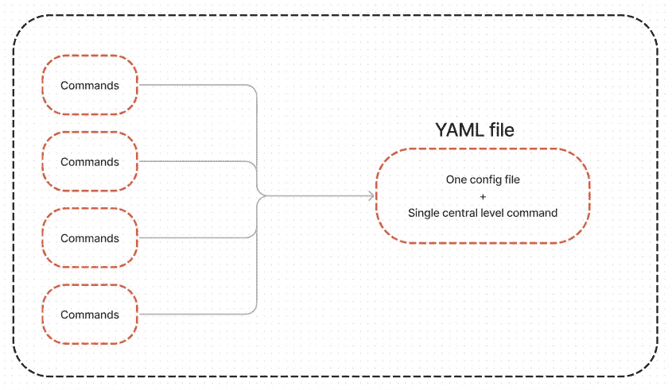

# Docker 撰写

> 原文：<https://medium.com/nerd-for-tech/docker-compose-ef04b31f5388?source=collection_archive---------2----------------------->

我们基于 docker build、docker run、-v、-p 等命令使用 docker。，每次我们开发**图像**或者**容器**。即使命令很长并且重复很多次，我们仍然在命令提示符/shell 中键入。

说到技术，一切都是为了方便和减少重复。因此，docker 推出了名为**“Docker 撰写”的解决方案从官方网站下载 docker 时，这是默认设置。**

因此 Docker Compose 帮助我们轻松管理多个容器。我们只需要一个 docker-compose 文件。带有输入的“yaml”文件以键值对的形式给出。当我们拥有这个文件时，我们必须从拥有该文件的终端发出一个命令— *docker-compose up* 或*docker-compose down*—docker-compose**。yaml** 。

> ***Docker-compose 称为多个容器的管理/编排(一切都可以暂存到一个配置文件中)。***



## 如何写一个 yaml 文件？

yaml 文件像 python 文件一样依赖于**缩进**来执行。

基本命令包括

默认情况下，docker-compose 将所有服务放在一个网络中——它们可以用服务名进行通信，或者我们也可以在默认网络之外创建一个自定义网络。

```
**v*ersion***: [what version of docker-compose you want to use] --> available official website ***services***:  [**service_name**]:-->frontend,backend,db etc.    
#a child will be two space indented

 ***image***:[official image name/custom image name/path to repository] or if no image exists      
 ***build:***[docker_file_path]  

 ***ports****:*    
 #we use '**-**' in front for lists in YAML   
 -['containerport:external_port'] ***volumes***:      
 -[**host directory**]:[**container directory**] --> for **bind mounts**      
 -[**named of volume**]:[**container directory**] --> **named volume** --> needs to be included in **meta volume** at the end of file     
 -[**container_path**] --> for **anonymous volume** ***depends_on:***     -[service_name]**#we use depends on key when we want to start some service before this service needs to be started**
```

*原载于 2022 年 5 月 18 日 https://www.pansofarjun.com**T21*[。](https://www.pansofarjun.com/post/docker-compose)