# 基于细胞神经网络的犬种分类器

> 原文：<https://medium.com/nerd-for-tech/dog-breed-classifier-using-cnns-72c33ce891c6?source=collection_archive---------10----------------------->

> Udacity 的数据科学家纳米学位计划的顶点项目

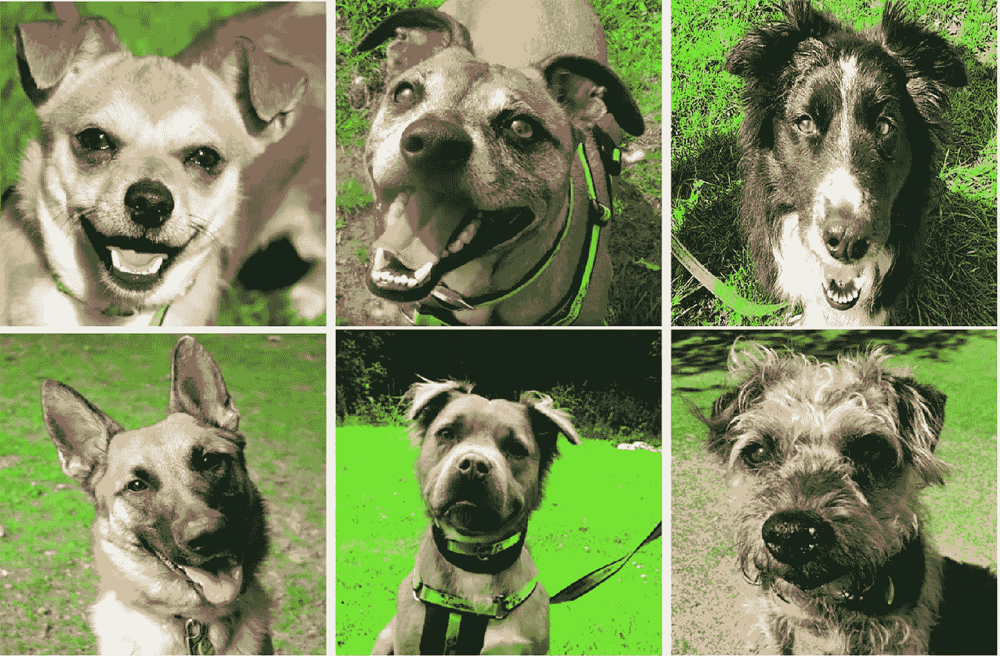

[DogAge 数据集](https://link.springer.com/chapter/10.1007/978-3-030-30508-6_34)

# 项目概述

该项目的目标是**创建一个端到端的深度学习管道，根据狗的品种对它们的图像进行分类**。该管道将接受任何用户提供的图像作为输入，并将预测图像中是否存在狗或人。如果在图像中检测到狗，它将提供狗的品种的估计。如果检测到人类，它将提供一个最相似的狗品种的估计。

# **问题陈述**

在这个项目中，我被提供了人和狗的 RGB 图像，并被要求设计和实现一种可以在图像中检测人(人检测器)或狗(狗检测器)的算法。在检测到人或狗之后，算法还需要预测狗的品种(如果检测到狗)和最相似的狗品种(如果检测到人)。如果在图像中没有检测到，算法应该要求用户输入另一个包含狗或人的图像。

# **指标**

为了评估我的算法的性能，我使用分类精度作为性能度量。所有三个深度学习模型人类检测器、狗检测器和狗品种分类器(稍后将详细介绍)都使用这些模型在分类图像时获得的准确度进行了评估。

对于这些模型，精确度是性能度量的合理选择。这是因为人类检测器模型被提供有 100 幅人类图像和 100 幅狗图像(平衡数据)以评估其准确性。类似地，向狗检测器提供每个人和狗的 100 个图像，以评估其准确性。在验证集上验证犬种分类器模型以发现其泛化性能，然后最终在测试集上评估。

> 可以使用的其他性能指标有 F1 评分、AUC-ROC 曲线和混淆矩阵。

# **数据探索和可视化**

在这个项目中使用了两个不同的数据集。第一个数据集是 [**标记的野生人脸**](http://vis-www.cs.umass.edu/lfw/) **包含 13233 个人的图像。**所有图像的高度和宽度均为 250x250 像素。数据集中的大多数图像在图像中具有单一的人脸，但是有一些图像具有额外的半张脸。这对于在图像中检测人类的人类检测器模型来说不应该是问题，因为面部检测器模型对于图像中存在的小随机噪声是鲁棒的。

第二个数据集是**狗品种数据集，包含 8351 张狗图像，133 个狗品种类别**。数据集不是完全平衡的。每堂课的平均图片数量约为 50 张。但是数据集中很少有少于 30 幅图像的类，而有些类有超过 70 幅图像。数据中的这种小的不平衡可能在训练狗品种分类器模型中造成问题。但是这可以通过对少数类进行过采样或对多数类进行欠采样以及数据扩充方法来解决。

从训练数据中随机抽取的几个犬种样本如下所示

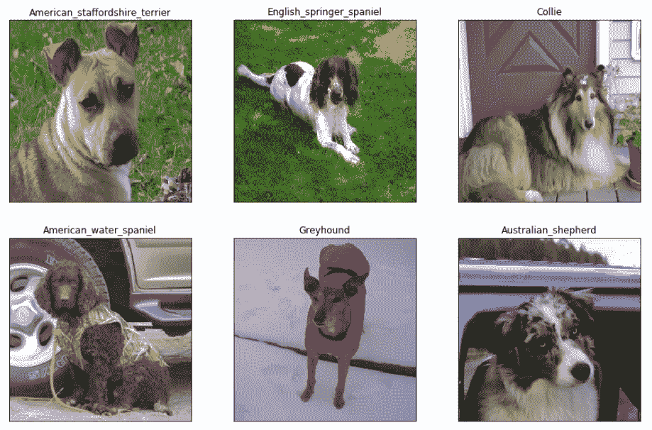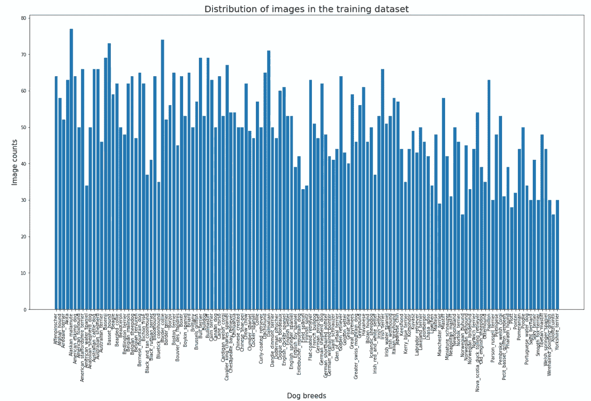

# 项目路线图

整个项目分为 9 个部分(步骤 0-8)。

*   步骤 0:导入和预处理数据集
*   步骤 1:实现人体检测器
*   步骤 2:实现狗检测器
*   第三步:CNN 对狗的品种进行分类(从头开始)
*   第四步:CNN 对狗的品种进行分类(使用迁移学习)
*   第五步:编写算法来预测狗的品种
*   步骤 6:测试算法
*   第七步:结论
*   第八步:提高绩效的技巧

# 步骤 0:导入和预处理数据集

Keras 中的所有 CNN 模型都需要 4D 数组/张量作为 shape (batch_size，image_height，image_width，num_channels)的输入。每个图像的形状需要相同，以便批量训练 CNN 模型。因此，需要对狗检测器模型和狗品种分类器模型的输入数据进行整形，使得所有图像具有相同的形状。

在 Keras 中为任何预训练的 CNN 模型准备好 4D 张量，需要一些额外的处理。首先，通过对通道重新排序，将 RGB 图像转换为 BGR 图像。所有预训练模型都有额外的归一化步骤，即必须从每个图像的每个像素中减去平均像素(以 RGB 表示为[103.939，116.779，123.68]，并从 ImageNet 中所有图像的所有像素中计算)。使用`preprocess_input`函数可以很容易地在 Keras 中实现这个步骤。

输入人体探测器模型的图像需要从 RGB 格式转换成**灰度。**

# **第一步:**实现人体检测器

我使用 OpenCV 库中预先训练好的 [**Haar cascade 人脸检测器**](https://docs.opencv.org/master/db/d28/tutorial_cascade_classifier.html) 模型来确定图像中是否存在人类。使用 Haar cascade 检测人脸的代码非常简单明了。首先，使用预先训练的权重创建模型的实例，将 RGB 图像读入内存并将其转换为灰度。然后使用执行分类器并以灰度图像为参数的`detectMultiScale`函数，返回人脸包围盒的坐标。代码片段和检测结果如下所示。

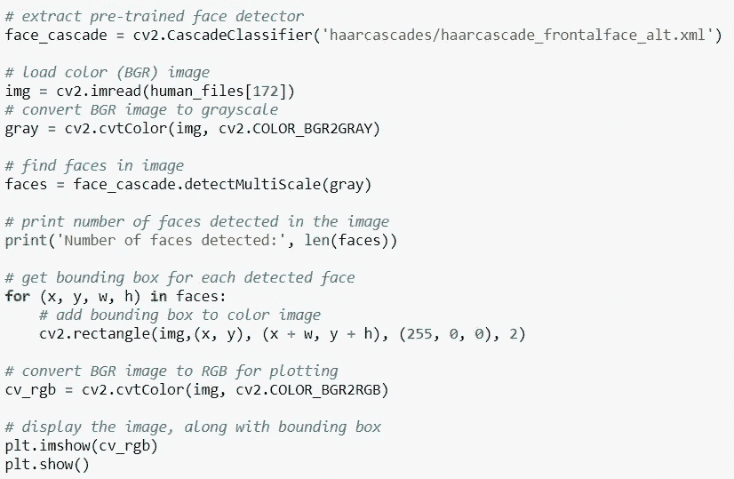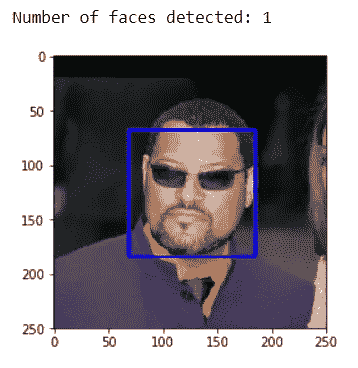

# **第二步:**实现狗检测器

为了检测图像中的狗，我使用了一个预先训练好的 [**ResNet-50**](http://ethereon.github.io/netscope/#/gist/db945b393d40bfa26006) 模型。这个模型已经在 [**ImageNet**](http://www.image-net.org/) 上进行了训练，这是一个非常大且流行的数据集，用于图像分类和其他视觉任务。该模型将输入图像作为 4D 张量，并为图像中包含的对象提供 1000 个类别中的一个作为**输出，其中几个类别是不同品种的狗。因此，ResNet50 可用作狗检测器。如果图像的类别属于狗的品种类别之一，则图像中存在狗。**

> 图像中人和狗的检测对这个项目至关重要，因为我将使用这些模型和狗品种分类器。

# 第三步:CNN 对狗的品种进行分类(从头开始)

在直接跳到转移学习之前，我从零开始建立一个 CNN 模型。这个模型很简单，既不深也不浅。它有**Conv2D 层的五个块，后面是 MaxPooling2D 层**。我在 Conv2D 和 MaxPooing2D 图层的每两个块之后添加了一个 **dropout 图层**来**避免过拟合**。在 Keras 中创建**顺序模型的代码及其摘要如下所示。**

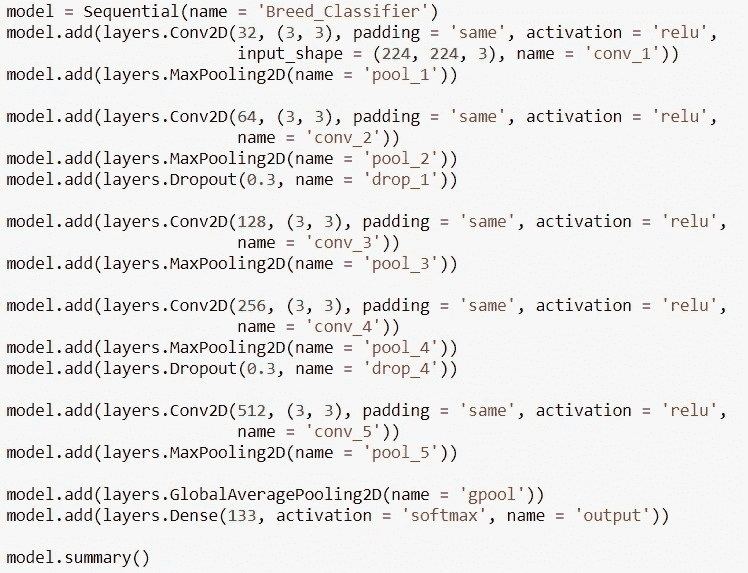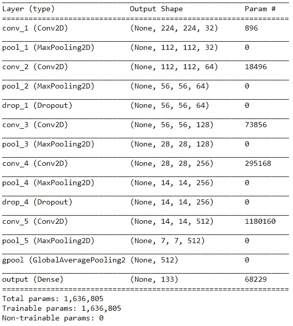

我训练了 6 个时期的模型，每批 20 个，没有增加任何数据。该模型表现不佳，在测试数据上仅达到 6%的准确率。

# **第四步:CNN 对狗的品种进行分类(迁移学习)**

什么是迁移学习？迁移学习是一种机器学习方法，其中为一项任务训练的**模型可以用作类似任务**的另一个模型的起点。这是深度学习中非常流行的技术，即使在非常小的数据集上，也可以用较少的计算获得非常好的性能。

我用了五种不同的模型和预先训练好的权重来对狗的品种进行分类。型号有 **VGG16、VGG19、InceptionV3、ResNet50、Xception** 。所有这些模型都是在 ImageNet 数据集上训练的。**犬种数据集中的图像类似于 ImageNet 数据集中的图像**，因此迁移学习适合于这项任务。这些预先训练的模型可以作为图像中非常好的特征提取器，并且可以通过转移模型已经学习到的内容来用于这个品种分类任务。

## 使用预训练模型构建分类模型的步骤

1.  使用除分类头之外的预训练模型的所有层作为特征提取器。
2.  冻结预训练模型的权重，以防止它们在训练过程中退化。
3.  在冻结层的顶部添加几个新的可训练层。第一层可以是一个 [**全局平均池 2D**](https://www.tensorflow.org/api_docs/python/tf/keras/layers/GlobalAveragePooling2D) 层或一个 [**展平**](https://keras.io/api/layers/reshaping_layers/flatten/) 层。你也可以添加一个**层来避免过拟合和[**batch normalization**](https://keras.io/api/layers/normalization_layers/batch_normalization/)层来平滑训练。**
4.  **建立新模型。您可以使用 Keras 的 [**顺序**](https://keras.io/api/models/sequential/) 或 [**功能**](https://keras.io/guides/functional_api/) API。**

> **我使用了一个 GlobalAveragePooling2D 层，然后是一个带有 softmax 激活的密集分类层，该层在预训练模型的基础上计算每个狗品种的概率。**

****车型评价****

**在没有数据扩充的情况下进行训练时，所有模型(VGG16、VGG19、InceptionV3、ResNet50、Xception)都在训练数据集上过度拟合。训练损失随着每个时期持续减少，而确认损失减少非常缓慢(似乎饱和)并且比训练损失高得多。同样，训练精度也远高于验证精度。下表总结了所有模型在训练和验证数据集上的结果。**

**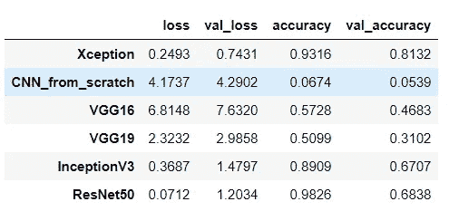**

**在所有经过训练的模型中，**异常模型在验证数据集上表现最好**。该模型在验证数据上的准确率达到了 81.32%，而其他模型在验证数据上的准确率都在 70%以下。下图显示了没有数据扩充的 Xception 模型的训练和验证损失和准确性曲线。**

**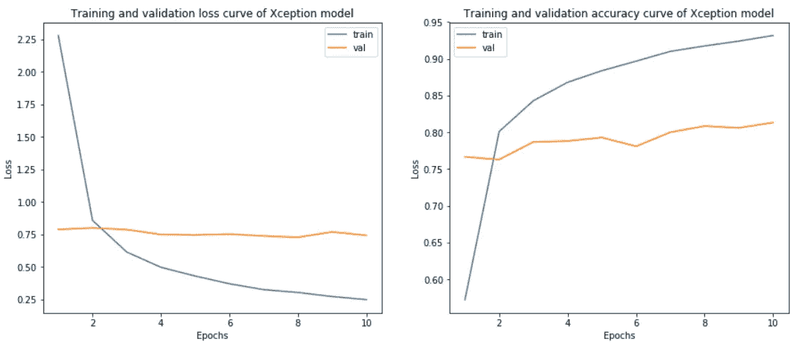**

****细化:用数据扩充训练异常模型****

**为了提高 Xception 模型的性能，我使用了数据增强技术，例如使用 Keras[**imagedata generator**](https://keras.io/api/preprocessing/image/)对图像进行随机旋转、翻转、剪切、缩放操作。这个**减少了过拟合**，在验证数据集上模型的准确率达到了 81.7%。数据扩充的代码以及训练和验证数据的损失和准确度图如下所示。**

**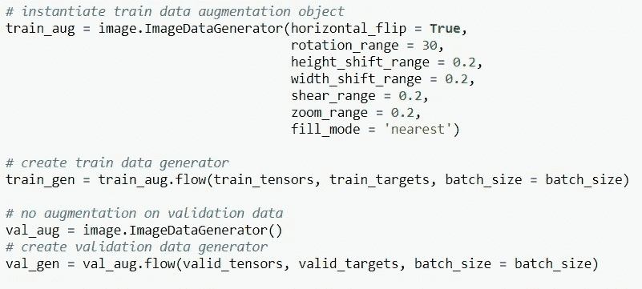****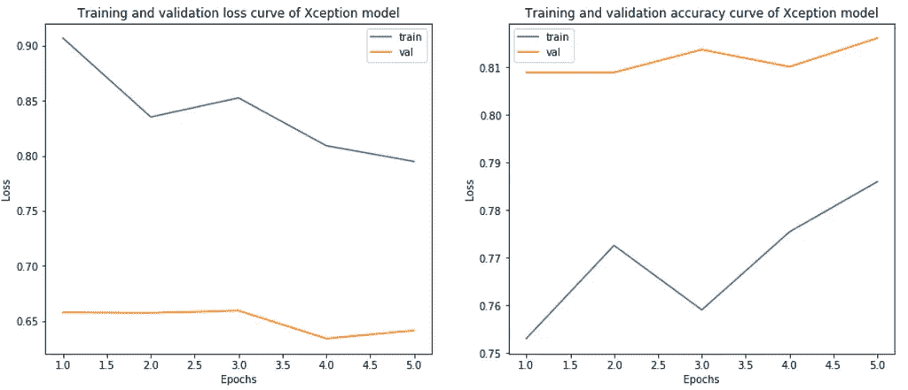**

**为了进一步提高性能，我**解冻了 Xception 模型的最后两个块，以便对它们进行微调**。结果，该模型在验证数据集和测试数据集上的准确率分别达到了 83%和 83.5%。该模型预测了大多数类别，而不会将它们与其他类别混淆。但是，在测试数据中很少有类别没有被模型正确分类。由测试数据上的模型生成的混淆矩阵显示了这些结果。**

**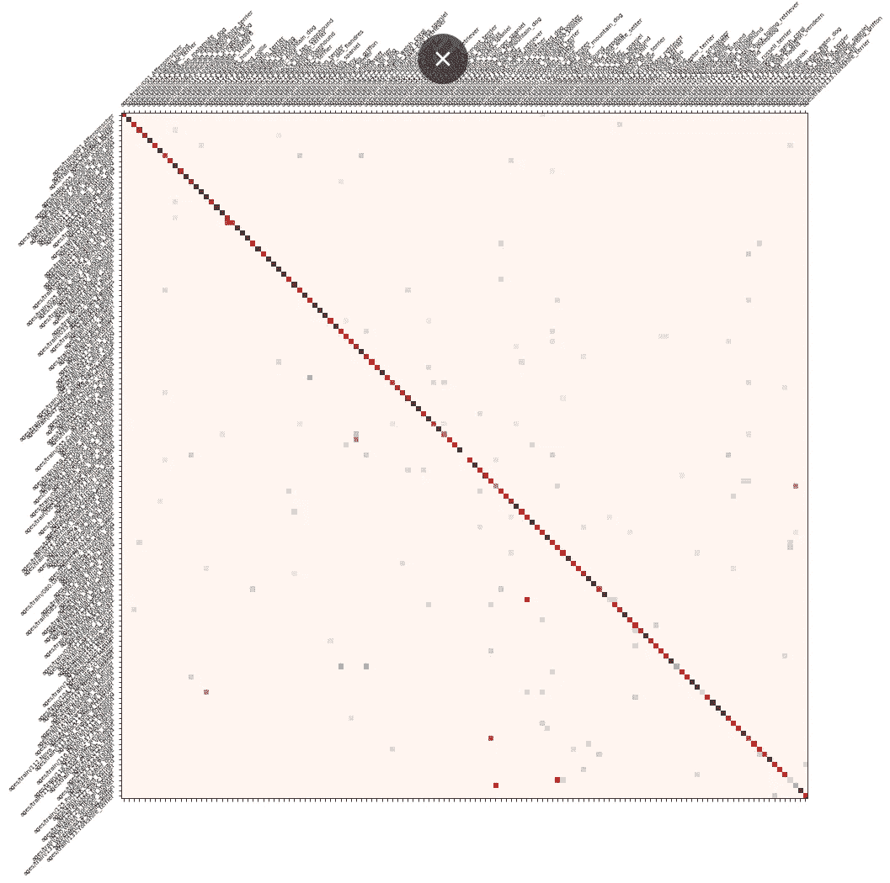**

# ****第五步:编写算法预测狗的品种****

**最终算法使用**人类检测器模型(Haar cascades)和狗检测器模型(ResNet50)** 来检测图像中是否存在人类或狗。一旦在图像中确认了人或狗的存在，就将其传递给狗品种分类模型(例外模型)以确定人或狗最相似的品种。模型预测与是否检测到人或狗一起被打印出来。如果发现图像两者都不包含，则请求带有人或狗的新图像。**

# ****第六步:测试算法****

**算法的结果如下所示:**

1.  **人和狗图像的算法结果。**

**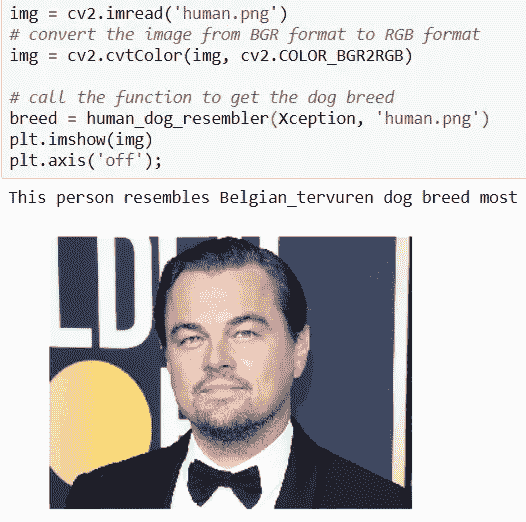****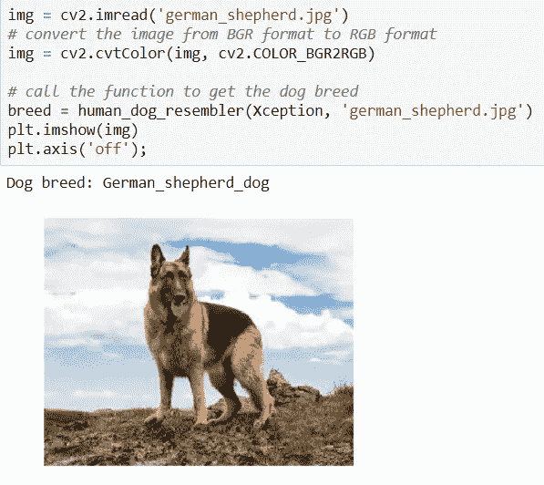**

**2.没有人或狗的图像上的算法结果。**

**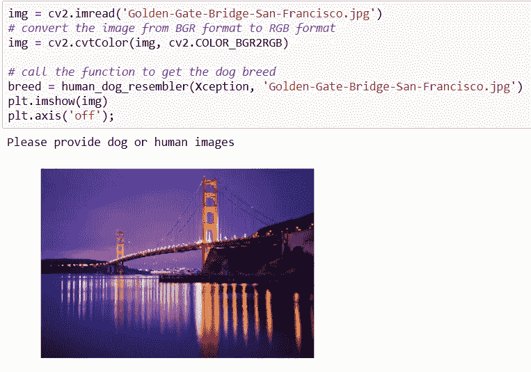****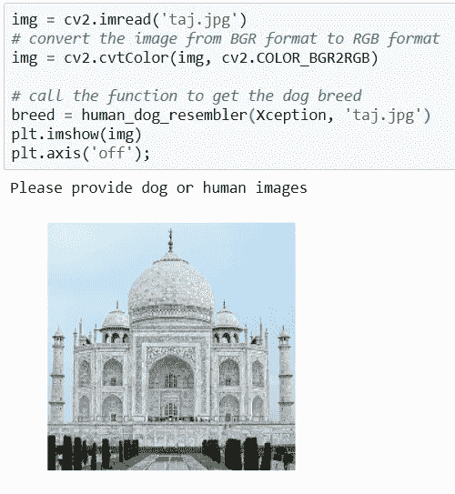**

# ****结论****

**这个项目是进入深度学习领域的一个很好的起点。在训练任何机器学习模型之前，数据探索和可视化是极其重要的，因为它有助于选择合适的性能指标来评估模型。Keras 中的 CNN 模型需要 4D 张量形式的图像数据。为了批量训练 CNN 模型，需要将所有图像重新整形为相同的形状。**

**在 Keras 中，从头构建 CNN 模型极其简单。但是从头开始训练 CNN 模型在计算上是昂贵和耗时的。Keras 中有许多预训练模型(在 ImageNet 数据集上训练)可用于迁移学习。**

**最值得注意的是**迁移学习的力量**以小计算量取得好结果。当任务类似于预训练模型权重被优化的任务时，它工作得很好。**

# ****提高性能的技巧****

1.  **每节课获取更多图像**
2.  **使数据集平衡**
3.  **使用图像增强方法，如**剪切、混合和剪切混合****
4.  **使用 **VAEs/GANs 生成人工数据****
5.  **使用激活图来解释模型预测**
6.  **使用基于深度学习的方法来检测人脸(MTCNN)**

**希望你喜欢阅读这篇文章。**

**你可以在我的 [GitHub Repo](https://github.com/Ankit-Kumar-Saini/Dog_Breed_Classifier) 中找到所有代码**

**LinkedIn 句柄: [ankit-kumar-saini](https://www.linkedin.com/in/ankit-kumar-saini/)**