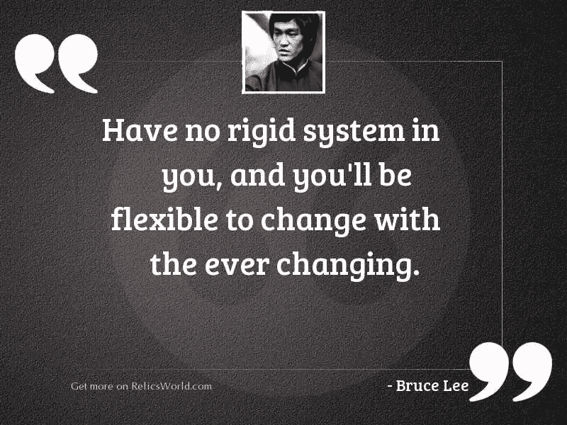

# 不要盲目遵循原则和规则，要明白如何应用它们。

> 原文：<https://medium.com/nerd-for-tech/dont-follow-principles-and-rules-blindly-understand-how-to-apply-them-feebf74b8d36?source=collection_archive---------14----------------------->

我想讨论一些在我看来是软件工程职业中最大的罪恶之一的事情。我将从一个个人的故事开始，作为铺垫。

当我 2009 年第一次来到伦敦，开始一份 Java 开发人员的新工作时，毕业后不久，我发现自己在一个小团队中，一位技术主管不喜欢在一个函数中有多个 return 语句。

技术负责人一直拒绝我的 PRs 中不符合“干净代码”规则的代码，即使在一些特殊的情况下，我认为代码肯定是干净的，具有[早期返回](/swlh/return-early-pattern-3d18a41bba8)。于是我开始质疑这个。我问:“为什么我们有这个规则，为什么有多个 return 语句是坏代码？”我得到了一个有点轻蔑的回答:“这是软件行业公认的编码标准，你只是一个初级开发人员，还不熟悉它”…

我不服气，几天后又压了我的铅。最后我得到了更多的信息:这条规则来自 [Dijkstra](https://en.wikipedia.org/wiki/Edsger_W._Dijkstra) 本人，一位著名的计算机科学家，他写在一本书里。现在我被激起了兴趣……但仍然没有完全被说服。我查了一下，的确，Dijkstra**T5 本质上说:“每个函数，以及函数中的每个块，都应该有**一个入口**和**一个出口”。**这就是所谓的[【单入口，单出口】](https://softwareengineering.stackexchange.com/questions/118703/where-did-the-notion-of-one-return-only-come-from)原理，最初是写在*(1972 年！).***

*然而，我仍然不相信这适用于我们的情况。我直观地感觉到，使用多个 return 语句的代码比使用结果变量的代码更清晰，有更多的块嵌套和更多的逻辑。此外，在阅读了最初陈述的 Dijkstra 规则后，我注意到在大多数 Java 代码库中还有其他可能违反该规则的情况——例如:任何抛出异常的情况。*

*那么这里发生了什么🤔？…事实上，这条规则是，引用 StackOverflow 的话:“在大多数编程都是用汇编语言、FORTRAN 或 COBOL 完成时编写的”，这意味着底层环境与我公司的环境非常不同。这条规则旨在解决**只出现在支持*转到*** 的语言中的问题。(参考报价见[第一个堆栈溢出答案](https://softwareengineering.stackexchange.com/a/118793/381999)*

*在合理的程度上，这种编码规则仍然适用于 C 语言，因为正如在[第二次 StackOverflow 回答](https://softwareengineering.stackexchange.com/a/118717/381999)中所描述的，函数中的多次返回使得确保资源被清理变得更加困难。我相信这实际上是我的技术负责人从 C 程序员开始学习这条规则的地方，这在一些 C 书籍中提到过，特别是[MISRA C](https://www.viva64.com/en/w/v2506/)——一个著名的 C 编码标准。*

*然而，在 Java 世界或类似的面向对象语言中，这些都不再适用了。现代面向对象语言有垃圾收集，所以绝大多数资源不需要显式关闭/释放。即使对于那些资源(文件、套接字、流等)也是如此。)，有一个`finally`块来帮助完成这个任务。换句话说，规则的上下文发生了很大的变化，以至于它不再适用——而且可以说它使代码变得更糟了！(这篇关于[提前返回模式](/swlh/return-early-pattern-3d18a41bba8)的文章有更详细的理由)*

*那么我要带着这个去哪里？到目前为止，这个故事的寓意应该很清楚了:*

# *不要盲目地遵循规则和原则，要学会理解潜在的背景，所涉及的权衡，并据此应用它们。*

*我相信这是一个非常重要的原则，可以让你的职业更上一层楼，尤其是当你进入更高的职位时。然而，这是许多开发人员失败的地方。他们只是肤浅地看待规则和原则，经常以僵硬和教条的方式应用它们，导致不太有效的结果。尽管我举了一个老派的例子，这种情况还是经常发生。*

*对于 Java 和 OO 来说，可以考虑这样一个例子，要求类中的所有字段都应该**总是**是*私有的*并且可以被 getters 访问。另外，您的服务 API 应该理想地达到 Richardson 成熟度模型中的 2 级或更高级别(如果我想提供一个 gRPC 适配器，我该如何处理 HTTP 动词和状态代码？).在管理&开发过程方面，还有敏捷……这是一个误用原则的巨大雷区。可能是因为敏捷开发的*环境*更加微妙、复杂和主观。但是让我们不要进入那个…*

*另一个例子，来自函数式编程世界:可变性是不好的，应该尽可能避免。😑这是我最讨厌的事情，在 FP 的世界里，说这个想法过于教条可能会有争议，但是我确实相信它。这个职位将需要一个单独的博客帖子来适当地证明，尽管。(待定…)*

*一个附带说明:理解规则和指导方针周围的*上下文和环境*的想法与一个更普遍的原则紧密交织在一起:**许多高级软件工程都是关于理解权衡，并基于这些权衡做出选择**。这种[权衡](https://www.nemil.com/on-software-engineering/think-in-tradeoffs.html)的想法通常在架构模式中更加清晰(例如微服务、事件源、CQRS 等)。)因为在这些讨论中，权衡和选择往往会被明确地提到**。换句话说，问题的 ***上下文*** 更加明确。***

***我认为这是因为对于架构模式来说，每种模式只有在某些情况下才是正确的方法，而干净代码规则和指导方针在大多数情况下都是正确的选择(T21)——很容易让人误认为它们是 100%通用的，而事实并非如此…***

*****结论:**不要屈从于教条和僵化的思维，不要断章取义地套用想法和模式。***

******