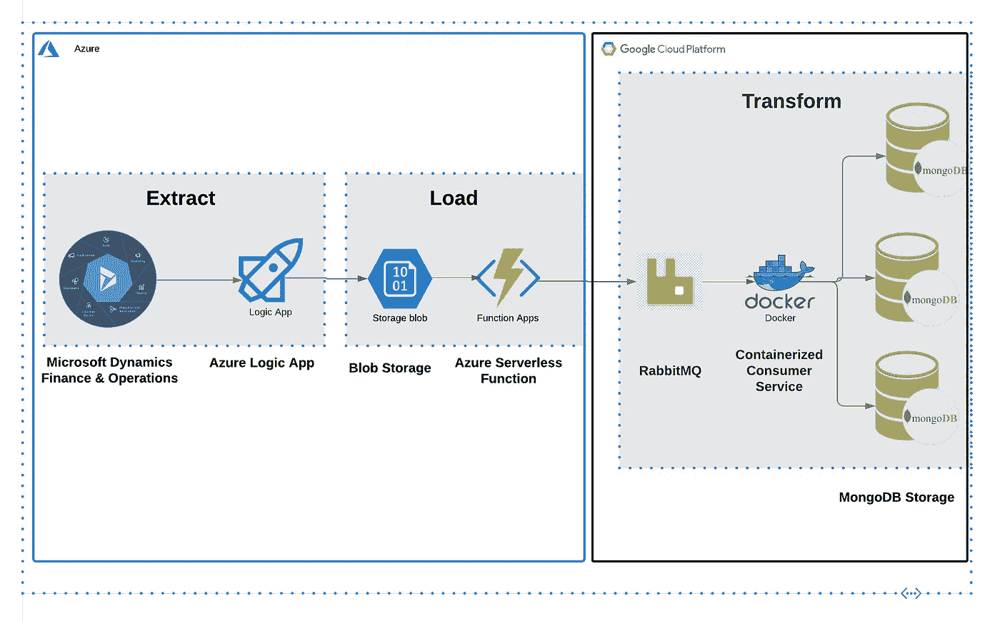
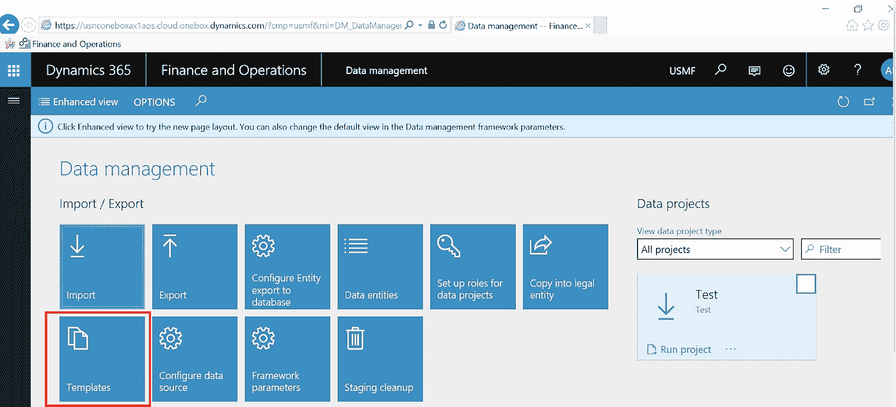

# Dynamics 365 F&O 集成案例研究:第一部分

> 原文：<https://medium.com/nerd-for-tech/dynamics-365-f-o-integration-case-study-a575eb5c8b47?source=collection_archive---------8----------------------->

**简介**

最近，我参与了一个客户项目，该项目要求我们跟踪对客户的 Microsoft Dynamics 365 财务和运营模块所做的更改，并将这些数据更改集成到目标应用程序中。作为一个团队，我们学到了很多关于如何设计和实现这种场景的解决方案，我们希望与任何需要开发类似管道的人分享见解和技巧。

**栈**

对于这个项目，我们有一个由 MSSQL 中的关系源数据库组成的源系统，位于 Microsoft Dynamics 365 之后，还有一个由一个 web 应用程序和 MongoDB 上的支持数据库组成的目标系统。源数据库有一个称为“CDC”的特性，即可以配置为在表级别跟踪更改的更改数据捕获。在我们的用例中，这些更改需要在 MongoDB 端捕获，因为它们发生在 SQL 数据库中。我们的管道被设计成使用事件驱动的架构，使用 RabbitMQ 作为我们的消息代理。目标组件包括一个订阅我们的代理主题的消费者服务，以及一个作为目标数据库的 MongoDB 集群，数据更改在该集群中被捕获。管道的组件包括 Azure 函数、逻辑应用和作为中间件的 blob 存储。我从高层次上展示了系统的设计，以便全面了解所有不同的组件。

**文章**

为了反映开发过程，这项研究将分成不同的文章，每一篇文章关注我们架构的不同层或堆栈。我们将从源系统和数据库(Microsoft Dynamics & MSSQL)开始，然后是中间件(Azure Logic Apps & Azure functions)，最后是目标系统(message broker、消费者服务和 MongoDB 数据库)。

本系列中的文章:

*   **第一部分:源系统(见下文)**
*   [**第二部分:中间件**](https://dverasc.medium.com/dynamics-365-f-o-integration-case-study-part-ii-6e7a131a9eda)
*   [**第三部分:目的地系统**](https://dverasc.medium.com/dynamics-365-f-o-integration-case-study-part-iii-1e44e09d2187)

**参考文献**

设计和开发过程的一部分总是涉及到一些研究，我既想感谢在我们的研究过程中帮助我们的信息来源，也想为任何将承担与我们类似项目的人提供其他资源。

以下是我们在研究中使用的一些资料来源:

*   [https://docs . Microsoft . com/en-us/dynamics 365/fin-ops-core/fin-ops/](https://docs.microsoft.com/en-us/dynamics365/fin-ops-core/fin-ops/)
*   [https://docs . Microsoft . com/en-us/dynamics 365/fin-ops-core/dev-it pro/data-entities/data-entities](https://docs.microsoft.com/en-us/dynamics365/fin-ops-core/dev-itpro/data-entities/data-entities)
*   [https://blog . Cr group . com/dynamics-365-latest-feature-the-data-export-service/](https://blog.crgroup.com/dynamics-365-latest-feature-the-data-export-service/)
*   [https://www . encore business . com/blog/logic-apps-in-dynamics-365-fo-file-based-data-integrations/](https://www.encorebusiness.com/blog/logic-apps-in-dynamics-365-fo-file-based-data-integrations/)
*   [https://medium . com/Hitachi solutions-brain trust/logic-app-integration-with-d365-f-o-524 AC 4909 f 0](/hitachisolutions-braintrust/logic-app-integration-with-d365-f-o-524ac4909f0)
*   [https://azure integrations . com/2019/10/15/d 365 fo-interactive-with-data-management-frame-work-using-rest-API-for-delta-changes-on-entity/](https://azureintegrations.com/2019/10/15/d365fo-interacting-with-data-management-frame-work-using-rest-api-for-delta-changes-on-entity/)
*   [https://github . com/Microsoft/Dynamics-AX-Integration/wiki/File-based-Integration-using-Logic-Apps](https://github.com/Microsoft/Dynamics-AX-Integration/wiki/File-based-integration-using-Logic-Apps)

## **第一部分**

**来源**

对于这个项目，我们的数据源是位于 SQL 数据库之上的 Microsoft Dynamics 365 财务和运营 web 应用程序。这个源的一个重要特征是它是一个关系数据库，与目的数据库相反，目的数据库是一个基于文档的数据库。

**关系数据库**

关系数据库往往是大多数团体和组织的行业标准，因为坦率地说，这些数据库比其他类型的数据库存在的时间更长，并且在供应商和企业客户中得到最多的支持。大多数开发人员和数据库管理员都是使用关系数据库来学习他们的技术的，并且它们是业界事实上的标准。这些数据库的主要特征如下:

*   数据库由 RDBMS 或“关系数据库管理系统”管理
*   数据根据预定义的关系按行和列进行组织
*   可以使用 SQL(结构化查询语言)来操作数据
*   行代表相关值的集合或分组
*   列代表某种数据
*   行几乎总是有一个“主键”，用作唯一标识符
*   流行的关系数据库包括 MSSQL、MySQL、Oracle 和 PostgreSQL

**微软 SQL 服务器**

既然我们已经介绍了关系数据库的一般概念，我们将回顾一下 SQL Server 的一些特定于产品的特征。首先要注意的是，Microsoft SQL Server 和更短的“MSSQL”缩写词在行业中是可以互换的，所以请记住它们是同一个词。

微软的 SQL Server 是最受欢迎的企业数据库之一，在客户端项目中经常出现(包括激发了这篇文章的那个)。过去，微软对“开源”并不友好，使用他们的产品需要购买许可密钥，并作为客户完成系统设置过程。令人欣慰的是，他们近年来采取了不同的态度，并扩展了他们的产品，以允许更容易的部署和无前期使用成本。因此，如果您正在跟踪这个项目，并且没有访问客户端 MSSQL 的权限，您可以使用 Docker 启动一个非生产 MSSQL 数据库。

**微软动态 365 财务&运营**

该系统最初被称为 Microsoft Dynamics AX，主要用于大中型组织和企业资源规划。在 Dynamics 生态系统中，我们感兴趣的数据被表示为“数据实体”,它们本质上是由基表中的字段组成的自定义视图。“数据实体”的目的是将基表中的数据抽象为针对非技术用户的特定于业务的术语(例如“雇员”实体，它可以从 4 个不同的基表中引入存储与雇员相关的信息的字段)。对于我们的项目，需要从源传输到目的地的数据实体来自所谓的“导出作业”。*这些导出作业是使用 web 界面创建的，这提供了一层便利性和安全性，因为数据不必直接从数据库中提取*。这个接口意味着我们不需要创建自定义查询或存储过程来获取数据。我在下面添加了一些图片来展示我所说的功能:

忽略红框，我们感兴趣的是导出按钮

“添加实体”按钮允许我们用感兴趣的数据配置每个作业

**设置源组件**

从技术角度来看，这个源系统需要的工作量最少。为了设置管道的其余部分，我们简单地为我们感兴趣的所有数据实体创建了“导出作业”,通过将实体添加到配置屏幕上的作业中来传输到我们的目标系统。在我们的特殊情况下，我们将作业配置为将数据导出为 CSV 文件摘要，但是也可以将数据导出为 Excel 摘要或其他文件/数据类型。我们项目的关键需求是，我们对每次都导出所有数据不感兴趣，我们只对已经更改的数据感兴趣(“更改数据捕获”)。为了确保我们只传输这个特定的数据，我们确保在我们感兴趣的每个实体上启用变更数据跟踪。启用此功能后，在第一次初始数据转储后，将只导出发生更改的数据。您可以在实体模块中使用 web 界面来完成此操作。

为了明确起见，您应该在创建导出作业之前为每个实体启用 CDC

**源系统结论**

阅读这一部分，您可能会对我们管道这一阶段的简单性感到惊讶。由于 Dynamics web 应用程序提供的抽象，我们不必直接与底层数据库交互。总结一下我们在这里所做的，我们只是在我们感兴趣的转移实体上启用变更跟踪，然后创建相应的导出作业。在下一篇文章中，我们将探索如何使用几个不同的 Azure 服务将这些导出作业绑定到管道的其余部分和我们的事件驱动设计中。