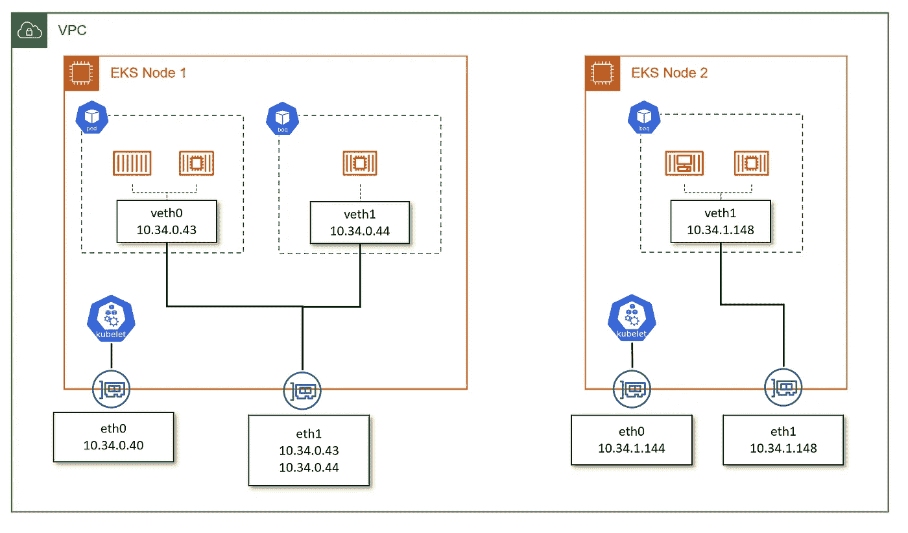
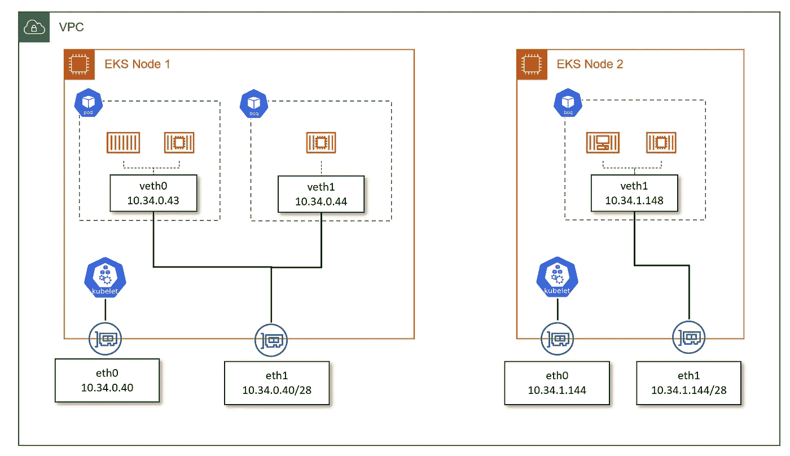
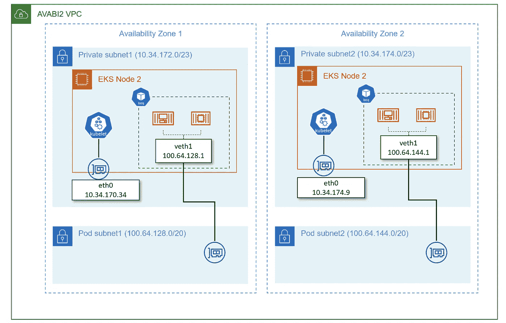

# EKS 网络——VPC CNI 模式

> 原文：<https://medium.com/nerd-for-tech/eks-networking-vpc-cni-modes-e6292e2db3b6?source=collection_archive---------0----------------------->

约翰·巴克利在 [Unsplash](https://unsplash.com/s/photos/cables?utm_source=unsplash&utm_medium=referral&utm_content=creditCopyText) 上拍摄的照片

EKS 的 Pod IP 寻址

AWS EKS 使用一种简单的方法进行 pod 联网。它使用来自 VPC 的 IPs 作为 Pod。通过利用 VPC·CNI 插件，一个在集群中运行的 daemonset(aw-node ),也可以达到同样的效果。VPC CNI 插件作为 K8s 和 AWS VPC 之间的桥梁。

这个插件利用了 EC2 实例可以有多个网络接口(ENI)和每个 ENI 可以有多个 IP 的事实。CNI 插件提供辅助接口并向其添加多个 IP。当收到 pod 创建请求时，它会从连接到辅助 ENI 的 IP 池中分配一个 IP。当节点上运行的 pod 数量超过单个 ENI 上的地址数量时，CNI 后端会开始分配新的 ENI。CNI 插件公开了下面提到的配置，以控制 IP 和 ENI 预留。

> *温暖 _ ENI _ 目标
> 温暖 _ IP _ 目标
> 最小 _ IP _ 目标*

要了解上述配置，请访问我之前的文章[https://medium . com/nerd-for-tech/eks-networking-CNI-457 AE 298 b9e 6](/nerd-for-tech/eks-networking-cni-457ae298b9e6)

该插件主要在三种模式下运行。

## IP 模式

在此模式下，辅助 ENI 保留子网中的 IP 地址。

作者图片

## 前缀模式

在这种模式下，辅助 ENI 映射到一个子网前缀，并根据该前缀将 IP 分配给 pod。前缀是/28。这意味着我们将节点可用的 IP 数量增加了 16 倍。比方说，对于 c5.large，我们可以有 3 个 ENI，每个可以有 10 个 IP。这给了我们 27 个可用的 IP。但是加上前缀，我们会有 432 (3*9*16)个 IP。这允许我们有更大的荚果密度。

作者图片

## 自定义配置模式

在这种模式下，CNI 将使用二级 CIDRs。辅助 CIDR 范围是部署到与现有专用子网相同的可用性区域的一组附加子网。唯一的区别是，这些子网使用辅助 CIDR 范围，而不是连接到 VPC 的主 CIDR 范围。在这种模式下，工作节点将从我们的主 CIDR 范围获取 IP，而 pod 将从我们的辅助 CIDR 获取 IP。

作者图片

在这篇博客中，我试图解释 IP 是如何以不同的模式分配给 EKS 的 pod 的。

网络快乐！！