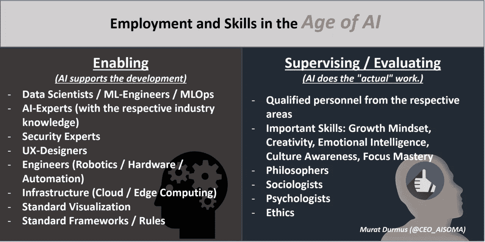
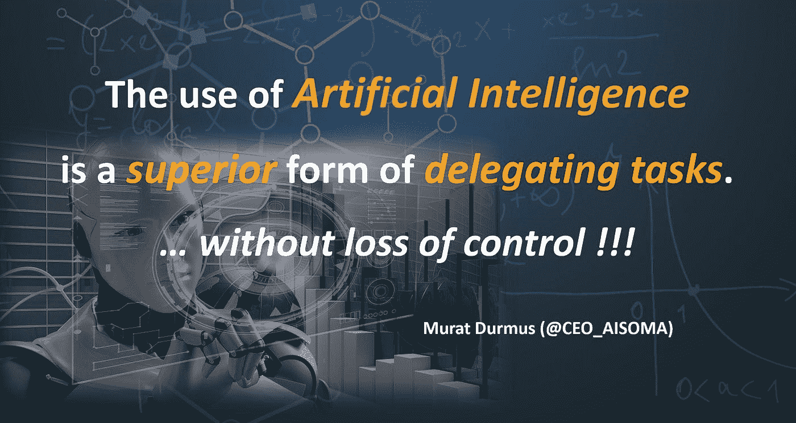
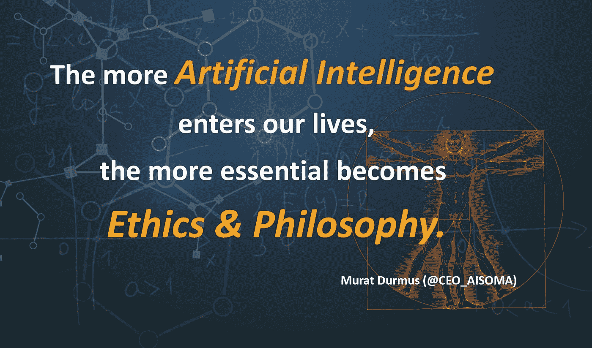

# 人工智能时代的就业与技能

> 原文：<https://medium.com/nerd-for-tech/employment-and-skills-in-the-age-of-ai-e3a191a0b137?source=collection_archive---------15----------------------->

人工智能时代的就业和技能

对未来就业的方方面面做一些基本的(可能太肤浅的)思考。

> 对通过人工智能失去工作的恐惧无处不在，也是有道理的，但它也有“积极”的一面。我们被迫更加认真地思考重新定义工作。

毫无疑问，我们目前正处于向人工智能时代过渡的阶段。整个事情的发展速度一天比一天快。我们一定不能陷入思考的信念:这都需要一些时间，我们有足够的时间来思考 AI 对我们人类和社会的影响。现在，没有人能准确地估计人工智能领域的发展。看到这一点的最好方法是，即使是专家也有非常不同的意见。

在我看来，人工智能时代的未来就业类型可以大致分为两个领域:

**1。人工智能使能**

**2。人工智能-监督/评估。**

**AI 使能**

这个领域已经发生了很多事情。越来越多的物联网设备进入市场，还不能产生数据或具有接口的机器正在翻新。

如果你看看近年来的就业市场，你会发现越来越多的数据科学家，ML/数据工程师，人工智能专家正在被寻求。一些大学已经在提供人工智能课程/学位。更多的人将紧随其后。甚至有纯人工智能大学，一切都是围绕人工智能设计的。

在硬件开发和技术进步方面也有很多进展。像神经形态芯片和量子计算这样的新方法越来越成熟。

由于对人工智能的关注不断增加，社区和“专家”的数量也在增加。因此，算法/网络拓扑不断得到改进和优化。

最大的挑战:

1.  让算法更高效、更透明(可解释的人工智能)、更公平
2.  标准
3.  安全性

**人工智能-监督/评估**

这里看起来还不太好，但我们慢慢意识到人工智能将对我们的生活和社会产生多么重大的影响。我们人类必须重新定位自己，在某些领域改变我们的思维方式。随着时间的推移，人工智能将从我们身上带走很多东西。无论是工作还是私人生活。我们将有更多的时间来思考我们自己、世界和宇宙……(为有意义的危机预先编程😉)

这并不容易，所以我们需要更多的哲学家、社会学家、心理学家来帮助我们应对所有这些变化，并将它们转化为我们的优势。

我们需要成为更“真正”的思想家，更不用说哲学家了。像成长心态、创造力、情商、文化意识、专注度等软技能成为“重要素质”，因为单调和基于规则的理想状态对我们人类来说将不再存在。

甚至约翰·麦卡锡教授也认识到了哲学的重要性( [的哲学人工智能和](http://jmc.stanford.edu/articles/aiphil2.html) *的哲学人工智能)。不幸的是，我们经常迷失在技术细节中，而忽略了主题领域的整体观点。总和比它的组成部分更多更不同。*

最大的挑战:

*   改变/适应心态。

> 我们正处于过渡时期。人工智能变得越先进，不确定性就传播得越多。如果我们不想灭亡，我们必须重新定位自己，必须改变心态。那是肯定的。
> 
> 人工智能应该面向人类，应该只具有补充功能。

最后，关于未来学习和知识的另一个想法:

> 未来，此刻的学习将成为一种“工作方式”，获取新知识的能力将比自己已经拥有的知识受到更高的重视。这一点是肯定的。

这可能也是有趣的(我关于正念人工智能的新书):

链接(亚马逊):[人工智能思想书:励志思想&人工智能语录](https://www.amazon.com/gp/product/B08Z4BWN1X/ref=dbs_a_def_rwt_bibl_vppi_i0)

木拉提