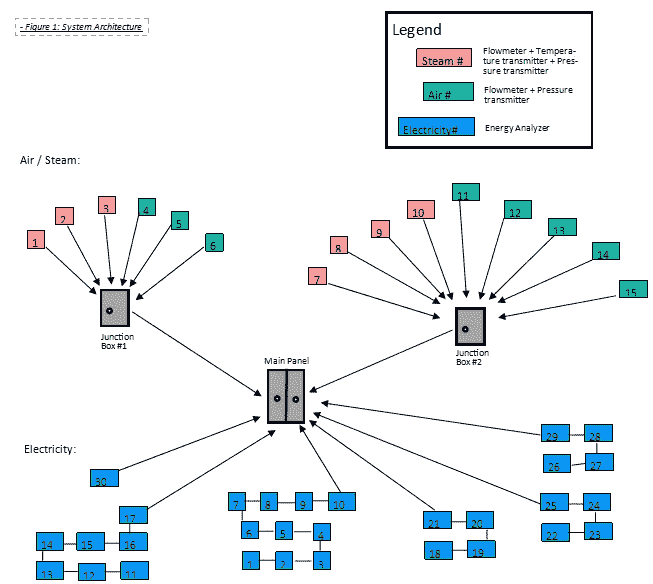
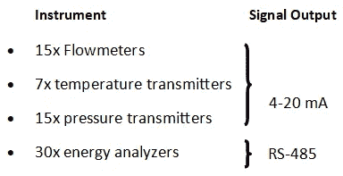
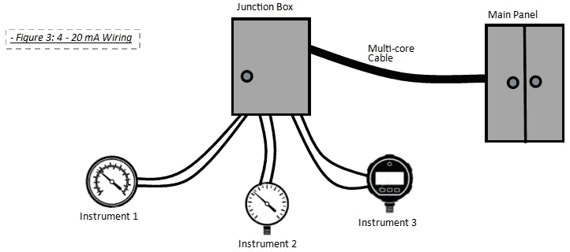
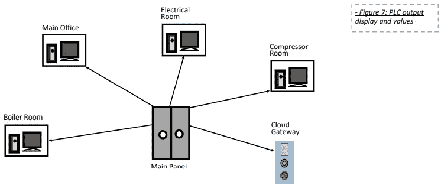

# 能源监控和物联网

> 原文：<https://medium.com/nerd-for-tech/energy-monitoring-and-the-internet-of-things-639db075a2e1?source=collection_archive---------2----------------------->

你问什么事情？良好的..

> 1.问题的重要性

在当今充满挑战的经济环境下，企业主正在寻找新的方法来控制成本。为了做到这一点，他们必须准确地了解他们现有的成本、负债和资产。一个很好的起点是监控产品生产过程中消耗的能源。为了提供一些背景知识，我目前在一家轮胎制造厂工作，我们最近刚刚在那里实施了一个完整的仪表和计量器网络，以确定每个部门消耗的公用事业；即**空气**、**蒸汽**和**电力。**

迄今为止，用于过程变量测量的仪表和量规非常有限。而那些已安装的仅具有本地显示。这意味着全天记录的值非常少，因为必须有人亲自前往该位置并手动记录这些值。由于自然的人为错误，这也导致了不可靠的读数。

我们面临的另一个问题是，由于没有可靠的方法来确定成本节约的“之前和之后”的差异，劳动力为削减公用事业成本所做的任何尝试往往都没有被注意到。

我们也无法确定我们每种产品的制造成本到底是多少。目前，这一成本是基于生产量和每个公用事业账单的总和，而不考虑正在制造的不同类型的产品(某些产品的成本高于其他产品)。

> 2.解决方案的影响

## 2.1 故障排除

这个项目帮助我们确定了损失最大的领域。我们现在也能够更快地解决问题。现在，甚至在消费者得到通知之前，每个公用事业部门的经理都可以找到问题的根源。这是可能的，因为显示的实时值带有添加警报的选项，可以通过电子邮件通知相关人员测量值的任何差异。由于这个项目已经实施，我们现在可以实时查看过程变量。空气、蒸汽和电力是我们产品的主要成本。这些值的实时监控和记录已经取代了手动记录方法，让位于更高的准确性和更频繁的数据记录。每 5 秒记录一次这些参数，可以让我们更深入地了解我们的能源需求变化的频率和速度。在过去，很难确定温度和压力下降，因为它们有时会在夜班期间发生，此时无法采取快速应对措施，因此生产线经理必须等到早上，并向经理报告由于过程变量不符合要求而造成的生产损失。随着 EMS 的引入，我们现在能够使用时间序列图来确定压力或温度下降发生的时间和地点，时间序列图可以存储长达数月的数据。通过这种方式，可以更快地诊断问题，并随后在更短的时间内解决问题，从而提高质量和数量。

## 2.2 确定新项目的可行性

既然我们已经对能源消耗有了详细的了解，那么在投入大量资金之前，确定一个新项目是否有益就容易多了。当供应商提供产品演示时，这尤其有用。例如，如果一个供应商正在提供一个效率更高的电机，他们声称这将节省电力消耗，我们现在有工具来检查到底节省了多少电力(如果有的话)。

## 2.3 产品成本计算

该系统提供的最大好处之一是能够单独计算每个产品类别的成本。通过测量每个部门消耗的空气、蒸汽和电力，并除以前者生产的总量，我们可以确定每个项目类别的单位成本。这也将有助于我们评估员工的绩效，方法是建立基准，如果单位能耗较低，则提供激励；如果单位能耗较高，则采取纠正措施。

## 2.4 分析和报告

随着所有这些数据被输入到我们的系统中，这些数据必须以一种对相关经理来说直观易读的方式进行组织和呈现。如果数据没有经过过滤和分类，这些任务留给管理者去做，那么这个系统的目的就失去了。因此，我们在 HMI 屏幕上浓缩了信息，每个部门都有自己的信息。这有助于轻松导航，并让相关人员快速访问他们需要的信息。有了它，我们还通过密码保护屏幕实现了行级别的权限。这确保了只有有权访问特定信息的人才能获得它。然而，这并不是环境管理体系的全部。这些数字的数据分析可以提高我们对制造过程的理解，并帮助我们进一步优化它们。利用云的力量，我们还能够为相关部门主管提供日常消耗和生产效率报告，从而增强责任和所有权。

> 3.解决方案的架构

## 3.1 硬件配置

## 3.2 仪器

该项目包括来自每个仪表和仪器的电缆槽中的电缆网络，并将它们连接到主面板。由于信号(即能量分析仪的 RS485 协议和压力、温度和流量测量设备的 4–20mA 信号)的原因，连接能量计的方法与其他仪器不同。

## 3.3 布线

****

**然而，4–20mA 信号要求每个设备单独连接到 PLC 模拟模块。**

****

**为了减少电缆的混乱，我们决定将所有 4–20mA 电线(每只电表 2 根电线)集中到 2 个主接线盒中，两条主多芯电缆从这里将信号传输到主配线架。这可以在图 3 中看到。**

## **3.4 处理和输出**

**主面板包含可编程逻辑控制器(或 PLC)。该设备收集所有信号。一旦所有信号到达 PLC，它们就通过应用不同的缩放和标准化技术进行处理。此后，它们被存储并显示在 HMI(人机界面)和/或桌面屏幕上。**

**为了利用所有数据，我们使用了一个互联网网关设备将这些信息实时传输到云端。网关设备支持 AWS IOT。这意味着数据通过 MQTT 协议传输，并通过 API 端点以通用 JSON 格式提供给我们，我们可以将 API 端点与任何第三方应用程序集成。这有助于我们将这些数据与其他软件结合使用，从而更好地全面了解运营情况。这也让我们能够执行实时分析，以实施生产预测和预测性维护。**

****

**上面显示的四台计算机都安装了可视化软件。这使得这些计算机可以显示定制的过程可视化，并显示实时值。这些位置的布置方式使得每个电力公司的经理都可以访问这些屏幕，以便快速排除故障和进行监控。我们还为 IOT 接入安装了一个互联网网关设备。这使我们能够将值实时传输到云上，以供进一步处理和分析。其他云应用包括带通知的阈值监控。**

> **4.更进一步**

**到目前为止，当谈到这个系统的潜力时，我们只是触及了表面。在存储的大量数据中，隐藏着更多有用的信息。一个这样的例子是观察测量批量生产的电子信号。具体来说，让我们以混合工段为例，在该工段，能量计安装在用于混合橡胶混合物的大型电机上。每次将新的批次放入混炼机，电流(以及消耗的功率)都会显著上升，然后随着批次进入下一个过程而下降。已经知道了一个批次的重量，我们可以通过将一段时间内波峰的数量乘以一个批次的重量来计算一段时间内的总产量。**

****

**该数据的另一个用途是估计机器何时可能发生故障。可以监控某些电气参数来指示设备故障。例如，开始磨损的轴承会给电机带来额外的负载。额外的负载反过来会导致电机消耗额外的电流。如果不加控制，这种过大的电流会使绕组过热，烧毁电机。然而，有了电能计量，我们现在可以看到电流值是否有任何异常，并在故障发生前采取行动。除此之外，我们还可以定期确定设备的健康状况。**

****

> **5.更进一步**

**综上所述，IOT 是一个新兴领域，可广泛应用于任何类型的行业。当与分析工具相结合时，这种组合可以通过更负责任地使用现有资源来促进业务增长并同时提高效率。它将信息浓缩成有意义的见解，以便通过简化决策过程来补充和增强现有专业。**