# 数据可视化

> 原文：<https://medium.com/nerd-for-tech/english-data-analytics-visualizations-3rd-ea37151f6cae?source=collection_archive---------22----------------------->


艾萨克·史密斯在 [Unsplash](https://unsplash.com?utm_source=medium&utm_medium=referral) 上拍摄的照片

## 案例研究系列—独立学习数据科学。

## 第三个案例研究。

**目录**

1.  [简介](#48b7)
2.  [背景](#a538)
3.  [问题陈述](#bf0f)
4.  [业务理解](#8495)
5.  [数据理解](#16ff)
6.  [提出见解](#4d33)
7.  [可视化](#890f)
8.  [可视化中呈现的分析如何促进业务理解？](#f118)
9.  [结论](#7f3d)
10.  [参考文献](#ba0c)

# **简介**

由于我在*独立学习数据科学之初已经写了统计和机器学习案例研究，*我想在我的下一篇案例研究写作中加入数据可视化，并详细阐述它的整个过程。主要话题围绕着*新冠肺炎如何影响马来西亚的经济。**作为旁注，数据可视化中使用的所有支持信息和数据均从 2020 年 10 月中旬至 12 月底的[马来西亚开放政府数据](https://malaysia.gov.my/portal/subcategory/726)中获得。因此，可视化中呈现的任何信息都不能反映当前的情况。

我与另一个小组成员合作完成了这个项目:我自己🇮🇩，伊布努🇮🇩和莫卡拉姆🇧🇩。虽然本案例研究的最终目标听起来微不足道，即在新冠肺炎可视化与马来西亚经济相关的所有信息，但重要的是要全面了解这个问题，以筛选不必要的数据，并提供真正重要的数据。一旦我们有了精心策划的数据，我们就能够将数据转换成用图形表示的信息，并以讲故事的方式对其进行剪裁。我们在完成这个项目的过程中使用了很多工具，它们是*****Python*******power bi*******Microsoft Excel****，以及****Tableau****。像往常一样，案例研究的内容将被分成不同的部分。事不宜迟，我们开始吧。*****

# ****背景****

**由于新冠肺炎疫情的广泛传播，各种情况的不确定性已经影响到世界各国。一个国家有两个重要的部门同时受到打击，那就是卫生和经济。政府在上述部门采取了许多行动，如政策改革，以拯救人民和国家。和其他国家一样，马来西亚一直在努力减少疫情的影响，重建经济。它也被认为是在缺乏关键优势和广泛资源的情况下成功应对危机的国家之一。在新冠肺炎病例激增的早期(2020 年第一季度)，为了抑制病毒传播速度，卫生总干事 Noor Hisham Abdullah 博士和卫生部的一线卫生专业人员在接触和战略追踪方面采取了积极行动。**

**3 月下旬，被认为是红色区域(热点)的地区被立即封锁隔离，并部署了移动测试来测试所有居民的症状。2020 年第二季度，马来西亚政府实施了进一步的行动限制，优先考虑马来西亚人的安全和健康。这些限制包括移动控制令(MCO)、有条件移动控制令(CMCO)和恢复移动控制令(RMCO)。这些限制成功地遏制了新冠肺炎的蔓延，但也影响了马来西亚的整体经济活动。**

# ****问题陈述****

**3 月 18 日的移动控制令(MCO)对马来西亚的经济活动影响最大，因为大多数公司都让员工在家工作，一些员工不得不停止工作。在这次强制执行中，马来西亚经济运行了 45%,如 PMO 网站所述。随后是 5 月 4 日的有条件移动控制命令(CMCO)和 6 月 10 日的恢复有条件移动控制命令(RMCO)，直到奥古斯都 31 日。这也导致了马来西亚经济的分阶段重新开放和应该遵守的严格的标准操作程序。**

**努尔·希沙姆·阿卜杜拉将军说，最近，新冠肺炎病例呈上升趋势，这被认为是新一轮疫情的可能性。案例不断增加的趋势促使政府实施了另一项 CMCO，强调在家中工作，涉及 80 万私营部门的工人和几个地区的 20 万公务员。突然的不确定性再次影响了经济部门的复苏计划。因此，需要支持经济理事会的行动，以了解当前的经济问题，帮助实施战略和建议可行的行动计划，从而促进经济复苏。**

# ****业务理解****

**为了更好地理解新冠肺炎是如何影响马来西亚经济的，一个系统的研究方法是至关重要的。为了创建这样一个全面的业务理解，需要确定以下六个要素。以下六个元素是*业务案例、文献综述、业务目标、业务用例、业务问题、*和*见解*。**

## ****A .商业案例****

**商业案例包含三个后续活动:理解*需求，识别差距，*和*可能的解决方案。***

## ****了解需求****

**SWOT 分析将对马来西亚当前的经济形势和问题进行快速分析和概述。分析的主要参考资料来自马来西亚统计局发布的 Q1-20 和 Q2-20 的马来西亚经济表现，以了解最新的问题。此外，还阅读了与马来西亚当前经济状况和问题相关的新闻媒体报道。SWOT 分析结果如图 1 所示。**

**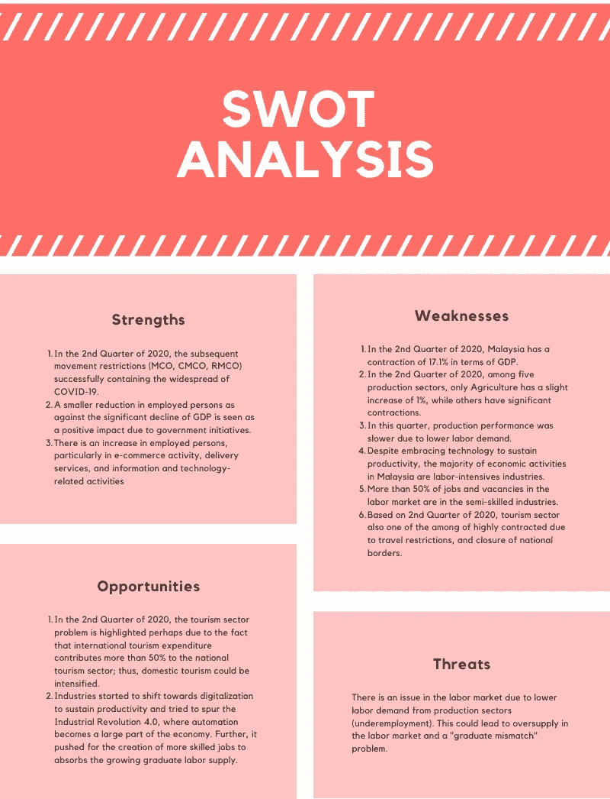**

****图一。** SWOT 分析**

## ****确定差距****

**根据 SWOT 分析结果中的机会部分，有两个潜在领域需要解决，因为我们的业务案例与新冠肺炎对马来西亚经济和 EAC 核心职能的影响有关。旅游业和劳动力市场领域。为了理解为什么这些领域与求解相关，需要进一步的简要阐述。**

****旅游****

**根据 2019 年旅游卫星账户，马来西亚旅游业对国内生产总值的贡献为 15.9%，其中超过一半的百分比来自国际旅游支出。由于“访问马来西亚 2020”的大型活动，2020 年预计将是马来西亚旅游业的一年，但随之而来的不是数百万游客，而是一种病毒。很难考虑酒店、航空公司、运输、当地企业(餐馆、街头摊点等)等子行业。)还得吃苦。因此，旅游业有望复苏，有助于国家的复苏。由于旅游业的最大份额来自国际支出，因此需要这样一个加强国内旅游的行动计划。**

****劳动力市场****

**为了保持生产力，各行业开始接受数字化，并进一步刺激工业革命 4.0，其中自动化成为经济的更大部分。然而，马来西亚的大部分经济活动都是劳动密集型产业。此外，劳动力市场中超过 50%的工作和职位空缺属于半熟练类别，48%的就业岗位属于分布在五个生产部门的中小企业。鉴于马来西亚统计局有关劳动力市场信息的最新报告，目前，失业率在 6 月份录得 4.9%后，仍为 4.7%。然而，由于新冠肺炎病例增加的最新趋势，失业问题甚至可能令人担忧。此外，较低的劳动力需求可能会影响劳动力市场的状况。**

**可能会出现两个问题:就业市场供过于求，特别是来自新毕业生的就业市场，并可能导致“毕业生错配”，即低技能工作被由于工作机会而预期从事高技能工作的毕业生占据。如果这个问题持续下去，毕业生的才能和技能就不能为经济发挥最大作用。因此，这样一个行动计划利用这种危机的势头来推动各行业刺激创造更多新的技术工作岗位，以吸收不断增长的毕业生劳动力供应，从而在长期内为国家经济做出贡献。**

## **可能的解决方案**

**根据确定的差距，有两个解决方案值得 EAC 考虑。**

1.  **制定短期行动计划，加强和促进国内旅游业。**
2.  **创建一个长期行动计划来刺激各部门，特别是在电子商务、送货服务以及信息和技术领域，以创造更多的技术工作岗位，并帮助吸收不断增长的毕业生劳动力供应，从而利用他们的潜力来最大限度地提高经济。**

## **B.文献评论**

**文献综述将提供敏锐的推理，说明旅游业和劳动力市场等领域如何与东共体考虑的新冠肺炎对马来西亚经济影响的商业案例相关。文献综述的摘要如图 2 所示。**

**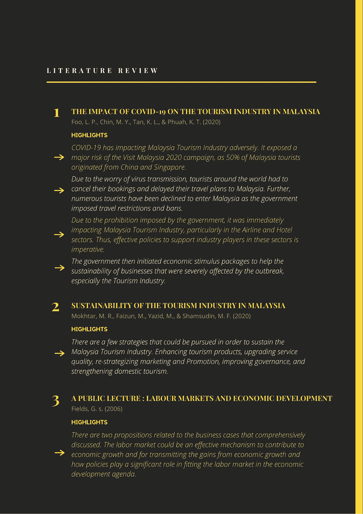**

****图二。**文献综述**

**文献综述显示了从三篇期刊论文中确定的重点，以支持旅游业和劳动力市场的相关性，作为 EAC 关注新冠肺炎对马来西亚经济影响的商业案例。**

****旅游****

**旅游业领域(Foo et al .，2020)随后讨论了新冠肺炎疫情给马来西亚旅游业带来的严重影响。它进一步指出，政府已经出台了一揽子经济刺激计划，以帮助企业，特别是旅游业的可持续性。**

**然而，经济刺激计划只能缓解压力，而不能治愈疾病；它不会持续足够长的时间，直到企业无法生存下去。因此，(Mokhtar 等人，2020 年)提出了一些适用的战略，以帮助旅游业部门的业务可持续性。在五项战略中，提到了加强国内旅游业。这一战略与马来西亚统计局指出的当前问题相一致，即国家旅游部门 50%以上的贡献来自国际旅游支出。**

****劳动力市场****

**劳动力市场领域(Fields，2006)强调通过有效的劳动力市场刺激经济发展的概念。此外，他讨论了通过劳动力市场实现经济发展的政策目标的重要性。回想之前在劳动力市场领域的讨论，作为商业案例，有两个问题；供过于求，“毕业生错配”潜力大。**

**这一领域的关键问题是，由于就业机会，劳动力市场对不断增长的毕业生供应的吸收能力较低。尽管存在就业不足问题，但就业人数有所增加，特别是在电子商务活动、送货服务以及信息和技术相关活动方面，马来西亚统计局如是说。这是一个机会，作为日益增长的毕业生劳动力供应的目标来源。**

## **C.商业目标**

**新冠肺炎疫情造成了巨大的全球生命损失，并对公共卫生、食品供应和全球整体经济状况构成了前所未有的威胁。因此，世界经济正竭尽全力在经济上生存。马来西亚的经济状况也不例外。因此，对情况的补救措施属于政策实施的范畴。**

**因为我们的商业案例是新冠肺炎；因此，我们设定的业务目标是*通过使供应过剩的劳动力多样化来加强国内旅游业，从而最大限度地减少疫情对经济的影响*。根据 CRISP-DM 法规扩展分析流程，需要根据 SMART 标准构建业务目标。SMART 代表具体的、可衡量的、可实现的、相关的和有时限的。图 3 显示了业务目标已经满足五个标准中的三个的理由。**

**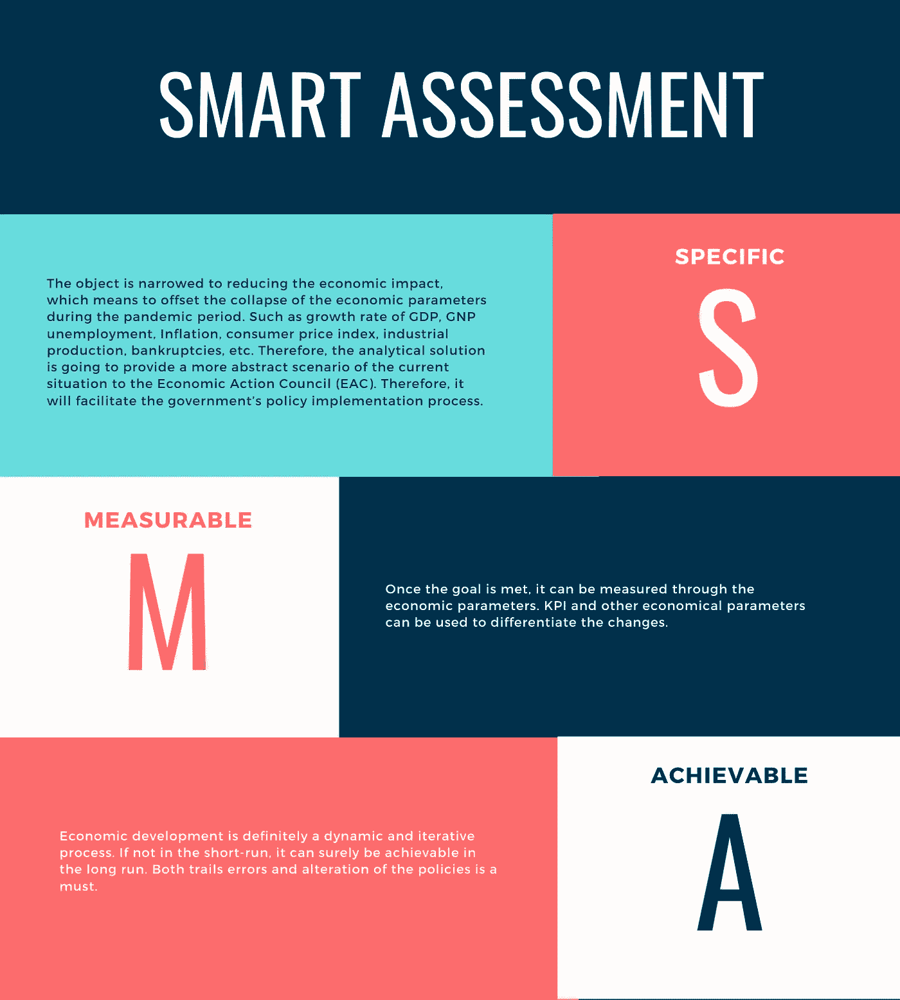**

****图三。**智能评估**

## **D.业务用例**

**ECA 是分析团队的利益相关方。东非共同体应采取政策援助旅游业，以减少新冠肺炎对经济的负面影响。50%的行业收入来自国际游客。因此，旅游部门的任何变化都会对经济产生重大影响。此外，劳动力市场受到疫情的严重破坏。很大一部分劳动力已经失去了他们唯一的收入来源。这种情况通过减少消费者支出来降低经济增长。**

**当劳动力需求下降时，劳动力市场一直面临着主要的劳动力供应。此外，不断上升的失业率有几个后果。如道德和伦理退化、青年精神崩溃、抚养比增加，包括增长率下降(失业率增加 1 %可使国内生产总值减少 2 %)。因此，劳动力的多样化是非常重要的。多样化可以通过创造新的就业设施或创造更多的就业机会来实现。**

## **E.业务问题和见解**

**业务问题有助于分析决策的洞察力。针对旅游和劳动力市场的商业问题明确描述、识别和指出当前形势、可能的选择和线索，以获得更好的洞察力。就劳动力市场而言，它不仅评估了当前的形势，而且指出了政府为弥补经济损失可以作出的选择。**

**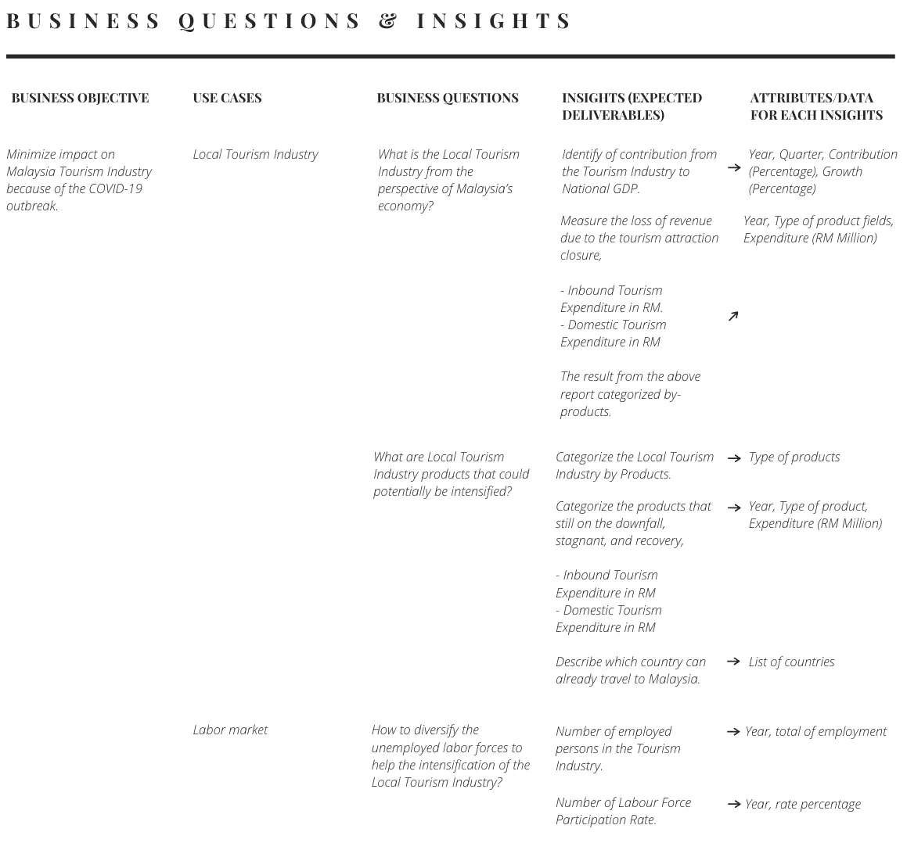**

****图四。**商业问题&见解**

# **数据理解**

**在数据理解阶段，需要执行三项任务。分别是*数据描述*、*数据有效性*和*数据探索*。任务的结果将解释如下。**

## **A.数据描述**

**大部分数据是从 MAMPU Data Terbuka 收集的。此外，汇总格式的数据集的共同特征(累积、百分比份额等。).此外，并非所有数据集都满足我们的主要要求，例如 Q1、Q2 和第三季度的 2020 年最新数据。因此，我们试图收集尽可能多的数据集，但与预定义的业务目标相关。**

1.  **失业率(1991-2020 年)**
2.  **旅游业比率(2005 年至 2019 年)**
3.  **劳动力参与率(1982-2020 年)**
4.  **国际游客收入(2000 年至 2019 年)**
5.  **国际游客抵达人数(2000 年至 2020 年)**
6.  **按产品划分的游客入境旅游支出(2005–2018)**
7.  **按部门分列的国内生产总值增长(2018-2020 年)**
8.  **旅游业就业人员(2005-2018 年)**
9.  **按产品划分的游客国内旅游支出(2005–2018)**
10.  **Covid 案(2020 年)**
11.  **消费价格指数(2019-2020 年)**
12.  **消费者信心指数(2010–2020**

**在管理数据集集合之前，我们收集了 20 多个数据集，并将它们管理为对解决预定义的业务问题最重要的 12 个。数据集的使用将用于不同的环境。图 5 显示了上下文的结构。**

**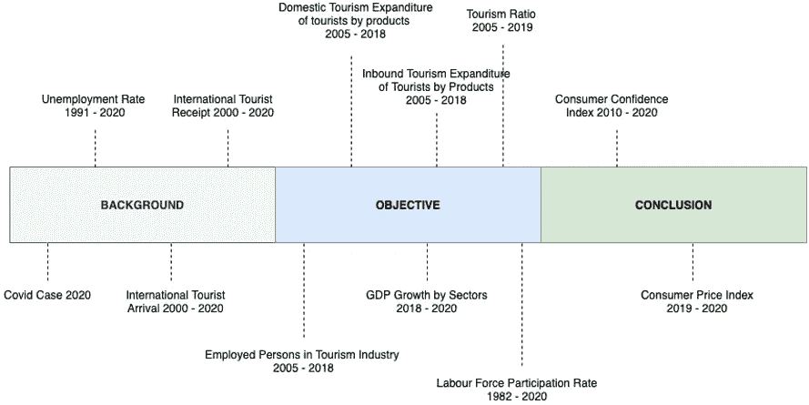**

****图五。**数据使用上下文结构**

**结构上下文由三个主要部分组成；背景、目标和结论。背景环境中的数据集将支持我们的业务用例的事实数据；当地旅游业和劳动力市场。客观背景下的数据集将为东非共同体提供关于当地旅游业强化机会的见解摘要。总之，该数据集将为当地旅游业强化计划提供额外的信心。**

## ****B .数据有效性****

**在我们完成数据集收集后，需要进一步的质量检查。质量检查非常重要，因为它可以发现数据集中的无效值、缺失值和非典型值等问题。质量检查的结果稍后将通过使用***alter yx****和 ***Python*** 执行数据处理来解决。***

**从数据有效性的结果来看，发现的大多数问题是**不典型**和**空值**。为了解决这个问题，我们可以对数据进行快速预处理。为了解决空值的问题，我们可以删除或估算它。为了进行插补，我们需要来自其他变量的其他信息。如果没有可以帮助进行插补的变量，我们将从数据集中删除这些行。**

## **C.数据探索**

**为了更好地理解收集的数据集，我们进行了进一步的快速数据探索，看看数据集是否有具有诸如*单变量*、*双变量*或*多变量*等特征的变量。数据探索是因为能够发现可能与我们预定义的业务用例相关的洞察力，并且有助于回答业务问题。因此，所研究的数据集是独立的(彼此不相关)，但我们可以使用一个数据集作为辅助工具来解释其他数据集(在插补备选方案的情况下)。**

# **提议的见解**

**我们已经执行了三个后续过程；数据描述、数据有效性和数据探索。然而，我们发现了可能有助于业务目标的新见解。图 6 显示了潜在的洞察力。**

**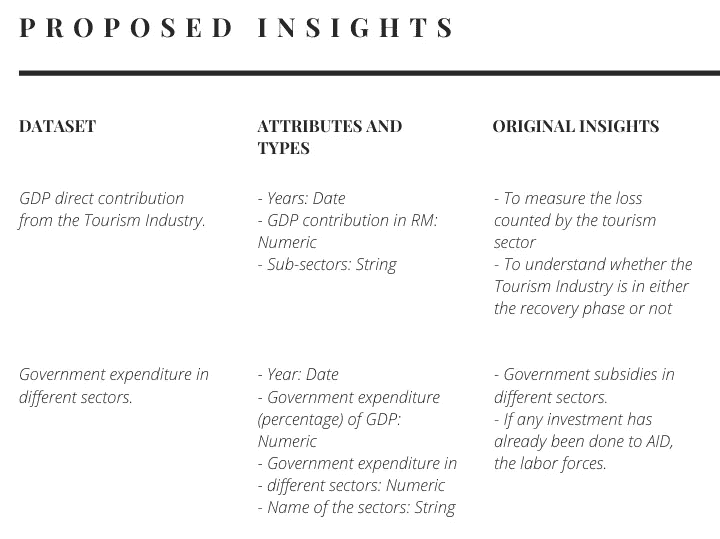**

****图六。**提出见解**

# **形象化**

**我们用已经使用 *Alteryx、Python、*和 *Microsoft Excel 预处理过的数据构建了数据可视化。*我们使用 *Tableau* 进行可视化，并按照预定义的数据使用上下文结构将数据编译到不同的仪表板表示中(参见图 5)。我们利用 Tableau story 功能来帮助我们以讲故事的方式排列仪表板。下面是展示可视化结果的一系列图表。每一个可视化上面都有一个描述，我们确保图形的表示是自我解释的。**

****马来西亚的新冠肺炎****

**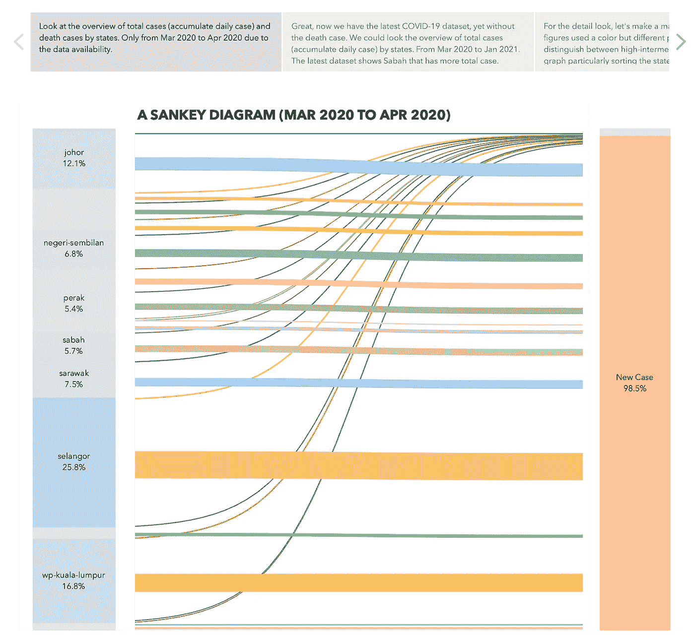**

****图 7。**2020 年新冠肺炎病例的桑基图**

**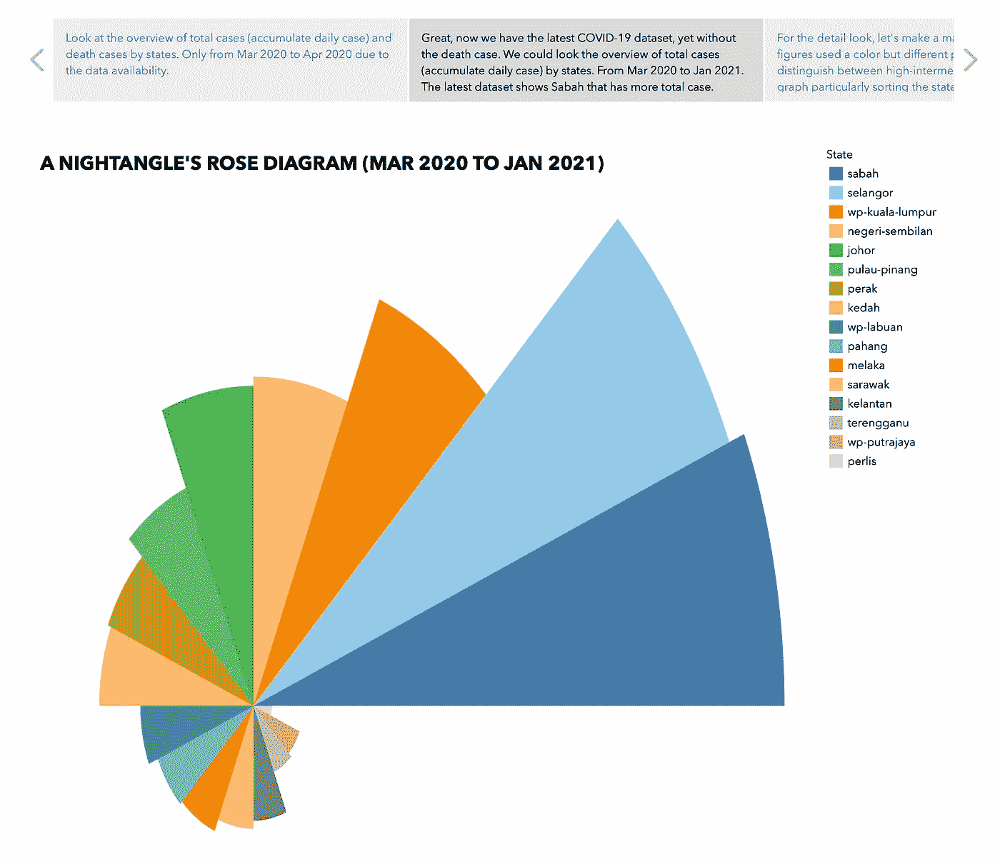**

****图 8。**按州分组的新冠肺炎病例总数的南丁格尔玫瑰图**

**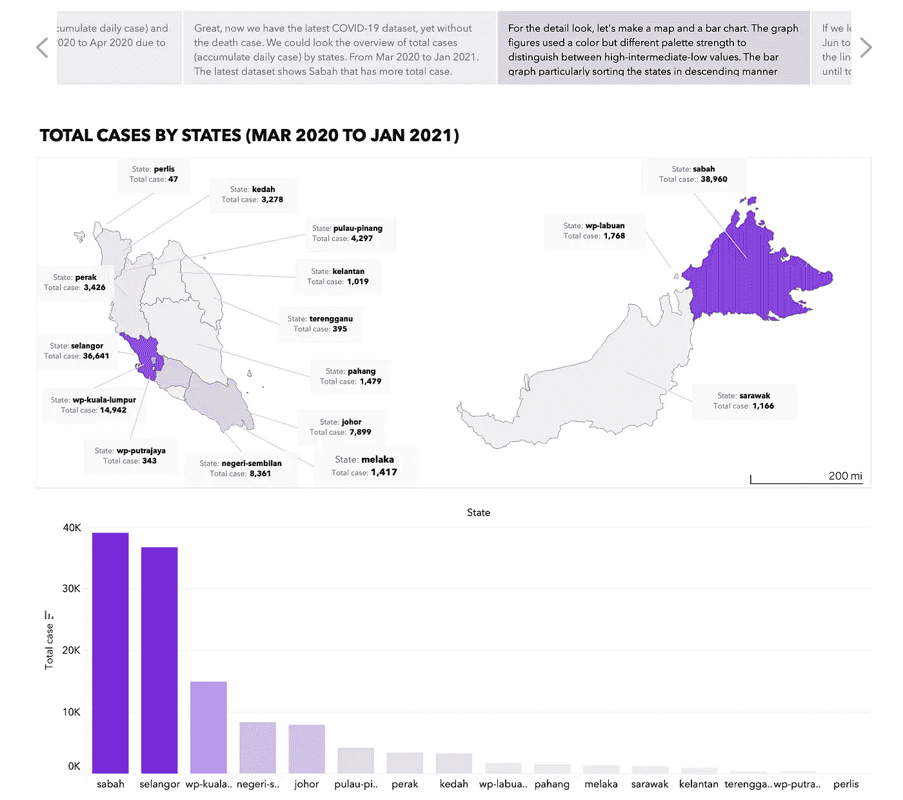**

****图九。**显示新冠肺炎病例总数的仪表板，按州分组，用地理图和分级条形图表示(从高到低)**

**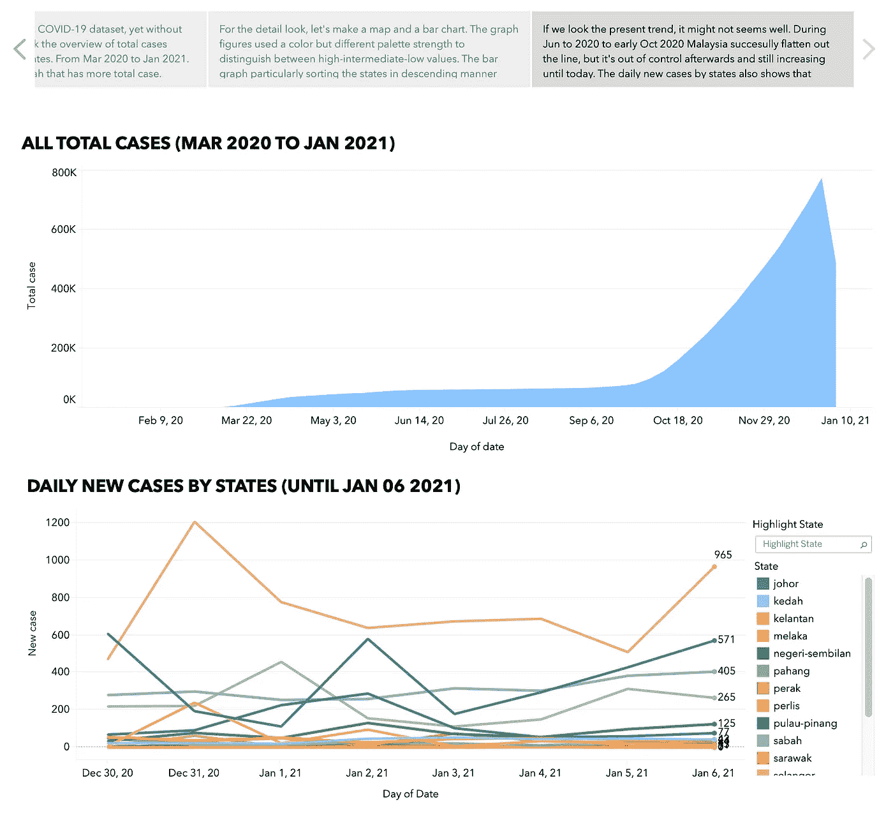**

****图 10。**显示所有州合并的新冠肺炎病例总数和按州分组的每日新病例的仪表板，以面积图和折线图表示**

****马来西亚的旅游业****

**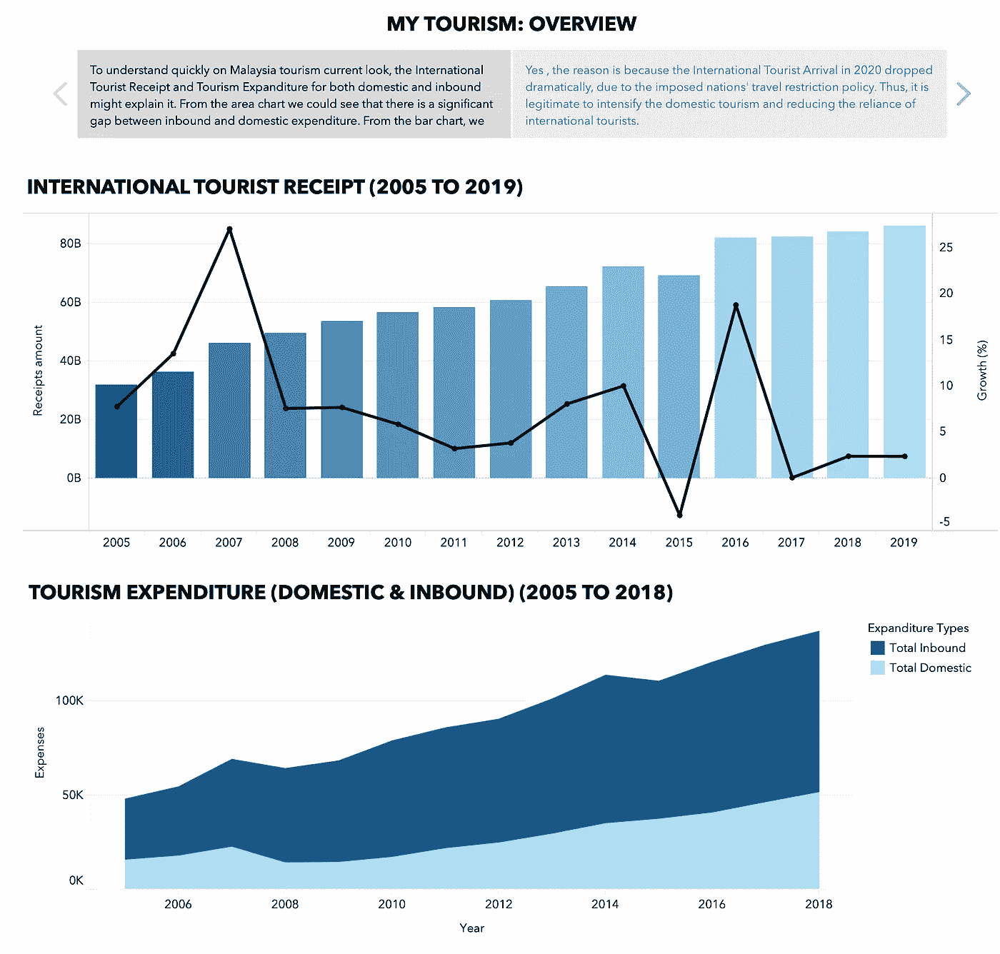**

****图 11。**显示国际游客收入(2005 年至 2019 年)和国内及国际旅游支出(2005 年至 2018 年)的仪表板**

**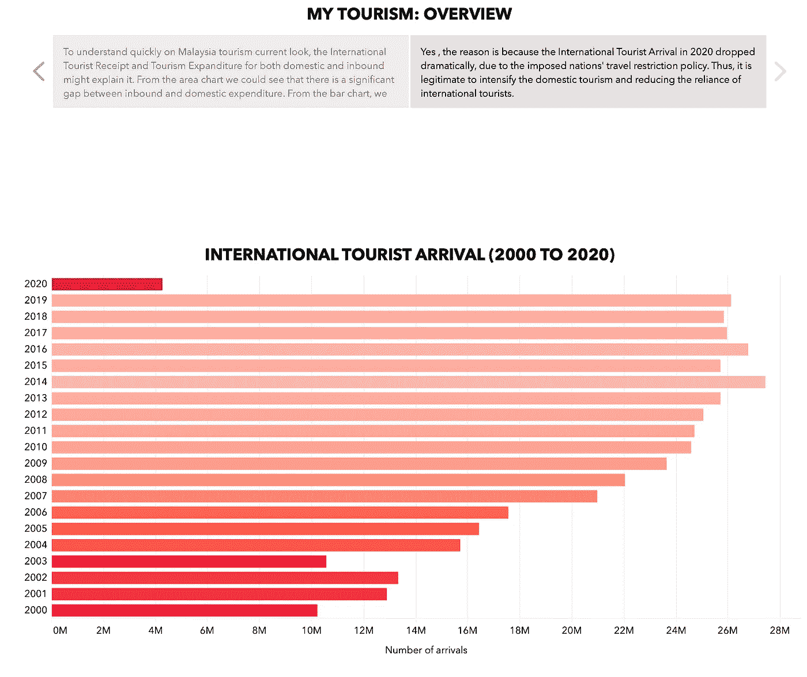**

****图 12。**显示国际游客到达情况的仪表板(2000 年至 2020 年)**

****马来西亚的劳动力市场****

**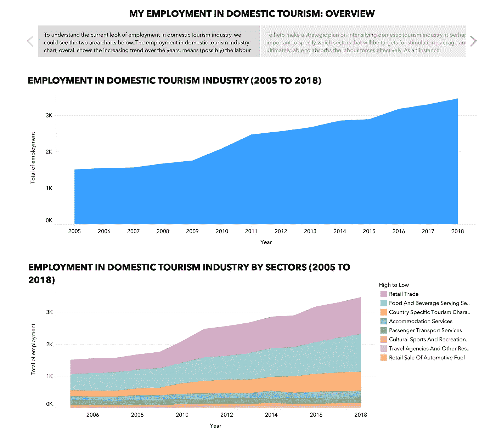**

****图 13。**显示国内旅游业就业情况(2005 年至 2018 年)的仪表板和按行业分组的仪表板**

**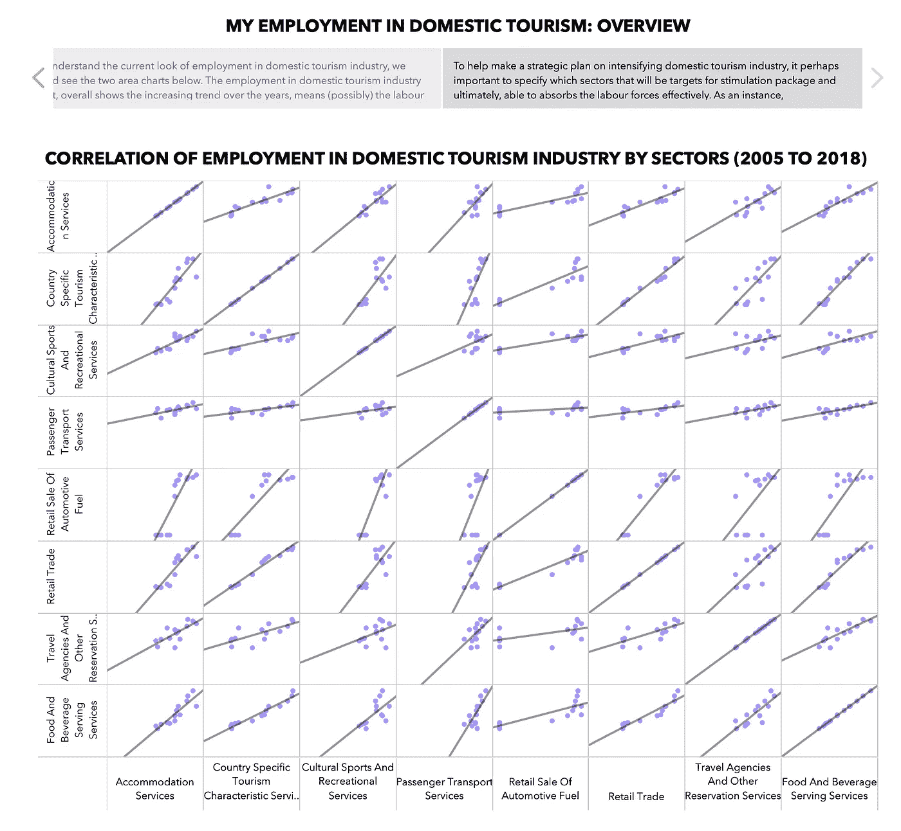**

****图 14。**散点图显示了旅游行业的就业相关性**

****公制****

**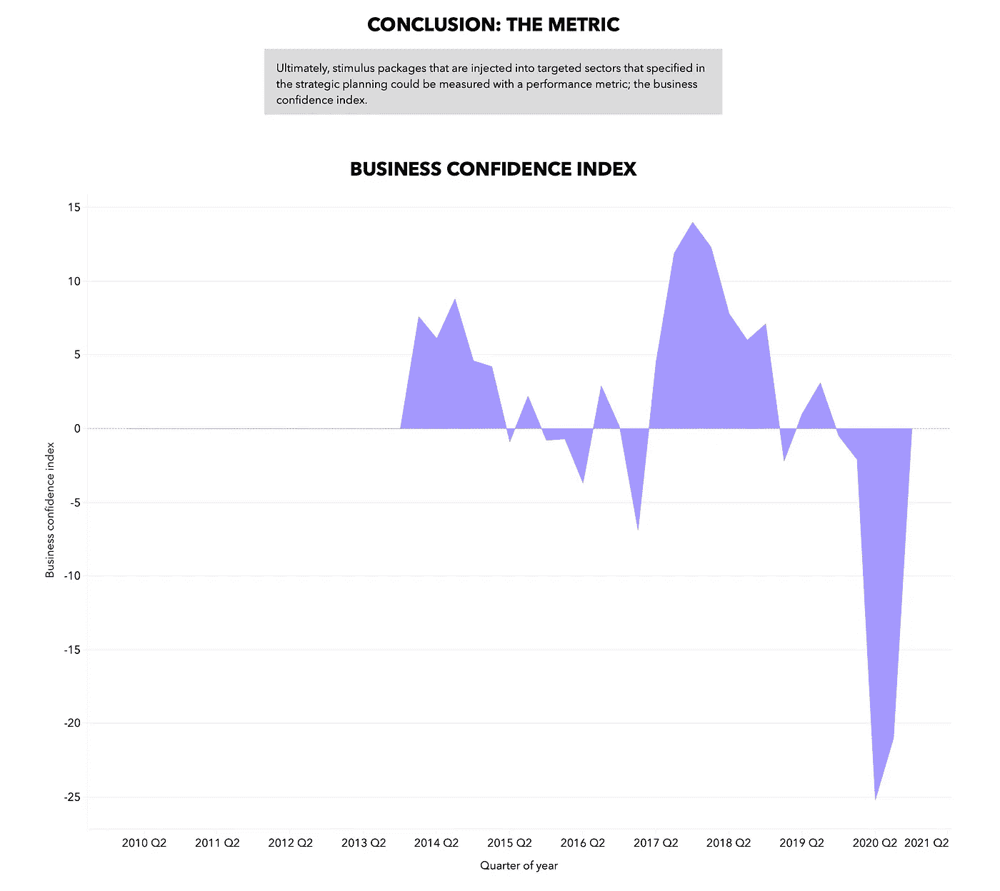**

****图 15。**面积图显示商业信心指数**

# **可视化中呈现的分析如何促进业务理解？**

**故事中发展和安排的分析是系统化的，并且相互关联。这使得故事组件之间的点连接变得更加容易。我们来做一个叙述流程，以便于理解。我们的目标是*多元化* *劳动力供过于求来强化国内旅游业* 由于新冠肺炎疫情造成的失业冲击。那么，*我们需要做什么？*收集围绕马来西亚新冠肺炎、马来西亚国内旅游业、旅游业就业以及商业信心预期指数的数据集。随后，数据集将被制作成许多较低的可视化图形，并按顺序排列，希望能为实现目标提供基础。**

**较低的可视化图形的集合然后被分组为完整故事的三个不同的主要组成部分。*它是如何工作的？*当前组件将提供基本基础，并作为后续组件的过渡和背景。为了清楚地了解它的样子，请看图 16。**

****

****图 16。**组件在整个故事中的作用**

**有两个术语需要理解；*提问*和*回答。*这是什么意思？ *ask* 就是一个组件需要前一个组件提供额外的信息来证明驻留在*ask*组件中的信息。a *nswer* 简单来说就是一个组件向它的后续组件提供附加信息。因此，如果我们回到确定的目标，加强国内旅游业的想法需要得到新冠肺炎案例的支持，这是有意义的，然后我们能够说“嘿，由于新冠肺炎的 ，国内旅游业正在发生一些事情。让我们制定一项战略来解决这个问题”。**

**然后，在观察了故事的客观组成部分之后，战略计划可能会出现，随后会被执行。为了实际查看战略计划执行后是否有任何差异，应该有一个需要评估的指标。商业信心指数(BCI)可以被认为是衡量未来一段时间的商业信心预期，例如在一个国家的范围内每月或每年。**

# **结论**

**当然，该报告中开发的分析可能会得到改进，以便为业务理解提供更全面的信息，从而导致更多更有效的业务决策。然而，在这种分析的开发过程中，我们面临两大挑战:汇总数据，缺少近期数据，即 2019 年和 2020 年的数据。因此，为了支持信息的缺乏，我们收集了许多数据集，然后筛选出最有用的来实现目标。为了进行更详细的分析，可以借助机器学习等高级统计学来开发高级建模。也许，先进的数学建模可能有助于估计国内旅游业目标部门的预算议程，并有效地吸收劳动力，最终实现既定目标。**

# **参考**

```
**1\. Fields, G. s. (2006). A public lecture : Labour markets and economic development. *Journal of Eastern Caribean Studies*, *31*(2), 72–84.2\. Foo, L. P., Chin, M. Y., Tan, K. L., & Phuah, K. T. (2020). The impact of COVID-19 on tourism industry in Malaysia. *Current Issues in Tourism*, *0*(0), 1–5\. https://doi.org/10.1080/13683500.2020.17779513\. Mokhtar, M. R., Faizun, M., Yazid, M., & Shamsudin, M. F. (2020). Sustainability of tourism industry in Malaysia. *Journal of Postgraduate Current Business Research*, 1–3.**
```