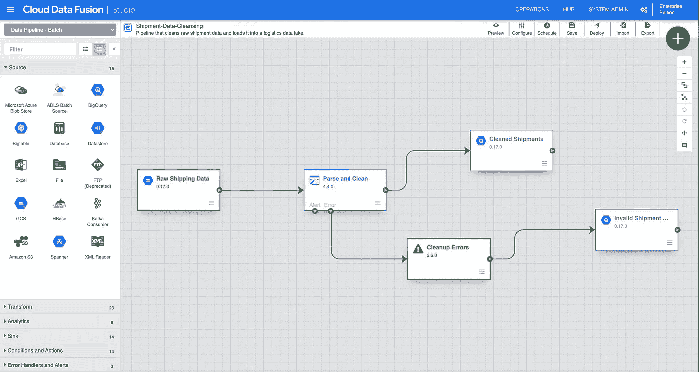
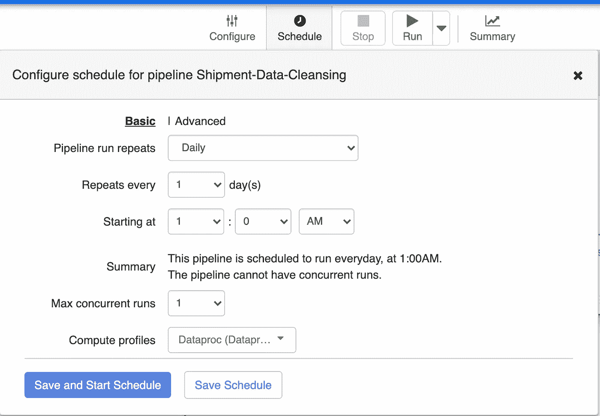
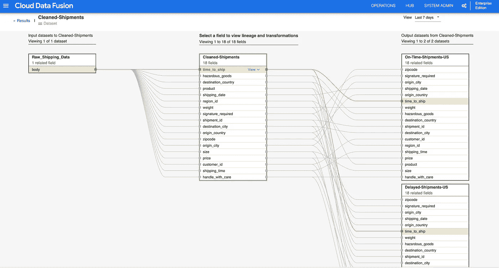
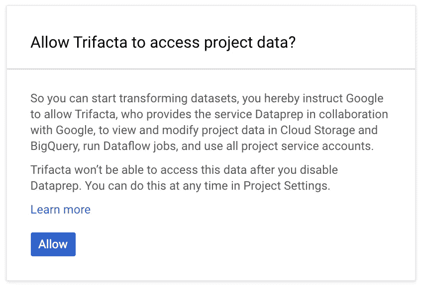
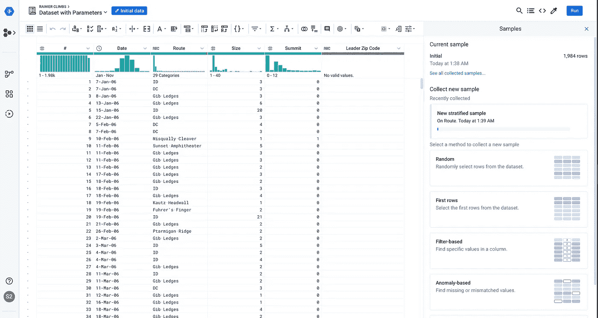
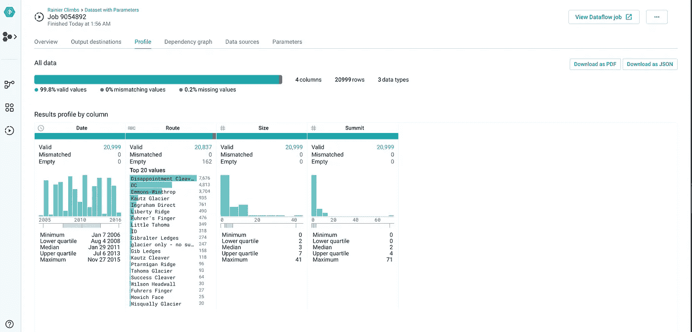

# GCP 上的企业 ETL 自动化

> 原文：<https://medium.com/nerd-for-tech/enterprise-etl-automation-on-gcp-6b5f545f3027?source=collection_archive---------2----------------------->

大型企业绝不会只有一两个数据源。他们总是需要从数十或数百个地方获取数据，如果不是数千个的话。在公司早期，可能以几个 shell 脚本开始，可能已经变成了任务的 crontab，这变成了 cron 依赖关系的蜘蛛网，最终您会让项目管理人员嗅着您部门的脖子说“为什么这个 ETL 过程总是失败，并浪费我们的钱？”。最终会有一个项目来清理你的技术债务，把所有东西都放在一个平台下。

问题变成了，“我们如何控制这一切？”，您将开始研究不同的 ETL 工具。让我们来看看 GCP 在这一领域能提供什么。

# 工具和范例的选择

其核心思想很简单——使用一个框架来减少手工工作量。这意味着不再有 shell 脚本或雪花风格的执行虚拟机。我们有可重复使用的组件和快速开发工具。谷歌的所有产品在某种程度上都符合要求，但在细节上有所不同。

我们有以下托管服务选项:

*   cloud Composer——开源的 apache airflow。
*   云数据融合—开源数据集成、转换和分析工具。
*   Cloud Dataprep —针对数据集成、转换、清理和分析的封闭源代码合作伙伴解决方案。

您选择使用哪一种将取决于您团队的技能、您公司在数据方面的法律地位以及您的预算。

## 云作曲家

Airflow 是基于 python 的——通过编写 python 代码来开发管道。在这里阅读更多:[https://mark-mccracken . medium . com/air flow-data flow-scalable-secure-and-reliable-data-integration-AAC 925195 a 56](https://mark-mccracken.medium.com/airflow-dataflow-scalable-secure-and-reliable-data-integration-aac925195a56)。

如果您的团队不精通 python，这可能是一个即时拦截器。当事情不可避免地出错时，您需要能够阅读文档、堆栈跟踪，并且熟悉编写一些 python 的基础知识。您还需要熟悉 kubernetes，因为 composer 在 kubernetes 集群中部署工作人员资源，所以如果出现问题，您需要能够投入并调试，或者让您的基础架构或运营团队中了解 airflow 和 kubernetes 架构的人来为您做这件事。

然而，如果以上都不是问题，那么 cloud composer 可能是一个很好的选择。在这里，用 python 编写代码提供了最大的灵活性。Airflow 还有一个非常先进的[调度器](https://airflow.apache.org/docs/apache-airflow/stable/scheduler.html)，因为这是主要目标之一。回溯一月份每个星期二的一段数据将是一件相当简单的事情，尽管这需要一定的学习过程，但如果做对了，这将是一件好事。它提供了很大的灵活性和强大的依赖管理特性，以确保您的 ETL 过程以正确的顺序运行。

气流是开源的，社区经常有更新。他们最近推出了 airflow 2.0，看起来好像不是在 21 世纪初建造的——但你可能需要耐心等待它在谷歌的云合成器中着陆。airflow 最吸引人的一个方面是能够毫不费力地编写任意 python 代码，如果您发现自己在重复使用相同的代码片段或代码区域，那么将它们转换成简单的可重用操作符是相对容易的。

我过去使用过的一个这样的例子是 tableau 数据集刷新操作符——在您为 tableau 工作簿所需的数据源完成 ETL 依赖项之后，运行一个小任务来刷新 tableau 中的数据源。这使您的 BI 团队能够尽早将最新数据发布给企业。

如果您使用的是 SaaS 产品，或者您的 tableau 服务器的本地 API，那么这个操作符只是对 tableau 的公共可用 API 的几个 API 调用，看起来是这样的:

这并不复杂，它只是用一个 execute 方法将一个 python 脚本放到一个类中。这对于初学 python 的开发人员来说并不困难，因为他们的代码是可重用的。这就允许我们编写看起来非常自然的工作流(称为有向无环图，或 Dag):

Google 的 Cloud Composer 是开源工具的一个可靠的现代实现。它[定期更新](https://cloud.google.com/composer/docs/release-notes)，默认情况下相当安全。你为你能够访问的底层 kubernetes 资源付费，在你看不到的对等项目中的应用引擎上运行的 web 服务器，以及保持不可访问的后台数据库——然而，如果你*非常*坚定，你可以通过 kubernetes 集群连接到它。但是这些组件被隐藏起来是有原因的，您可能不想摆弄它们。谷歌在确保你的平台持续运行方面做得非常好，你不需要深究它。对于您所消耗的资源来说，价格是非常合理的，实际上并不比您自己使用相同的组件来运行和管理它所支付的费用多。

由于它非常基于代码，但主要是围绕一个有良好文档记录的框架进行抽象的，所以 airflow 将让任何熟悉 SQL 和 python 编码的人对他们的新工具感到满意。

## 云数据融合

数据融合基于一种名为 CDAP 的开源工具，来自一家名为木桶的公司，谷歌在 2018 年收购了该公司，以支持他们的数据解决方案产品。这里的目标受众似乎是企业数据仓库团队，他们需要从不同来源获取大量数据，并且希望花尽可能少的时间编写代码。

该环境基于一个 web 应用程序来创建数据管道，用于从源接收数据，通过一系列转换和分析步骤运行数据，并将输出定向到目标接收器。就外观和感觉而言，它就像是 2000 年代中期的产品，由数据工程师为数据工程师打造:

云数据融合 UI 截图

我必须承认，我已经创建了专注于前端用户体验的应用程序，以及几个用于数据操作和协调的工具——后者不知何故在外观部门没有得到太多的爱，CDAP 背后的团队应该感到自豪，因为我的是功能性的，但更可怕！也许是另一篇文章的故事。

那么用起来是什么感觉呢？功能性。它能完成任务。它的布局非常简单，可以很快找到您要找的东西，并且有大量预构建的连接器、转换和接收器，可以将您的数据整理到位。有一个非常直观的数据管理器，在玩了一两个小时后，你会感觉很舒服。每次作业运行后，您都会获得作业中已完成工作的分析，以查看摘要数据信息。

解析字段、操作字段、更改数据类型、过滤和聚合的简单规则

底层工具 CDAP 有几个重要的方面很有趣，它是开源的，所以如果您对本地基础架构有复杂的业务需求，您也可以要求您的基础架构团队推出这种工具。工作的底层工人是 Hadoop 集群，或 GCP 上的 Dataproc。这意味着每条记录都是手工获取和处理的，因此您实际上可以从每个输出任务中获得单独的提要，包括成功和失败的记录，并相应地处理它们，我认为在企业数据仓库方面有经验的团队会发现这非常有用。这里的计算模型也很有弹性，但与其他平台相比，开始工作会感觉有点慢。

理论上，这应该是所有人都不用管的，但是如果出现问题，您将需要对 hadoop 集群、流程和日志消息有一定程度的了解才能解决，这可能是一个痛苦的经历。你可以为平台开发新的插件，但这是用 Java 完成的，当你想要一个“无代码 ETL 环境”时，这可能不是你注册的。

有一个调度器，它可能满足基本需求，但它远不如 airflow 的调度和回填功能先进:

基本日期安排

数据融合有不同的层次，但任何规模较大的团队都会要求企业版，最低每月 3000 美元，这还不包括员工的执行环境，只包括服务。这听起来很多，但很可能符合同一领域的其他企业级工具。

CDAP 提供了一个数据沿袭工具。就我个人而言，我觉得数据血统对每个组织来说都是“最好的”，但在实践中，当它存在时，我并没有看到它实际上被使用得很多。我所看到的实例有所帮助的次数，比创建和维护它所花费的努力要少得多。我发现 BI 平台中的两个不同报告更有可能显示相互矛盾的数字，并且数据沿袭工具通常可能无法到达数据管道的这一端，以告诉项目可能在哪里发生了分歧。

显示数据字段源和下游目标的数据沿袭视图

这一点也不吸引人，但这可能只是一个大型企业将大量流程整合成一种通用格式的工具，这一价值主张肯定会带来回报。没有什么严重的缺点，这个工具非常强大。

## 云数据准备

现在这一张让人眼前一亮！肯定是针对数据分析师和矿工的，这对于分析数据的质量和稀疏性非常有用。如果您有杂乱的数据源，这看起来是将它整理成形的完美工具。

这个特殊的工具有一些重要的警告，所以要小心:它不是开源的，是由 Trifacta 和谷歌合作提供的，所以这意味着要和你的法律团队讨论允许他们的平台看到你的数据。没有开源的对等物可以迁移或部署。除非您严格地处理 GCS、sheets 和 BigQuery，否则额外的连接器会带来巨大的开销，而且每个用户都有一个许可模型。然而，如果这些都没问题，那你就有得吃了。

这种体验围绕着从数据源获取数据，并在一个高度专业化的数据管理器面板中完成大量工作

牧马人的 dataprep 用户界面截图

顶部的专业栏提供了数据的多样性、质量和稀疏性的概览。操作工具使用起来很简单，感觉更像是在编辑谷歌表单，而不是在一个笨重的数据库工具中工作。您可以从非常大的数据集中提取样本，以了解转换的大致情况，甚至可以使用高级采样功能进行重新采样，例如分层采样！该工具的质量给我留下了深刻的印象，它可以通过一个奇妙的预览窗格执行连接，并且操作能力与一些高级 bigquery 特性相当。我真的被它的一些功能震惊了，比如 pivots、macros 和数据标准化，几个小时后，我会向我认识的几个喜欢以这种方式工作的人全面推荐它，这些人很不幸地不得不经常处理杂乱的数据。

工作人员运行数据流作业，根据需要接收和转换数据，这些作业的速度非常快。您可以从 GCP 控制台的数据流 UI 页面获取作业指标，也可以在工具的 UI 中获取类似于数据融合的数据分析:

工作后数据分析指标

Trifacta 还为高达 1GB 的数据集提供了内存解决方案，它启动和执行作业*的速度非常快*！无需等待 2-3 分钟来启动数据流作业，也无需等待它再次停止，只需开始即可。虽然我们只是在谈论几分钟，但当它被消除时，它会让你保持在工作流程中。

有什么条件？

*   [的定价模式](https://www.trifacta.com/pricing/)并不便宜。除非你专门使用 google sheets、GCS、bigquery 和本地 CSV，否则你需要支付专业版来连接其他来源，每月 400 美元，每个用户**。对于一个 5 人团队来说，在你支付任何数据处理费用之前，一年就是 25，000 美元！**
*   **连接器丢失？太糟糕了，因为你不会开发插件。**
*   **我提到价格了吗？如果您想要更高级的功能，如单点登录，您需要通过他们的销售部门。**

# **我们应该在团队中使用什么？**

**这些工具都有不同的方法和受众。如果你有一个舒适的开发团队，Cloud Composer 可能是一个很好的选择，但是仍然需要一个学习曲线来适应，就像任何框架一样。云数据融合和 Dataprep 可以以类似的方式工作，尽管您应该在深入研究之前考虑您的业务约束。**

**如果发现企业将 Cloud Composer 与其他一些工具混合使用，只要它们适合团队的技能，我不会感到惊讶。Airflow 有操作员可以接触到数据融合和[启动管道](https://airflow.apache.org/docs/apache-airflow-providers-google/stable/operators/cloud/datafusion.html#start-a-datafusion-pipeline)，同样的还有在 Dataprep 中运行作业组的[。](https://airflow.apache.org/docs/apache-airflow-providers-google/stable/operators/cloud/dataprep.html#run-job-group)**

**如果这些看起来都不吸引人，或者不够端到端，还有第三方企业等着拿走你的钱并完全为你管理你的 ETL，如 [FiveTran](https://fivetran.com) 和 [tray.io](https://tray.io) —这些平台为你提供来自数百个来源的数据集成，所有这些都在几分钟内完成。它们非常有用，可以以良好的格式将您的数据直接放入您的仓库，但是当涉及到您自己的定制 ETL 工具时，您的收益可能会有所不同——如果一个大型企业能够完全依赖这些 ETL 工具，我会感到惊讶，但是当我使用它们时，它们肯定有增值。**

**或者，如果所有这些对你的团队来说太重了，Google 还提供工作流，一种完全无服务器的方法。如果云功能是事件的粘合剂，那么工作流将是 it 在流程和调度方面的合作伙伴。这是一个非常年轻的产品，可能适合更小更敏捷的团队，但可能是你正在寻找的[非常简单的用例](https://cloud.google.com/workflows/docs/sample-workflows)。**

**我最想推荐的是，为你团队中将要使用该平台的几个成员获得一些 qwiklabs 积分，让他们试驾 [Data Fusion](https://www.qwiklabs.com/catalog?keywords=Building%20Codeless%20Pipelines%20on%20Cloud%20Data%20Fusion) 和 [Dataprep](https://www.qwiklabs.com/quests/156?catalog_rank=%7B%22rank%22%3A1%2C%22num_filters%22%3A0%2C%22has_search%22%3Atrue%7D&search_id=10754989) 几天，并使用案例来了解这些工具，然后向他们报告这些工具有多有用。没有什么比亲身体验更能熟悉事物，并做出正确的评估了。**