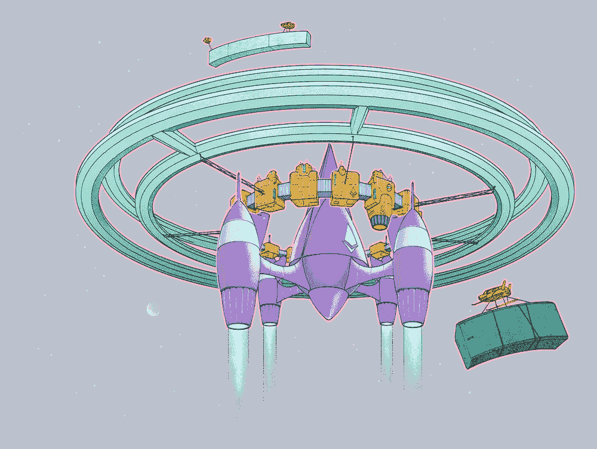

# ETH 2.0 来了！

> 原文：<https://medium.com/nerd-for-tech/eth-2-0-is-coming-1ab212708ec8?source=collection_archive---------5----------------------->

关于即将到来的以太坊升级，你需要知道什么

作为一名程序员和区块链爱好者，我想简要地写一下以太坊网络即将到来的升级。如果你有兴趣，但对区块链并不了解，如果你想快速了解区块链和加密货币，可以查看我以前的帖子[这里](/geekculture/what-is-blockchain-technology-simply-explained-3e71d56ae415)。

# 事实真相

ETH 2.0 又名项目“serenity”是以太坊网络的一系列升级，使其更具可扩展性、更安全、更节能。

目前，Eth 每秒只能支持大约 15 笔交易，这已经是比特币速度的两倍，但 ETH 2.0 旨在通过将速度提高到每秒 1000 笔交易来实现更大的可扩展性

ETH2.0 旨在通过从工作证明转变为堆栈证明，使执行 51%攻击变得更加困难，从而变得更加安全。在 ETH 2.0 中，51%的攻击仍然是可能的，但是控制 51%的赌注 ETH 似乎要困难得多，因为你需要实际拥有这么多 ETH，而不是当前的工作证明系统，在当前的工作证明系统中，你可以用 51%的采矿能力对网络进行攻击。

ETH 使用的当前工作共识模型证明需要太多的能源，因为随着网络的增长，它需要越来越多的矿工，而 ETH2.0 旨在通过采用利益证明来提高能效。

# 利害关系证明

即将到来的从工作证明到股权证明的变化将消除矿工验证新区块的需要，相反，以太坊网络将向 ETH 所有者支付至少 32 个 ETH 的股权，以随时准备在网络上验证新交易，如果它们被选中的话。这对于能源效率来说非常好，因为它只需要一个被挑选来验证事务的 ETH staker 的计算能力，而不是使用多个挖掘器的计算能力来验证一个事务。

# 分片

分片是编程中的一个常见概念，它将数据库分成多个数据库，其中只包含整个数据库的一部分。ETH2.0 旨在使用这一概念在升级时将他们的区块链分成 64 个碎片链，这将允许多个事务在每个单独的碎片链上运行。这对于可扩展性来说是非常好的，因为新的 ETH 网络可以根据网络规模的增长，在每个部分处理成千上万的事务。

# 信标链

信标链是利益系统的证明，一旦 ETH 2.0 发布，信标链将成为管理所有其他碎片链的碎片链。其他碎片链将处理事务，而信标链将负责重要的事情，如分配随机的 ETH stakers 来验证新的事务，在不同的碎片链之间传输状态数据，并支付验证器。

# 合并

正式名称为“对接”。这将是 ETH 开发者将 Beacon 链与当前以太坊 mainnet 合并的最后阶段，成为第一个碎片链，标志着 ETH 2.0 的开始。这是工作证明结束的时候，希望它将邀请新用户使用新的可扩展性因素，并对总督埃隆·马斯克本人来说足够节能。

# 结论

作为一名以太坊用户，我喜欢以太坊网络即将到来的所有升级，我迫不及待地想看到它在 2022 年 Q1 发布时的表现。

感谢您的阅读，如果您喜欢并关注更多编码和技术内容，请留下您的评论。