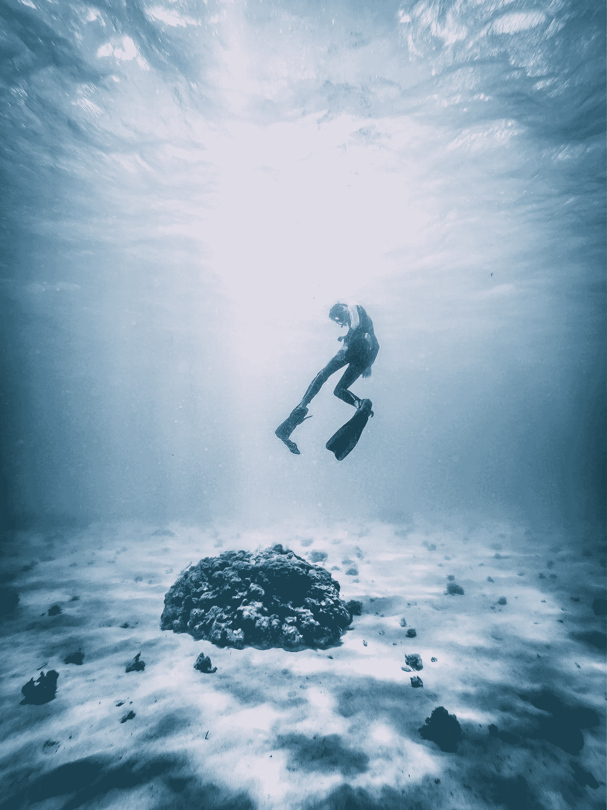

# 欧洲开发收集海底垃圾的机器人系统，可以自主区分垃圾和海洋动植物

> 原文：<https://medium.com/nerd-for-tech/europe-develops-a-robotic-system-for-collecting-seabed-garbage-which-can-autonomously-distinguish-c3c4e042ad3d?source=collection_archive---------0----------------------->

## “清洁海洋”的机器人系统

最近，一个欧洲研究小组开发了一种可以在水下收集垃圾的机器人系统，并成功进行了原型的首次测试。该机器人系统由四个自主机器人组成，能够通过深度学习算法和声学传感器区分海洋动植物的垃圾。

在“地平线 2020”框架下，欧盟已向海底垃圾收集项目拨款 500 万欧元，希望开发一种机器人系统来收集海底垃圾。这个名为“清洁海洋”的联合研究项目已经成功完成了第一次测试。该项目涉及来自 5 个国家的 8 个合作伙伴和 49 名研究人员。

“清洁海洋”项目的机器人系统由四个自主机器人组成，包括一艘自主(或遥控)母船、一架无人机和两个水下机器人。这两个水下机器人由母船上的电缆供电。无人驾驶飞机和一个水下机器人被用来识别垃圾。他们使用深度学习算法和声学传感器来区分垃圾和海洋动植物。使用定制设计的抓取器和抽吸装置收集探测到的垃圾，并放置在水面上的收集箱中。

在空中飞行的无人机可以根据收集到的信息生成虚拟地图。水下机器人然后驶过地图上的某些点并收集垃圾。通过所谓的多智能体控制技术，所有机器人都相互连接。当一个机器人改变位置时，其他人会知道。除了来自机器人的初始命令，整个系统不需要人工干预。

参与该项目的德国慕尼黑工业大学为机器人提供了人工智能算法，这些算法可以教会水下机器人何时以及在何种条件下以某种方式移动。一旦发现并定位了垃圾，机器人将坚持在它周围移动，即使遇到强大的潮汐。清洁海洋项目的目标是以 80%的预测率对水下垃圾进行分类，并成功收集 90%，大致相当于潜水员所做的工作。

## 对高质量人工智能训练数据的大量需求

目前，各行业对最优质的 AI 训练数据需求迫切。AI 在多个领域实现，如教育、法律、智能驾驶、银行、金融等。每个领域都有细分和专业化的要求。

其中，尤其是智能转型的传统企业和科技企业，更需要有丰富项目经验的培训数据服务商的协助，帮助整理数据标注指令，获取更适合的数据。在特殊场景下使用高质量的数据，减少研发周期，加速实施过程，帮助企业更快更好地进行智能化转型。

在深入的产业落地过程中，人工智能技术与企业需求仍有差距。企业用户的核心目标是利用人工智能技术实现业务增长。人工智能技术并不能直接解决所有的业务需求。它需要创建可以基于特定业务场景和目标大规模实现的产品和服务。

我们需要明确的是，对于 AI 公司和整个行业来说，数据标注是实现人工智能必不可少的一部分。标注数据的准确性和效率影响着人工智能算法模型的最终结果。

## 结束

将你的数据标注任务外包给 [ByteBridge](https://tinyurl.com/ytb2bkwf) ，你可以更便宜更快的获得高质量的 ML 训练数据集！

*   无需信用卡的免费试用:您可以快速获得样品结果，检查输出，并直接向我们的项目经理反馈。
*   100%人工验证
*   透明标准定价:[有明确的定价](https://www.bytebridge.io/#/?module=price)(含人工成本)

## 为什么不试一试？

来源:https://www . robot-China . com/news/202201/17/69489 . html