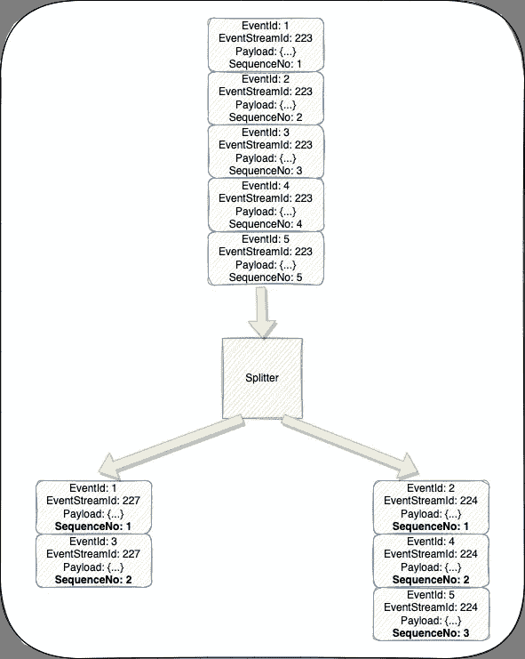

# 事件来源-哎呀，错误的聚集边界

> 原文：<https://medium.com/nerd-for-tech/event-sourcing-oops-wrong-aggregate-boundary-74b4e98249f4?source=collection_archive---------1----------------------->

我如何共享流来拆分聚合以及为什么？

[亚历克斯](https://unsplash.com/@worthyofelegance?utm_source=medium&utm_medium=referral)在 [Unsplash](https://unsplash.com?utm_source=medium&utm_medium=referral) 上的照片

对于大多数 DDD 项目，在对解决方案域建模和开始实现之前，您试图尽可能好地理解问题域。现在，在一个理想的世界里，你可以接触领域专家，有时间从他们那里提取和记录尽可能多的知识来帮助建模过程。也许甚至可以举办一些“事件风暴”会议。然而，你通常没有这种奢侈，你从最不了解的地方开始建模。

从不完美的模型开始不是问题，因为没有完美的模型。 [Eric Evans 有一个伟大的演讲](https://www.youtube.com/watch?v=lY54TmmEllY)关于一个好的设计是不完美的。因此，改造一个领域并不罕见；相反，这是意料之中的。

当您将事件源添加到组合中时，这个过程变得更加复杂。这是因为您现在进入了仅附加模型的领域。在以后的帖子中，我将讨论这对于事件版本化意味着什么，但是这里我想具体讨论我在事件源聚合中遇到的一个问题，以及我选择如何解决它。

## 错误的聚集边界

随着需求的发展，系统变得与我预期的完全不同，因此也与我对问题域建模的方式完全不同。很明显，这个集合做得太多了，我需要把它分开。

Andrey Metelev 在 [Unsplash](https://unsplash.com?utm_source=medium&utm_medium=referral) 上拍摄的照片

## 聚合边界是错误的！现在怎么办？

从现在开始的行动取决于边界的错误程度。该聚合应该被拆分或与另一个聚合合并。这可能是无数原因造成的结果。也许这个集合体做得太多了，那里还有第二个集合体等着出现。或者，为了实施当前的业务规则，应该扩展聚合以包含另一个聚合。我将在以后的文章中讨论如何解决这些问题。在这篇文章中，我将更深入地研究我的问题:拆分聚合。

## 拆分基于事件的聚合

基于事件的聚合建立在事件流之上。因此，当您想要拆分聚合时，事件流中的大多数(如果不是全部)事件将只与其中一个聚合相关。

**共享事件流** 解决这个问题最实际、最直接的方法就是共享事件流。当我提出这个建议时，遭到了很多反对；大家一致认为这是权宜之计，不是解决这个问题的正确方法。然而，共享事件流并没有错，它是一个实用的解决方案，可以让您快速处理重要的事情，并且为业务提供价值。

这种方法是:

1.  在实时系统中更容易做到
2.  不需要转换事件流

在这种情况下，与替代方法相比，这尤其容易:拆分事件流，这需要拆分代码和持久化的事件流。在代码中拆分聚合是我们实际想要做的，所以没问题。然而，最好避免遍历整个事件流并在一个活动的系统上修改事件。

拆分事件流

在实时系统中做这件事有很多挑战，但这是另一篇文章的主题。这里我想指出的一点是，您需要确保应用程序能够处理这两种事件流配置，以实现无缝转换。

**应用级拆分** 共享事件流时，拆分实际上发生在应用级的代码中。因此，当水合时，每个骨料将重放流中的所有事件，但仅应用与其相关的事件。这将使将来你想要或者需要分割数据流变得更加容易。

就代码而言，这两个集合将是完全独立的。但是，在剥离之前创建的聚合将共享相同的聚合 ID。这应该与域无关，因为聚合 ID 与域逻辑无关；事实上，聚合 ID 可以从聚合代码中完全删除。

聚合 ID 通常有两个用途:

*   加载正确的事件流:这实际上发生在聚合存储库中，它是基础设施代码的一部分，而不是领域的一部分。
*   为投影关联事件—所有事件通常都有一个关联的聚合 ID，因为它们通常需要在读取模型中构建实体的表示。

这两种情况都可以在聚合本身不包含聚合 ID 的情况下处理。

根据我的经验，在拆分聚合和共享流时，两个聚合之间不会有太多争用。这通常是因为两者的生命周期和负载不同，不经常重叠。如果事实证明不是这样，并且您最终会遇到许多开放式并发问题，那么这可能是一个信号，表明共享流不是最佳的解决方案——您可能需要考虑拆分流本身。