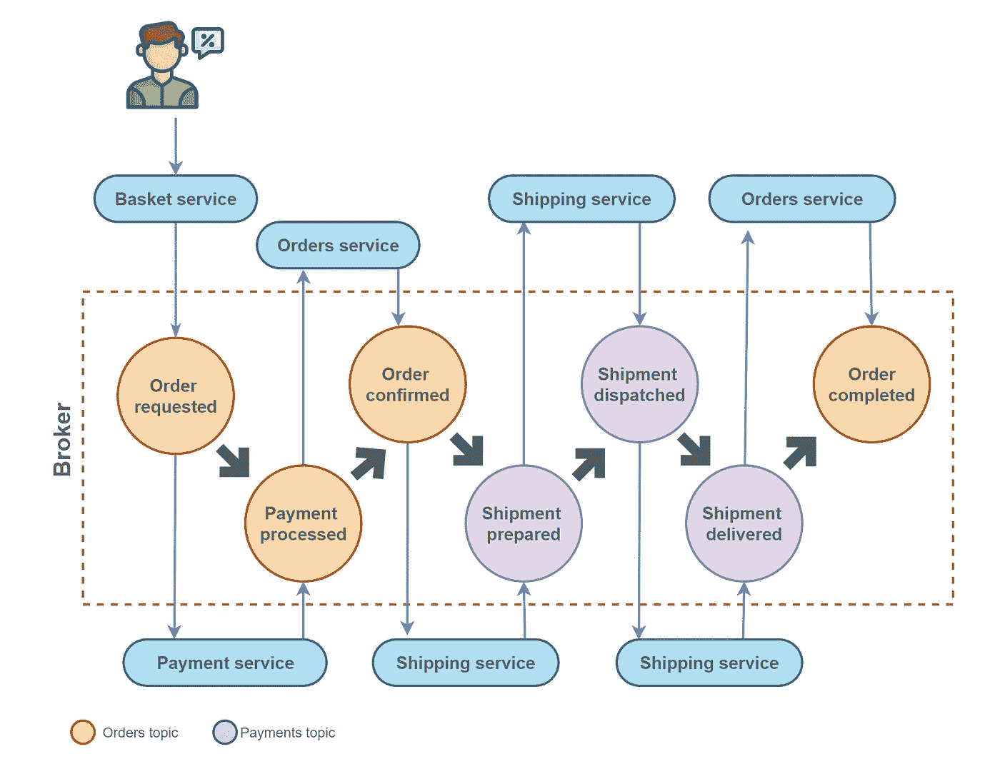
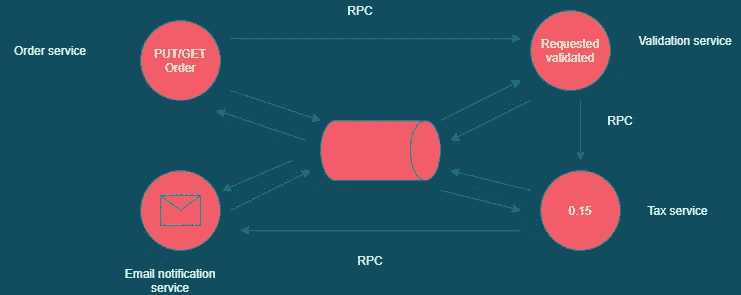
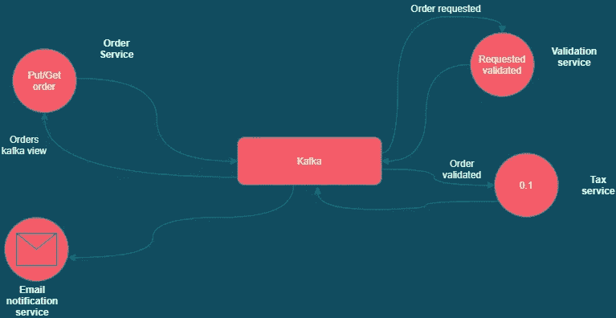
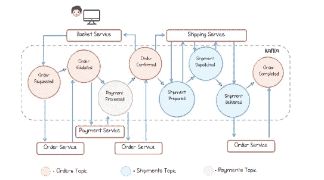

# 事件驱动系统中的最终一致性结果

> 原文：<https://medium.com/nerd-for-tech/eventual-consistency-consequences-in-the-event-driven-system-d1081ad19ab3?source=collection_archive---------0----------------------->

在本文中，我将解释在基于事件的系统中应用最终一致性的后果。

我们将讨论以下几点

*   一致性在不同的上下文中意味着同步和异步系统
*   最终的一致性后果问题(时间表和冲突)
*   无冲突复制数据类型
*   单编写器模式

**一致性**

一致性概念在我们的行业中广泛使用，具有不同的含义，例如，实施单线程写入并应用具有 ACID 属性的数据库事务的传统系统，以便用户可以在强一致性模型中读取最近写入的值，这可以在传统的三层程序(客户端、服务器和数据库)中安全地完成，但如果独立运行并异步通信的服务团队(如在微服务架构中), 只要数据从一个服务移动到另一个服务，它通常会在不同的时间对用户可见，除非我们使用单个全局状态，但是在应用程序跨地理位置和网络分布的真实世界的分布式系统中，实现限制可伸缩性的单个全局状态是一件坏事。

正如我们所看到的，这是一个直接模型，因为所有事情都通过 RPC 通知以单个全局状态顺序处理。这是一个简单而好的方法，但它不可扩展，因为当我们添加新服务或需要扩展现有服务时，这很困难。

大规模运行的基于事件驱动的系统不是在这种方法中构建的，相反，它们强制异步广播，当服务通过不同的网络和时钟异步通信时，这种异步广播消除了具有另一种称为最终一致性的全局状态的必要性。

通过提交日志连接的事件驱动系统

在这种设计中，服务独立工作，因此它们可以独立扩展，让我们来解释一个设计，订单由订单服务接受，由验证服务接收，在验证服务中进行验证，添加销售税并发送电子邮件。更新后的订单返回到订单服务中，可以通过订单视图对其进行查询。这是 CQRS(命令查询责任分离模式)的一个实现。您可以查看我以前的文章，我详细解释了查询问题

 [## 使用 Kafka 跨多个微服务进行实时查询

### 我们的主要问题是如何在微服务架构中实现从多个服务检索数据的查询…

medium.com](/nerd-for-tech/make-a-real-time-query-across-multiple-microservices-using-kafka-ecd46d651acd) 

在我们的上下文中，最终一致性有两个结果

**时间线(滞后)**

当两个不同的服务处理相同的事件流时，由于网络和时钟条件，它们将以不同的速率处理它们，因此一个可能落后于另一个。反正回头看看我们的设计，我把文章写完了。内容非常好，我会比 Redis 和 Kafka 评价更高，因为它的主题很少在好的用例中描述。不过，我最大的担心是，如果没有修订，许多人将很难理解要点，并将迷失在表达式和术语中。用户可以导航以检查订单，假设电子邮件服务和订单视图订阅相同的事件，该事件保存由验证服务处理/生成/创建的已验证订单，并发处理它们意味着一个很少落后于另一个，事实上， 如果我们停止向我们的系统写入，它们最终将处于相同的状态，但通常它们很少滞后于彼此，因此它们相对于彼此缺乏及时性，因此当用户单击电子邮件中的链接，但订单服务视图滞后时，该链接将返回不正确的订单状态。 因此，我们可以通过阻塞对订单服务的调用来解决这个问题，直到视图更新超时，或者我们可以添加另一个事件(视图更新事件)，电子邮件服务将基于该事件触发该事件，两者都以不同的方式考虑串行执行。

**碰撞**

当两个服务同时更新同一个事件时就会发生冲突，这在串行执行设计中是不会发生的，但如果我们允许并发执行，这种情况就会发生。回顾我们的设计，假设验证服务和税务服务并发执行，因为它们都可以对订单请求事件 ***作出反应(确切地说，我们可以通过让税务服务对请求事件作出反应，然后强制验证服务对加税事件作出反应，使它们按顺序执行，但是这将引入另一个由于网络条件引起的端到端延迟问题)*** 通过执行 then 并发，我们可能会以两个包含重要信息的事件结束，因此为了获得正确的订单，我们需要合并两个服务中的两个事件(查询订单视图中的订单服务和电子邮件服务)。某些业务系统中的合并方法可能容易出错，尤其是对保存由验证服务资金处理/生成/创建的已验证订单的同一事件，如电子商务和零售系统。 有一种保证完整性的以这种方式合并数据的正式技术叫做 CRDT(无冲突复制数据类型)

在分布式计算中，CRDTs 在数学上总是可能合并或解决并发更新，而没有冲突或中央仲裁器。一个关键的方法是将所有编辑操作减少到只交换操作，以便改变的顺序不再重要。在实践中，这将处理“无序”到达的更改，因为不同副本上发生的独立更改没有固定的顺序，或者当有有效的顺序时，无法保证更改可以传播到每个接收者以遵守它，并且它本质上限制了您可以执行哪些操作来确保当数据被更改并随后被合并时您不会丢失信息，但是缺点是方言相对有限。

有两种 CRDT

# 基于操作的 CRDTs

基于操作的 CRDTs 也称为可交换的复制数据类型，或 CmRDTs。CmRDT 副本通过仅传输更新操作来传播状态。例如，单个整数的 CmRDT 可能会广播操作(+10)或(20)。副本接收更新并在本地应用它们。这些操作是可交换的。然而，它们不一定是幂等的。因此，通信基础设施必须确保复制品上的所有操作都被传递到其他复制品，没有重复，但是以任何顺序。

# 基于状态的 CRDTs

基于状态的 CRDTs 被称为收敛复制数据类型，或 CvRDTs。与 CmRDTs 相反，CvRDTs 将其完整的本地状态发送到其他副本，在副本中，这些状态由一个函数合并，该函数必须是可交换的、结合的和幂等的。合并函数为任何一对复制状态提供了一个连接，所以所有状态的集合形成了一个半格。根据与半格相同的偏序规则，更新函数必须单调增加内部状态。

对于大规模系统来说，更好的适应是保持时间线的缺乏，这允许我们以只读方式获得相同状态的副本，但通过禁止并发突变来完全消除冲突的机会。我们可以通过为每种类型的事件(卡夫卡的主题)或每种状态转换提供单个写入器来实现这一点。

**单写入模式**

该原则背后的思想是将一致的关注隔离到拥有的服务中，因为传播特定类型的事件的责任被分配给单个服务，所以例如在电子商务系统中，订单实体事件应该由订单服务拥有，当只有单个节点仅接收写请求而其他节点为只读时，单个写入者原则也用于数据库系统中的单个领导者复制。这使得有效地管理一致性变得更加容易。此外，该原则允许数据版本化，这允许通过检查版本号进行乐观并发控制，它促进了诸如数据模式更改之类的更改管理，因为它由单个团队拥有的专用服务所拥有。

正如我们看到的，所有订单实体相关事件都归订单服务所有，而不是共享一个全局一致性模型，我们使用单次写入来创建通过事件流连接的本地一致性点，实际上，我们可以通过在 Kafka 的情况下根据需要添加更多的流分区来解决单线程操作的扩展问题，例如，ORDER_ID，它可以保证在单个分区上进行串行订单处理。

这种模式有两种不同的方法

**命令题目**

在这种方法中，我们为每个实体提供了两个主题，一个用于命令，一个用于实体，例如，在订单中，实体事件可以分为两个主题(订单请求)和(订单验证，订单完成)，这两个主题是命令，在这种情况下，任何服务都可以写入订单请求(命令)，但只有订单服务可以写入订单实体，订单实体管理订单状态转换并强制每个主题的权限。

**单个作家每次转场**

单个编写器的效率较低且严格的变体涉及拥有单个转换而不是主题中的所有转换的服务，例如，不是将支付主题用于支付服务应该拥有的支付实体，而是可能简单地将额外的支付信息添加到现有的订单消息中，这是通过考虑从一开始就将支付模式添加到订单消息中。

**最后，我要说处理分布式系统并不容易，没有什么能解决所有问题，所以尽可能保持简单，以减少复杂方法的必要性。**