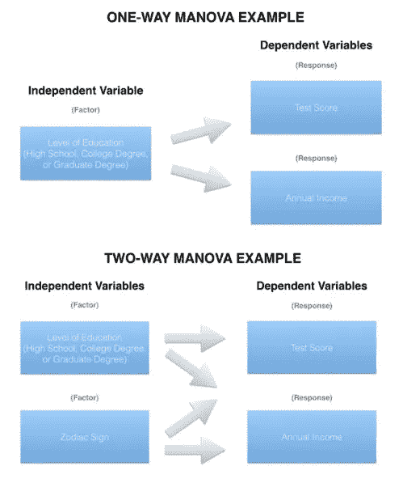
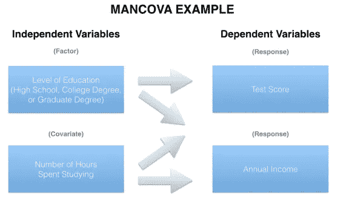

# 关于马诺娃和曼科瓦的一切

> 原文：<https://medium.com/nerd-for-tech/everything-about-manova-and-mancova-4c1c237af464?source=collection_archive---------1----------------------->

**MANOVA** (多变量方差分析):是一种多变量分析，用于分析一次涉及多个因变量的数据。MANOVA 允许我们检验关于一个或多个自变量对两个或多个因变量的影响的假设。ANOVA 和“多变量方差分析”(MANOVA)之间的明显区别是“M”，它代表多变量。用基本术语来说，MANOVA 是具有两个或多个连续响应变量的 ANOVA。像 ANOVA 一样，MANOVA 既有单向的味道，也有双向的味道。所涉及的因素变量的数量将单向方差分析与双向方差分析区分开来。

当通过单因素比较两个或多个连续响应变量时，单向方差分析是合适的(例如，通过“教育水平”将“考试分数”和“年收入”一起比较)。双向方差分析还需要两个或更多的连续响应变量，但至少通过两个因素对它们进行比较(例如，通过“教育水平”和“星座”将“考试分数”和“年收入”一起进行比较)。

**曼科娃:**

协方差的多元分析(MANCOVA):它是一种统计技术，是协方差分析(ANCOVA)的扩展。它是有协变量的多变量方差分析(MANOVA)。).在 MANCOVA 中，我们通过一个独立的分组变量来评估多个连续因变量的统计差异，同时控制称为协变量的第三个变量；根据样本大小，可以使用多个协变量。添加协变量是为了减少误差项，从而消除协变量对独立分组变量和连续因变量之间关系的影响。ANOVA 和 ANCOVA，MANOVA 和 MANCOVA 之间的主要区别是“C”，它也代表“协方差”。MANOVA 和 MANCOVA 都有两个或更多的反应变量，但两者之间的关键区别是 IVs 的性质。虽然方差分析只能包括因子，但当一个或多个协变量加入到混合变量中时，分析会从方差分析发展到协方差分析。

